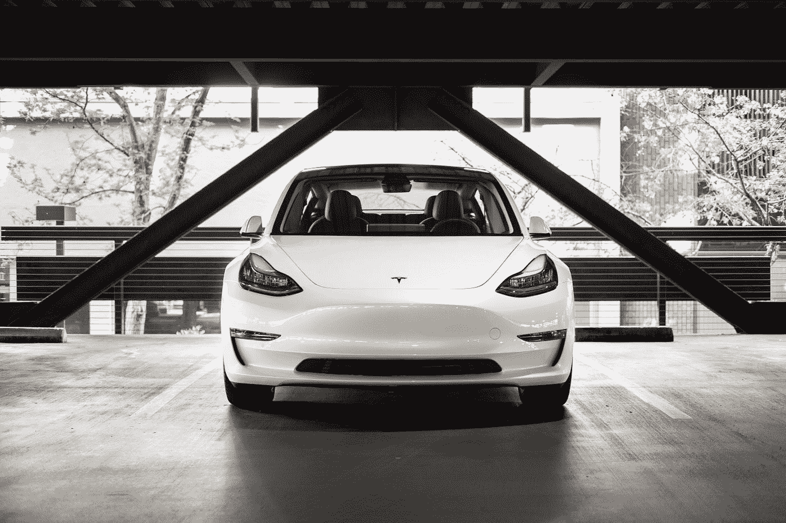

# 特斯拉的崛起将如何赢得比特币竞赛

> 原文：<https://medium.datadriveninvestor.com/how-teslas-rising-power-will-win-the-bitcoin-race-8ed695ddef50?source=collection_archive---------5----------------------->

## 似乎埃隆·马斯克比竞争对手更早发现了这一点

Photo by [Charlie Deets](https://unsplash.com/@charliedeets?utm_source=medium&utm_medium=referral) on [Unsplash](https://unsplash.com?utm_source=medium&utm_medium=referral)

对于比特币和特斯拉的粉丝来说，现在很难抑制他们的乐观情绪。

上周对股票市场来说可能是历史性的一天。特斯拉购买了 15 亿美元的比特币。一家 S&P500 排名前五的公司确实购买了 10%的现金用于加密货币。

在这个问题上，你可以是帽匠，也可以是看跌者。但你必须承认这是一个令人惊讶的重大举措。而且会在国际上产生相当大的反响。

当你看到世界上最富有的人在 BTC 拥有 15 亿美元的资产，他经营着一家以打破所有科技先例而闻名的巨型科技公司，这真是令人着迷。

现在有多少顶级公司的寄宿室在讨论这个话题？他们中有多少人想打电话给迈克尔·塞勒(Michael Saylor)，试图对比特币多了解一点？

潘多拉魔盒本周被打开了，不管你喜不喜欢。世界会变，货币体系也会适应。此外，个人和公司至少能够保护自己免受全球货币贬值的影响。

一些人认为比特币是一种情绪化的东西，上涨的图表完全是疯狂的。但如果你能拉远看数字，这只是一个供需问题。

美联储不能印刷更多的比特币，所以价格在上涨，因为更多的人在购买比特币。与美元或欧元不同，BTC 是一种稀缺和有限的资产。

金钱是两部分之间的协议。如果双方都同意该协议，则交易完成。很简单。

比特币是一项技术突破。[事实证明，许多人正在采用它。](https://medium.com/the-price-of-tomorrow/how-early-adopters-always-win-use-massive-advantage-to-earn-first-52330c409be1)起初，BTC 被体验为金钱。并且在某些国家是用于某些交易的工具。但大多数人都将比特币作为对抗印钞的硬资产。

[那些说比特币是庞氏骗局或泡沫的人，是那些仍然不相信也不接受 BTC 是一种资产的人。](https://medium.com/the-price-of-tomorrow/bitcoin-a-free-market-flag-vs-a-suffisticated-marketing-brand-846a86892a78)但如果大多数人同意协议并在几方之间进行交易，那就无关紧要了。如果协议在两方之间和数千或数百万人之间被接受，它就变成了钱。因为钱只不过是当事人之间的一个协议。

埃隆·马斯克明白这一点。不仅如此，埃隆还将 BTC 视为一个避风港。他不认为 BTC 是一种货币。将 BTC 纳入资产负债表让他又一次相信，这种加密货币不会成为买卖东西的工具。相反，像黄金一样，BTC 将成为价值储存手段。

马斯克的公司将获得法定货币形式的未来利润，10%至 15%将自动转入比特币。这就是公司会计部门的工作方式。

作为早期采用者，特斯拉以很低的价格购买了比特币。

作为未来最有价值资产的早期买家，特斯拉未来会有怎样的表现？

# 如果你购买了 S&P500 指数基金，你就已经拥有了比特币

埃隆·马斯克的这一举动颇具讽刺意味。当特斯拉收购 BTC 时，世界上大多数投资者都成了*比特币的创造者。*

随着许多 S&P500 指数公司购买比特币，越多的投资者接触到最好的加密技术。

这里分析了另一个激动人心的运动。假设 2021 年底比特币将达到 28.8 万美元。关于 2030 年底价值 1000 万美元的 BTC 的预言实现了。在这种情况下，你将拥有早期采用者的竞争优势。

这意味着比特币的早期采用者可以购买竞争产品，就像苹果或微软对小公司所做的那样。早期采用者的这种现象可能会重新设计全球经济的未来。

购买比特币需要极度的深度思考和个人责任感。在这个阶段，这是一场力争上游的比赛。埃隆·马斯克已经明白了这一点。

# 作为股息收益率投资组合的比特币利率

这是一个*超碳化*的观点。但这很有道理。如果比特币将成为硬资产，它将拥有和黄金一样的额外待遇。因此，你可能有兴趣把你的 BTC 借给一个过度抵押的市场。

通过将你的比特币借给抵押市场，你有两大优势。

首先，您可以保留您的密钥地址，这样您的资产就安全了。

第二，你的利率可以自己 24/7，365 监控。

比特币是一项年轻的技术。但它有增长潜力，至少在未来 10 年是如此。那么，你认为利率会是多少？5%, 10%, 30%?

在某个时候，投资者会关注股票的价值和收益率。再看看侧面，意识到比特币的市场正在给你两倍的收益。投资人的态度会是怎样的？股市未来的估值会如何？

一个苹果还会有 35 的 PE 吗？还是会降到 5 或者 10？

如果这种深入思考的推理是正确的，比特币将迫使一切重新定价成为一个新的现实条款。

# 最终想法

国际金融的宏观结构将会发生许多变化。尤其是对于那些认为比特币将成为全球货币和最佳硬资产的人来说。

如果你将法定货币与比特币进行比较，你会得出结论，我们正处于一个恶性通胀的环境中。为什么？因为 BTC 从一开始就以 200%的速度增长。

如果这个故事趋于准确，它将是未来几十年法定货币彻底崩溃的小说。

现在，我只是把可能的未来联系起来。但这不是纯粹的想象，因为 S&P500 的公司已经在购买比特币。这只是一个故事的开始。

你至少应该知道这个故事的走向。保持警惕，做出决定。

有些事情正在发生。埃隆·马斯克和迈克尔·塞勒指出了一条道路。我们可以看着它，也可以闭上眼睛。

我们可以相信，也可以怀疑。

但是不想观察和做深入的思考过程是不太正确的。

在接下来的几年里，世界将会发生很大的变化。

一场技术颠覆革命正在发生。加密货币是这场革命的五大平台之一。

退出游戏是你不太正确的选择。

所以，你现在能买到的最有价值的资产就是你的深度思考。

[**注册我的邮件列表**](https://mailchi.mp/104ad9e5f4d9/nuno-fabiao) ，加入 Medium 上最快乐的读者。
*(在这里你可以独家访问我的日常活动、经历和日常想法)*