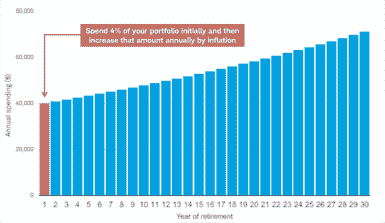

# 4%法则对退休有什么帮助

> 原文：<https://medium.datadriveninvestor.com/how-the-4-rule-can-help-in-retirement-47031b35405a?source=collection_archive---------9----------------------->

## 什么，你能在退休后实际花费多少？

Photo by [Huy Phan](https://unsplash.com/@huyphan2602?utm_source=medium&utm_medium=referral) on [Unsplash](https://unsplash.com?utm_source=medium&utm_medium=referral)

4%规则的出现是基于从 1926 年到 1976 年 50 年间各种股票和债券回报的历史数据。简而言之，**4%法则规定，退休后，你每年可以提取投资组合的 4%来过上舒适的生活。**

现在，提到了预期寿命在决定这一退出率是否可持续方面起着至关重要的作用，因为寿命更长的退休人员显然希望他们的储蓄能持续更长时间。在一个人一生中的黄金时期，医疗费用和住院费用都会显著增加。

# **通货膨胀会计**

有少数退休人员真正坚持 4%的提款率，并保持美元数额不变。事实上，该规则允许退休人员增加美元价值和利率，以跟上通货膨胀的步伐。

Taken from Schwab.com

为了调整通货膨胀，您可以设定每年 2%的固定年增长率，这是[美联储](https://www.federalreserve.gov/aboutthefed.htm)的目标通货膨胀率，或者根据该财政年度的实际通货膨胀率调整提取比例。

为了调整通货膨胀，这里有一个计算方法可能会有用，特别是如果你离退休还有几十年，并且已经考虑过退休后的生活会是怎样。下面是一个快速总结:

*   **乘以 1.48——如果你离退休还有 10 年**
*   **乘以 1.80——如果你离退休还有 15 年**
*   **乘以 2.19——如果你离退休还有 20 年**
*   **乘以 2.67——如果你离退休还有 25 年**

举例来说，假设你想每年从你的退休投资组合中提取 100，000 美元，距离退休还有 25 年，为了达到你的通胀调整目标，你将 100，000 美元乘以 2.67，得到 267，000 美元的数字。

# **何时避免 4%提款规则**

在一些情况下，这条规则可能不起作用。例如，在严重的市场调整或长期衰退的情况下，高风险投资工具可能会受到严重影响并失去其价值，通常比典型的退休投资组合更不稳定。

 [## 如何不做傻钱|数据驱动的投资者

### 为什么要相信一个标题，说我知道如何区分傻瓜和聪明的钱？因为我一直都是，并且从…

www.datadriveninvestor.com](https://www.datadriveninvestor.com/2020/08/19/how-not-to-be-dumb-money/) 

一个退休者，为了让这条规则生效，必须年复一年地忠于它。在一次大采购上挥霍，甚至违反规则一年，都可能在以后的阶段产生极端的后果，因为本金减少了，这影响了退休人员赖以生存的复利。

下面列出了一些注意事项—

1.  这是一个严格的规则
2.  **它使用历史市场回报**
3.  **它适用于投资组合(通常是 50%的股票和 50%的债券，但可以有所不同)**
4.  **假设时间跨度为 30 年**

# 没有事情会完全按照计划进行

做好计划和预测，为未来做好准备是很好的。未来是不可预测的，任何你计划的事情——生活会向你扔出意想不到的曲线球。

因此最重要的是**保持灵活性，至少每年评估一次你的计划**。如果任何不利的重大生活事件发生，或者如果经济条件导致严重的市场低迷，你可能不会放心在这段时间增加你的支出。

相反，如果市场表现好于平均水平，给你带来比通常情况下更高的回报，你可能会想在那些“值得拥有的东西”上多花一点钱。

# 底线

一些分析师和财务顾问多年来一直质疑 4%提款规则的可行性和可行性。虽然他们有合理的观点和担忧，但毫无疑问，4%法则在各种艰难的市场条件下都是可靠的。

这条规则经受住了至少上个世纪以来的重大金融危机，从 1929 年的股市崩盘和大萧条、二战到 20 世纪 70 年代的滞胀。

Photo by [Nick Karvounis](https://unsplash.com/@nickkarvounis?utm_source=medium&utm_medium=referral) on [Unsplash](https://unsplash.com?utm_source=medium&utm_medium=referral)

永远不会有一个单一的正确答案，告诉你在退休后需要花多少钱来享受退休生活，并在投资组合中拥有足够的钱来维持你的一生。你所需要的只是一个花钱的计划和一些总的指导方针——并在这个过程中进行必要的调整。

最终目标是享受你的退休生活，让其他一切都自动为你服务。你一直想要并努力争取的退休生活。哦，自由的甜蜜感觉。

## 访问专家视图— [订阅 DDI 英特尔](https://datadriveninvestor.com/ddi-intel)