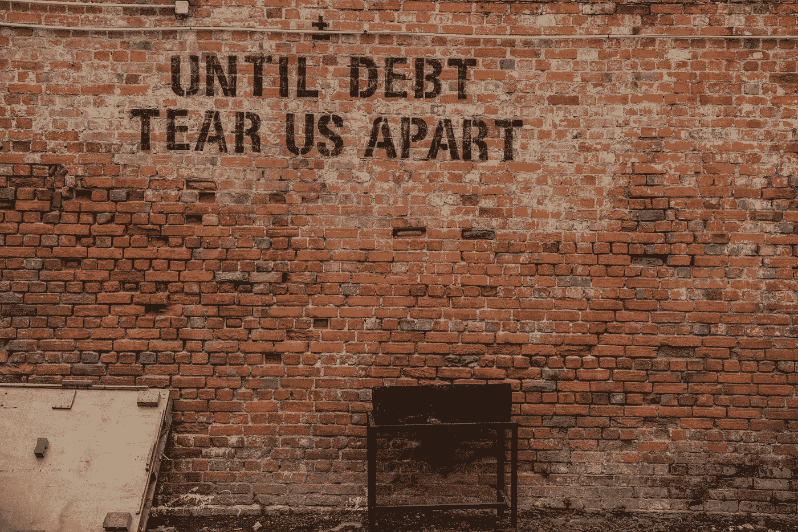

# 美国信用评分系统如何鼓励债务

> 原文：<https://medium.datadriveninvestor.com/how-the-american-credit-score-system-encourages-debt-9c0ab6e5820c?source=collection_archive---------4----------------------->

## 对美国人来说，有好债也有坏账。对拉美人来说，有债务

Photo by [Alice Pasqual](https://unsplash.com/@stri_khedonia?utm_source=unsplash&utm_medium=referral&utm_content=creditCopyText) on [Unsplash](https://unsplash.com/s/photos/debt?utm_source=unsplash&utm_medium=referral&utm_content=creditCopyText)

A h，信用评分。**告诉别人你可以被信任的社会印记**。这个神秘的数字将决定你是否能买得起你梦想中的房子。

很明显，许多美国人担心他们的信用评分。只需谷歌“信用评分”,就能看到提供免费信用报告或承诺提高信用评分的广告数量。这是有充分理由的。如果你申请一张信用卡，信用评分在决定你能获得多少信用方面起着重要的作用。买车还是买房？你的信用评分影响你得到的利率。搬到新公寓？你的信用评分将决定你的存款。

# 什么是信用评分，如何使用

信用评分只是一个指标，我们的信誉。这是一个试图总结某人借钱给你的风险有多大的数字，或者换句话说，你还钱的可能性有多大。

贷款总是有风险的。如果你的信用评分很低，你会被认为是一个高风险的借款人，贷款人会对你的贷款持谨慎态度。如果你的信用评分很高，贷方更有可能相信你会按时还款。

信用评分不是唯一的信誉指标。当你申请信贷时，贷方通常也会使用其他信息。例如，他们会想知道你的收入。但是信用评分始终是这个难题的关键部分。

 [## 对有商业头脑的投资者有用的行为经济学概念|数据驱动的投资者

### 在美国企业界，高斯统计，对我们周围世界的确定性解释，以及理性…

www.datadriveninvestor.com](https://www.datadriveninvestor.com/2020/07/09/helpful-behavioral-economics-concepts-for-the-business-minded/) 

# 好债，坏账

我的朋友古斯塔沃，一个出生在玻利维亚的美国犹太人，曾经告诉我:

> 对美国人来说，有好债也有坏账。对西班牙裔来说，有债务。

这可能过于简单化了，我相信他这样做只是为了表明一个观点，但不同的文化与金钱有不同的关系，这是事实。

作为一个在西班牙长大的孩子，我被告知，一般来说，最好避免负债。在我十几岁的时候，我注意到信用卡债务是我父母之间最常见的矛盾来源。很难看出债务有什么好处。

其实很难说债务是好是坏。在他们的博客文章《 [11 个信贷神话](https://www.experian.com/blogs/ask-experian/11-credit-myths-dont-fall-for-em/)》中，益百利将“债务就是债务”列为第一个神话。《华盛顿邮报》称，“并非所有的债务都是平等的”，然后将 a)用于支付派对(我认为是有史以来最棒的派对)费用的 15 万美元信用卡债务与 b)“让你晚上有个温暖的地方睡觉”的抵押贷款进行了比较。

这是一个有效的观点，并非所有的债务都是平等的，但债务*就是债务*。你仍然必须还钱，如果不还，可能会导致拖欠，无论你是在一个聚会上花了 15 万美元，还是在一个非常负责任的每月抵押贷款上花了钱，让你有了一个非常合适的住处，或者你是把钱捐给了一个高尚的事业，还是用来支付医疗账单。

# 信用评分系统鼓励债务的方式

## 1.没有债务，没有信用评分，没有信用

信用评分是使用我们信用历史报告中的不同数据计算的。主要因素是已用信贷与可用信贷的百分比、付款历史、债务类型和金额、信用历史的长度以及最近对您的信用报告的查询。

换句话说，向贷款人证明你的可信度的方法是出示你现在和过去如何处理债务的证据。收入对信用评分没有影响。储蓄对信用评分没有影响。显然，你的话对信用评分没有影响。

由于贷款人严重依赖信用评分来批准信贷和贷款，即使有完美的支付历史，非常健康的经济状况和良好的声誉，大多数贷款人会认为借钱给你是有风险的。

## 2.取消债务甚至会损害你的信用评分

正如 Experian 在他们的“[神话](https://www.experian.com/blogs/ask-experian/11-credit-myths-dont-fall-for-em/)”文章中指出的，注销信用卡甚至会损害你的信用评分。由于信用评分值低使用你的可用信贷，当你取消信用卡或贷款，你的可用信贷减少，所以，如果你继续使用相同数量的信贷，你的相对使用可用信贷增加。

## 3.它用于非信贷应用

如果你对债务有如此坚定的立场，为什么还要担心你的信用评分呢？反正你也不会申请学分。我说的对吗？

不，我没有。信用评分可以并被用于许多其他目的，除了扩大信用。

几个例子是:

*   信用评分低或缺乏信用记录的公寓租户面临更高的押金，有时会被要求提供担保人或提前付款。
*   公用事业公司使用信用评分来确定存款，甚至计划的资格
*   保险公司有时使用信用评分来决定他们的价格和政策
*   雇主看不到你的信用评分，但在某些州，他们可以使用你信用报告中的其他信息来做出雇佣决定
*   在某些情况下，甚至政府机构也可以检查你的信用报告

# 结论

信用评分系统在许多方面帮助了美国人。如果银行没有信用评分来帮助估计贷款给每个特定个人的特定风险，他们将无法定制他们的优惠，良好的付款人将无法受益于较低的利率。

总体而言，信用评分有助于贷方了解其客户的总体风险。如果不了解这一点，贷款人在发放贷款时将需要更加谨慎。信贷机会将更加有限，利率可能会上升

与此同时，信用评分系统激励债务和债务，好的或坏的，在一个家庭，一个公司，甚至一个国家的经济健康中发挥着重要作用。因此，承认美国信用评分系统如何鼓励家庭负债是很重要的。

# 媒体相关文章

*   [“信用评分神话与事实](https://medium.com/escaping-the-9-to-5/credit-score-myths-and-facts-20904cbb628c)”。说到神话！ [Casey Botticello](https://medium.com/u/ccf1b677570b?source=post_page-----9c0ab6e5820c--------------------------------) 在 2018 年发表了这篇文章，但它仍然相关，我喜欢它的简洁。不过，在第七点上，我不同意他的观点。信用卡也是债务。
*   瑟林·阿尔里克撰写的《[如何提高你的信用分数](https://medium.com/@therinalrik/how-to-guide-for-boosting-your-credit-score-2cec68ef5d8b)》一文。如果你痴迷于你的信用评分，小心提示 4！
*   莎拉·洛夫格伦的《你没有意识到的超级怪异的事情会降低你的信用评分》。谁说信用评分不能搞笑了？
*   "[在一段新关系中，你会在什么时候讨论信用评分？](https://medium.com/the-billfold/at-what-point-in-a-new-relationship-do-you-discuss-credit-scores-e253b938e462)作者[妮可·迪克](https://medium.com/u/b1de9fec5b45?source=post_page-----9c0ab6e5820c--------------------------------)。简洁又给力。

**访问专家视图—** [**订阅 DDI 英特尔**](https://datadriveninvestor.com/ddi-intel)