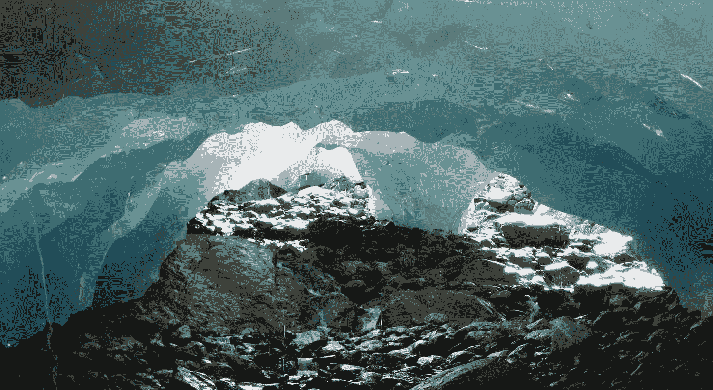

# 北极是如何变化的以及机器学习的意义。

> 原文：<https://medium.datadriveninvestor.com/how-the-arctic-is-changing-25503e024551?source=collection_archive---------26----------------------->

## 为了解北极随全球变暖的变化而采取的研究措施。为什么重要？采取了哪些措施？

我自己是一个技术爱好者，我和我的同事就前沿技术如何为人类和地球做出贡献，而不是专注于为商业赚钱进行了深入的交谈。我们必须用我们所利用的所有资源来回报这个世界。凭借我们获得的知识和开发的技术，我们有责任了解并解决我们的世界正在经历的问题，并为更美好的明天找到可能的解决方案。

Photo by [Bethany Legg](https://unsplash.com/@bkotynski?utm_source=unsplash&utm_medium=referral&utm_content=creditCopyText) on [Unsplash](https://unsplash.com/s/photos/arctic?utm_source=unsplash&utm_medium=referral&utm_content=creditCopyText)

北极因其多样的野生动物和文化而闻名，是世界的财富。但最近，就气候变化、野生动物或植被而言，它比地球上任何其他地区都变化得越来越快。自 20 世纪 90 年代以来，全球变暖的影响已经导致北极地区发生了很多变化。但现在它变得如此重要，以至于该地区正滑向一种不同的气候，其特征是冰雪减少，开阔水域和雨水增多。

Photo by [Annie Spratt](https://unsplash.com/@anniespratt?utm_source=unsplash&utm_medium=referral&utm_content=creditCopyText) on [Unsplash](https://unsplash.com/s/photos/global-warming?utm_source=unsplash&utm_medium=referral&utm_content=creditCopyText)

研究人员认为，北极温度升高是由于大气中二氧化碳含量增加，如果不加以控制，可能会进一步加剧全球变暖。此外，一组来自德国的科学家警告我们一种新现象，即融化较亮的北极表面，暴露深色海水，这反过来影响深色海水吸收更多的光，并催化融化。因此，较轻海冰的消失导致了**反照率效应**——造成了大约 25%的全球变暖。

**永久冻土** **退化**是北极社区和生态系统面临的另一个重大难题。它形成了北半球 24%的表面，并占地球土壤中储存的所有有机碳的大约一半。有机物一直被困在永久冻土中，直到融化。一旦它开始融化，微生物就开始吞噬这种物质，导致它腐烂，并向大气中释放大量的二氧化碳和甲烷。即使这些温室气体中的一小部分被释放出来，它也将不仅对北极，而且对整个地球的气候系统产生影响。

Photo by [Arie Wubben](https://unsplash.com/@condorito1953?utm_source=unsplash&utm_medium=referral&utm_content=creditCopyText) on [Unsplash](https://unsplash.com/s/photos/permafrost?utm_source=unsplash&utm_medium=referral&utm_content=creditCopyText)

科学家们在北极发现的另一个威胁是**规律的降雨**，降雨渗透到内陆深处，形成厚厚的冰层，限制了像**驯鹿**这样的动物寻找食物。2013 年至 2014 年间，由于冬季多雨造成的大规模匮乏，俄罗斯亚马尔半岛估计有 61，000 只动物死亡。此外，在过去的 20 年里，全球驯鹿和北美驯鹿的数量下降了 56%。因此，毫无疑问，气候变化已经对人类、动物和整个地球造成了不可挽回的损害。

> 现在的问题肯定是，对明显的气候变化和全球变暖采取行动是否为时已晚？

是的，这是相当晚了，但仍然有很多事情你可以做。首先，我们必须定义全球变暖和气候变化。科学家使用术语**气候变化**来描述影响天气和气候系统的复杂变化。气候变化不仅包括平均气温上升，还包括极端天气状况、野生动物数量减少、海平面上升以及一系列其他影响。而**全球变暖**是由于大气中吸热的温室气体导致的地球整体温度的长期变暖。

我们可以做很多事情来保护我们星球的长期资产。我们是既得利益的一代，已经经历了技术革命，可以利用所有的新技术来保卫和保护北极。减少大气中二氧化碳含量的技术，帮助我们有效理解和适应北极变化的工具应该是我们的优先事项。

Photo by [NOAA](https://unsplash.com/@noaa?utm_source=unsplash&utm_medium=referral&utm_content=creditCopyText) on [Unsplash](https://unsplash.com/s/photos/arctic-research?utm_source=unsplash&utm_medium=referral&utm_content=creditCopyText)

北极研究计划，如**Arctic sail drone**——一种风力驱动的无人驾驶水面航行器，可到达北极遥远而恶劣的场景，以收集重要的大气和海洋数据，**国际北极浮标计划** (IABP) —多个国际机构在太平洋北极地区部署和维护北极浮标，以获取海洋和气象数据， **美国北极观测网络**(美国 AON) —一项旨在通过跨美国联邦机构的合作发展来促进持续和独特的北极观测网络的倡议，**分布式生物观测站** (DBO) —一项由 **NOAA 的** **北极研究计划**支持的多学科北冰洋取样计划。 国际北极大气观测系统(T21)协调各个北极观测站的活动，为北极大气研究和操作提供一个国际合作网络。

最近对熔池分数建模的研究使用了各种使用光学成像技术的光谱分解方法。这导致不太重要和不太准确的结果。当使用光学成像技术时，北极的云层遮挡了图像。用于模拟熔池部分的微波雷达有助于我们克服云层存在的缺点，因为微波可以很容易穿透云层。即使利用多时相采集，单频率和单偏振(对于一些传感器)也不能提供足够的信息来进行准确的区分。基于机载合成孔径雷达采集的研究活动已经探索了多频合成孔径雷达用于地表分数估计的益处。不同的微波频率在不同的表面上具有不同的穿透性，因此微波反向散射数据的特征将是不同的。

研究表明，使用深度学习或基于随机森林的机器学习技术比数学频谱分解技术(如 SMA、MESMA 等)产生更好的结果。发现机器学习方法的准确性优于区域性调谐光谱解混，并且其实现起来明显更加可行。在最近的研究中使用机器学习和人工训练数据显示了池塘分数的 RMS 误差的改善。使用深度学习技术的优势可以通过结合迁移学习和微调来临时发挥。由于它使我们能够在预训练模型上训练数据，该模型具有在训练期间冻结的训练权重，因此在末尾添加的分类和
线性层将经历训练，其权重针对当前光谱微波数据进行更新，以估计熔池分数。

Photo by [Hitesh Choudhary](https://unsplash.com/@hiteshchoudhary?utm_source=unsplash&utm_medium=referral&utm_content=creditCopyText) on [Unsplash](https://unsplash.com/s/photos/artificial-intelligence?utm_source=unsplash&utm_medium=referral&utm_content=creditCopyText)

文献综述还简要介绍了某些季节出现的数据采集缺口，以及为研究和评估融化池而创建数据的各种方法。像 GAN(生成对抗网络)这样的深度学习技术可以用于创建人工训练数据来建立模型。GAN 包括一个生成网络和一个鉴别网络。生成器的目标是欺骗鉴别器，因此生成神经网络被训练成最大化最终分类误差。鉴别器的目标是检测虚假生成的数据，并使鉴别神经网络能够最小化最终分类误差。
这两个网络的这些相反的目标和对抗性训练的隐含概念解释了“对抗性网络”的名称(两个网络都试图击败对方，这样，它们都变得越来越好)，并导致生成一个模型，该模型产生可以用作训练数据的虚假数据。这也将提高估计熔池分数的性能，因为更多的训练数据会导致更一般化
和更高的精确度。

所有这些举措都有助于在更大程度上追踪北极面临的问题。然而，现在是我们开始筹集更多资金支持进一步研究和技术创新的时候了。还应该开始构思北极行动的统一声音，并继续进行全球会谈和决策，以获得势头。现在就做，不要等到以后！！

感谢您的阅读和宝贵时间。