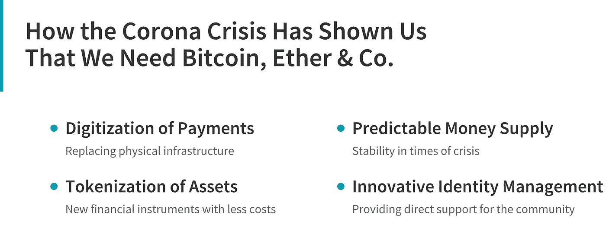
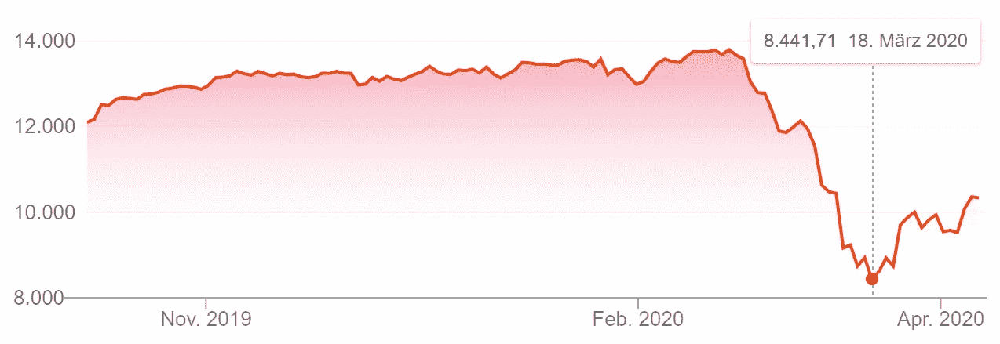
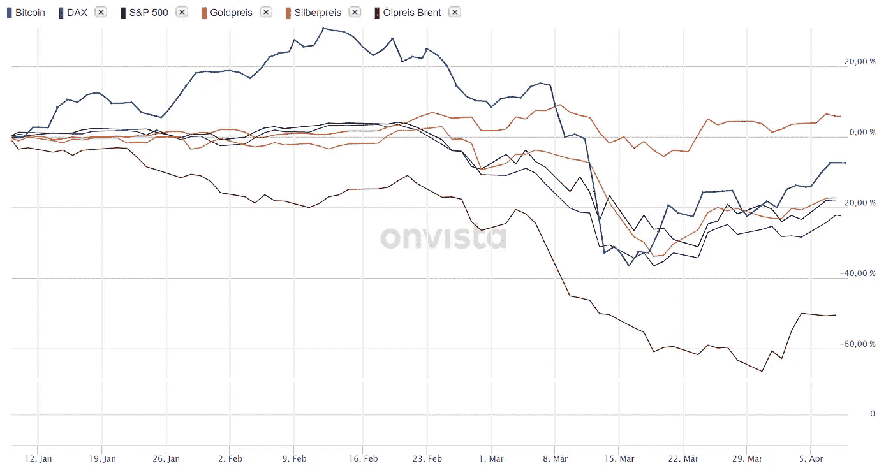

# 电晕危机如何向我们表明，我们需要比特币，以太公司。

> 原文：<https://medium.datadriveninvestor.com/how-the-corona-crisis-has-shown-us-that-we-need-bitcoin-ether-co-21fd2149163e?source=collection_archive---------7----------------------->

作者:乔纳斯·格罗斯，菲利普·桑德纳，维克多·冯·沃希特

**比特币是第一个基于区块链的数字资产，引发了一系列其他项目的跟进。区块链技术的一个关键方面是其作为组织法律权利和资产所有权的“电子登记册”的特征。区块链的这一核心特征可以帮助世界应对冠状病毒传播后出现的风险:有了一般的数字资产，人们可以避免被怀疑传播病毒的实物钞票。此外，数字资产可以创建新的金融工具来解决当前的低效率问题，同时大幅降低交易成本。随着比特币作为最突出的数字资产，存在一种稀缺的资产来用作价值储存和对冲通货膨胀。这提供了在几十年间转移财富的能力。最后，基于区块链的身份管理和数字身份可以减少物理接触点的数量。作为一个创新的想法，这些身份可以与区块链为基础的凭证相结合，直接向社会提供商品和服务。最终，数字身份可以与健康证书相结合来识别人们的身份，人们已经发现这些人对冠状病毒具有免疫力。**

# 介绍

电晕疫情正在动摇全球金融体系。病毒到达欧洲后，金融市场陷入恐慌:德国股市指数 DAX 在两周内下跌超过 30%(见图 1)——这是历史上最大的跌幅之一。政府债券的利息收益大幅增加——尤其是在意大利这个受病毒影响最严重的国家。这些强烈的市场反应表明，金融市场参与者很紧张，预计会出现一次严重的衰退。世界各国政府宣布了前所未有的经济刺激计划——事实上，所有主要经济体都宣布了数十亿或数万亿美元的支持计划。此外，中央银行通过降低利率(如美联储、英国银行)或推出新的资产购买计划(如美联储、欧洲中央银行)推出扩张性货币政策措施。疫情揭示了当前全球金融系统的弱点和低效率，并证明了加密资产，如比特币和以太网，由于其固有的特性，将成为未来金融系统的重要组成部分。

 [## 数字货币、区块链和货币的未来|数据驱动的投资者

### “区块链”、“加密货币”、“令牌化”，以及现在的“央行数字货币”已经成为…

www.datadriveninvestor.com](https://www.datadriveninvestor.com/2020/02/18/digital-currencies-blockchain-and-the-future-of-money/) 

**图 1:** 日冕引发崩盘期间的德国股市指数 DAX[【1】](#_ftn1)

# 支付的数字化

*基于区块链的资产是完全数字化的，即提供数字价值索赔、支付和结算，取代了物理基础设施的缺点。*

# 关闭的银行和提现限额

由于冠状病毒，许多银行已经关闭了他们的子公司，例如在德国和美国。尤其是附近只有一家银行的农村地区遭受重创。因此，本应呆在家里不冒健康风险的老年人失去了进入金融系统的机会。但更多的是:在一些国家，已经引入了现金提取的限制，以至于一些客户不能提取他们想要的金额。

相比之下，比特币任何时候都可以使用，而且没有提款限制。比特币可以在任何时间，甚至是周末或节假日，不受地点限制地获得和转移，在农村地区也是如此。客户只需要一部智能手机、互联网和一个钱包。尽管金融系统中存在明显的压力，但比特币正在以常规方式处理交易，并且每 10-11 分钟可靠地产生一个区块。就像瑞士钟表一样。因此，比特币系统再次被证明非常有弹性——即使在金融市场恐慌的情况下。请注意，由于比特币价格的下降，散列率也相应下降。但是，这是系统的正常行为，不是错误。

当然，这不仅是比特币的情况，而是所有主要加密资产的情况。预计未来运行的企业区块链网络也是如此。总的来说，支付已经在某种程度上数字化了，而且在很短的时间内将会更加数字化。因此，对银行营业时间和钞票的需求将会减少。

# 通过钞票的电晕传染

研究人员已经发现，病毒(例如冠状病毒)的细菌会持续存在于钞票上。世界卫生组织(世卫组织)承认，细菌可能会在钞票上停留相当长的时间。根据《医院感染杂志》的一项研究，一些冠状病毒株可以在钞票上停留长达五天。在新加坡，金融管理局建议公众尽可能多地使用非接触式支付方式。中国中央银行采取了具体措施，一直在对钞票进行消毒，以清除病毒的病菌。

当然，使用数字形式的货币作为加密资产会降低病毒传染的风险。与众所周知的科技巨头 Apple Pay 和 Google Pay 相比，各种移动优先的数字钱包已经存在。通过这些应用程序，智能手机可以方便地将加密资产从 A 地转移到 B 地，而不需要实物现金，因此没有因接触脏钞票甚至更脏的硬币而感染病毒的风险。

# 资产的令牌化

数字资产可以将费用和交易成本降至最低，同时提供新的创新金融工具，即使在危机时期也能保持稳定。

## 黄金和白银:高昂的费用和有限的可用性

在危机时期，对贵金属，如金银币或金条的需求会增加。客户将贵金属视为坚实的价值储存手段，因此也是在危机时期对冲价格波动的工具。这一次，也是在 3 月份，对贵金属的需求大幅增加，以至于大多数(在线)金店，如德国的德固赛，很快就销售一空。此外，由于感染的高风险，销售贵金属的商店的当地附属机构不得不关闭。作为对黄金供应有限和需求增加的反应，德国银行等竞争对手提高了贵金属购买费用，以至于黄金的市场价格和黄金购买报价之间的价差——就我们个人而言——超过了 10%。白银的情况甚至更为严峻。市场价格和提供的购买价格之间的差价超过 100(！)百分比。

这种情况表明，目前贵金属市场的效率和竞争力都不够，少数行为者拥有巨大的市场力量。由于竞争对手不得不关闭子公司，这些卖家的市场力量甚至被放大了。因此，这些玩家可以收取更高的费用，而客户仍然会购买贵金属。

## 僵化的黄金产品

使用区块链技术可以增加这一领域的竞争，并提供巨大的效率收益。在“令牌化”的总括条款下，实物商品、贵金属和其它资产可以被引入区块链系统。广义而言，对实物资产(在这种情况下，是黄金或白银)的法律主张被包装在一个基于区块链的数字令牌中。

因此，数字代币可以充当实物金条的容器；因此，区块链是分销网络。与传统分销相比，令牌化黄金的交易费用可以显著降低，因为中间商变得不情愿，令牌化黄金的结算几乎立即以低成本进行。由于加密资产可以随时交易，令牌化黄金变得更加全天候可用。如果一个人打算出售黄金，他可以简单地用一次交易进行交换，例如用数字黄金交换数字白银。最后，使用区块链提高了客户的灵活性，因为数字黄金可以以小部分进行交易。虽然一根金条可能太贵，而且没有各种不同尺寸的黄金，但令牌化的黄金可以在任何可以想象的单位上交易，因此可以满足任何客户的需求。

今天，已经可以买到代币化的黄金。在领先的项目中，PAX Gold 是一种由一盎司实物金条支持的加密资产。包装在该加密资产中的法律声明被“打印”在区块链上。但是，请注意，目前令牌化黄金的发行者不受监管。因此，客户必须相信发行者，支持的黄金数量将实际支付。

# 可预测的货币供应

作为主要的加密资产，比特币的货币供应量是由数学方法决定的，因此是可预测的，提供了高度的稳定性。

## 巨大的公共干预

在当前的危机中，经济领袖和政治家们很早就开始呼吁集中扩张性干预。自 2008/2009 年金融危机以来，各国政府和中央银行增加了权力，并增加了大量中央干预措施，作为危机时期的政策工具。在病毒完全“抵达”西方仅四周后，世界上最大的经济体之一，美国和欧盟，采取了重大的扩张措施。在接下来的快速步骤中，两个经济体的领导人宣布了超过 2.15 万亿美元(美国)和 1.2 万亿美元(欧盟)的大规模经济支持计划。此外，各国央行也推出了大规模的刺激计划。这些刺激计划的庞大规模意义重大，引发了人们对货币供应量增加的担忧。诚然，如果货币在社会中的流通速度由于冲击而下降，就需要更高的货币供应量来保持价格稳定。尽管如此，对于比特币的信徒来说，重大的集中行动是一种趋势。比特币是一个非常严格的经济学派的数字形式，在这个学派中，货币决策没有中央集权，货币政策完全是通过社区制定的(在某些方面类似于“奥地利学派”)。就比特币而言，货币政策完全由核心代码中实现的数学运算决定，而且可能永远不会改变。该政策预定到 2140 年，这提供了前所未有的可预测性的好处。

## 包括比特币在内的所有资产类别的崩溃

新比特币的发行目前年增长率为 3.8%，今年夏天甚至将减少一半，至 1.9%。由于这一利率每四年减半，这创造了一种数字稀缺资产，并且在理论上可以很好地抵御通胀(和恶性通胀)，从而在几十年内保护财富。然而，在这场危机中，这种数字避险资产的理论受到了考验，因为比特币的价格几乎与黄金、股票和债券等所有其他资产一起下跌。加密市场的整体规模从 2012 年 3 月 4 日的 2240 亿美元下降到 2013 年 3 月 5 日的 1260 亿美元。[【5】](#_ftn5)作为主要的加密资产，比特币在这两天内也失去了相当大的份额。它从 7911 美元跌至 4474 美元，触及 2020 年的底部(见图 2)。

**图 2** :电晕危机时期各资产类别的回报[【6】](#_ftn6)

大部分情况下，这种急剧下降可以用全球“逃向安全”来解释。在全球动荡的影响下,(几乎)所有资产类别的价格都下跌了，因为恐慌的投资者清算了他们的资产，以获得“安全的”法定货币，如欧元和美元。相对较高比例的杠杆头寸进一步放大了加密市场的下跌。BitMex 和 Deribit 等交易平台上的大量保证金要求迫使平仓，进一步压低了价格。除了这些短期影响，我们认为比特币确实可以被视为一种价值储存手段。当“黑天鹅”事件发生时——百年一遇——那么由恐慌性抛售引发的短期价格下跌是合理的，也很容易解释。正如政府和中央银行大规模集中干预所表明的那样，目前的系统也不足以抵御“黑天鹅”事件。

需要强调的是，比特币的基本面没有改变。加密资产——尤其是比特币——是数字、分散的资产，有着非常严格的货币政策，这意味着稀缺性。这些基本面还是很有希望的。比特币是在 2008 年上一次金融危机期间发明的，其想法是创建一个与传统金融系统相反的替代货币系统。目前，在全球范围内，比特币仍被视为一种高风险资产，在危机情况下，比特币会被出售，以支持法定货币。比特币和其他数字资产现在有巨大的机会接受进一步测试，以确定它们在未来货币体系中的位置。

# 身份的创新管理

虽然尚未到位，但有各种其他有前途的用例将由区块链技术驱动，并在(电晕)危机时期提供支持:基于区块链的身份管理、健康证书和凭证。

## 身份管理

基于区块链的身份管理有助于缓解电晕危机。如果人们的身份被一个基于区块链的系统所支持，那就没有必要再拥有一个物理的 ID 卡或健康保险卡了。如果一个人可以用自己的数字身份签署合同，那么社会距离将会得到缓解，而不必为了交一张健康保险卡而亲自去看医生。

## 健康证明

一旦实施的限制将被取消，关键是要知道哪些人已经被感染，以及一个人是否因此对病毒免疫。对冠状病毒的免疫力是关键。因此，向免疫的人发放健康证明是合理的。这些人可以在我们的社会中活动而不会对他人造成任何危险。健康证明必须与人们的身份绑定。即使是老年人也可以参与公共生活——但前提是他们的手机能够识别他们，并且他们有有效的免疫证明。

## 凭证

在各个国家，经济活动将面临风险，经济将放缓。这可能对货物供应，特别是食品供应产生不利影响。为了公平分配潜在的稀缺商品，可以引入代金券制度。代金券将会发放给人们，这样他们就可以在之前规定的限额内消费商品和服务。这也可以包括旅行和其他需要限制的社交活动——无论是因为风险太大还是因为供应需要限制。如果这种代金券与人们的身份绑定，也有可能防止人们与其他人交易代金券的二级市场。有趣的是，德国政府对这样的想法表示赞赏。[【7】](#_ftn7)

# 结论

我们认为当前的危机对加密资产和区块链来说是一个机会，对未来几年区块链生态系统的发展有着至关重要的影响。现在的挑战是得出正确的结论，并构建系统、工具和应用程序，从加密资产和区块链中提供真正的价值。加密资产本质上是数字的，因此没有“物理”限制。他们既不需要提款机提取现金，也不需要实物结算和存储(例如黄金、白银)。此外，加密资产的货币政策更加透明和受限制。比特币的核心设计是成为一种稀缺的数字资产。在政府货币政策不可预见的时候，加密资产提供了一个真正的选择。仍然是一个利基，区块链围绕生态系统和投资理论(“避险资产”)现在正在接受测试，这是积极的，因为它提高了对这一资产类别的普遍理解。此外，区块链还可以通过提供区块链健康证书和与个人身份相关的凭证来减轻冠状病毒的影响。

自然，我们也将此视为一个机会，甚至可以更深入地探究加密的基础知识。由于这个世界是在家庭办公模式下运行的，每个人都可以轻松地应用这种每日剂量的加密和区块链！公司可以利用封锁来促进教育——区块链的生态系统充满了数字学习材料。[【9】](#_ftn9)

但是关于科罗纳、加密资产和区块链的所有新闻，首先，我们希望每一位读者保持安全和健康！

Source: Pixabay, Alexandra Koch ([https://pixabay.com/de/photos/corona-welt-maske-virus-krankheit-4912807/](https://pixabay.com/de/photos/corona-welt-maske-virus-krankheit-4912807/)).

# 评论

如果你喜欢这篇文章，我们会很乐意转发给你的同事或在社交网络上分享。更多关于法兰克福学派区块链中心的信息请上 [*互联网*](http://www.fs-blockchain.de/) *，上* [*推特*](http://www.twitter.com/fsblockchain) ，*或者上***。**

****Jonas Gross****是法兰克福学派区块链中心(FSBC)的项目经理兼研究助理。他的兴趣领域主要是加密货币。此外，在他的博士背景下，他分析了区块链技术对全球央行货币政策的影响。他主要研究央行数字货币(CBDC)等创新，以及“Libra”等加密货币项目。你可以通过邮件联系他(jonas.gross@fs-blockchain.de)、LinkedIn (* [*、*](https://www.linkedin.com/in/jonasgross94/?source=post_page---------------------------) *)、Xing (* [*、*](https://www.xing.com/profile/Jonas_Gross4?source=post_page---------------------------) *)或者在 Twitter 上关注他(@Jonas__Gross)。**

****Philipp Sandner 博士*** *教授是法兰克福金融学院&管理学院法兰克福学派区块链中心(FSBC)的负责人。2018 年，他被德国主要报纸《法兰克福汇报》(Frankfurter Allgemeine Zeitung，FAZ)评为“30 大经济学家”之一。此外，他属于“40 岁以下前 40 名”——德国商业杂志《资本》的排名。尤其是，Sandner 教授的专业知识包括区块链技术、加密资产、分布式账本技术(DLT)、欧元账本、首次发行硬币(ico)、证券代币(sto)、数字化转型和企业家精神。你可以通过邮件联系他(email@philipp-sandner.de)通过 LinkedIn(*[*https://www.linkedin.com/in/philippsandner/*](https://www.linkedin.com/in/philippsandner/)*)或者在 Twitter 上关注他(*[*【@ Philipp sandner*](https://twitter.com/philippsandner)*)。**

****维克多·冯·沃希特*** *是总部位于瑞士的 Smart Valor 数字资产交易所的产品经理兼区块链工程师。他感兴趣的领域主要是业务、技术和数据之间接口的区块链协议、Staking、STOs 和 DeFi。他在慕尼黑工业大学的研究为 ERC1400 和 ERC1410 安全令牌标准的开发做出了贡献。你可以通过电子邮件(*[*victor @ vonwachter . de*](mailto:victor@vonwachter.de)*)或 LinkedIn(*[*https://www.linkedin.com/in/victor-von-wachter*](https://www.linkedin.com/in/victor-von-wachter)*)联系到他。**

# *尾注*

*[https://markets.ft.com/data/indices/tearsheet/summary?s=DAXX:GER](https://markets.ft.com/data/indices/tearsheet/summary?s=DAXX:GER)*

*[【2】](#_ftnref2)g . Kampf，D. Todt，S. Pfaender，e .施泰因曼，“冠状病毒在无生命表面的持久性及其用生物杀灭剂的灭活”，《医院感染杂志》，第 104 卷，第 3 期，第 246–251 页。*

*[【3】](#_ftnref3)[https://www . central banking . com/central-banks/currency/7509046/will-cash-survive-新冠肺炎](https://www.centralbanking.com/central-banks/currency/7509046/will-cash-survive-covid-19)。*

*[【4】](#_ftnref4)[https://www . ft . com/content/0f 289d 20-6e 97-11ea-89df-41 bea 055720 b](https://www.ft.com/content/0f289d20-6e97-11ea-89df-41bea055720b)。*

*【https://www.coingecko.com/en/global_charts】[。](#_ftnref5)*

*[【6】](#_ftnref6)[https//www . on vista . com](http://www.onvista.com)。*

*[【7】](#_ftnref7)[https://www . handelsblatt . com/technik/it-internet/euro-token-digitalstaatsministerin-Baer-macht-sich-fuer-digitale-gutscheine-auf-区块链-basis-stark/25696622.html？ticket = ST-521579-lb 57 yymkwy 5 r 3t 6g 9 GB 4-ap3。](https://www.handelsblatt.com/technik/it-internet/euro-token-digitalstaatsministerin-baer-macht-sich-fuer-digitale-gutscheine-auf-blockchain-basis-stark/25696622.html?ticket=ST-521579-lb57YymKwy5R3T6g9GB4-ap3.)*

*[【8】](#_ftnref8)[https://medium . com/@ philippsandner/education-in-区块链-how-to-acquire-the-needucation-of-a-duty-a-workload-of-10-days-9091 DC 8 a3 c 53](https://medium.com/@philippsandner/education-in-blockchain-how-to-acquire-the-necessary-knowledge-with-a-workload-of-10-working-days-9091dc8a3c53)。*

*[【9】【https://a16z.com/2018/02/10/crypto-readings-resources/】](#_ftnref9)。*