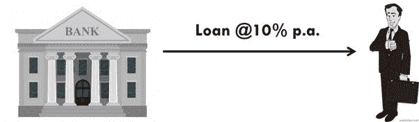
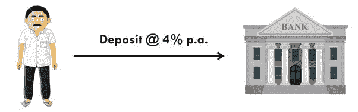

# 经济是如何运作的？

> 原文：<https://medium.datadriveninvestor.com/how-the-economy-works-e032cc132589?source=collection_archive---------7----------------------->

## 一切都是相连的。

([Image credited to ‘Sarah Hargett’, Pinterest](https://in.pinterest.com/skhargett/dark-netflix-series/))

只要记住这句简单的台词，

我们，人民创造了经济，而经济又创造了我们！

我们做的每一笔交易都会影响经济，而经济的每一个变化都会影响我们。基本上，人和经济是相辅相成的。这是一个循环。《经济如何运转》和网飞秀《T2 黑暗 T3》的相似之处简直不可思议！

让我们明白这一点。

# 创业

比方说，“大卫”是一个崭露头角的企业家。他有一个商业想法，要实现这个想法，他需要资金。

他走近一家“银行”。银行借给他一笔年利率为 10%的贷款。

大卫借了这笔贷款，开始了他的生意。

(created by author in MS Power point)

# 创造就业

“大卫”将贷款金额投资于他的企业，并购买机器和其他资产来进行生产。

他雇佣为他的企业工作的劳动力和员工，作为回报，他同意支付他们工资和薪水。

由于“大卫”,劳动力和工作人员正在赚取收入，他们把这笔钱带到他们的房子。在经济学中，我们称他们为*【家庭】*。“大卫”保留企业利润，这就是他的收入。在经济学中，我们把像“大卫”这样的人称为“商人”。

基本上，在经济中，像“大卫”这样的企业家正在创造产出和就业。因此，包括“大卫”在内的人们都在赚取收入。

**收入导致储蓄**

我们都知道‘收入’*减去*‘支出’等于‘储蓄’。

我们也知道一个人的支出是另一个人的收入。

当人们(比如上面的工人和职员)获得收入时，他们会消费，当他们消费时，像“大卫”这样的企业家实际上是在赚钱。

如果我们仔细观察，我们会得出这样的结论:“劳工和职员”的收入依赖于像“大卫”这样的雇主。此外，像“大卫”这样的雇主正在赚钱，因为像“劳工和职员”这样的人正在支出他们的收入。

在某种程度上，两者是相互依赖的。

收入中没有花出去的部分就成了‘储蓄’。人们可能会把钱放在家里或更安全的地方，他们把钱存在“银行”里。

当人们存钱时，他们期望这笔存款有一定的利息。比方说，银行准备给存款人年息 4%的利息。

(created by author in MS Power point)

现在，银行应该使用这些存款，并把它借给像大卫这样的企业家，而这些企业家又准备以每年 10%的利率付给他们。

所以，如果我们做一点算术，我们就会知道，从借款人那里得到的利息(每年 10%)和付给储户的利息(每年 4%)之间的差额就是银行的利润率。(每年 6%)。

如果我们仔细观察，我们会意识到是“银行”通过贷款帮助人们，人们也通过存款帮助银行。所以，基本上两者是互相依赖的。

如果我们进一步分析，我们会得出这个简单的结论，

基本上，每个人都在尽自己的一份力量让经济继续发展。如果有人搞砸了，经济就会崩溃。

比如说，**‘如果人们不再把钱存入银行，会发生什么？’**

银行将会缺钱→银行将会没有更多的钱来放贷→商业将不会繁荣→就业将会减少，人们的收入将会下降。

你拿到照片了吗？如果人们开始浪费时间，不做他们该做的，那将会适得其反。这里的每个人都类似于拼图玩具。如果一块拼图被放错了地方，它就毁了。

经济是由人来管理的，我们知道人不是完美的(理智在这里是恰当的词)。

因此，我们需要一些强有力的机构来调节经济并确保其平稳运行。这些机构是经济的“中央银行”和“政府”。

比方说，中央银行决定提高利率。这种简单的经济变化将影响经济的每一个方面。

利率上升将导致贷款成本上升→企业将失去借贷动力→经济增长将放缓，就业和收入将下降。

所以，经济影响着我们的日常生活，同时我们也影响着整体经济。

记得我说过什么吗？

**我们，人民创造了经济，经济也创造了我们！**

这就是“万物相连”的方式。