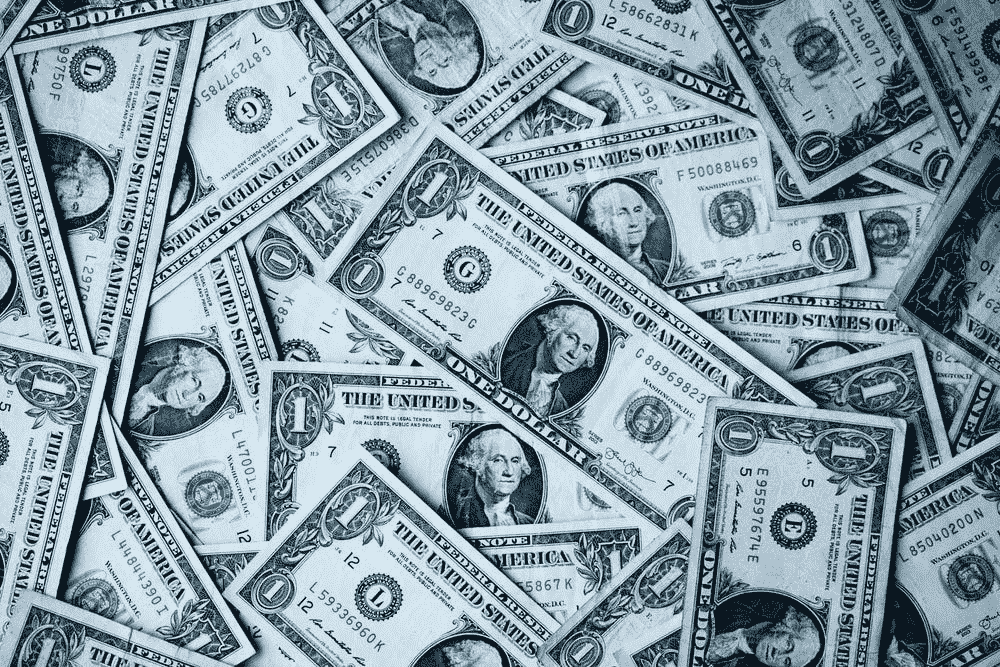

# 美联储如何应对新冠肺炎

> 原文：<https://medium.datadriveninvestor.com/how-the-fed-is-responding-to-covid-19-ee640cefd7a1?source=collection_archive---------24----------------------->

Source: [Sharon McCutcheon (Unsplash)](https://unsplash.com/@sharonmccutcheon)

上周，美联储宣布下调银行间利率，并计划向银行发放超过 1.5 万亿美元的短期贷款。在[之前的一篇文章](https://medium.com/swlh/the-truth-behind-the-feds-1-5-trillion-cash-injection-577b51c7add7)中，我试图解释这意味着什么以及为什么要这么做。我写这些帖子的目的是传达我们的央行美联储为应对新冠肺炎而采取的行动。在一个当前充满歇斯底里的世界里，保持消息灵通和了解真实情况是很重要的。

昨天，2020 年 3 月 15 日，美联储[宣布了它正在采取的额外行动](https://www.federalreserve.gov/newsevents/pressreleases/monetary20200315b.htm)，希望影响银行在新冠肺炎疫情期间帮助公司和个人。以下是美联储在此次声明中采取的一系列行动，它们的含义以及背后的原因:

**取消存款准备金要求**

历史上，美联储要求银行和其他所谓的“存款机构”手头保持一定数量的现金，称为准备金要求。准备金要求的目的是防止银行将从客户存款中获得的资金全部贷出。这反过来限制了银行向寻求贷款的个人和公司发放贷款的能力。作为“新冠肺炎刺激方案”的一部分，美联储董事会完全取消了这一要求，允许银行发放更多贷款。理论上，这将鼓励银行向需要资金运营的家庭和公司发放更多贷款。

**余额支付利息的减少**

在采取上述行动的同时，美联储还降低了准备金和超额准备金余额的利息。简而言之，如果银行将钱存入美联储，它们会获得类似于储蓄账户的利息。美联储将这一利率降至 0.1%，这鼓励银行将多余的现金借给家庭和企业，而不是存在美联储。

**意图降低利率**

作为对 COVD-19 的回应，美联储采取的最后也是最大的行动是将银行间利率降至零。虽然这看起来很奇怪，但这绝对是以前见过的。最值得注意的是，为了应对 2007—2008 年金融危机，美联储将银行间利率(银行相互借贷的利率)设定为零。直到 2015 年，美联储才再次加息。日本在上世纪 90 年代金融危机期间也实施了零利率政策。

 [## 经济就是包容人|数据驱动的投资者

### 建模，数据，最重要的是，人 Tayo Oyedeji 博士在他的食谱中混合了所有这些成分，为一个…

www.datadriveninvestor.com](https://www.datadriveninvestor.com/2019/03/06/economy-is-all-about-including-people/) 

为什么这很有帮助？通过将银行间相互拆借的利率设定为零，它允许银行以极低甚至零成本相互拆借资金。此外，由于银行间利率较低，这鼓励银行向客户设定较低的利率。这导致了以更低的利率借钱的能力。

总体而言，美联储最近实施的这些政策旨在鼓励银行向个人、家庭和企业发放低息贷款。这样做的目的是减轻新冠肺炎对我们经济的影响，这种影响是不可避免的。只有时间才能证明这些应对措施是否有效，以及银行是否会选择合作，帮助那些需要帮助的人。

【TL；美联储博士正试图鼓励银行向那些需要贷款的人发放更多贷款]