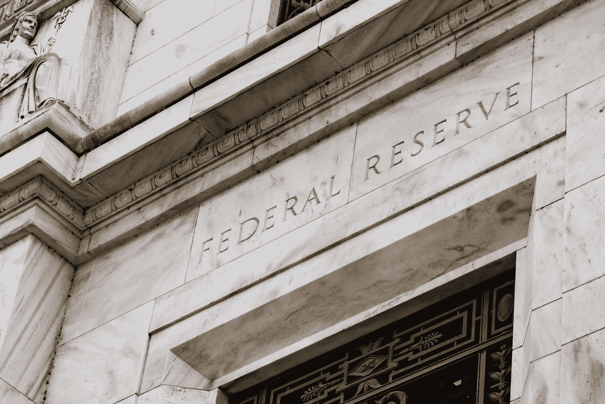

# 美联储降息对你和你的财务前景有何影响？

> 原文：<https://medium.datadriveninvestor.com/how-the-federal-reserves-interest-rate-cuts-affect-you-and-your-financial-future-159724300ba7?source=collection_archive---------12----------------------->

随着冠状病毒疫情的出现，全球市场陷入混乱。世界各地的中央银行正在向市场注入大量资金，以防止市场崩溃。事实上，美国美联储做出了一个戏剧性的决定，于 2020 年 3 月 15 日将利率降至接近 0%。此外，当我写这篇博客时，美联储在 2020 年 3 月 23 日宣布，他们将购买无限量的国债，并首次购买公司和市政债券，这是一项历史性的努力，旨在保护美国经济免受严重的冠状病毒破坏。

这一切对你来说意味着什么？从短期和长期来看，美联储的决定对你的生活有什么影响？在这篇文章中，我将谈论利率变化如何影响你的信贷和消费，你的购房和抵押贷款利率，你在股市的投资和其他现实世界的影响。如果你想了解**这如何影响你的财务健康**，我敦促你不要忽视我将要分享的内容。

让我们开始吧。

Source: [Federal Reserve](https://www.fool.com/investing/2020/03/15/federal-reserve-cuts-rates-to-zero-announces-700-b.aspx)

# 谁是美联储？

美国联邦储备系统，通常也被称为美联储，是美国的中央银行。美联储监管美国的货币和金融体系。

美联储履行五大职能:执行国家货币政策，监管银行机构，监督和保护消费者的信贷权利，维护金融体系的稳定，以及为美国政府提供金融服务。

 [## 外汇投资如何帮助偿还债务|数据驱动的投资者

### 外汇是对外汇市场的投资，不同国家的货币在外汇市场上进行兑换

www.datadriveninvestor.com](https://www.datadriveninvestor.com/2019/02/13/how-forex-investment-helps-to-repay-your-debts/) 

# 他们为什么降息

理论上，在经济放缓的情况下，美联储可能会考虑降息，从而降低借贷成本。这鼓励企业通过扩大生产和雇佣更多的人来借钱投资他们的企业。消费者被鼓励更加自由地消费，从而推动增长。

相反，当经济繁荣时，美联储可能会提高利率，阻止企业借更多的钱。雇主和消费者可能会放缓他们的招聘过程，并在做出会对他们的业务产生重大影响的财务决策时变得格外谨慎。

> 你获得信贷的能力受到利率的影响。

# 受利率变化影响的经济领域以及它们如何影响你？

让我们看看当美联储改变利率时的真实世界的影响，从借贷到消费支出到股票市场。

## 利率和借款:你能借多少？

由于利率降低，债券收益率对投资者变得非常没有吸引力。从美国国债到公司债券，各种债券的收益率往往会下降，这降低了它们对新投资者的吸引力。

> 债券价格与利率成反比，所以当利率下降时，债券价格上升。

因此，固定收益投资者受到负面影响，因为利率上升导致债券收益率下降。随着利率上升，消费者也不太可能借款或为现有债务再融资，因为这样做的成本更高。

## 信用卡利率:你的信用度如何？

最优惠利率代表银行向信用最好的客户提供的信贷利率。随着美联储提高利率，优惠利率也随之提高。银行使用这些优惠利率来确定你的信用程度和你的风险状况。信用卡利率和其他贷款受到影响，因为消费者被广泛地剖析了寻求信贷以进行购物的风险状况。此外，短期借款利率高于长期借款利率。

## 抵押贷款利率:你要支付多少利息？

加息的迹象可能会让房屋借款人急于完成新房固定贷款利率的交易。然而，抵押贷款利率传统上与国内 10 年期美国国债收益率更为一致，后者在很大程度上受到利率的影响。因此，如果利率下降，抵押贷款利率也会下降。较低的抵押贷款利率意味着房屋贷款变得更便宜。

如果美联储看起来要加息，提前偿还高成本债务可以在美联储加息前为你的预算创造一些喘息空间。

## 房屋销售:你一直想买的梦想之家怎么样了

更高的利率和更高的通货膨胀通常会冷却房地产市场的需求。购房者可以预期在投资期间支付更多的利息。但是如果利率下降，同样的购买价格购买同样的房子将会导致更低的月供和更少的抵押贷款总利息。随着抵押贷款利率的下降，同样的房子变得更加便宜，因此买家会更加渴望购买。

## 消费性开支

借贷成本的上升传统上会拖累消费者支出。更高的信用卡利率和更高的银行利率导致的储蓄率都加剧了消费者冲动购买的低迷。当利率下降时，消费者可以以更低的成本赊购。这可以是任何东西，从信用卡购物到贷款买车。

## 储蓄

由于最优惠利率的提高，货币市场和存单(CD)利率也随之提高。理论上，这应该会增加消费者和企业的储蓄，因为他们可以从储蓄中获得更高的回报。另一方面，影响可能是任何有债务负担的人会转而寻求偿还他们的金融债务，以抵消与信用卡、住房贷款或其他债务工具相关的更高的可变利率。

通过关注你的银行的**年百分比收益率(APY)** 保持领先于任何美联储利率变动，即考虑到复利的影响，储蓄存款或投资的实际回报率。定期检查你的银行对账单也可以帮助你确定你的利率是否比市场上的其他选择有竞争力。

## 股票市场:你的投资

虽然当利率上升时盈利能力会下降，但是，这通常对在美国开展大部分业务的公司有利。随着美元走强，这使得当地产品更具吸引力。然而，在国际市场开展业务的公司受到了负面影响。由于利率上升推动美元兑外币汇率上升，海外公司的实际销售额下降。加息有利于金融行业，因为银行股往往在加息时表现良好。

尽管利率和股市之间的关系相当间接，但两者往往会朝着相反的方向发展。根据一般经验，当美联储降息时，它会导致股市上涨，当美联储加息时，它会导致股市整体下跌。但不能保证市场会对美联储选择的任何利率变化做出何种反应。

## 通货膨胀:货币购买力

通货膨胀是指一个经济体中商品和服务的总体价格上涨，它可能是由一个国家的货币贬值或经济增长过快导致商品需求超过供应并推高价格造成的。

当通货膨胀上升时，利率通常也会提高，这样中央银行就可以控制通货膨胀。然而，如果利率下降，通货膨胀可能会开始加速，因为以廉价信贷购买的消费者可能会再次抬高价格。

# 要记住的事情

*   如果美联储认为经济正在放缓，它将下调利率，以重振经济活动，推动增长。
*   你获得信贷的能力受到利率的影响。
*   其动机是通过降低借贷成本来鼓励消费者和企业投资和消费。
*   利率的变化影响经济的许多方面，包括但不限于消费信贷和消费、房屋购买和抵押贷款利率以及股票市场。

# 参考

*   詹姆斯·加勒特·鲍德温。"美联储利率变化的影响." *Investopedia* ，Investopedia，2020 年 3 月 16 日，[www . Investopedia . com/articles/investing/010616/impact-fed-加息. ASP](http://www.investopedia.com/articles/investing/010616/impact-fed-interest-rate-hike.asp.)
*   福斯特莎拉。"美联储利率决策影响你的 5 种方式."Bankrate.com*Bankrate*，2020 年 3 月 15 日[www . Bankrate . com/banking/fed-reserve/how-fed-interest-rate-decisions-impact-your-money/。](http://www.bankrate.com/banking/federal-reserve/how-fed-interest-rate-decisions-impact-your-money/.)
*   巴卡达斯，马丁。"美联储推出无限 QE，全力应对“严重冠状病毒破坏”. " *TheStreet* ，2020 年 3 月 23 日[www . the street . com/investing/federal-reserve-unless-unlimited-QE-to-conflict-coronavirus。](http://www.thestreet.com/investing/federal-reserve-unveils-unlimited-qe-to-confront-coronavirus.)
*   陈，詹姆斯。"美联储系统(FRS). " *Investopedia* ，Investopedia，2020 年 1 月 29 日，[www.investopedia.com/terms/f/federalreservesystem.asp.](http://www.investopedia.com/terms/f/federalreservesystem.asp.)

如果你喜欢读这篇文章，请留下你的评论或点击下面的拍手图标以示感谢。如果你想让其他人从这篇文章中受益并帮助传播，请在你最喜欢的社交媒体平台上分享。谢谢你的时间。

# 我写的其他投资文章

*   *现在如何在艰难和可怕的市场条件下通过拥有 MLP 赚取额外收入？:*[https://medium . com/datadriveninvestor/how-to-earn-extra-income-now-by-owning-mlps-during-rough-and-arrowing-market-conditions-BC 82 E3 d 35130](https://medium.com/datadriveninvestor/how-to-earn-extra-income-now-by-owning-mlps-during-rough-and-fearful-market-conditions-bc82e3d35130)
*   *利用公司利润表进行基本面分析:*[https://medium . com/@ amrut . Patil 88/stock-investing-Fundamental-Analysis-Using-companies-Income-Statement-37 b0d 80531 f1](https://medium.com/@amrut.patil88/stock-investing-fundamental-analysis-using-companys-income-statement-37b0d80531f1)
*   *动量投资:像秘书处:*[https://medium . com/swlh/Momentum-Investing-Be-Like-The-Secretariat-5d 27521 ba 10](https://medium.com/swlh/momentum-investing-be-like-the-secretariat-5d27521ba10)
*   滚雪球效应:如何利用股息增加你的财富？:[https://medium . com/swlh/the-snowball-effect-how-compound-your-wealth-use-股息-d92b719ffe79](https://medium.com/swlh/the-snowball-effect-how-to-compound-your-wealth-using-dividends-d92b719ffe79)
*   *利用公司资产负债表的基本面分析:*[https://medium . com/@ amrut . Patil 88/stock-investing-Fundamental-Analysis-Using-companies-Balance-Sheet-153531d 98 F8 b](https://medium.com/@amrut.patil88/stock-investing-fundamental-analysis-using-companys-balance-sheet-153531d98f8b)
*   *使用自由现金流量表的基本面分析:*[https://medium . com/@ amrut . Patil 88/stock-investing-Fundamental-Analysis-Using-Free-Cash-Flow-Statement-454 beaa 7 f 00](https://medium.com/@amrut.patil88/stock-investing-fundamental-analysis-using-free-cash-flow-statement-454beaa7f00)

# 放弃

*以上文章的内容仅用于信息和教育目的。它无意成为投资建议。此外，我与这篇文章中提到的股票或 ETF 的任何公司都没有业务关系。请在投资前考虑所涉及的风险和您的个人财务状况，或寻求正式许可的金融专业人士的投资建议。*

# 关于我

Amrut 是一名全栈软件工程师，他对软件开发和投资充满热情。他定期为热门出版物撰写文章，如****[**值得注意的是——期刊博客**](https://blog.usejournal.com/)**[**HackerNoon.com**](https://medium.com/hackernoon)**[**数据驱动投资者**](https://medium.com/datadriveninvestor) 和 [**codeburst.io**](https://codeburst.io/) 。他喜欢写关于技术、编码、投资、交易、金融和经济的文章。业余时间，阿姆鲁特喜欢了解不同的投资金融工具。他坚信通过高质量的工作为人们的生活增加价值，并赋予人们掌控个人财务的权力。********