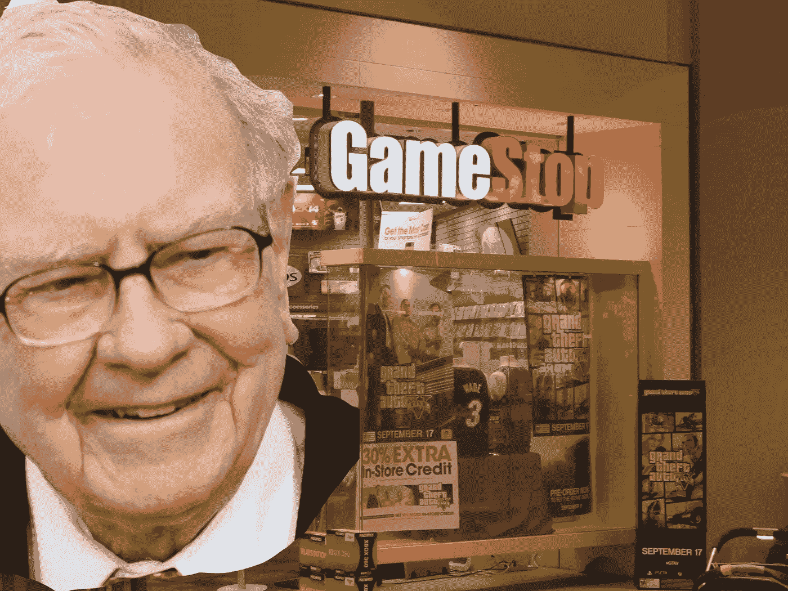
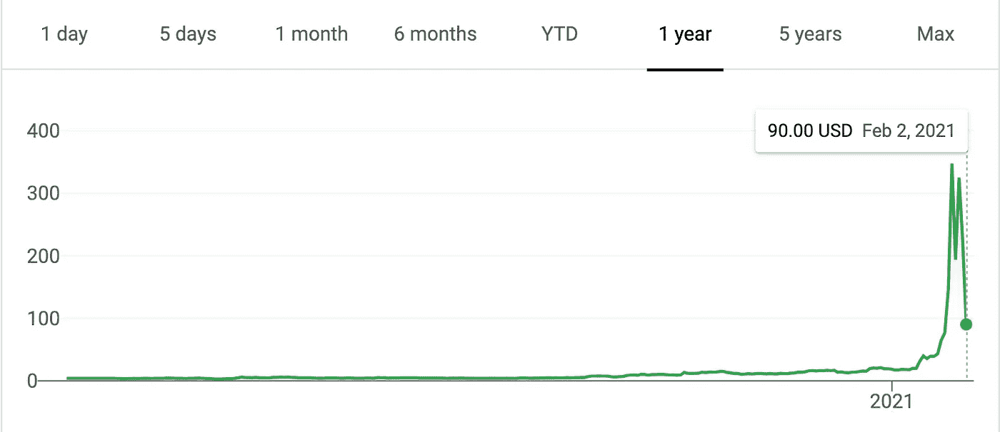
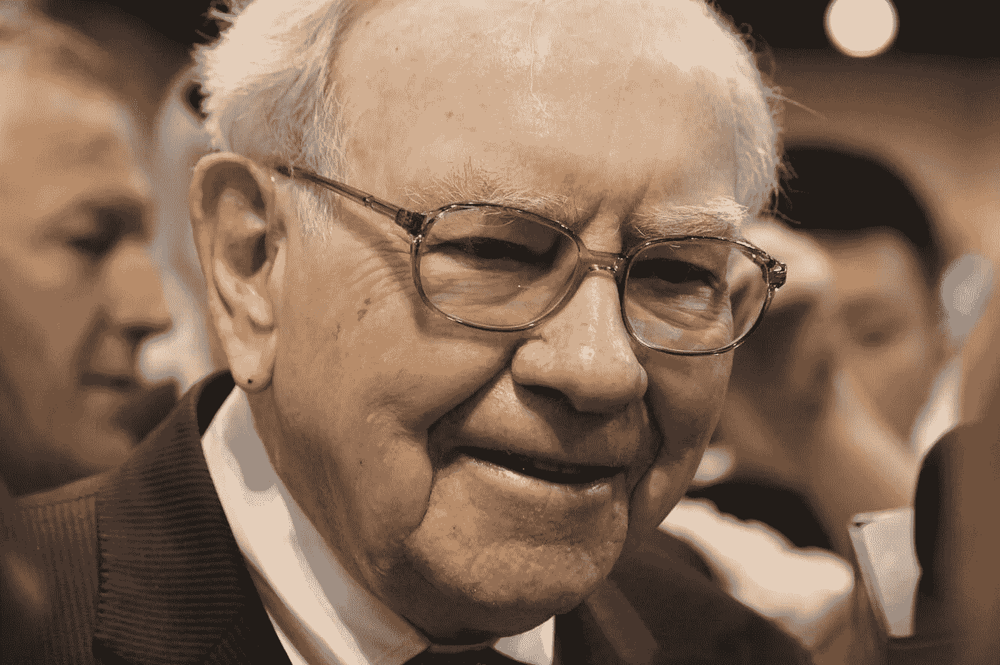

# GameStop 的惨败如何使有效市场理论失效

> 原文：<https://medium.datadriveninvestor.com/how-the-gamestop-fiasco-invalidates-efficient-market-theory-7223e7facf6e?source=collection_archive---------1----------------------->

沃伦·巴菲特批评的投资假说刚刚被证明是无效的

我将这篇文章分成三个部分:GameStop 股票市场繁荣的概述，有效市场假说的解释，第三部分阐述这两者之间的联系。

事不宜迟，我们开始吧。

# GameStop 狂潮

我相信我们都知道，GameStop 是一家因缺乏客户忠诚度和价格过高而陷入困境的公司。该公司处于亏损状态，它积极*现在亏损*。

该公司还有大量卖空者，他们通过押注股票将下跌而非上涨来赚钱。很多人只有在确定股票处于糟糕的财务状况时才会做空。特斯拉是[市场上被卖空最多的股票](https://markets.businessinsider.com/news/stocks/tesla-short-sellers-lost-39-billion-betting-against-stock-2020-12-1029915087)，仅在今年它才盈利。

奇怪的是，大约在上周的 Reddit 上，subreddit[r/wall street bets](https://www.reddit.com/r/wallstreetbets/)上的一群股票交易员决定前去购买 GameStop 的股票。为什么？为了迷因。他们认为这会很有趣。

我说的“一群股票交易员”是指成千上万的人。subreddit 本身就有超过 800 万的会员。

这些投资者开始购买如此多的 GameStop，以至于它的股价飙升到了云端。一月份，该股涨幅超过 1900%。1 月 4 日，它的交易价格在 17 美元左右，1 月 27 日，它达到了令人瞠目结舌的 347.51 美元。

该股波动如此之大，在达到上述峰值后，第二天下跌了 44%，第二天又回到了 325 美元。截至 2 月 2 日，该股暴跌 72%，至 90 美元。

[Google’s statistics](https://www.google.com/search?q=gamestop+stock&oq=gamestop+stock&aqs=chrome.0.69i59l2j69i60l3.2229j0j1&sourceid=chrome&ie=UTF-8) for GameStop’s stock

所有这一切都是为了一家仍在亏损的公司。

为什么？为什么这些人都这样赌自己的血汗钱？

为了迷因。

现在我们知道了发生的背景，让我们看看我之前提到的有效市场理论是什么。

# 有效市场假说

从字面上看名字本身就可以理解有效市场假说。

“假设。”好的，我们知道这是一个假设。

“有效市场。”所以这个理论表明公开市场是有效的。

用你能理解的术语来说，这个假设简单地陈述了市场总是正确的。因此，股票市场始终是当时所有信息的结果。

因此，从理论的角度来看，市场永远是正确的，从长期来看，你的财务业绩不可能超过市场，因为根据公众可获得的信息，股票的市场价格是公司的正确价值。

在该理论看来，任何相反的尝试，即投资者的表现超过市场回报，都只是异常现象，不可能持续获得这些回报。

现在看看这个理论，有了现成的信息，我们可以很容易地说这个假设是完全、完全、完全不正确的。

有太多太多的投资者一次跑赢市场几十年的例子。投资者不仅表现出色，还持续破坏了市场回报水平。

最值得注意的是，这个家伙:

From the [Motley Fool](https://www.fool.com/investing/2021/02/02/why-warren-buffett-will-never-get-short-squeezed-i/)

沃伦·巴菲特的伯克希尔·哈撒韦公司在其 55 年的股票市场交易中，每年的平均回报率为[20.5%](https://www.fool.com/investing/2019/12/22/5-reasons-warren-buffett-didnt-beat-the-market-ove.aspx#:~:text=Warren%20Buffett's%20Berkshire%20Hathaway%20(NYSE%3ABRK.&text=Berkshire%2C%20which%20owns%20everything%20from,it%20began%20trading%20in%201965.\)，是同期标准普尔 500 指数回报率的两倍多，这是大多数人在谈论整体市场时所关注的市场平均水平。

他不是唯一一个。彼得·林奇在富达工作的 13 年间，每年的回报率为 29%。塞思·卡拉曼，比尔·阿克曼，他们都是持续跑赢市场的投资者。

沃伦·巴菲特在他著名的演讲[中批评了有效市场理论在演讲中，他举了一个例子。](https://www8.gsb.columbia.edu/articles/columbia-business/superinvestors)

如果你带来 2.25 亿只猩猩，并让它们抛硬币。在抛硬币之前，猩猩们会被要求试着判断硬币会落在哪一边。

在 20 次抛硬币后，假设只有 215 只猩猩每次都正确地说出了硬币。这不涉及任何技巧，你会有 215 只自我中心的猩猩夸耀它们的掷硬币技巧。

然而，如果你做了调查，发现 215 只猩猩中有 40 只来自某个特定的动物园，你会想知道那个动物园管理员给猴子吃什么。你会问他让他们做什么练习，他们在读什么书，等等。

这就是投资的本质。世界上许多伟大的股市投资者，如巴菲特，都是价值投资的先驱本杰明·格雷厄姆和大卫·多德的门生。如果不是，他们至少使用相似的原则。

巴菲特的观点是，鉴于那些在股市中遵循正确原则的人明显的成功率，有效市场假说是不可能成立的。

From [Ivan Corvin](https://pixy.org/author/Ivan_Corvin/) on [Pixy](https://pixy.org/)

# 这两者是如何关联的

回到 GameStop，我们可以看到它与有效市场理论的关系。如果没有足够的证据表明这是明显错误的，现在有了。

没有额外的信息出来是 GameStop 的股票像鸟一样飞向天空的原因。仅仅是 Reddit 上的一群人决定让股票飙升是打破现状并坚持让那些亿万富翁对冲基金经理受益的一个好方法。

一只股票因为迷因暴涨了 1900 美元，是因为迷因暴涨，而不是因为它实际上值那么多钱。

有效市场理论会假设 GameStop 公司实际上值那么多钱，尽管很明显事实并非如此。几天之内，股价从 17 美元涨到 347 美元，再到 90 美元。这些估值中只有一个是正确的。

看着现状被打破，看着华尔街像以前一样被打乱，是一种享受。但我们不要自欺欺人地认为 GameStop 公司实际上值那么多钱。华尔街上的交易者从事的是赌博，他们的名字中就有“bet”这个词。

GameStop 是这样交易的，不是因为它有价值，而是因为一个原因。

为了迷因。