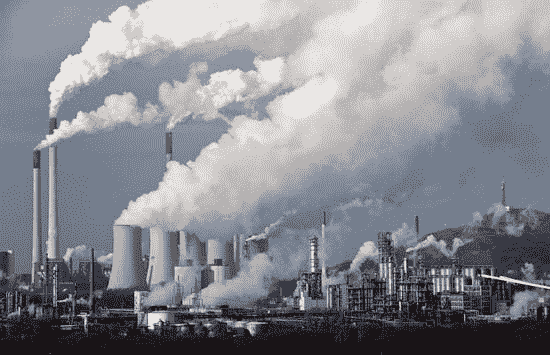

# 世界上最具创新性的国家仍然沉迷于旧能源

> 原文：<https://medium.datadriveninvestor.com/how-the-most-innovative-country-in-the-world-is-still-addicted-to-energy-of-old-e9ad172f3ff0?source=collection_archive---------14----------------------->

朝鲜战争后的 60 年间，韩国的发展可谓引人注目。战争结束后，韩国是地球上最贫穷的国家之一，但快速的工业化和对经济增长的极度关注使它成为世界上技术最先进的国家之一。

根据[彭博创新指数](https://www.bloomberg.com/news/articles/2020-01-18/germany-breaks-korea-s-six-year-streak-as-most-innovative-nation)，今年年初，七年来韩国首次被列为世界第二大最具创新力的国家——之前的六年，韩国一直是世界第一。现代、LG 和三星等公司的发展是这一发展的关键，并确保它们继续引领世界各地的技术创新。

 [## 气候变化辩论中的科学与金钱|数据驱动的投资者

### 没有关于气候变化的公开辩论。在我发布文章的媒体上，有成千上万的文章是关于…

www.datadriveninvestor.com](https://www.datadriveninvestor.com/2020/01/30/science-and-money-in-the-climate-change-debate/) 

尽管韩国在经济和技术上做得很好，但他们几乎完全依赖化石燃料——主要是煤。他们不仅依赖化石燃料，而且几乎没有自然资源可以依靠，他们依赖从其他国家进口超过 98%的化石燃料，所有这些都是通过油轮进口的，没有国际管道基础设施。

> *“我们没有任何其他自然资源——我们只有我们的大脑可以求助。”*
> 
> [*张淑娟，汉阳大学企业管理教授*](https://www.bloomberg.com/news/articles/2020-01-18/germany-breaks-korea-s-six-year-streak-as-most-innovative-nation)

[气候行动追踪者](https://climateactiontracker.org/countries/south-korea/)——一个独立的科学机构，研究世界上许多国家如何采取足够的行动来实现将升温限制在 1.5 摄氏度的目标——目前将韩国为实现 2015 年巴黎协定设定的目标所采取的行动评为“非常不够”。[根据忧思科学家联盟的数据](https://www.ucsusa.org/resources/each-countrys-share-co2-emissions)，韩国在一个国家的总排放量中排名第七。按人均计算，韩国排在第 22 位，当你考虑到上面的许多国家都是产油国时，对于一个面积和密度都相当大的国家来说，这是非常高的。

就在两年前，我写了一篇博客，关注首尔的可持续性。当时，我评论了它如何利用技术提高效率，减少韩国首都产生的排放，它在这方面做得很成功。提高公共交通的可及性和燃油效率，让使用电动汽车出行变得更容易，以及让通过手机控制家庭的各个方面成为可能，这些都在减少排放方面发挥了作用，但在每个例子中仍然使用化石燃料。事实上，尽管采用了各种技术，但韩国消耗的电力中只有 3%是由可再生能源生产的。

A coal power station in South Korea (Copyright 2004 Yonhap News Agency All rights reserved.)

# 对化石燃料的嗜好

像世界上许多国家一样，他们谈论行动和应对气候紧急情况的重要性，但往往很少采取实际行动来解决这一问题。韩国在这里也没有什么不同。2008 年，全球金融危机之后，绿色增长和改变“化石燃料常态”的承诺出现了。不幸的是，这一举措收效甚微，韩国仍严重依赖化石燃料。

我经常批评英国和澳大利亚，尤其是它们继续投资化石燃料项目；燃料成本的增加以及燃烧时对环境和人类健康的损害应该足以成为将其留在地下并转向更清洁燃料的理由。然而，韩国仍在继续快速建设新的燃煤电厂，并似乎在将这种古老、肮脏的燃料作为绿色技术进行营销。老实说，韩国的绿色清洗是我从未见过的…

以 Goseong 绿色电力公司为例。如果你去他们的网站，你会被下面一些风景如画的湖边景色的图片所欢迎，并且标签上写着“创新的绿色电力供应商”有了这个和这个名字，发现他们计划在 2021 年之前在庆尚南道建一个新的煤电厂可能会有点震惊。

Front page of Goseong Green Power website (Source: [www.ggpower.co.kr](http://www.ggpower.co.kr/))

这只是一个例子。你对韩国的能源行业了解得越多，就会发现越多的公司在营销时，甚至直接称自己是“绿色”的，它们要么大举投资，要么正在建设燃煤电厂。然而，似乎没有任何监管甚至道德来阻止公司故意向公众撒谎。

韩国不仅仅需要在国内放弃化石燃料。如果韩国要真正走向绿色，那么它也必须迅速放弃化石燃料，停止向化石燃料项目提供资金。国际石油变革组织(Oil Change International)最近的一份监督报告发现，韩国、中国、日本和加拿大每年通过政府支持的贷款和国际发展项目，向化石燃料项目提供总计 500 亿美元的资金，这直接违背了巴黎协议中的承诺。

# 韩国能走向绿色吗？

很明显，任何更具可持续性、更接近实现巴黎协议目标的举措都将是困难的。

在学校气候罢工、国际社会对气候危机的认可以及最近的冠状病毒疫情之后，南韩似乎终于更加认真地对待应对气候紧急事件了。绿色新政在世界各国受到越来越多的关注，在一位新议员的领导下，它正进入韩国政治的前沿。

最近,*《卫报》* 的一篇[报道的主题是李素英，该报道关注的是南韩如何成为又一个认真执行绿色新政的国家。她在选举前的竞选活动将绿色新政作为其宣言的核心，鉴于压倒性胜利，绿色新政在韩国公众中非常受欢迎。她的能量似乎正在本届政府中蔓延，因为许多议员似乎越来越雄心勃勃，要在后 COVID 世界实现绿色新政——这是 2008 年金融危机后所缺失的。](https://www.theguardian.com/world/2020/may/23/could-a-green-new-deal-turn-south-korea-from-climate-villain-to-model)

Soyoung Lee taking part in the climate strikes (Source: [*The Guardian*](https://www.theguardian.com/world/2020/may/23/could-a-green-new-deal-turn-south-korea-from-climate-villain-to-model))

由于在国会中占据明显多数，执政的民主党几乎没有障碍阻止其为韩国制定绿色新政。在最近的疫情之后，显然会有必须解决的经济挑战，但是绿色增长没有理由不能在减少国家的环境和气候影响的同时重启韩国经济。

# 技术不是唯一的解决方案

尽管韩国开发了所有技术，创新也很明显可用，但他们仍然依赖化石燃料，尤其是煤炭，这非常令人担忧。他们距离巴黎气候协议中商定的目标还有很长的路要走，而且鉴于他们目前对化石燃料的依赖，我们可能需要很多年才能看到实质性的进展

韩国的例子也对技术在帮助我们摆脱气候危机中的作用提出了严肃的问题。如果世界上技术最先进的国家之一是最严重的污染者之一，技术不能被视为唯一的解决办法。我并不是说技术不会帮助解决这场危机，只是它不会像许多人希望的那样成为灵丹妙药。

事实是，世界上的每个国家都一样，解决气候危机和发展一个可持续的，如果不是可再生的，地球需要一个多方面的方法。随着韩国城市效率的提高——或者至少在首尔——以及最近的选举结果，变化正在发生，即使只是在局部范围内。韩国人似乎想认真对待气候紧急事件，现在我们只需要政府和韩国企业尽快跟进。

*原载于 2020 年 5 月 28 日 http://thinksustainabilityblog.com***。**