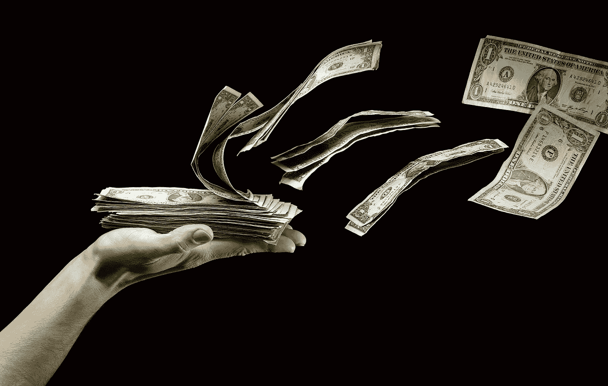
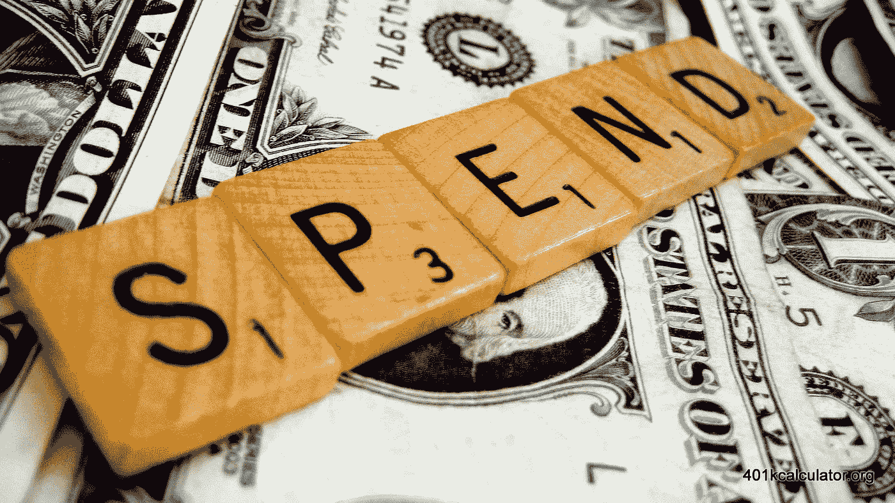
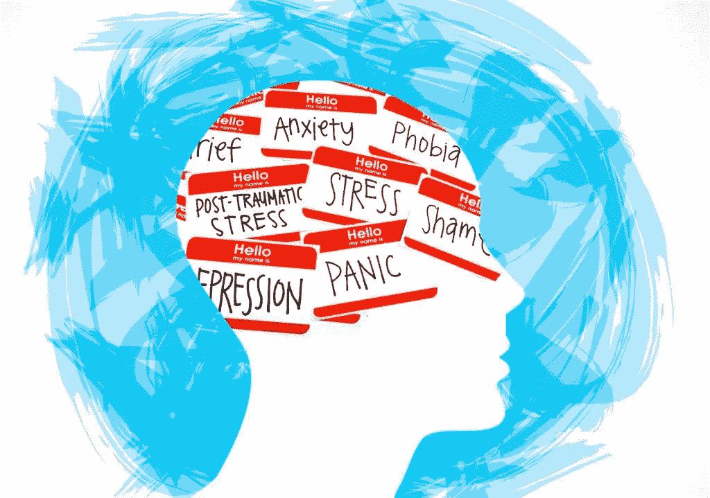
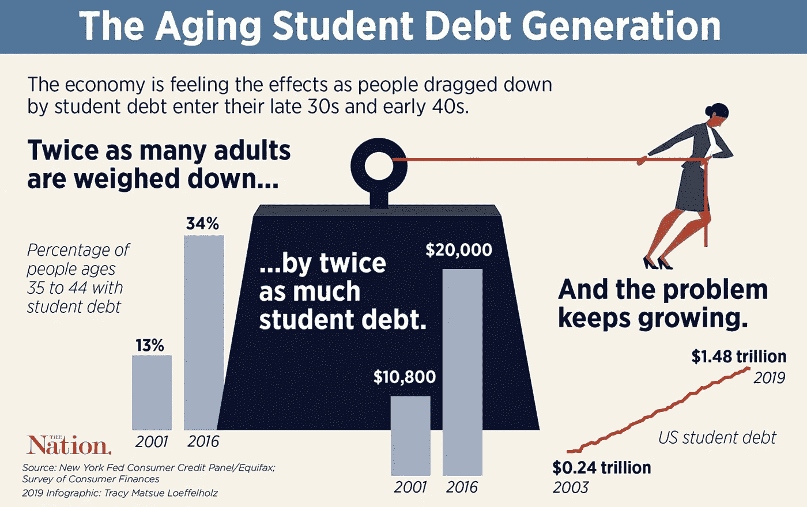
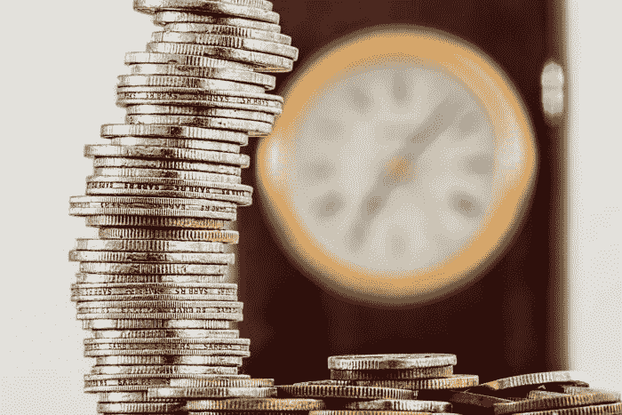

# 新生如何在 COVID–19 期间消费和投资

> 原文：<https://medium.datadriveninvestor.com/how-the-new-kids-are-spending-and-investing-during-covid-19-9c4a943f12d?source=collection_archive---------13----------------------->

千禧一代仍然被认为是“新的孩子”，但他们已经不再是新的孩子了。事实上，大多数已经存在了一段时间。尽管我们想以他们为代价创造所有的迷因，但他们是美国最大的一代。他们是最大的财富建设者，最大的收入群体，也是最多样化的一代。这些区别意味着它们构成了我们经济的一大部分；如果他们做得好，我们作为一个国家也会做得好。

自 COVID–19 爆发以来，数百万人失去了工作，还有数百万人处于可怕的财务状况中。即使是那些已经做出财务成熟决定的人，比如至少有一年的可用存款，也在以惊人的速度消耗他们的积蓄。失业救济已经失效，刺激计划的谈判陷入僵局，与此同时，多达 4000 万人面临被驱逐的风险。

因此，在大萧条以来最严重的经济低迷时期，千禧一代过得怎么样？他们的消费习惯发生了怎样的变化？在这段艰难时期，投资行为发生了怎样的变化？

剧透:很多都变了。

千禧一代表示，确保强大的财务未来比以往任何时候都更重要。大多数千禧一代回到绘图板，重新编制收入预算，分散投资组合，优化储蓄。

逻辑可能会告诉你，在经济危机时期，这似乎很正常。在经济不确定时期，重新分析你的财务状况是正常的。但对于千禧一代来说，这是一个他们太熟悉的老问题。在他们的职业生涯中，尤其是在大萧条之后，千禧一代总是对经济持怀疑态度。他们知道一个热门领域的学位和一份精美的简历并不能保证工作的稳定性。他们知道，一个已经动荡的市场——疫情加剧了它的不稳定性——无法保证金融稳定。

多达 70%的千禧一代在疫情期间减少了支出，多达 47%的人表示，在疫情结束后，他们将继续减少支出。鉴于大约 87%的千禧一代主要生活在 COVID–19 遭受打击最严重的州，对开展业务和日常生活的限制彻底改变了他们的生活。

千禧一代将收入的 37%额外用于家庭用品和电子产品。在线订阅也增长了 37%。就连服装和配饰支出也增长了 30%。这些花费中的大部分可以归因于需要解决的精神健康问题。不是因为他们疯了，而是因为 COVID–19 的情有可原的情况导致创纪录数量的美国人面临某种精神健康问题。

 [## 金钱:冠状病毒疫情期间的投资|数据驱动的投资者

### 在我将近 20 年的金融服务生涯中，我曾经负责监督整个…

www.datadriveninvestor.com](https://www.datadriveninvestor.com/2020/07/29/money-investing-during-the-coronavirus-pandemic/) 

千禧一代受到批评，而且往往是不公平的，因为他们在处理财务方面缺乏务实和成熟。然而，正是这些可怕的斗争助长了这种情绪，现在是我们在更深层次上分析这种情况以帮助美国最大的一代人的时候了。

虽然老一代人(即仍在工作的 X 一代)也深受 COVID-19 锁定的影响，但千禧一代面临着一个主要的额外问题:学生贷款债务。

随着年轻人不得不忍受生活和教育成本的上升，他们的经济状况比他们的父母在相同年龄时要糟糕得多。个人财富的缺乏造成了一系列问题:失业、缺乏储蓄、金融不安全，甚至不良的消费习惯。财务不安全在很大程度上影响了人们的心理，这往往会导致不良的消费习惯(如上所述)。

另一个有趣的事实是，X 一代在 18 岁到 32 岁之间平均从事三份工作。另一方面，千禧一代平均持有 8 个。在他们的职业生涯中，X 一代员工在一份工作上花费的时间平均比千禧一代多近 23%。千禧一代频繁更换工作并不是因为他们更容易被解雇，而是因为员工频繁更换工作以寻求更高的工资和更好的福利。

千禧一代的这种跳槽性质，加上不断上升的学生贷款债务，导致了严重的金融不稳定和不安全。这些问题在疫情之前确实存在；COVID–19 只是火上浇油。鉴于千禧一代更年轻，可能处于“公司阶梯的较低位置”，当经济衰退来袭时，他们首先受到冲击。由于疫情，超过 35%的千禧一代的工资下降或失业。除了失业的可能性增加之外，还有学生贷款债务、缺乏财富以及 48%的千禧一代承担大家庭成员的家庭开支这一事实。

面对巨大的财务困难，超过 60%的千禧一代现在以不同的方式思考他们的财务问题，转而学习更多关于金融市场的知识并积累财富。

鉴于千禧一代不得不应对的金融动荡局面，让他们的财富“经得起未来考验”比以往任何时候都更加重要和有吸引力。近 70%的千禧一代渴望学习如何投资，超过 60%的人认为现在是投资的好时机，超过 20%的人正在积极尝试投资，近 30%的人已经在投资市场。

在投资于市场的千禧一代中，大多数人更喜欢适度激进的投资组合，以增加获得更高回报的机会。近 40%的千禧一代投资者的投资组合主要由派息股票组成，而只有 18%的千禧一代投资房地产。简单地说，这是一种有效的方法:23%的千禧一代报告说，他们的收入来自股票投资组合的升值。

虽然千禧一代多年来一直面临着无数的财务困境，但那些投资于市场的人主要看到了良好的回报。COVID–19 引发了千禧一代不得不应对的最严重的金融危机之一，但市场投资似乎达到了历史最高水平。这是为什么呢？这是怎么回事？

最近投资的增长很大程度上可以归因于 FOMO 文化(害怕错过)。千禧一代经常被批评为容易受到同龄人的压力，并购买从时尚到美食的最新潮流。然而，FOMO 文化并不总是被证明是一件坏事:许多趋势曾经被认为是古怪和不切实际的(网上购物，送餐等)。)现在已经变得司空见惯。公共变量？千禧一代倾向于尽可能快速高效地做事。有人可能会说，这种源自 FOMO 文化的思维方式多年来一直推动着技术创新。

导致优步和 Doordash 崛起的同样的千年风气，现在正在为金融科技(Fintech)的发展铺平道路。而且不仅仅是移动支付服务(Paypal、Venmo、Cashapp 等。).

投资平台正在变得疯狂。Webull、M1 金融、E*TRADE 以及最著名的 Robinhood，在千禧一代中越来越受欢迎。查尔斯·施瓦布今年新开了 80 多万个账户。FOMO 文化、无聊和对未来金融的渴望导致了这一切。

那么这到底有什么不好呢？更多的人投资市场不好吗？

是也不是。越来越多的人对市场如何运作感兴趣，越来越多的人积极尝试学习更多的财富管理和金融知识，这很好。谁知道呢，也许这可能会鼓励政治家们最终推动在我们的教育系统中开设金融知识和财富管理课程。

可悲的是，这些应用吸引了没受过教育的投资者。这就是冷酷的事实。这些应用程序有吸引力的原因有三点:用户界面很棒，很容易使用，随时可以使用，你不需要太多的钱就可以开始使用。不幸的是，由于许多“新手”不了解市场如何运作以及如何管理风险，这是一个灾难的处方。

千禧一代已经有财务问题，这一点已经很清楚了。他们已经在与心理健康问题作斗争，特别是在 COVID 的时代——19:60%的千禧一代由于无聊和抑郁而一直在进行不必要的消费。不做适当的尽职调查就交易高波动性股票是一种不必要的支出，后果是可怕的。它不仅恶化了千禧一代的财务状况，而且精神健康的损失也太大了，不容忽视。今年早些时候，一名认为自己在 Robinhood 上欠了 73 万美元债务的 20 岁学生自杀了。

COVID–19 对我们大多数人的打击都很大。一些人受到的打击比其他人更大，许多人是“新孩子”:千禧一代。虽然千禧一代是你可以打赌会度过这场漫长而黑暗的风暴的一代(鉴于他们应对经济灾难的经验)，但生活仍然异常艰难。千禧一代的生活困难加上他们对效率和速度的渴望，导致了技术的快速发展，科技行业只涨不跌。

当然，虽然技术确实极大地帮助了人类，但也有负面影响。虽然技术帮助我们更简单地找到工作和银行，但它也为错误信息和心理健康问题打开了大门。虽然数字创业公司的崛起意味着千禧一代未来将更容易创造可靠的收入来源，但他们也利用了我们的无知。

但还是有希望的。近 70%的千禧一代渴望学习如何投资。30 岁以下的人有 77%对投资感兴趣。财富管理、金融知识和投资方面的适当教育可以为未来几代人的金融观察和成功铺平道路，避免千禧一代被迫忍受的无数灾难。

**进入专家视角—** [**订阅 DDI 英特尔**](https://datadriveninvestor.com/ddi-intel)