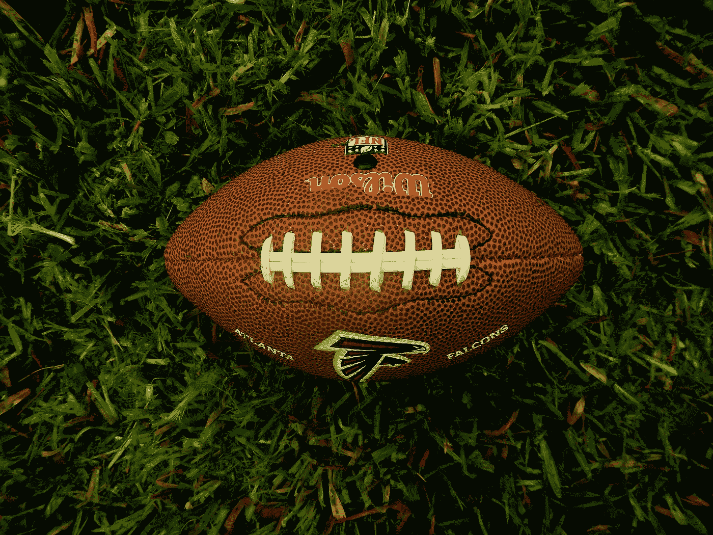

# NFL 如何鼓励公平竞争

> 原文：<https://medium.datadriveninvestor.com/how-the-nfl-encourages-fair-competition-2a604e571bfa?source=collection_archive---------17----------------------->

## NFL 展示了一个封闭的市场是如何增加竞争的，而一个自由的市场只为占主导地位的少数人服务

[Ernesto Rodriguez](https://pixabay.com/users/Lernestorod-5382836/?utm_source=link-attribution&utm_medium=referral&utm_campaign=image&utm_content=2660585)

由于新冠肺炎的原因，今年的 NFL 选秀可能会有一些不同，但规则是一样的。NFL 去年表现最差的球队获得了大学球员的第一选择权。超级碗的获胜者最后挑选。这只是 NFL 用来平整比赛场地的一种控制手段，以确保没有球队占据主导地位。美国国家体育的核心是一个受控制的市场。看起来很奇怪，自由市场的大本营有一项运动信奉它所鄙视的原则。但这种矛盾有助于暴露自由市场的弱点。

该草案并不是寻求鼓励 NFL 公平竞争的唯一规则。[50 亿美元的转播权](https://www.cnbc.com/2019/12/30/nfl-ratings-recovering-new-media-deals-could-be-on-the-2020-agenda.html)由各队分享。以及[门票和商品收入](https://www.sportingnews.com/us/nfl/news/nfl-revenue-sharing-television-contracts-2014-season-business-model-nba-nhl-mlb-comparison-salary-cap/gu0xok7mphu01x3vu875oeaq6)。

这些措施有助于保持高度竞争性的竞争。在过去的十年里，已经有八个超级碗冠军得主。在此期间，只有新英格兰爱国者队赢过不止一次。

NFL 是一个受控制的市场如何创造公平竞争的象征。这是一个非常不同的故事。

## 英格兰超级联赛自由市场

英超显示了在自由市场中会发生什么。橄榄球不像 NFL 那样有馈线系统。最富有的俱乐部有财力为最好的球员支付最高的费用和最高的工资。这意味着他们总是比小团队表现得更好。每支球队的[根据他们在联赛中的名次授予奖金](https://www.premierleague.com/news/1225126)。顶级团队赚得最多，底层团队赚得最少。经常出现的球队(最好的球队)也能获得更多的转播收入。

这些措施意味着财政资源决定成功。在 27 个赛季的英超联赛中，已经有 6 个冠军得主。一个贫穷的俱乐部能在这个市场上成功的唯一方法是通过来自外部投资者[的资金注入。](https://www.bbc.co.uk/sport/football/45372362)

英超联赛模式是欧洲最公平的主要联赛。它设置了一些控制，例如，每个团队都被授予一定报酬的[均等份额](https://www.premierleague.com/news/1225126)。

在不受控制的自由市场中，最强大的俱乐部可能会要求不平等的收入份额。有一种观点认为最成功的团队最吸引人。他们负责产生最大的收入，所以股票折价了他们的价值。如果最富有的球队如愿以偿，联赛将变得更加没有竞争力。更多的财富被分配到更少的俱乐部手中。

## 成功者的成功

英超联赛的模式确保了成功只属于少数几支球队。其余的为残羹剩饭而战。

这个模型展示了自由市场如何创造一个正反馈循环。一个团队越成功，他们赚的钱就越多，这意味着他们越有可能继续成功。较小的团队则相反。他们越不成功，赚的钱就越少，这使得他们更有可能保持不成功。

把这个比喻用于商业，“赢家”总是保持不变。最大的公司可以摧毁他们的竞争，因为他们有不公平的优势。他们可以通过降低价格来削弱任何竞争。独立生产商根本无法在价格上与跨国公司竞争。

对商业不加控制会减少竞争。减少一个行业中公司的数量并扩大其规模。商业街上的零售商就是一个例子。大街已经变成了荒凉、没有灵魂的地方，因为它们都是一个主题的变体。独立零售商已经成为过去。

美国是不受控制的自由市场力量的守护者。这一新自由主义口号已经成为影响全球经济的主导思想。

## 市场需要平衡

NFL 和英超联赛之间的差异表明，对市场的控制越少，市场就越不平等。

自由市场让强大的公司变得更加强大。我们被灌输了选择的错觉，但我们的选择是从一家大公司还是他们的竞争对手那里购买。令人难以置信的是，只有十家公司拥有世界上几乎所有的大型食品和饮料品牌。

自由市场减少竞争，赢家总是一成不变。如果市场是一项运动，我们早就都关掉了。

自由市场的动态意味着，随着时间的推移，行业越来越多地被少数占主导地位的公司所控制。我们需要的是更多的控制来创造公平的竞争环境。

如果美国继续拥抱一个不受控制的市场，我们可能会发现自己被少数公司控制了一切。但也许这一直是自由市场的目标。

【transformatise.com[*阅读原文，订阅更多文章*](http://www.transformatise.com/)