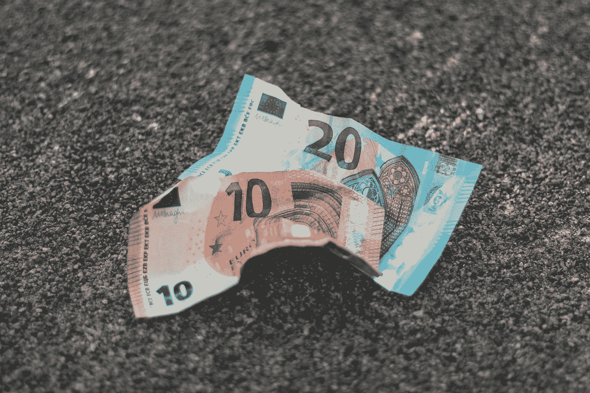
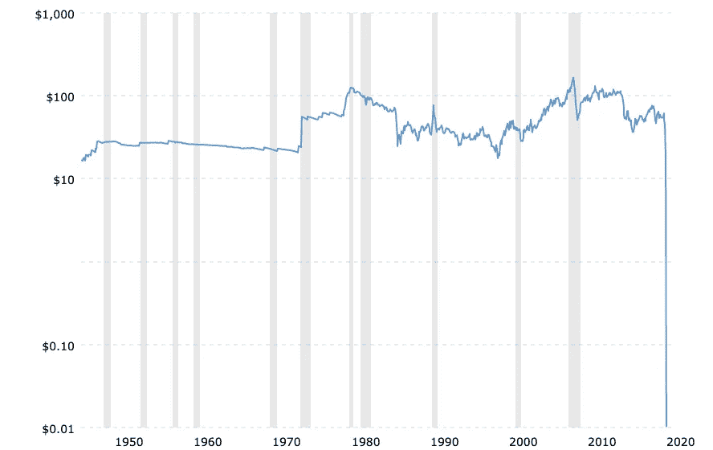
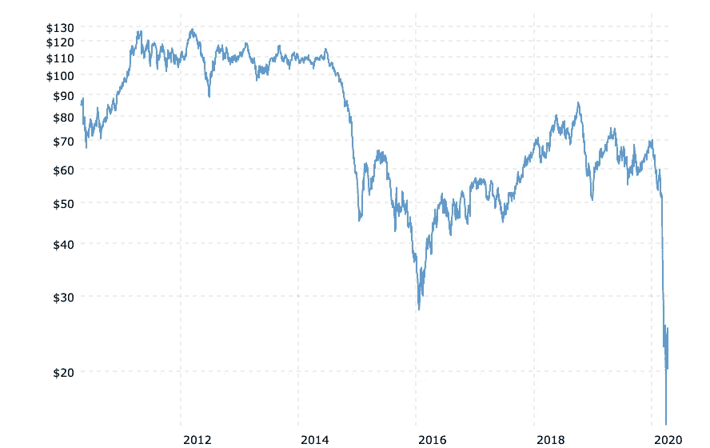
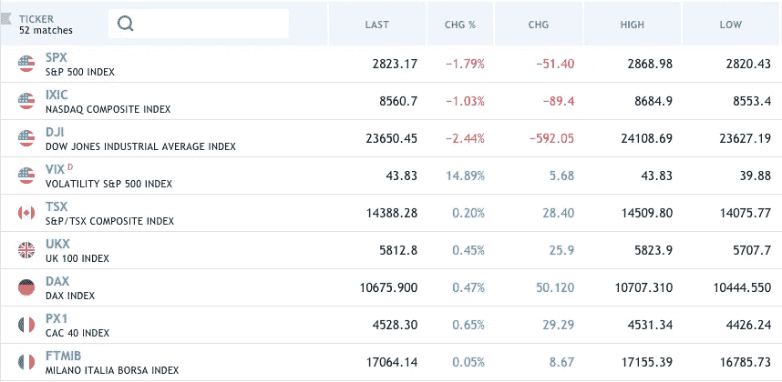

# 今天的石油危机将如何恶化明天的欧盟？

> 原文：<https://medium.datadriveninvestor.com/how-the-oil-crash-of-today-will-worsen-the-eu-of-tomorrow-ecd04d0e17a5?source=collection_archive---------27----------------------->

Photo by [Christian Wiediger](https://unsplash.com/@christianw?utm_source=medium&utm_medium=referral) on [Unsplash](https://unsplash.com?utm_source=medium&utm_medium=referral)

Twitter 现在快疯了，我的屏幕是这样的:

[Crude Oil Prices — 70 Year Historical Chart](https://www.macrotrends.net/1369/crude-oil-price-history-chart)

你现在看到的是最受欢迎的石油质量等级之一——西德克萨斯中质油(WTI)，它是北美的基准。WTI 在芝加哥和纽约的交易所交易。

[Brent Crude Oil Prices — 10 Year Daily Chart](https://www.macrotrends.net/2480/brent-crude-oil-prices-10-year-daily-chart)

这是布伦特北海原油。它是北海 15 个油田的混合物。这是世界产量的三分之二。非洲、欧洲+中东的标杆。

今天油价暴跌的原因很简单:需求不足。

但是为什么股票价格没有反映出来呢？

**因为央行。**

他们——以及财政当局——将挺身而出。

现在的问题是:当危机结束时，结果会是什么？

对美国和英国来说——由于法定货币，这是可控的。他们是全球货币发行者。

对意大利来说——因为欧元，根本无法管理。

这一切都归结于银行和做央行所做事情的能力。

但是这里也有一个文化问题。

这可能有点难以定义，但现实是没有*欧洲合众国。*他们真的不像美国那样团结。

当然，有很多关于红州和蓝州的谈论，但事实是当新奥尔良有飓风时，所有美国人*都变成了美国人*。

透过危机，你可以看到美国是一种怎样的文化，而这是欧洲从未经历过的。

 [## 使用谷歌搜索趋势预测首次申请失业救济人数|数据驱动的投资者

### 几年来，我的重点一直是使用多种替代数据来预测宏观经济统计数据…

www.datadriveninvestor.com](https://www.datadriveninvestor.com/2020/03/25/using-google-search-trends-to-predict-initial-jobless-claims/) 

另一方面，在过去的 25 年中，欧洲在团结和试图协调平衡方面取得了巨大的进步，但现实是，当今天的欧洲领导人还是孩子的时候，他们听到的是关于欧洲大国之间发生的两场可怕战争的故事。

这些不是统一的文化，在表面之下潜伏着文化风险，这是美国人在美国根本没有的。

# 英国

联合王国始终保持自己的中央银行，因此能够实施自己的货币政策。

但欧洲其他一些国家发生的事情会影响整个欧元区。布鲁塞尔在一个潜伏着潜在文化紧张的地区推行了一个一刀切的解决方案。

从市场角度考虑这个问题。

比较一下美国和欧洲的两个工业经济体。

美国有汽车，欧洲有汽车。

现在，哪个国家将对冠状病毒做出更强有力的反应？

基于欧元股票相对于标准普尔 500 指数的记录，你真的因为市盈率的折扣而获得了与欧洲下跌相关的风险补偿吗？

我不确定是不是这样，鉴于欧洲财政货币政策的结构，贴现很可能与欧洲相对于美国的增长不足完全一致。

和往常一样，时间会证明一切。可以肯定的是，市场有能力保持非理性。谁知道剩下的。