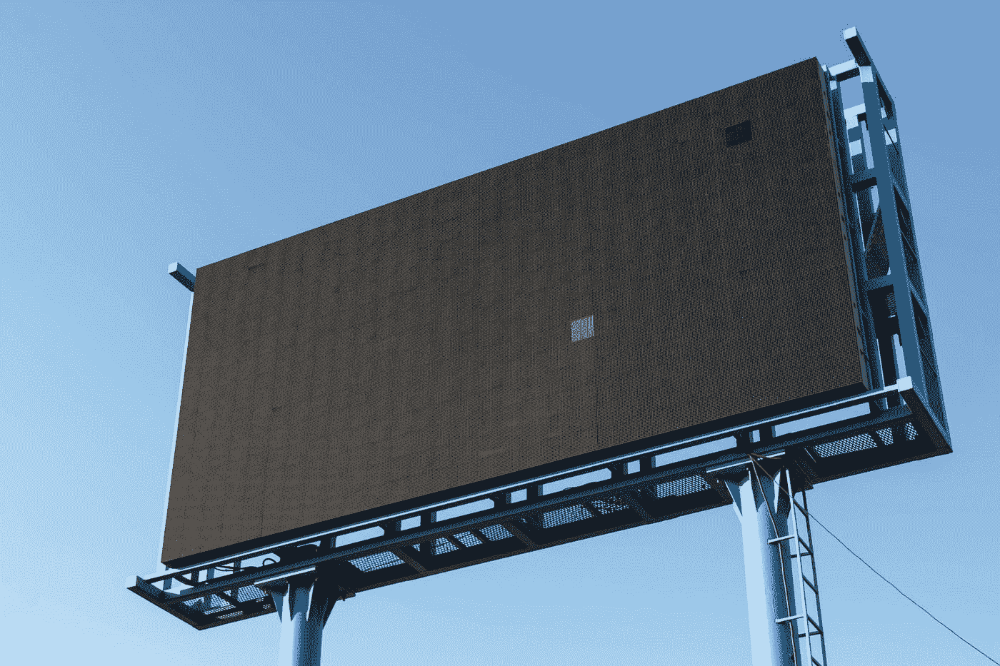
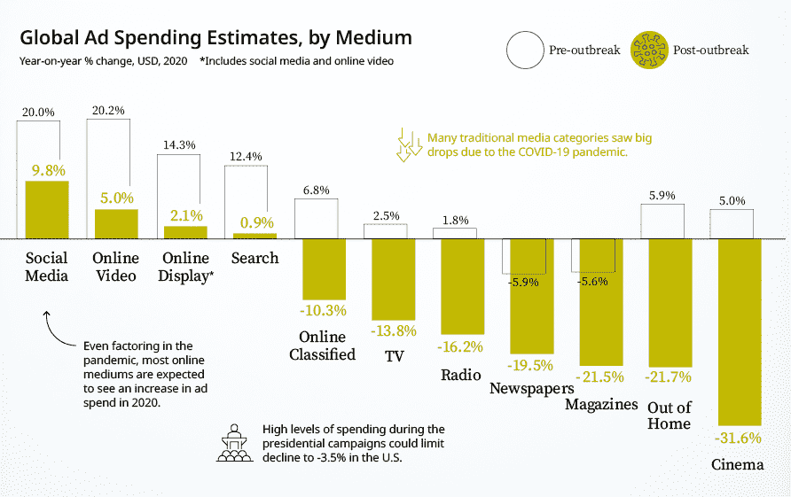
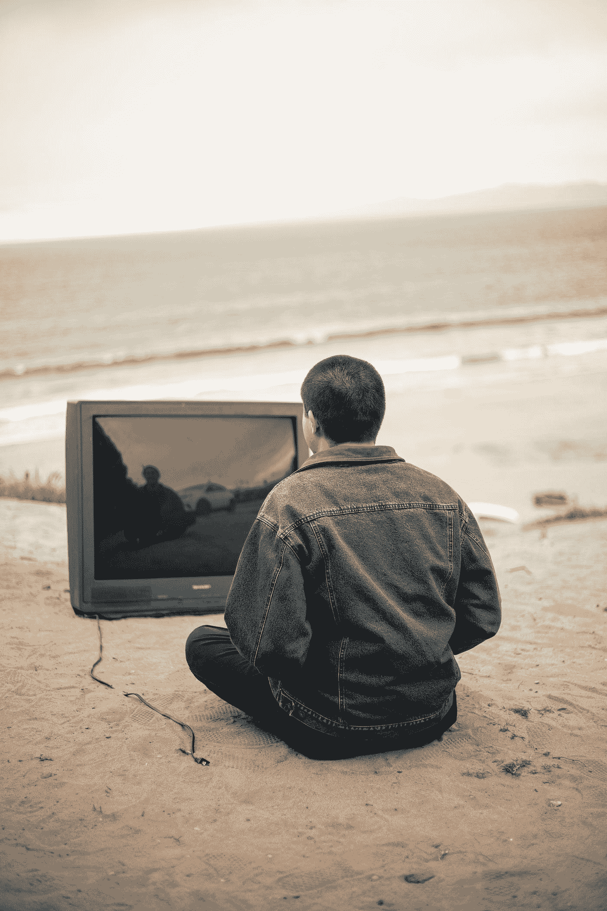
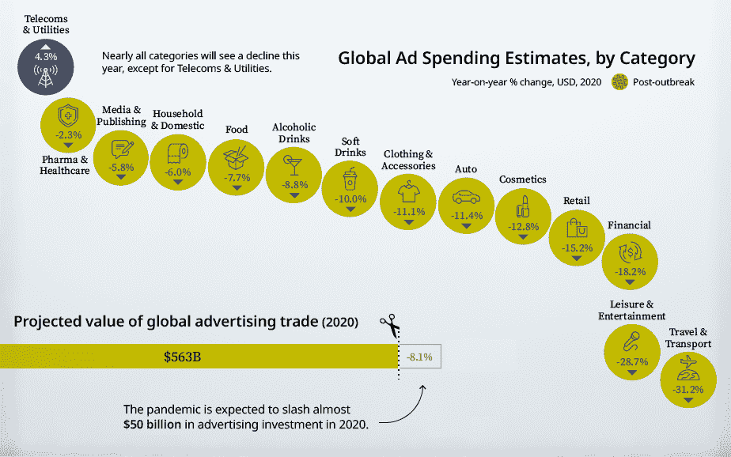

# 疫情如何改变了广告游戏

> 原文：<https://medium.datadriveninvestor.com/how-the-pandemic-has-changed-the-advertising-game-be5cec3524c1?source=collection_archive---------1----------------------->

## 冠状病毒的爆发和随之而来的我们生活中的变化大大加快了广告游戏的趋势。什么样的广告形式——以及广告商——会在这场“完美风暴”中幸存下来

Photo by [Paweł Czerwiński](https://unsplash.com/@pawel_czerwinski?utm_source=medium&utm_medium=referral) on [Unsplash](https://unsplash.com?utm_source=medium&utm_medium=referral)

> "[愿你生活在有趣的时代……](https://quoteinvestigator.com/2015/12/18/live/)"
> 
> — [奥斯丁·张伯伦爵士](https://en.wikipedia.org/wiki/Austen_Chamberlain)，英国议员，1936 年

# 介绍

如今，在每个行业，连锁反应——或者更准确地说是比喻——“T4”号新冠肺炎疫情号“T5”的海啸级冲击正在造成巨大的损失。公司突然陷入困境。工作岗位正在迅速消失。突然有钱消费的消费者正在将他们的消费转向更重要的“东西”。在每一个行业，我们似乎都在几个月、几周，有时甚至几天内看到了一二十年的变化。

广告行业当然也不能幸免于冠状病毒的破坏性影响。不仅仅是在美国，全球广告业几乎在一夜之间发生了巨大的变化。最近的报告记录了我们生活方式改变的影响程度——我们不仅消费商品和服务，还消费媒体。底线简单明了:疫情时期的广告将与 2020 年 3 月之前的广告不一样，因为冠状病毒加速了媒体形式的变化，无论是现在还是未来。这意味着营销行业的每一个人——今天，实际上是我们所有人——都需要意识到新冠肺炎·疫情迅速给全球和各国市场的广告支出带来的重大颠覆——真正的巨变。

Photo by [Ussama Azam](https://unsplash.com/@ussamaazam?utm_source=medium&utm_medium=referral) on [Unsplash](https://unsplash.com?utm_source=medium&utm_medium=referral)

# 数据显示:情况并不乐观

在过去的几个月里，疫情对广告行业的影响力有多大，证据之一来自总部位于伦敦的 WARC 的一份报告。这家分析公司最近发布了一份名为[全球广告趋势:新冠肺炎对广告投资](https://content.warc.com/rs/809-PJV-078/images/Global%20Ad%20Trends%20-%20May%202020%20%28sample%29.pdf)的影响的报告，该报告基于全球[广告业](https://www.warc.com/data/adspend/notes-sources)和各经济部门广告商财务表现的关键来源。Visual Capitalist 的分析师凯蒂·琼斯(Katie Jones)最近写了一篇关于 WARC 发现的文章，用赤裸裸的语言给他们的结论贴上标签，是的，这些数据确实值得。她认为 WARC 的报告是“暗淡的”，显示了广告行业的“残酷收缩”，疫情可能真的是许多传统媒体“棺材上的最后一颗钉子”。

 [## 2020 年最佳短期投资选择精选资源|数据驱动型投资者

### 投资是增加你净财富的一个好方法。如果你通过遵循一个严格的…

www.datadriveninvestor.com](https://www.datadriveninvestor.com/2020/03/28/handpicked-resources-for-the-best-short-term-investment-options-of-2020/) 

那么，如今对广告业来说，这个消息有多糟糕呢？累积起来，全球广告业每年创造的收入远远超过 5000 亿美元。根据 WARC 的预测，行业分析师在 1 月份疫情之前预测增长 7.1%，而现在该公司预计全球广告总收入将在 2020 年收缩 8.1%。这意味着依赖广告收入的公司仅今年一年的收入降幅就将超过 500 亿美元！如果包括目前广告收入下降所代表的真实“总”损失，而不是疫情之前预测的广告收入增长，这意味着，根据 WARC 数据内容负责人*James McDonald 的说法，在 2020 年这一困难的年份，广告行业将从其最高收入中损失近 1 亿美元*——准确地说是 9640 万美元！毫无疑问，这是一个惊人的数字！根据 WARC 的报告，如果不是疫情在美国真正站稳脚跟之前的前三个月广告支出相当强劲，并且 2020 年是美国总统大选年，那么*的下降会更严重*。最后，根据 WARC 的报告，广告收入可能要到 2022 年才能接近 2019 年的水平——或者更久， 这取决于整体经济状况和抗击疫情的进展，众所周知，这是相辅相成的！

就广告支出在当前环境下将如何改变以及改变多少而言，整体前景变得更加黯淡。正如您在下面的图 1(*2020 年全球媒体广告支出的疫情前后估计值*)中所看到的，所有媒体形式的广告支出都被彻底打乱——并全面降低。预计会增长的在线广告类别将全部

**图 1:2020 年全球媒体广告支出的疫情前后估计值**

***Source:*** [Visual Capitalist](https://www.visualcapitalist.com/), “[*The COVID-19 Impact on Advertising Spend*](https://www.visualcapitalist.com/the-covid-19-impact-on-advertising-spend/),” June 2020

尽管疫情期间我们花了很多额外的时间在网上，但今年的增长率比几个月前预测的还要低。社交媒体广告的增长预计是其预测值(20%)的一半(9.8%)。而在其他形式的网络媒体中，广告支出增速的下滑将更加明显。这包括:

*   在线视频(年增长率从预计的 20.2%下降到 5.0%，降幅达 75.2%！);
*   在线显示器(年增长率从预计的 14.3%下降到 2.1%，降幅达 85.3%！);和
*   搜索广告(年增长率从预计的%下降到%，下降了 92.7%！).

此外，由于疫情之后大量失业和整体经济衰退，在线工作和就业广告(在 WARC 的研究中被归类为“在线分类”)将在 2020 年下降 10.3%，而不是当年预测的 6.8%的增长。

Photo by [Josh Kahen](https://unsplash.com/@joshkahen?utm_source=medium&utm_medium=referral) on [Unsplash](https://unsplash.com?utm_source=medium&utm_medium=referral)

从图 1 的预测中可以清楚地看到，传统媒体受到了冠状病毒疫情的冲击！总体而言，各种形式的非在线媒体在全球的收入预计都将大幅下降。虽然平面媒体(报纸和杂志)和广播媒体(电视和广播)的受众都在减少，因此在十几年内都面临广告困难，但新冠肺炎疫情带来的经济和文化冲击似乎加大了新旧媒体之间的差距。

想想这份报告中强调的两种形式的线下媒体的变化有多突然——这两种媒体预计将在 2020 年出现显著增长，但现在正受到冠状病毒带来的许多变化的影响。首先，有“户外”广告，包括户外和室内环境中的广告牌和其他展示广告。众所周知，疫情迎来了一个“新常态”，我们中的许多人现在可以在家工作(WFH)，同时商品和服务、娱乐、旅行等实际上需要我们离开房子的东西的可用性和需求都在下降。随着通勤时间的减少和外出时间的减少，这意味着这种形式的广告媒体将受到很大冲击——由于行为模式的改变，户外广告可能会继续出现，这种改变在疫情之后将持续很长时间！仅就今年而言，这意味着户外广告将会下降 21.7%，而在 1 月份，户外广告曾被预测为全年增长 5.9%。

Photo by [Alex Avalos](https://unsplash.com/@ialexavalos?utm_source=medium&utm_medium=referral) on [Unsplash](https://unsplash.com?utm_source=medium&utm_medium=referral)

其次，考虑一下电影院广告的糟糕状况——这种广告形式几乎肯定永远不会恢复到 2020 年 3 月之前的水平！根据 WARC 的预测，2020 年电影院的广告预计将增长 5%，但现在，他们修正后的预测称今年将下降 31.6%——考虑到电影院业务的现状，这可能过于乐观了！鉴于电影发行方式的转变几乎在一夜之间发生，首先在影院放映，随着[越来越不愿意顾客回到封闭的电影院](https://www.washingtonpost.com/business/2020/06/22/movie-theaters-reopen-theyre-tackling-role-they-never-expected-play-psychologist/)，电影院广告——所有电影观众都可以证明这已经成为去看电影的未来，尽管经常令人讨厌——看起来是一种广告媒体，可能已经在前疫情时期达到顶峰！

最后，如今的广告市场没有真正的“亮点”。如下图 2(*2020 年全球广告支出分类预测*)所示，在所有类别的广告客户中，无论他们的公司销售什么类别的商品或服务，没有一个行业——除了一个——会在本年度增加广告支出。除了电信和公用事业类别之外，所有的电话和有线电视公司都在主导这一类别，它们使得人们越来越依赖在线交流、会议和与你家以外的人联系成为可能，所有类别的广告客户的广告支出都在急剧下降。然而，值得注意的是，人们可以看到广告支出下降最多的行业可能是受冠状病毒爆发影响最大的行业，今年“旅游&交通”下降了 31.2%，而“休闲&娱乐”预计将下降 28.7%。

**图 2:2020 年全球广告支出分类预测**

***Source:*** [Visual Capitalist](https://www.visualcapitalist.com/), “[*The COVID-19 Impact on Advertising Spend*](https://www.visualcapitalist.com/the-covid-19-impact-on-advertising-spend/),” June 2020

# 分析

即使在“旋转”的时代——公司、政治、文化等等。——在我们生活的这个世界里，根本没有办法从这份关于当今全球广告业状况的报告中得出任何积极的信息。当然，我们今天正在经历的疫情并非没有先例。然而，一百年前西班牙流感疫情期间的媒体环境基本上由一种媒体组成——印刷媒体。因此，正如现在的新冠肺炎·疫情在很多方面挑战了*我们所有人*，它为广告商和媒体公司创造了在现代，当然，在网络媒体时代前所未有的环境。

那么广告行业和广告商的未来是什么呢？嗯，就像疫情一直很难确定，并产生了这么多意想不到的曲折，很难在短期内做出任何明确的预测。然而，我们本能地知道，从长远来看，广告将会反弹，尽管如前所述，这位分析师认为，到 2021 年或 2022 年，全球广告支出和活动恢复到疫情之前的水平是极不可能的。我们也知道，疫情将加速向在线媒体投放广告的趋势，不仅对传统媒体作为广告论坛的生存能力构成真正的挑战。是的，影院广告可能面临生存威胁，正如电影院本身[可能永远无法从短短几个月内发生的长达十年的变化中恢复过来。类似地，如果人们和公司做出调整，让在家工作成为经营业务的首选方式，通勤将会不同，户外广告也不会一样！](https://www.latimes.com/entertainment-arts/business/story/2020-03-25/movie-theaters-recover-coronavirus-closures)

最后，由于《WARC 报告》关注的是全球广告行业，人们理应更加关注你们国家的广告市场。在冠状病毒导致的病例和死亡数量方面，美国不幸地领先于世界，而且目前出现的高峰非常令人担忧，并且似乎有增无减，美国市场在近期和长期都可能特别麻烦。从[不会发生的体育运动](https://www.startribune.com/sports-postponed/569357451/)到高校[可能不会重新开放](https://www.nytimes.com/2020/06/28/us/coronavirus-college-towns.html)到商业[可能不得不再次关闭](https://chicago.suntimes.com/coronavirus/2020/6/30/21308770/coronavirus-roars-signs-new-round-job-layoffs-2020)，以及更多的工作岗位因此而失去，疫情对美国的影响可能会比世界上大多数其他国家的市场持续更久，更强大。因此，尽管全球大部分地区的广告和媒体前景可能正在改善，但美国媒体市场——以及依赖于它的所有收入和就业机会——此时似乎尤其脆弱。因此，*广告行业和依赖广告收入的媒体公司中的每一个人都需要了解新冠肺炎·疫情已经并将继续如何影响他们的运营、收入以及生计。*

# **和我一起在媒体上写作**

想开始自己的写作之旅吗？想通过发布自己创作的文章来更好地建立个人品牌？考虑今天和我一起在 Medium 上写作，并使用这个链接:[https://davidwyld.medium.com/membership](https://davidwyld.medium.com/membership)。这样做，你将帮助支持我的写作，因为我收到你的媒介会员费的一部分。

 [## 通过我的推荐链接加入媒体-大卫·怀尔德

### 作为一个媒体会员，你的会员费的一部分会给你阅读的作家，你可以完全接触到每一个故事…

davidwyld.medium.com](https://davidwyld.medium.com/membership) 

# 关于大卫·怀尔德

大卫·怀尔德([dwyld@selu.edu](http://dwyld@selu.edu/))是路易斯安那州哈蒙德市[东南路易斯安那大学](https://www.southeastern.edu/)的战略管理教授。他是管理顾问、研究员/作家、出版商、执行教育家和经验丰富的专家证人。

**大卫·怀尔德的社交媒体链接:**

*   上[脸书](https://www.facebook.com/david.wyld)
*   上 [LinkedIn](https://www.linkedin.com/in/david-wyld-4923707/)
*   在[推特上](https://twitter.com/GoodAdvicePub)

## 访问专家视图— [订阅 DDI 英特尔](https://datadriveninvestor.com/ddi-intel)