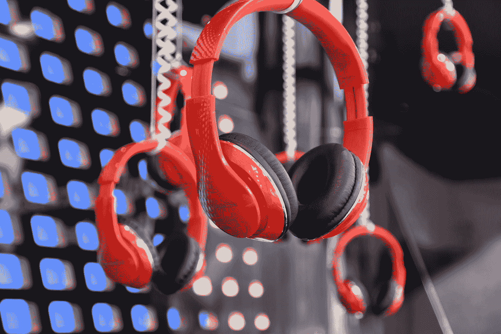

# 疫情如何增加仅占音乐业务 1%的在线音乐流

> 原文：<https://medium.datadriveninvestor.com/how-the-pandemic-has-increased-online-music-streaming-for-only-1-of-the-music-business-d6180d01ae5f?source=collection_archive---------13----------------------->

Photo by [Waldemar Brandt](https://unsplash.com/@waldemarbrandt67w?utm_source=medium&utm_medium=referral) on [Unsplash](https://unsplash.com?utm_source=medium&utm_medium=referral)

## 看起来疫情带来了在线音乐收听的巨大增长。音乐行业报告称，流媒体订阅和在线乐器销售大幅增长。

尽管实际的音乐零售量和数字下载量分别下降了 23%和 50%，但是流媒体的增长速度比预期的要快。

黑胶唱片的销售包括在这一下降中，除了二手唱片的销售正在飙升。

## 由于 COVID 社交距离和自我隔离警告，越来越多的人被迫留在室内，这是有道理的。

随着我们进入【2020 年秋季流感季节，COVID 数字上升，毫无疑问，音乐流媒体将保持稳定增长。

## 2020 年，芬德卖出的吉他比其历史上任何一年都多

在新冠肺炎疫情期间，吉他销量呈指数级增长，以至于 Fender 今年的乐器销量创下历史新高。

## **SiriusXM 用户在疫情期间激增——比早期预测增长了 40%**

SiriusXM 表示，在追踪到比早期预测增加 40%的用户后，预计将增加比预期更多的用户。这将使新的自费订户的净订户预测从 50 万增加到 70 万。

该公司还表示，预计到 2020 年，总收入将增加到 77 亿美元，自由现金流将增加约 16 亿美元。

## **如今，只有 1%的音乐艺术家拥有 90%的音乐流量。**

分析公司 Alpha Data 最近发布了一项令人震惊的调查，显示市场上只有 1%的艺术家明显主导着当代流媒体市场。

 [## 金钱:冠状病毒疫情期间的投资|数据驱动的投资者

### 在我将近 20 年的金融服务生涯中，我曾经负责监督整个…

www.datadriveninvestor.com](https://www.datadriveninvestor.com/2020/07/29/money-investing-during-the-coronavirus-pandemic/) 

# 去年在所有流媒体平台上传音乐的 160 万艺术家中，只有 1% (16，000 名音乐人)占音乐流媒体的 90%。

每天大约有 40，000 首新歌在平台上发布大多数人从未见过任何爱，这淹没了 90%的艺术家没有被听到的声音。

这对于那些努力提升音乐流和增加粉丝群的独立艺术家来说尤其令人失望。

在我看来，这确实表明了新艺人群体缺乏积极的独立推广。

通常，音乐家会将他们的音乐上传到流媒体平台，分享一次，然后开始创作下一首歌。

## 这些信息可能会鼓励那些花时间和预算与公关人员合作来推广当前发行的 **的艺术家。**

但是大多数独立艺术家需要更长的时间来订阅音乐主流传统使用的商业模式。

## 他们的音乐预算不是花在推广音乐上，而是花在乐器、软件和工作室更新上。

Photo by [Susan Mohr](https://unsplash.com/@theinnervizion?utm_source=medium&utm_medium=referral) on [Unsplash](https://unsplash.com?utm_source=medium&utm_medium=referral)

# 对于独立艺术家来说，将大部分时间花在不专注的社交平台滚动和创作音乐上，而不是雇佣团队成员来推广他们当前的音乐库，这仍然是一种常见的做法。

目前，**对于大多数音乐人来说，Spotify 的版税税率大约在每个流 0.003 美元到 0.005 美元之间**，再加上独立艺术家接收的流的缺乏，这一税率很明显地说明了为什么如果你只专注于流收入，作为音乐人谋生是如此困难。

这种商业模式在当前的流媒体速率下没有任何意义。

## 对于今天的独立艺术家来说，更好的目标是专注于教育和粉丝基础建设，目的是直接面向粉丝营销。

**推荐文章:** [**如何用 1k 真乐迷一年赚 100k**](https://link.medium.com/oj7FB4w6G9)

# 以下是 2020 年打造音乐人职业生涯的一些想法。

1.  通过阅读营销博客和像这样的在线课程来学习音乐营销和推广.. [(Udemy 课程)](https://www.udemy.com/course/instagram-marketing-course-for-musicians/learn/lecture/22172250?referralCode=AAB363F0747ED99B202B#overview)
    然后利用这些信息建立你的粉丝群，雇佣一个团队在更大范围内推广你的音乐。
    [**如何在你的音乐上获得 5 万个 Spotify 流(文章)**](https://medium.com/@JacquelineJax/how-to-get-more-streams-on-your-music-24b1a13d8088)
2.  雇佣一个营销团队和公关人员，和你一起制定一个目标和策略，建立一个长期的音乐职业生涯。
3.  建立一个产品线，满足你的利基市场的需求。想出人们经常购买来满足需求的东西。研究当季流行的 t 恤款式、秋季的连帽衫、流行的配色方案和文化主题，让你的产品符合你所在领域的流行文化。
4.  考虑教授你的技能:作曲、音乐理论、制作、乐器课、声乐..通过你的网站、社交网页或者像 udemy 或 Skillshare 这样的课程网站，你可以很容易地在线授课。普通音乐教师在线或亲自授课每小时可赚 30 美元。
5.  探索同步世界，将您的音乐授权给商业广告商、电影和其他渠道。
6.  考虑为电影和电影配乐做音乐。电影作曲家的平均工资是 5 万到 12 万美元
7.  使用 Instagram 账户和 beatstars 或 soundclick 等网站在线销售 beats。
8.  为视频游戏创作音乐。视频游戏音效设计师。**工资**:4 万美元到 12 万美元以上
9.  成为一名即兴音乐家:即兴音乐家将他们的技能加入到音乐项目中，每天可以赚 100-2500 美元。

由[杰奎琳·杰克斯](https://medium.com/u/33b440b8caf5?source=post_page-----d6180d01ae5f--------------------------------)撰写

**联系作者:**[https://linktr.ee/jacquelinejax](https://linktr.ee/jacquelinejax)

## **新文章&资源:**

 [## 为什么音乐家不能在 facebook 上直播或发布音乐视频

### 除非你开始使用这项工作，否则你的 facebook 页面将被禁止和删除。

medium.com](https://medium.com/@JacquelineJax/why-musicians-can-not-live-stream-or-post-music-videos-on-facebook-110d6de69fa7) 

## 1k 真乐迷如何一年赚 100k[https://link.medium.com/oj7FB4w6G9](https://link.medium.com/oj7FB4w6G9)

## [杰奎琳·杰克斯在线音乐营销课程(此处)](https://www.udemy.com/course/instagram-marketing-course-for-musicians/learn/lecture/22172250?referralCode=AAB363F0747ED99B202B#overview)

**访问专家视图—** [**订阅 DDI 英特尔**](https://datadriveninvestor.com/ddi-intel)