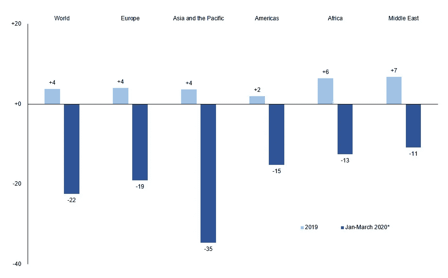
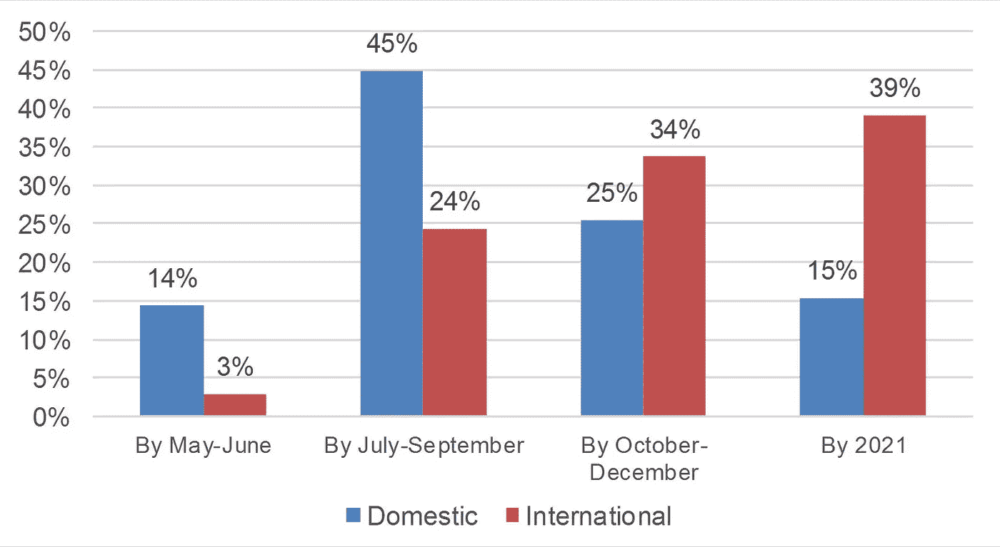

# 疫情如何帮助国内旅游业蓬勃发展

> 原文：<https://medium.datadriveninvestor.com/how-the-pandemic-helped-domestic-tourism-thrive-8863756a9300?source=collection_archive---------5----------------------->

疫情正在重新定义世界各地游客的享乐。

Photo by [JESSICA TICOZZELLI](https://www.pexels.com/@jersy?utm_content=attributionCopyText&utm_medium=referral&utm_source=pexels) from [Pexels](https://www.pexels.com/photo/cheerful-young-woman-standing-on-footbridge-during-sightseeing-4392990/?utm_content=attributionCopyText&utm_medium=referral&utm_source=pexels)

人类总是喜欢漫游、探索和到达他们周围以外的地方。历史上的许多事件证明了这一点；从月球探索到星际旅行和火星探测，再到深海探索。

探索是人类基因的核心部分。人类探索的主要方式之一一直是通过旅行，无论是作为个人寻求快乐的努力还是出于商业/职业原因。

除了人类，其他生物也喜欢旅行。它们较短的寿命和微小的本性确实阻止了它们为自己探索旅游的乐趣，有时对我们人类是有害的。像细菌和病毒这样的微生物就属于这一类。

通过依附在宿主身上，它们可以随心所欲地远行。除此之外，冠状病毒是如何在世界范围内传播，并几乎使人类屈服，限制了几乎所有其他已经存在的旅游形式的？

这是一个关于全球旅游业如何被这些微型游客改变的简要研究。

到二月初，中国游客在特拉维夫的机场被 T2 拒绝入境。

各国开始限制其他国籍的公民入境，因为担心他们会带来 COVID 19 感染的灾难。三月，美国和世界上许多其他国家[正式关闭了他们的边境](https://www.dhs.gov/news/2020/10/19/fact-sheet-dhs-measures-border-limit-further-spread-coronavirus)不让外国人入境。

> 根据皮尤研究中心(Pew Research Center)对边境关闭公告和联合国人口数据的分析，“至少十分之九(91%)的世界人口，即 71 亿人，生活在对来自其他国家的既非公民也非居民的人(如游客、商务旅行者和新移民)实行限制的国家。大约有 30 亿人，也就是 39%，生活在对非公民和非居民完全封闭的国家。”

各旅游国家关闭边境导致返回原籍国的疏散航班机票价格上涨。在这一点上，人们不再是为了旅游而旅行，而只是为了在不可预测的即将到来的封锁期间与家人在熟悉的环境中团聚。

International Tourist Arrivals, 2019 and Q1 2020 (% change). Source: UNWTO

旅游限制沉重打击了许多国家的 GDP，疫情让全球旅游业损失了至少 1.4 万亿美元，因为旅游业提供了包容性就业和外汇收入。压力在于[包容性就业](https://www.e-unwto.org/doi/pdf/10.18111/9789284420384)，因为 [54%的女性比男性更多地承担了这个部门的大部分创业工作。](https://www.tourism-review.com/gender-equality-gets-good-marks-in-the-tourism-industry-news11258#:~:text=The%20majority%20of%20the%20tourism,16.8%25%20in%20the%20broader%20economy.)

然而，在疫情，失业和减薪是家常便饭，没有游客服务，世界各地的旅游业不可避免地关闭。

高度依赖旅游业推动经济发展的泛亚和大洋洲地区的小经济体国家也受到了重创。像澳门、牙买加、马尔代夫、塞舌尔、安提瓜和巴布达、格林纳达、斐济和萨摩亚群岛。

以至于巴巴多斯将旅游签证政策修改为一年一签，以满足那些想在远离旅游目的地的地方工作的游客。这并不是说像中国和菲律宾这样的高收入国家不依赖旅游业或者没有感受到影响。因为他们也感受到旅游业停止的痛苦。

此外，与旅游业相关的其他部门也受到了旅游业衰退的冲击。我们谈论的是酒店经营者、娱乐活动提供商、航空业、食品服务业、休闲目的地等等。

因为访问任何没有完全执行 COVID 预防准则的地方被认为是有风险的。政府关闭了很多有可能在封闭空间聚集人群的企业。

这使得几乎所有的人类活动嘎然而止，以至于听到[野生动物在城市街道上游荡](https://www.theguardian.com/world/gallery/2020/apr/22/animals-roaming-streets-coronavirus-lockdown-photos)成了司空见惯的新闻。

虽然疫情在削弱人类生活的许多方面发挥了重要作用，但它也带来了一些积极的变化。

International Tourism Demand and Future Projections. Source: UNWTO

比如迫使游客向内看，发展国内旅游业。这已经发生在世界上的一些国家，像 T4、泰国、菲律宾和埃及。

例如，在埃及，国内旅游业务在五月恢复，酒店在六月只接受 50%的入住率。此外，自 8 月第一周以来，国内游客在 Maasi Mara 入口处排队，这被@ngwata_ 拍摄并发布在推特上。

最后但并非最不重要的是波斯尼亚和黑塞哥维那，自从他们暂停国际旅行以来，他们从六月开始非常努力地记录不受欢迎的景点并向其公民推销。

甚至有一家澳大利亚航空公司 [Qantas](https://simpleflying.com/qantas-787-takes-off/) ，允许旅客登上他们的波音 787 梦想飞机，在整个澳大利亚的一条风景优美的路线上飞行 7 个小时，不去任何特定的地方。

8 月 8 日，[长荣航空](https://edition.cnn.com/travel/article/eva-air-hello-kitty-fathers-day-flight/index.html)的台湾航班提供了一次无处可去的一次性旅程。同样在 8 月，[全日空航空](https://www.ana.co.jp/en/us/) (ANA)提供了一条在日本飞行一个半小时的短途观光路线。由于边境尚未完全恢复国际航班，这种新形式的国内旅游——无处可去的航班——正在成为新的趋势。

国内旅游本身仍然是一项艰巨的任务，因为岛国的当地人可能不认为国内旅游是值得向往的事情。

此外，各国能够有效遏制冠状病毒的传播将是吸引游客的一个主要因素。

因此，要确保国内旅游业的安全并引起足够的关注，以弥补一般旅游业的部分 GDP 损失，还有很多工作要做。

预计占经济合作与发展组织(OECD)国家旅游经济的 [75%](https://www.oecd.org/cfe/tourism/OECD-Tourism-Trends-Policies%202020-Highlights-ENG.pdf) 的国内旅游将比国际旅游更快复苏。

像泰国、克罗地亚和希腊这样的国家，他们的入境旅游已经占了他们经济的 5-24 %,而肯尼亚的国内旅游占了他们经济的 66%,这些国家比其他完全依赖国际旅游的国家更有可能快速复苏。

它不仅影响了人们探索本国美景的欲望，而且也让人们发现了新的风景。

例如，在尼日利亚，一个废弃的人造采石场成为联邦首都阿布贾居民最热门的附加景点——碎石矿。

当关于它的高度赞扬的消息四处传播时，一个类似景点的照片也被曝光。比如也在阿布亚的[奇卡采石场湖](https://instaza.net/tags/abujaadventures)和贝努埃州的[姆卡尔山](https://hotels.ng/places/nature/63-benue-hills)。

Gboko Mkar Hills 是一个自然景点，是这个快速发展的尼日利亚中北部城镇三座山中最高的一座，当地地势约为 318 米，很快来自邻国的人们可能会开始对这个新发现的景点进行旅游。

由于害怕传播冠状病毒，人们现在更喜欢私人旅游，而不是和陌生人一起参加团体旅游。

这也是入境旅游业的一个优势，因为更多的人会轮流观看标志性的目的地。这反过来意味着会有更多的钱定期流入，而不是时不时地有几大笔钱流入。

疫情迫使每个人都呆在室内很长时间，以至于每次宣布放松封锁后，又恢复了四处走动的自由。

如果旅游业把重点放在改善国内旅游的公民身上，它将繁荣发展，并给经济带来巨大的推动。

这是一个旅行者给另一个旅行者的建议，请不要太关注国际旅行和旅游。环顾你的国家，探索其中的美，这会让你重新欣赏你的国家，并帮助你的国家旅游业蓬勃发展。

感谢您的阅读。如果你喜欢这篇文章，请在下面留下你的评论。