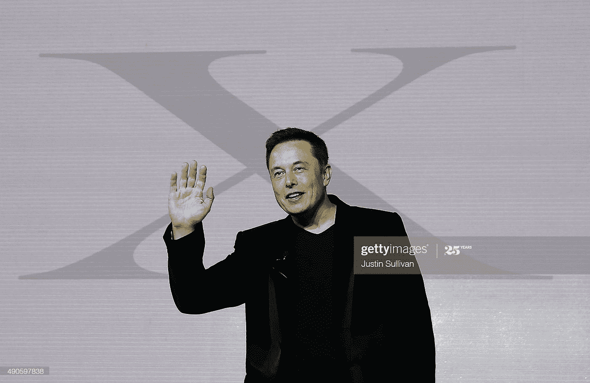
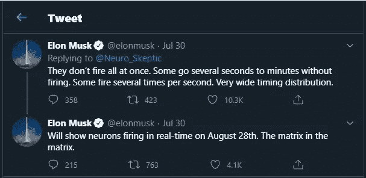
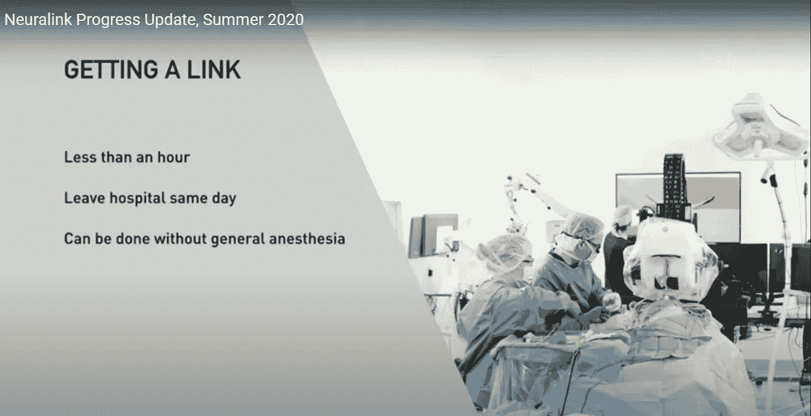
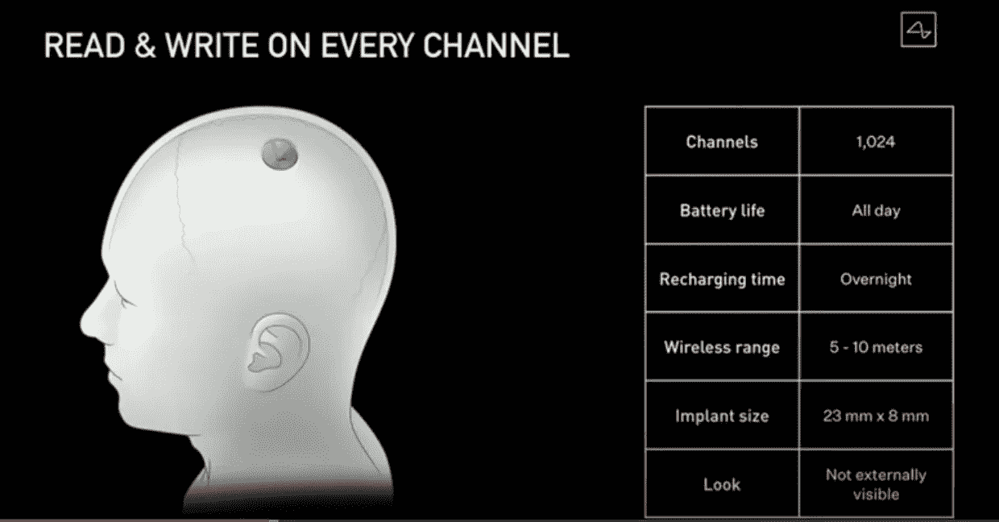
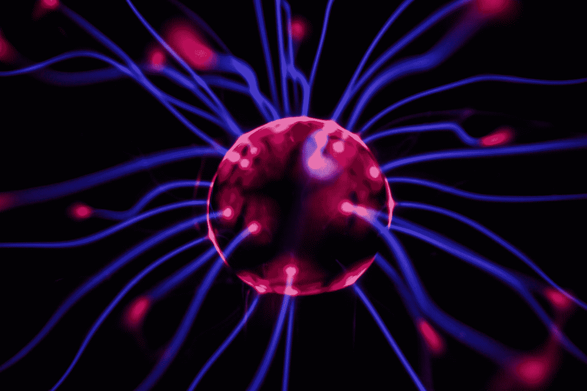

# 这项惊人的技术将如何震撼你的心灵

> 原文：<https://medium.datadriveninvestor.com/how-this-amazing-technology-will-blow-your-mind-c430e977107f?source=collection_archive---------21----------------------->

Credits: gettyimages

**“我认为它会让你大吃一惊”**——埃隆·马斯克(Elon Musk)，同时介绍一种思维植入物。

埃隆·马斯克是科技界最具魅力的人物，他取得了一些惊人的成就，从制造令人向往的电动汽车到开发可以返回地球并重复使用的火箭。

但是，敢说埃隆·马斯克做的任何事情都不是开创性的或有远见的，你可以期待这位伟人和他的热情粉丝的反弹。

这就是当一名英国学者批评马斯克周五展示他的 Neuralink 项目时发生的事情——他面临的报复主要是我的错。

Neuralink 是一项雄心勃勃的计划，旨在将人脑与计算机连接起来。它可能最终允许患有帕金森氏病等疾病的人通过思想的力量控制他们的身体运动或操纵机器。

有许多科学家已经在这个领域工作了。但马斯克比大多数人都有更大的野心，他谈到发展“超人认知”——增强人类大脑，部分是为了对抗他认为来自人工智能的威胁。

周五晚上的演示中，一头名叫格特鲁德的猪被装上了这位科技大亨所说的“你脑袋里的 Fitbit”。一个微小的装置记录了动物的神经活动，并将其无线发送到屏幕上。

每当她的鼻子被触摸时，就会发出一连串的哔哔声，这表明她大脑中寻找食物的部分在活动。“我认为这是令人难以置信的深刻”，马斯克评论道。

 [## Neuralink:未来还是终结？数据驱动的投资者

### 见见 Neuralink，埃隆·马斯克的新宝贝。一个微小的大脑植入物，可以将脑电波实时传送到你的手机上…

www.datadriveninvestor.com](https://www.datadriveninvestor.com/2020/09/01/neuralink-future-or-the-end/) 

一些神经科学专家对此不以为然。

英国科学媒体中心在试图让复杂的科学故事变得容易理解方面做得很好，该中心发布了一份新闻稿，引用了纽卡斯尔大学神经界面教授安德鲁·杰克逊教授的话。

“我不认为演讲中有什么革命性的东西，”他说。

“但他们正在解决将多个电极植入大脑的工程难题。

“就他们的技术而言，1024 个频道目前并不令人印象深刻，但无线中继它们的电子设备是最先进的，机器人植入也很好。

“最大的挑战是你如何处理这些大脑数据。在这方面，演示实际上相当乏味，没有展示任何以前没有做过的事情。”

他继续质疑为什么 Neuralink 的工作没有发表在同行评议的论文上。

我记下了他的话和他对演示的总结——“这是一个坚实的工程，但却是平庸的神经科学”——T2，然后发了一条推特。

不到**小时，马斯克在推特上回复道**:“不幸的是，学术界很多人普遍高估了想法的价值，而低估了实现想法的价值。比如，去月球的想法是微不足道的，但去月球是艰难的。”

他的 3800 万粉丝中有许多人似乎同意这一观点，有些人的观点相当强烈。

“学术界有很多人认为他们在任何时候都是房间里最聪明的人，但事实上他们有点笨，”一个人写道。

另一个人说:“如果我们等待特斯拉的同行评审，我们仍然会等待产品。做到了，他们就会来。”

关于教师的陈词滥调也被推出。

“这就是学者(那些能教、会教、不会教的人)和把事情做好的工业梦想家之间的区别。”

# 健脑

今天早上，我联系了杰克逊教授，为在 Twitter 上挑起这场群殴道歉。

Photo by [Josh Riemer](https://unsplash.com/@joshriemer?utm_source=medium&utm_medium=referral) on [Unsplash](https://unsplash.com?utm_source=medium&utm_medium=referral)

他笑着说自己在社交媒体上不是很活跃。他补充道，无论如何，马斯克说过其他人更糟糕的话。

杰克逊教授没有被困在象牙塔里，而是投身于实践研究。他已经探索了通过将信号从他们的大脑传递到他们的脊髓来帮助脊髓损伤患者恢复一些手臂运动。

他没有声称自己处于人类计算机界面研究的最前沿，但对该领域非常了解，并可以指出那些取得重大进展但没有像马斯克那样受到公众关注的学者。

他强调他并不想表现得消极。

“在这个领域工作了一段时间的每个人都对大型科技公司和热情的支持者试图投资这一领域的可能性感到兴奋，”他说。

虽然他对 Neuralink 的技术印象深刻，但他表示，他对用它来读写记忆或增强大脑功能的说法持怀疑态度。

他解释说，尽管神经科学家在理解大脑如何控制运动方面取得了进展，但大脑如何处理思想和记忆仍然是个谜。

*   [**Neuralink:埃隆·马斯克揭开大脑中有芯片的猪**](https://www.bbc.co.uk/news/world-us-canada-53956683)
*   [**埃隆·马斯克透露脑残计划**](https://www.bbc.co.uk/news/technology-49004004)
*   [**埃隆·马斯克打造 Neuralink 脑电极公司**](https://www.bbc.co.uk/news/technology-39416231)

对于他的所有成就，马斯克倾向于夸大他的技术将会发展得多快。

四年前，他告诉我，不出几年，一辆特斯拉就能独自穿越美国，沿途停下来充电。这还没有发生。

他预测到今年 [**特斯拉将有 100 万辆机器人轴**](https://www.cnbc.com/2019/04/22/elon-musk-says-tesla-robotaxis-will-hit-the-market-next-year.html) 上路，现在看来是异想天开。

就在这个周末，该公司的汽车收到了自动驾驶系统的 [**软件更新，以识别限速标志**](https://www.bbc.co.uk/news/technology-53973511) ，这可能是你认为对安全自动驾驶至关重要的东西。

技术远见者的全部意义在于他们有远大的想法。

但如果没有他一直批评的学者，马斯克用数字接口增强人脑的梦想不太可能实现。

具有讽刺意味的是，猪格特鲁德演示的公开目的是鼓励科学家加入 Neuralink。那些在 Twitter 上关注他的人可能不相信值得一试。

# 你的下一步是什么？

> 如果你喜欢这篇文章，点击下面的推荐会很有帮助！
> 关注我上 [*推特*](https://twitter.com/imPraveenPareek) *，* [*领英*](https://www.linkedin.com/in/praveenpareek/) *，以及* [*中*](https://medium.com/@praveen.pareek)
> 
> ***在这里阅读我的所有帖子/文章:***[***Praveen Pareek***](https://medium.com/@praveen.pareek)

 [## 3 人工智能在网络安全中的强大应用

### 世界越是向数字化的未来转变，网络攻击的威胁就越大。

medium.com](https://medium.com/@praveen.pareek/3-powerful-application-of-ai-in-cyber-security-effd4c7d7c3a) 

## 访问专家视图— [订阅 DDI 英特尔](https://datadriveninvestor.com/ddi-intel)