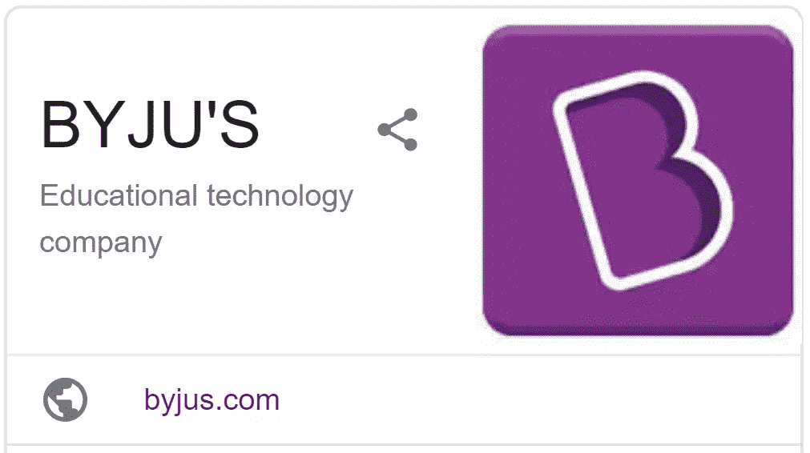

# 这个印度教育技术平台如何成为世界上最大的。

> 原文：<https://medium.datadriveninvestor.com/how-this-indian-edtech-platform-became-the-biggest-in-the-world-8e977d87d0e?source=collection_archive---------15----------------------->

自从 7 年前的首轮融资以来，它一直在定期筹集资金。

在玛丽·米克尔的最新一轮融资[后，BYJU 成为第一家达到十年估值的教育科技初创公司。同名的首席执行官 Byju Raveendran 从喀拉拉邦的一个小镇开始，然后参加了普通入学考试，这是进入印度顶级商学院的集中考试。在获得 100 分后，他开始教他的朋友。看到猫班的潜力，他很快就开始在体育馆上课。](https://www.forbes.com/sites/anuraghunathan/2020/06/29/indian-edtech-billionaires-byjus-becomes-decacorn-after-funding-round-from-mary-meeker/#5a71b4e294e3)

他在 2011 年的第一步叫做“思考与学习”,这是我个人的一个客户。我不会不同意，对于一个普通的印度人来说，这是革命性的东西。他过去常常在体育场进行大规模的会议，站在一个巨大的四面结构的顶部解释概念，比如毕达哥拉斯定理，每个面上都有显示面板。我必须说-

> Raveendran 是一个非常活跃的推销员。

当前 BYJU 的学习应用程序于 2015 年推出，面向 K-12 细分市场。它最初针对 4 至 12 年级的学生，2019 年，在迪士尼的帮助下，扩展到幼儿园至 3 年级。

7 年前它有了自己的系列。该公司定期筹集资金。[该公司的投资者](https://byjus.com/our-investors/)包括马克·扎克伯格的——陈·扎克伯格倡议(CZI)、红杉资本印度、来自中国的腾讯、通用大西洋、卡塔尔投资局以及南非私募股权巨头 Naspers。

K-12 教育是一个非常大的市场，而且它还有一个奇特的特点，那就是客户(父母)永远不会是最大的用户(孩子)。此外，因为父母希望他或她的孩子得到最简单的东西，所以他们对成本很不敏感。

 [## 夏普比率悖论:为什么还要投资风险资本？数据驱动的投资者

### 夏普比率是一种基于风险量化回报的方法，具体来说，它是超过…

www.datadriveninvestor.com](https://www.datadriveninvestor.com/2020/03/29/the-sharpe-ratio-paradox-why-still-invest-in-venture-capital/) 

随着人工智能和机器学习的使用，教育已经看到了“超个性化”的需求。这使得这个领域成为一个碎片化的市场，有数不清的家教、在线辅导和内容公司。同样，这些很难监管和正规化，这就是为什么砖和砂浆，定期考试进行学校存在。

虽然我们可能会对教师的有效性进行辩论，但他们中的许多人确实因对每个受过教育的人的生活做出了巨大贡献而值得称赞。例如，由于我的学校(和老师)，我培养了对英语和写作的热爱。很多人去了教练班，也阅读了在线内容，以更好地了解事情。因此，我们可以把学习看作一个三层的过程——核心、第二和第三层。核心是学校，二级是教练/学费，三级是课程相关知识。主要的两个衡量和检查，以确保我们的表现(主动)，第三个是由巨大的钩入我们(被动)。因此，将前两者归类为教育可能是公平的，第三者是最好的内容。

这是来自博客 [AJunoirVC](https://ajuniorvc.com/byjus-edtech-unicorn-srk/) 的一个有趣的片段:

> BYJU 的可能属于第三类学习，即课后学习和学费学习，通过市场营销和强大的销售模式推动其快速增长。深入了解该公司如何定位自己，在其网站上提到了 1000 多个视频(即它是一家内容公司)。在他们的主视频上(也有毕达哥拉斯的视频)，这家公司被描述为“内容、媒体和技术”的婚礼(即它是一家内容公司)。该公司声称拥有“最好的老师”，其中之一可能是一个山羊胡子的绅士，他拿着麦克风，通过一个弹簧解释声波。虽然他也可能很好，但我不确定他是否是最简单的声音老师(即这不是学习，而是一个内容公司)。BYJU 还声称使用知识科学和适应性学习的流行词汇来提高学生的表现，但没有显示学生表现的统计数据。在印度的标准化课程中，这可以相当简单地证明，但它仍然没有(即，它不是教育，而是一个内容公司)。虽然该公司的抱负毫无疑问是令人鼓舞的，但该公司不是教育技术公司(至少目前不是)，而是一家积极营销的内容公司。然而，这绝不意味着今天这是一个肮脏的行业。

内容公司 BYJU 在印度 1700 个城市接触了 5800 万学生，当该公司决定在疫情期间免费提供更多内容时，用户增加了 1400 万。Byju 提供免费增值模式，学生和家长可以免费使用 15 天，之后他们可以选择付费版本。他们的收入年增长率一直很高，非常接近 100%。从 2018 年的 8000 万美元到 2019 年的 2.07 亿美元，2020 年的 3.71 亿美元。

Photo by [Tirachard Kumtanom](https://www.pexels.com/@tirachard-kumtanom-112571?utm_content=attributionCopyText&utm_medium=referral&utm_source=pexels) from [Pexels](https://www.pexels.com/photo/blur-close-up-focus-gadget-574285/?utm_content=attributionCopyText&utm_medium=referral&utm_source=pexels).

该公司拥有大约 5700 万用户，其中 350 万是高级用户。BYJU's 的产品售价从 23000 印度卢比到甚至 90000 印度卢比(400-1000 美元)不等。

甚至在米克的最新交易之前，它已经成为世界上获得资金最多的教育科技初创公司。

> 米克在一份声明中说:“受到数百万学生的支持，Byju 已经成为教育技术领域的一个明显的领导者。”。“我们很高兴能够支持像 Byju 和他的团队这样有远见的人继续创新和塑造教育的未来。”米克因投资脸书、优步和 Airbnb 而闻名，对她来说，Byju 是她在印度的第一笔投资。
> 
> 摘自[福布斯。](https://www.forbes.com/sites/anuraghunathan/2020/06/29/indian-edtech-billionaires-byjus-becomes-decacorn-after-funding-round-from-mary-meeker/#1da9f2bc94e3)

自从新型冠状病毒袭击世界以来，教育部门经历了前所未有的巨大变化。这是 BYJU 成长的一个重要转折点。

人们开始以一种非常不同的方式看待教育部门。因为在这种情况下，用户和顾客是不同的，但现在由于父母更多地参与到孩子在家做的事情中，情况一直在变化。

Byju 也有他的投资份额，我们希望他们的学生能够提高个人水平，并产生影响。教育系统需要根本性的改变，而不是技术性的。

**访问专家视图—** [**订阅 DDI 英特尔**](https://datadriveninvestor.com/ddi-intel)