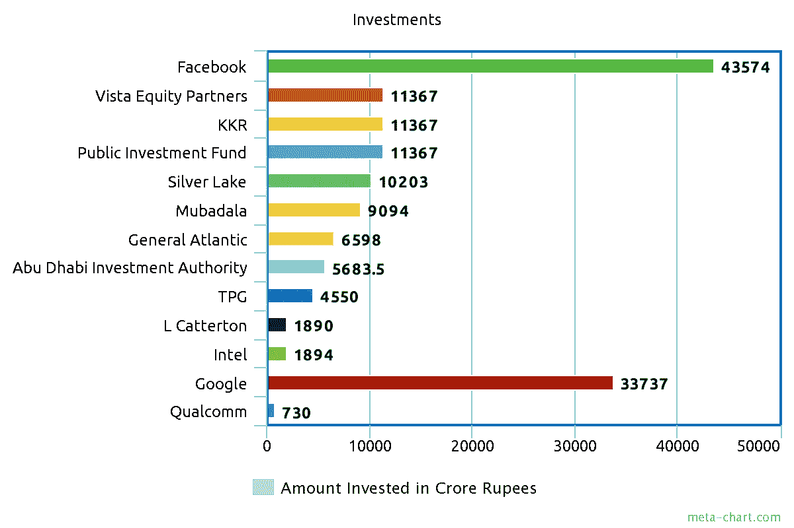
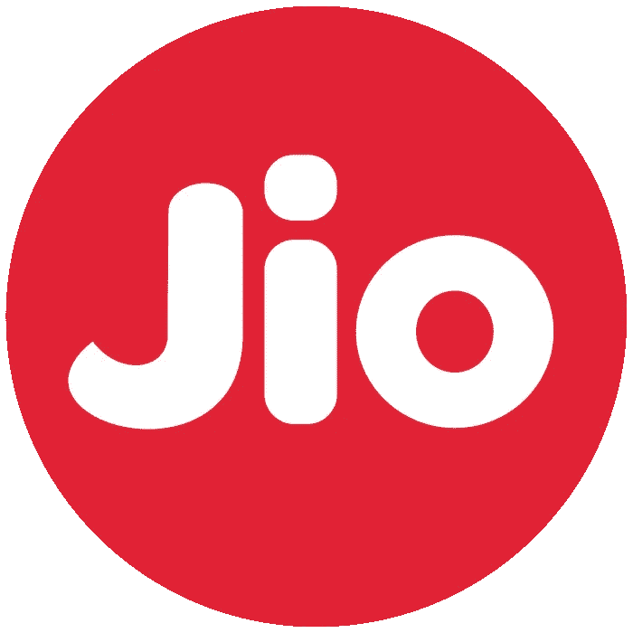

# 这家印度公司如何在疫情时期筹集了 200 多亿美元。

> 原文：<https://medium.datadriveninvestor.com/how-this-indian-firm-raised-more-than-20-billion-in-the-pandemic-period-e4dac17d057f?source=collection_archive---------12----------------------->

包括脸书的 57 亿美元和谷歌的 45 亿美元。

随着谷歌的最新交易，Jio 平台在 13 周内筹集了约 200 亿美元的₹152,056 克罗尔资金。类似的投资者还包括脸书公司、Vista Equity Partners、银湖公司、阿布扎比投资局等等。

The list of Foreign Investors.

Jio Platforms 是 Reliance Industries Limited 的数字子公司，从事能源、石化、纺织、自然资源、零售和电信等行业。Jio 平台是一个分支，涵盖电信、宽带服务、娱乐应用、社交连接、新闻和公用事业。

## Jio 平台的历史:

这一切都始于 2016 年 9 月，当时 Jio 只是一家电信公司。它开始向所有用户免费提供 3 个月的 4G 数据，然后转向廉价的数据计划和手机，这导致移动数据消费前所未有的增长，平均用户每月消费 11g 的数据。Jio 因其免费的 4G 数据方案而广受欢迎，当时 1 GB 3G 数据的价格约为 400 卢比。印度 100。这改变了游戏规则。最初有数千人认为它可能会窃取你的个人数据，否则为什么有人会以如此低的成本提供移动数据，但有数百万人开始使用它。

 [## 商业无国界:如何走向全球？数据驱动的投资者

### 首先，你要形成你的主要目标。例如，寻找投资，固定你的市场…

www.datadriveninvestor.com](https://www.datadriveninvestor.com/2020/07/14/business-without-borders-how-to-go-global/) 

Jio 电信的用户群开始呈指数增长。它的主要竞争对手是电信公司，如英国电信巨头沃达丰和印度 Aditya Birla 集团子公司 Idea 的合资企业沃达丰 Idea；和 Bharti Airtel。

reliance Jio——如其名，降低了手机通信和移动数据的价格，从大约 1000 卢比。2015 年每 GB 100 卢比(1.3 美元)，到 2020 年低于每 GB 6 卢比(0.09 美元)。他们面临了几个月的亏损，但在此期间建立了庞大的用户群，并且从未回头。

Jio Platforms Logo.

## 当前形势:

Jio 已经进入每一个可能的数字领域:

Jio 现在有了自己的:

浏览器

即时消息应用程序

在线高清视频库

基于云的备份工具

视频会议平台(非常类似于 ZOOM)

杂志电子阅读器

在线支付/钱包应用

音乐播放器应用程序，用于英语和印度语的在线和离线音乐流。

安全应用

Jio 也正在推出自己的印度在线杂货配送服务，名为 Jiomart。2019 年 12 月试运行。

## 投资背后的原因:

这是我的想法，还有其他原因。

Jio 有着强劲的增长历史。在一切都很顺利的时候，他们吸引了其他网络用户，使互联网到达了农村地区。

联合投资组织由凯什·安巴尼领导，他是印度最富有的人，在疯狂投资后排名世界第六。他比任何人都更了解这个行业在印度的运作方式。

还有许多农村地区有待开发，互联网用户的数量在未来几年将会增长得更快。预计 Jio 会用最便宜的方案欢迎他们。

Jio 一直在向 never industries 扩张，赞助印度最大的体育联盟和世界上最大的板球联盟印度超级联赛，作为其 2019 年版的冠名赞助商之一。

就用户数量而言，该公司在电信行业占据首位，超过了那些已经存在了很长时间的公司。

## 未来:

我强烈地感觉到，如果没有更大的脸书交易，Jio 不会看到这么多的投资。这将成为一个巨大的网络，世界上最大的社交媒体公司与印度最大的电信公司携手合作。

未来几年，印度活跃的互联网用户数量将会激增，他们最多将会通过电信和社交媒体进行互动。现在，随着这两者的结合，我们将见证一些惊人的商业创意的诞生。

预计 Reliance Jio 将率先在印度部署 5G 网络。这将是令人兴奋的。后来在年度股东大会上证实，他们正在等待 TRAI(印度电信监管局)关于在印度推出 5G 网络的确认。

另一个关于即将召开的 Reliance 年度股东大会的故事。

**访问专家视图—** [**订阅 DDI 英特尔**](https://datadriveninvestor.com/ddi-intel)