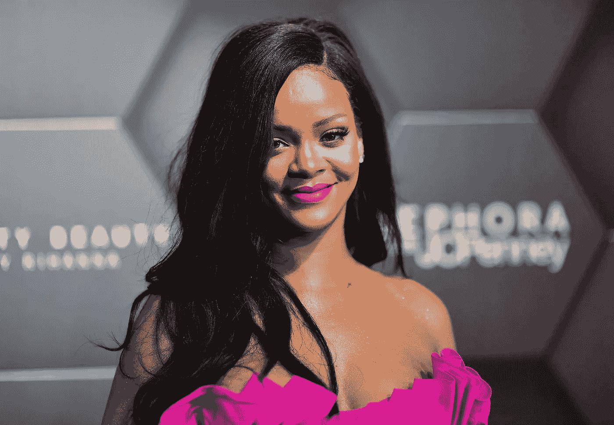

# 这一社会需求如何创造了一个价值 5.7 亿美元的美容帝国

> 原文：<https://medium.datadriveninvestor.com/how-this-one-social-need-created-a-570-million-beauty-empire-c8b731cddbdf?source=collection_archive---------3----------------------->

*包容的需求是如何引发了美女数量的激增*

[https://time.com/5403636/rihanna-barbados-ambassador/](https://time.com/5403636/rihanna-barbados-ambassador/)

从甜美和娃娃脸，到毫无歉意和自信，到前卫和冷静。纵观她近 17 年的音乐生涯，蕾哈娜对困扰大多数音乐艺术家职业生涯的文艺复兴周期并不陌生。出于在变化无常的行业中保持相关性的需要，再发明的想法已经在娱乐行业中根深蒂固了几十年。

然而，在 2017 年，蕾哈娜颠覆了这一比喻，在一个替代但同样变化无常的行业中建立了一种不需要重新发明、复兴或更新的产品。

自 2017 年以来，芬蒂美容改变了美容格局，并在行业内创造了一个颠覆性的爆炸。Fenty Beauty 突出强调了包容性营销的重要性，为美容行业的多元化确立了新的基调，为其他大型美容品牌设定了蓝图，开创性地为“每个女性”提供了 50 种色调的粉底，并推出了普遍讨人喜欢的彩妆产品。

Fenty Beauty 发起了影响深远的“为所有人而美”运动，单枪匹马地改革了一个曾经几乎只迎合白人顾客的行业，深色往往是事后才添加的。虽然其他美容品牌在解决少数族裔的商业力量方面行动缓慢，但 Fenty Beauty 展示了真正的**包容性**，在 17 个国家同时推出，并在首次发布时在每个门店储备了 40 种色调的粉底。

尽管范围广泛，Fenty Beauty 并不是第一个生产 40 多种色调粉底的美容品牌。在推出 Fenty Beauty 之后，Make Up For Ever stated，在 Instagram 帖子中；“40 度对我们来说并不新鲜。”

**那么蕾哈娜是如何颠覆一个已经提供相同产品的行业的呢？**

众所周知，每个已经生产了各种颜色的美容品牌都希望所有人都购买他们的产品。然而，与 Fenty 不同，他们没有向所有人推销他们的产品。从一开始，蕾哈娜就想为每个人服务。

蕾哈娜在丝芙兰发布会上谈到她的粉底系列时说:

> “需要有适合黑皮肤女孩的东西；需要为一个非常苍白的女孩准备一些东西；需要介于两者之间。有红色底色、绿色底色、蓝色底色、粉色底色、黄色底色——你永远不会知道，所以你希望人们欣赏这个产品，而不是觉得‘哦，那很可爱，但它只在她身上看起来很好’

营销战略也不陌生，将包容性和多样性放在核心位置。

Fenty Beauty 还使用了来自不同种族的模特，使该品牌被称为“新一代美女”。模特们的肤色非常苍白，美丽的米色，完美的深色调。白化模特带头冲锋。黑人模特炫耀他们的自然头发。一个模特戴着头巾。远离商业化的以欧洲为中心的美容标准，Fenty Beauty 在其所有的荣耀中庆祝普遍的美。

按照 Fenty Beauty 的说法，美不再是专属。

Fenty Beauty 吸引了大量的国际赞誉和积极的消费者反应，这不足为奇。与苹果的 iPhone X、特斯拉 Model 3、耐克的 Pro Hijab 和美国宇航局的火星飞船 InSight 一样，Fenty Beauty 被《时代》杂志评为 2017 年最重要的发明之一，“因为它的质量与可负担性比率以及对包容性的强调”。整个 2017 年 9 月，Harvey Nichols 每分钟都在销售该系列的一款 Pro Filt'r So Matte 粉底。另一个最畅销的产品，普遍讨人喜欢的光泽弹，每三分钟就卖出一个。丝芙兰的测试样品都卖光了。在一个月内，该品牌创造了超过 7200 万美元的媒体价值，并在运营的第一年创造了超过 1 亿美元的收入。2017 年，英国购物者排了一个小时的长队，来到骑士桥哈维·尼科尔斯商店拥挤的化妆品柜台，这是当时英国唯一一家专门出售 Fenty Beauty 的商店。该系列后来被宣布为哈维·尼科尔斯有史以来最大的美容发布。

当谈到创造一些特别的东西时，其他人想赶时髦。然而，Fenty Beauty 的独家 USP 给自己留下了一份太特殊而不能盲目复制的遗产。尽管金·卡戴珊、M.A.C、欧莱雅、Benefit 和 Tarte 都试图随后发布包容性粉底霜系列，并向有色女性推销其产品，但他们都没有达到 Fenty Beauty 不可避免地设定的标准。

 [## 创业公司的顾问？与他们合作的 4 种最佳方式|数据驱动型投资者

### 顾名思义，顾问能给你的建议对一个人来说是成功还是失败的关键

www.datadriveninvestor.com](https://www.datadriveninvestor.com/2020/09/27/advisors-in-your-startup-4-ways-to-best-work-with-them/) 

# 主要成就:以质量填补空白

几十年来，有色人种女性经常感到沮丧，因为在化妆品柜台找不到适合自己的粉底颜色。这是一个长期受到批评的市场缺口，缺乏包容性的基础已经被大型美容品牌在一系列令人不快和荒谬的答案中证明是不合理的。从“没有深色皮肤的市场”到“没有足够的货架空间来满足所有人的需求”，美容品牌已经优先考虑大量的桃色色调，而不是一波米色和棕色色调。

然而，芬蒂已经改变了叙事的斜率。Fenty Beauty 摆脱了没有市场的想法，为各种肤色的人，尤其是肤色较深和较暗的人，提供了一系列可以在高端商店找到的价格实惠的高质量产品。知名化妆师凯·蒙塔诺曾与从朱丽安·摩尔到露皮塔·尼永奥的各种肤色的客户合作过，她肯定地说，进入深色肤色女性的市场并不是随着芬迪的崛起而突然出现的。

> "它一直存在，但多年来一直严重不足."

乍一看，Fenty Beauty 闪耀的光彩是 50 色粉底。然而，当你走近一看，宝藏就在下面。在这个品牌衰落的两年前，蕾哈娜花了两年多的时间来创造她的产品的正确配方。Fenty Beauty 意识到，美的包容性和多样性不仅仅是色调的数量。这也是精心制作的细微差别，构成了阴影。对于数百万有色人种女性来说，寻找与肤色相匹配的粉底和美容产品一直是生存的祸根。然而，有了 Fenty Beauty，世界各地的化妆男女现在可以在这个品牌中找到自己，并感到自己也是其中一员。

# 单位标准普尔:所有领域的完全包容性

在其商业模式的每个方面，Fenty Beauty 都有根深蒂固的可及性和包容性；从它的产品到它的营销，到它的发布，到它的定价。

不同于其他美容品牌，其品牌形象往往显得花枝招展，Fenty 的营销展示了众多不同肤色的女性，来自不同的文化和宗教，团结一致地站在一起；一个团结的团队。在 Fenty 的营销中，每个女性都是平等的，受尊重的，令人惊叹的。

本着为所有人服务的理念，蕾哈娜希望她的品牌能同时为世界各地的女性所用。一个国家不能凌驾于另一个国家之上，该品牌以完全全渠道的营销策略在同一天同一时间(不分时区)在 17 个国家上线。还向 137 个国家提供直接送货服务。

在世界各地实时分发内容需要外科手术般的精确度。媒体和消费者认为这是一次别出心裁的完美执行，在幕后，超过 500 名来自品牌和销售、营销、供应链、社会和零售团队的全球领导者正在参加一场集体马拉松比赛，以实现这一目标。

普遍认为价格合理(丝芙兰 35 美元，哈维·尼科尔斯 27 美元一个 Pro Filt'r So Matte 粉底)，特别是与其他知名品牌相比，Fenty Beauty 通过促进包容性和拒绝排他性，以可承受的成本提供高质量的产品，忠于自己的使命。

# Fenty Beauty 的商业收获

1.  **挖掘情感需求**

> 我们第一次在内部展示 Fenty Beauty 活动的预告片时，一屋子的商业领袖，包括我自己，都非常激动。这是第一次代表不足，服务不足的女性和文化出现在全球声望美容活动中。

Fenty Beauty 的母公司 Kendo Brands 的首席营销官 Sandy Saputo 指出，Fenty Beauty 的精神气质中有一种根深蒂固的情感联系，几个月后将在全世界回荡。Fenty Beauty 没有采取激进的包容性方法的先例，也没有打破传统营销的需要，它知道这个品牌将打动世界各地女性的心。

虽然 Saputo 注意到了该品牌在会议室中的潜在情绪化，但直到它进入美容柜台后才变得切实可见。一些女性被拍到在丝芙兰哭泣，她们从来没有找到适合自己肤色的颜色——从白化病人到黑皮肤的女士。

蕾哈娜说:“我从来没有预料到女性对产品和品牌的情感联系。”有些人是第一次找到自己的粉底，在柜台上变得情绪化。这是我永远也无法释怀的。"

脸书利用了朋友和家人团聚的情感需求。Instagram 利用了怀旧情绪。Fenty Beauty 激发了被包容的渴望。

虽然经常有人说，情感和商业根本不融合；创造一个源于情感需求的产品或服务可以让你走上成功之路。

**2。秀，不要说**

在 Fenty Beauty 推出后，行动的呼声开始在业界回响。这种冲动被称为“芬蒂效应”，它刺激了品牌的连锁反应，让品牌做得更多，挑战现状。在美容行业，化妆系列开始扩大，以更具包容性。

有趣的事实:Fenty Beauty 从未在他们的营销信息中使用过“包容性”一词。

Fenty Beauty 采取保持沉默的方式，让产品说话，一直都是“展示，而不是讲述”虽然 Fenty Beauty 的核心品牌标识是基于包容性，但这个标签是由媒体和消费者加在品牌上的。

保持你的品牌信息的隐蔽性，以获得最大的影响力。

**3。不要害怕大胆**

2017 年 11 月 23 日，该系列的首款红色唇膏 Stunna Lip Paint 在独特的社会氛围中推出，赢得了雷鸣般的掌声。在“我也是”运动的早期，反抗议者经常利用这个机会向公开的女性性行为泼脏水。然而，随着历史上与卖淫和滥交联系在一起的普遍讨人喜欢的口红颜色的推出，蕾哈娜说了一切需要用化妆品说的话；

女人可以性感、自信、凶猛、不道歉、直言不讳、大胆、叛逆。我们看起来像在飞一样。任何不同意的人都要集体向你道歉。

不要害怕用你的产品或服务做一个声明。

**4。对于一个高质量的产品，你需要一个高质量的团队**

如果 Fenty Beauty 要成为世界级的品牌，就必须建立世界级的合作关系。

输入剑道

Fenty Beauty 的母公司是 LVMH 酩悦轩尼诗集团(LVMH mot Hennessy)的一个新部门，专门从事以名人为重点的项目，它以尖端技术团队、专业技术人员和雄厚的资金支持为品牌注入了活力。

有了凯特·冯·D 和马克·雅可布·美容这样的校友，剑道在孵化器的同行中是不同的。凭借其高度的自主性和大量具有创业经验的员工，Kendo 建立了一个与其他公司相比独特的风险档案。尽管如此，达成这样一个令人垂涎的合作伙伴关系让蕾哈娜能够将她巧妙的产品开发技能和营销头脑与美容行业的敏锐天赋结合起来。

此外，与 LVMH 合作给 Fenty Beauty 带来了一些好处。由于拥有丝芙兰，LVMH 给了 Fenty Beauty marquee 整个商店的分销，LVMH 拥有的其他美容品牌的销售数据，以及店内和网上的伟大的商品销售和产品植入。

如果没有路威酩轩集团的合作，Fenty Beauty 的完美发布也是不可能的。通过与 LVMH 及其物流基础设施的合作，Fenty Beauty 能够在 17 个国家的 1620 家店铺中立即开展“史上首次全球美容发布”。

如果你想让你的产品达到令人眩晕的高度，你需要你的团队成为梯子。

**5。市场调研！市场调研！市场调研！**

经过尝试和测试，但最终是真的，市场研究的力量是无限的。Fenty Beauty 成功的原因是蕾哈娜发现了美容市场上一个亟待填补的空白。找到你所选择的市场中缺少的东西，并彻底打破它。

Sandy Saputo 认为 Fenty Beauty 的首要目标是“打造美容史上最大的品牌发布会”

> 其结果是一场永远改变了美容行业的运动。

## 获得专家观点— [订阅 DDI 英特尔](https://datadriveninvestor.com/ddi-intel)