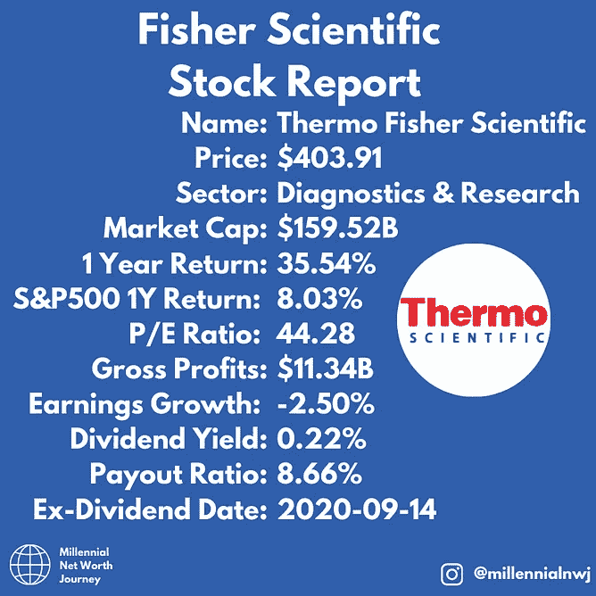
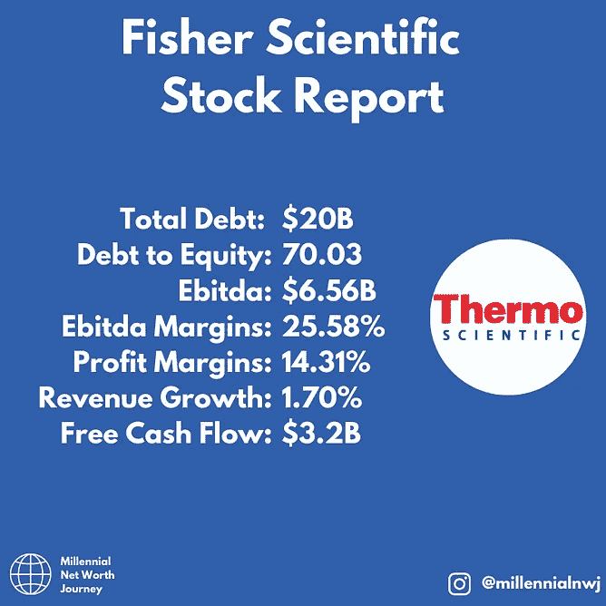
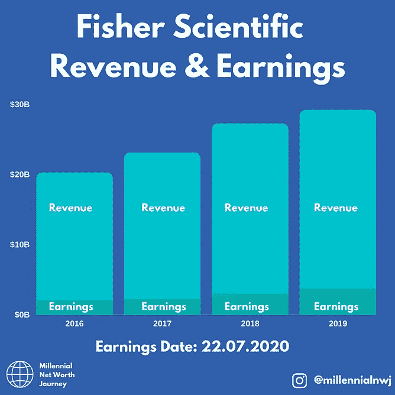
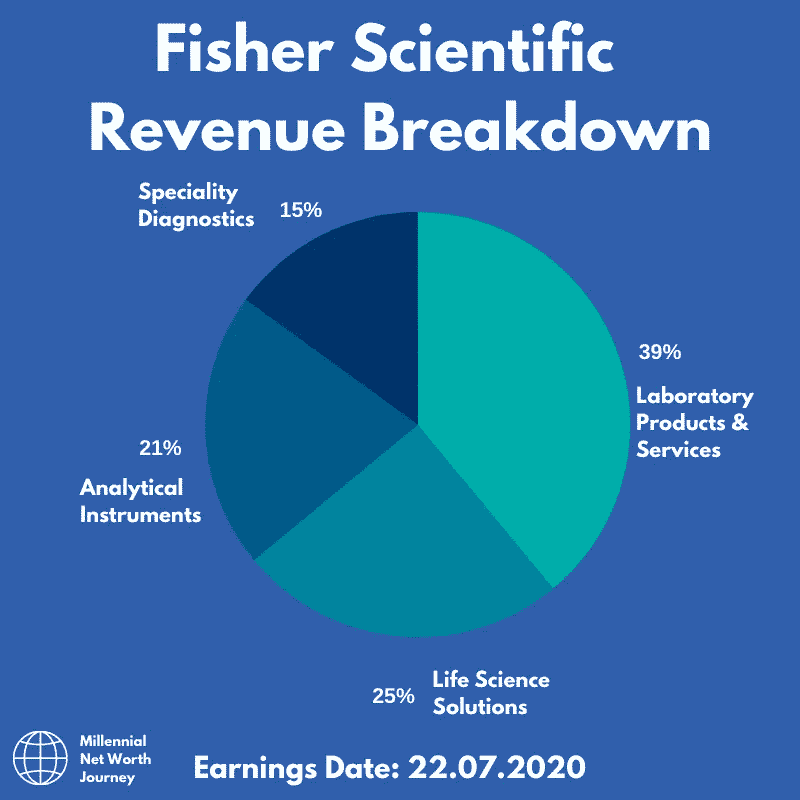
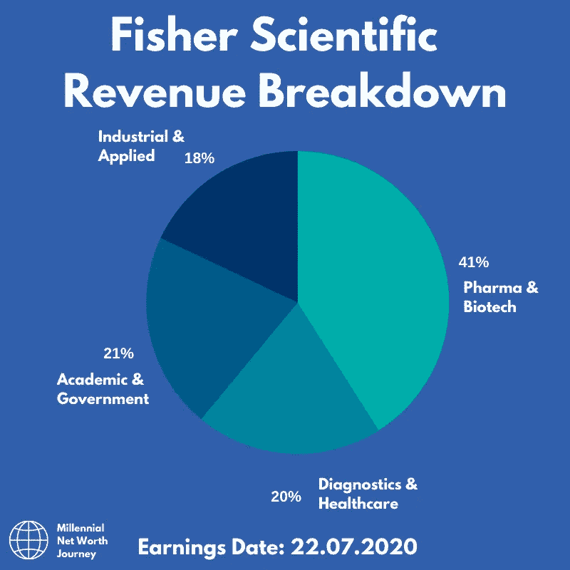

# 这种“平台”股票如何受益于新冠肺炎

> 原文：<https://medium.datadriveninvestor.com/how-this-platform-stock-benefits-from-covid-19-1bf23d585657?source=collection_archive---------26----------------------->

上周，我谈到了“平台”股票，以及它们如何进行伟大的投资。

 [## 为什么平台股票是最好的投资

### 一种利用公司的简单方法，这些公司提供让生活运转的东西。

medium.com](https://medium.com/datadriveninvestor/why-platform-stocks-make-the-best-investments-3945fc2b501) 

我用的例子是，由于规模经营的能力，卖铁锹比挖金子更好。

一只股票符合这一要求，并准备利用科学界研究数量的增加，这只股票叫做赛默飞世尔科技。

他们将从冠状病毒疫苗竞赛中受益，因为他们是提供研究人员的人。这和我前几天举的例子很像。这家公司是提供铁锹的公司，或者说是提供化学药品的公司。

## 赛默飞世尔科技公司

赛默飞世尔为政府、制药公司和生物技术公司提供他们进行研究所需的东西。

像化学药品、消耗品和制造疫苗或治疗的设备。

该公司还提供冠状病毒测试所需的消耗品。

## 看看这里的基本原理:

Images from [@millennialnwj on Instagram.](http://www.instagram.com/millennialnwj)

## 收入和收益

在过去的几年里，公司的收入和收益一直在稳步增长，而且看起来还会继续增长。

Images from [@millennialnwj on Instagram.](http://www.instagram.com/millennialnwj)

该公司在中国和韩国等新兴市场增长迅速，希望未来几年能在这些市场实现收入增长。派息率目前很低，未来还有很大的增长空间。

这不仅是一笔不错的投资，而且也是我合作多年的一家公司。它们本质上是化学输送的“亚马逊”。投资于你所知道的总是一个好的选择。

市场上有很多这样的机会，我们致力于与您分享。

如果你喜欢读这篇文章，请考虑注册我的邮件列表，这样你就可以把这样的文章发送到你的收件箱:

[http://millennialnetworthjourney.com/newsletter-sign-up/](http://millennialnetworthjourney.com/newsletter-sign-up/)