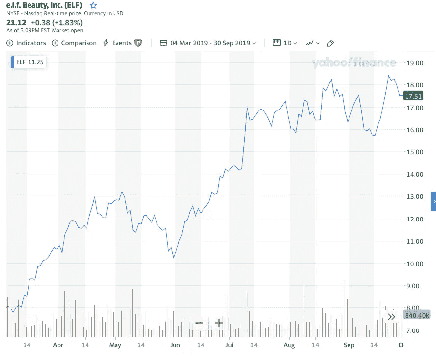

# 这位交易员如何利用一种新的股票投资方式——社会信息套利——将 1 万美元变成 2100 万美元

> 原文：<https://medium.datadriveninvestor.com/how-this-trader-turned-10k-into-21-millions-using-a-new-way-of-stock-investing-social-7c898de72033?source=collection_archive---------0----------------------->

## 熟悉技术和基本面分析？发现社会信息套利——股票投资的新方式

Photo by [Jakob Owens](https://unsplash.com/@jakobowens1?utm_source=medium&utm_medium=referral) on [Unsplash](https://unsplash.com?utm_source=medium&utm_medium=referral)

克里斯·卡米洛，一个年轻的交易者，花了几年时间想出了这个成功的交易策略。在早年的交易中，他在股票市场上损失了所有的积蓄，当他读了彼得·林奇的书《华尔街一瞥》后，他彻底改变了自己的投资方式。这本书于 1989 年发行，但克里斯·卡米洛在 2000 年代中期才拿到手。彼得声称战胜市场的唯一方法是拥有信息优势。克里斯·卡米洛(Chris Camillo)将这句话应用于当今时代，他抓住了新的社会趋势或文化转变，这些趋势或转变是华尔街抓住它们之前股价走势的重要催化剂。这帮助他在 14 年的时间里将 2 万美元变成了惊人的 2100 万美元。在施瓦格对克里斯的投资账户进行了详细审计后，克里斯·卡米洛甚至出现在杰克·d·施瓦格的新书《未知的市场奇才——你从未听说过的最好的交易者》中。

# **这与技术或基本面分析无关**

历史上，股票交易方法可以分为技术分析或基本面分析或两者的结合:

**技术分析:**这里的交易者通过检查历史数据，主要是价格和交易量，来预测价格走势。然后，这些数据帮助交易者根据股价的历史行为预测股价的变动。

**基本面分析:**这种方法包括通过分析公司的财务报表、竞争对手和市场来确定股票的公平市场价值。这里的投资者会建立一个贴现现金流模型，或者利用同行分析得出一家公司的公平市场价值。

克里斯·卡米洛创造了一种全新的投资方式，既不是技术性的，也不是基本面的。他不知道他投资的公司的市盈率是多少，也不关心某只股票是否突破了阻力位。如果没有计算机处理能力和社交媒体，他的新投资技术是不可能实现的。

# **在其他变化之前检测变化**

十几岁时，克里斯·卡米洛喜欢车库拍卖，从试图清空车库的家庭那里购买廉价的不需要的家居用品，然后寻找愿意以高价从克里斯那里购买这些物品的潜在买家。这是他晚年发明的投资策略的核心。

社交信息套利是指在华尔街和媒体发现之前，发现日常生活中可能对股价产生重大影响的新的社会趋势和文化变迁。为了让策略发挥作用，尽早发现这些变化非常重要——一旦媒体或华尔街开始谈论这些变化，交易就结束了。当这种情况发生时，通常是平仓的时候。

> 正如克里斯所言:“你不必预测未来就能在股市中赚钱，但你必须善于解读现在，识别正在发生的有意义的变化”。

# 一个行业的例子

克里斯·卡米洛在 14 年的交易生涯中有很多成功的交易。他进行的其中一项交易是在 2019 年收购化妆品公司 E.L.F. Beauty Inc .的股票和看涨期权。在撰写本文时拥有 1700 万订阅者的 beauty Youtuber jeffreestar 的一篇评论一夜之间改变了该公司的面貌。这篇评论已经让数百万千禧一代和 Z 世代的消费者购买了该公司的产品

该评论于 2019 年 3 月 5 日发布，随后该公司的股价在接下来的六个月里翻了一倍多。如下图所示，E.L.F Beauty 股票的股价在 2019 年 3 月至 9 月期间从 8 美元上涨至 17.5 美元。为了使交易利润最大化，克里斯·卡米洛使用期权。在这种情况下，他购买了看涨期权，银行利润是股票升值 120%的 10 倍。

Source: [Yahoo](https://uk.finance.yahoo.com/chart/ELF#eyJpbnRlcnZhbCI6ImRheSIsInBlcmlvZGljaXR5IjoxLCJjYW5kbGVXaWR0aCI6NS41MzQyNDY1NzUzNDI0NjYsImZsaXBwZWQiOmZhbHNlLCJ2b2x1bWVVbmRlcmxheSI6dHJ1ZSwiYWRqIjp0cnVlLCJjcm9zc2hhaXIiOnRydWUsImNoYXJ0VHlwZSI6ImxpbmUiLCJleHRlbmRlZCI6ZmFsc2UsIm1hcmtldFNlc3Npb25zIjp7fSwiYWdncmVnYXRpb25UeXBlIjoib2hsYyIsImNoYXJ0U2NhbGUiOiJsaW5lYXIiLCJzdHVkaWVzIjp7IuKAjHZvbCB1bmRy4oCMIjp7InR5cGUiOiJ2b2wgdW5kciIsImlucHV0cyI6eyJpZCI6IuKAjHZvbCB1bmRy4oCMIiwiZGlzcGxheSI6IuKAjHZvbCB1bmRy4oCMIn0sIm91dHB1dHMiOnsiVXAgVm9sdW1lIjoiIzAwYjA2MSIsIkRvd24gVm9sdW1lIjoiI2ZmMzMzYSJ9LCJwYW5lbCI6ImNoYXJ0IiwicGFyYW1ldGVycyI6eyJ3aWR0aEZhY3RvciI6MC40NSwiY2hhcnROYW1lIjoiY2hhcnQifX19LCJwYW5lbHMiOnsiY2hhcnQiOnsicGVyY2VudCI6MSwiZGlzcGxheSI6IkVMRiIsImNoYXJ0TmFtZSI6ImNoYXJ0IiwiaW5kZXgiOjAsInlBeGlzIjp7Im5hbWUiOiJjaGFydCIsInBvc2l0aW9uIjpudWxsfSwieWF4aXNMSFMiOltdLCJ5YXhpc1JIUyI6WyJjaGFydCIsIuKAjHZvbCB1bmRy4oCMIl19fSwibGluZVdpZHRoIjoyLCJzdHJpcGVkQmFja2dyb3VuZCI6dHJ1ZSwiZXZlbnRzIjp0cnVlLCJjb2xvciI6IiMwMDgxZjIiLCJzdHJpcGVkQmFja2dyb3VkIjp0cnVlLCJldmVudE1hcCI6eyJjb3Jwb3JhdGUiOnsiZGl2cyI6dHJ1ZSwic3BsaXRzIjp0cnVlfSwic2lnRGV2Ijp7fX0sInJhbmdlIjp7ImR0TGVmdCI6IjIwMTktMDMtMDRUMDA6MDA6MDAuNDcyWiIsImR0UmlnaHQiOiIyMDE5LTA5LTMwVDIyOjU5OjAwLjQ3MloiLCJwZXJpb2RpY2l0eSI6eyJpbnRlcnZhbCI6ImRheSIsInBlcmlvZCI6MX0sInBhZGRpbmciOjB9LCJjdXN0b21SYW5nZSI6eyJzdGFydCI6MTU1MTc0NDAwMDAwMCwiZW5kIjoxNTY5Nzk4MDAwMDAwfSwic3ltYm9scyI6W3sic3ltYm9sIjoiRUxGIiwic3ltYm9sT2JqZWN0Ijp7InN5bWJvbCI6IkVMRiIsInF1b3RlVHlwZSI6IkVRVUlUWSIsImV4Y2hhbmdlVGltZVpvbmUiOiJBbWVyaWNhL05ld19Zb3JrIn0sInBlcmlvZGljaXR5IjoxLCJpbnRlcnZhbCI6ImRheSJ9XX0-)

# **如何利用这一策略获得优势**

先于他人发现有意义的社会趋势并不容易。克里斯·卡米洛平均每年只发现少量的社会套利交易。不幸的是，发现这些趋势没有秘密可言。一个人必须重新训练他们的思维来审视和分析他们周围的事物。然后需要大量的分析来确定信息优势对特定股票是否有意义。像 Google trends 和 stocktwits 这样的工具可以帮助验证任何关键词的受欢迎程度。