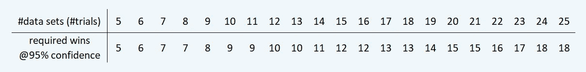

# 如何利用概率为 AI/ML 项目获取客户

> 原文：<https://medium.datadriveninvestor.com/how-to-acquire-clients-for-ai-ml-projects-by-using-probability-e92ca0f3ba68?source=collection_archive---------5----------------------->

通过二项式定理和统计学击败竞争对手


Photo by [Icons8 Team](https://unsplash.com/@icons8?utm_source=medium&utm_medium=referral) on [Unsplash](https://unsplash.com?utm_source=medium&utm_medium=referral)

通常，我们机器学习的实践者会被应用不同的模型来解决某个问题的热潮冲昏头脑。统计测试的广泛使用要么退居二线，要么只有在向客户展示最终结果时才发挥作用。

虽然某些指标，如 ROC、PR 曲线和 MCC，可以帮助你在项目的最后阶段微调你的结果(*阅读* : [如何不使用 ROC、精确回忆曲线& MCC](https://towardsdatascience.com/how-not-to-use-roc-precision-recall-curves-mcc-matthews-correlation-coefficient-f68a33108f8b) )，但某些其他指标如果在项目开始时使用，可能会帮助你为你的组织赢得新项目。

[](https://towardsdatascience.com/how-not-to-use-roc-precision-recall-curves-mcc-matthews-correlation-coefficient-f68a33108f8b) [## 如何不使用 ROC、精确回忆曲线和 MCC(马修斯相关系数)

### 我们在这些指标上犯的常见错误&如何选择最适合您的业务案例的指标

towardsdatascience.com](https://towardsdatascience.com/how-not-to-use-roc-precision-recall-curves-mcc-matthews-correlation-coefficient-f68a33108f8b) 

今天，我将展示一个案例，研究我们通常如何打包新项目，以及 p 值、置信区间和二项式系列等概念如何帮助我们赢得客户的信任。

# 恰当的例子

他的特定项目是制造业的计算机视觉项目之一。客户生产中型金属部件，在生产线末端目视检查是否有裂纹、凹痕、生锈和其他种类的缺陷。需要一个基于图像的自动化解决方案来取代当前的手动流程，因为他们的日生产量正在上升，目前约为每天 1，500 个零件。

邀请了多家软件供应商投标，我们是其中之一。正如经常发生的那样，客户在制造领域有很好的记录和专业知识，但在人工智能/人工智能领域却没有这么多。他们计划采取的典型方法是检查过去的项目、公司规模、商业报价，并尝试将其量化为对特定服务提供商的总体信心。

# 赌博

我们对这种方式不是特别满意，因为我们是一家成长中的小公司。然而，我们对自己的技能很有信心，因此我向客户提出了这个建议:

> 为什么我们不在一个月后测试我们的初始模型，在所有供应商中测试 1000 个零件，看看谁的模型性能最好？

这将成为一个 PoC(概念验证),也有助于我们准确地估计长期项目。当我提出这个建议时，他们已经把名单缩小到我们和另一个竞争对手。然而，他们赞同概念验证的想法，因为这似乎比他们当前的方法更可量化，并要求我们和竞争对手开始使用初始分类模型。

# 问题是

仅仅基于一个超过 1000 个样本的分类，你如何自信地说某样东西比另一个好？毕竟，这种模式每年要生产 350，000 多个零件。我们被问到:

> 这样的“样本运行”对于比较来说是否足够可靠？

此外，当我们说“更好”时，我们在这里考虑的是什么指标？是准确度、精密度、召回率、特异性、AUC 还是别的？

第二个问题比较容易回答，就从那个开始吧。我们的客户非常清楚他们跟踪**精密**的事实。所以我们没什么好讨论的了。*要快速查看混淆矩阵和相关指标，请阅读-*

[](https://towardsdatascience.com/the-two-variations-of-confusion-matrix-get-confused-never-again-8d4fb00df308) [## 困惑矩阵的两种变化——困惑，永不再困惑

### 记忆黑客记住它的两个变化和相关的公式

towardsdatascience.com](https://towardsdatascience.com/the-two-variations-of-confusion-matrix-get-confused-never-again-8d4fb00df308) 

为了回答第一个问题，我们首先设定一个期望值，一个置信水平——在这个例子中是 95%。我们告诉他们，无论这两个模型的比较结果如何，我们都有 95%的把握认为它是正确的。我们可以很容易地选择 90%或 99%或任何其他数字，但在概念验证阶段，他们对 95%没有意见。

现在比较分类模型，有几种统计方法；[麦克内马配对检验](https://machinelearningmastery.com/mcnemars-test-for-machine-learning/)是一种常用的检验方法。它可以在这里工作，但我们希望一些更直观的东西，当用日常术语解释时，也可以得到客户的信任。

# 救援的二项式系列

我想象一下:假设你掷一枚硬币，得到一个头像。你又翻了个身，又长了个头。然后是尾巴。然后是尾巴...

20 个翻转后，你看到你有 7 个头和 13 个尾巴。如果我让你对你的陈述有 95%的信心，你会说硬币是公平的，还是偏向反面？毕竟，人们从经验中知道，通常情况下，你不会在 20 次翻转中获得精确的 50-50 的正面对背面。这并不意味着硬币是有偏见的。

换句话说，在说硬币似乎倾向于反面之前，在 20 次翻转中，你想要多少个反面？

> 或者说尾巴比头表现好的概率明显更高？

上述问题的答案是这样的:



Tails required to prove a tail-biased coin (Image copyright : Author)

以上是通过应用[二项式公式](https://stats.stackexchange.com/questions/21581/how-to-assess-whether-a-coin-tossed-900-times-and-comes-up-heads-490-times-is-bi)得出的。您也可以使用 python 快速找到这一点:

```
from scipy.stats import binomN, p, alpha = 20, 0.5, 0.05distribution = binom(N, p)heads = distribution.ppf(alpha)if distribution.cdf(heads)>alpha: heads = heads -1print(f"At {100*(1-alpha)}% confidence level, minimum tails required out of 20 flips for coin to be tail-biased: {format(N-heads,'.0f')}")
```

N = 20(20 次翻转或试验)的输出为:

```
At 95.0% confidence level, minimum tails required out of 20 flips for coin to be tail-biased: 15
```

这与我们希望在 PoC 中回答的问题非常相似，其中“tail”是我们的模型，“head”是竞争对手的模型。如果我们一开始就假设两个模型基本相似，没有一个比另一个更好，那么在对多个数据集进行测试后，两个模型都有 50%的概率获得更高的精度。

> 但是，如果我们在 20 个数据集上测试它，并看到模型 1 在 15 个场合具有更高的精度，那么我们可以以 95%的置信度得出结论，模型 1 在精度方面优于模型 2。

这就是我们想要的。我们要求客户将 1，000 个独特的样品/零件分成 **20 组，每组 50 个零件**，这样每组都有一个公平的&相似的缺陷代表，我们在这 20 组上运行两个模型，记下我们的模型“获胜”的次数。

[](https://www.datadriveninvestor.com/2020/06/24/disclosure-and-resolution-program-wont-prevent-physicians-from-practicing-defensive-medicine/) [## 人工智能、深度学习和医疗实践|数据驱动的投资者

### 人工智能和深度神经学习的效用看起来可能是合法和有前途的，特别是…

www.datadriveninvestor.com](https://www.datadriveninvestor.com/2020/06/24/disclosure-and-resolution-program-wont-prevent-physicians-from-practicing-defensive-medicine/) 

我们的模型在 20 次中有 16 次显示了更高的精度。回过头来看，我们甚至可以有 99%的信心获胜！但是事后诸葛亮总是 20/20。

> 您可以将上面代码中的`alpha`更改为`0.01`，以查看输出为`16`。

# 学习

对于客户来说，看到我们用较小的数据集赢得了 20 次中的 16 次要可靠得多，而不是仅仅见证一次用较大样本量赢得的胜利。

知道我们可以交付一个更好的模型是不够的，以最直观的方式尽快向客户展示一个粗略的版本才是。

> 有兴趣了解类似的指标如何帮助我们赢得客户的信任，并确保我们更好地满足他们的业务需求吗？阅读:

[](https://towardsdatascience.com/a-common-mans-guide-to-mae-and-rmse-d5efcd238221) [## 梅和 RMSE 的普通人指南

### 用简单的话来理解——它们在现实世界中意味着什么，什么时候选择哪个？

towardsdatascience.com](https://towardsdatascience.com/a-common-mans-guide-to-mae-and-rmse-d5efcd238221) 

## 参考资料:

*   [http://www.jmlr.org/papers/volume7/demsar06a/demsar06a.pdf](http://www.jmlr.org/papers/volume7/demsar06a/demsar06a.pdf)
*   [https://www . research gate . net/post/How _ would _ you _ determine _ when _ a _ classifier _ is _ imaginally _ better _ than _ random _ guessing](https://www.researchgate.net/post/How_would_you_determine_whether_a_classifier_is_significantly_better_than_random_guessing)
*   [https://machine learning mastery . com/mcne mars-test-for-machine-learning/](https://machinelearningmastery.com/mcnemars-test-for-machine-learning/)
*   [https://stats . stack exchange . com/questions/21581/how-assessing-when-a-a-coin-through-900 times-up-heads-490 times-is-bi](https://stats.stackexchange.com/questions/21581/how-to-assess-whether-a-coin-tossed-900-times-and-comes-up-heads-490-times-is-bi)

对分享想法、提问或简单讨论想法感兴趣？通过我的网站、[我只是个学生](http://iamjustastudent.com/about)或在 [LinkedIn](https://www.linkedin.com/in/himanshu-chandra-33512811/) 、 [YouTube](https://www.youtube.com/channel/UChNybQwpqrX9SOc1D4K_x5Q) 或 [GitHub](https://github.com/HCGrit/MachineLearning-iamJustAStudent) 上与我联系。

回头见&学习愉快！

[](https://www.linkedin.com/in/himanshu-chandra-33512811/) [## Himanshu Chandra -业务主管-ML

### ​

www.linkedin.com](https://www.linkedin.com/in/himanshu-chandra-33512811/) 

**访问专家视图—** [**订阅 DDI 英特尔**](https://datadriveninvestor.com/ddi-intel)