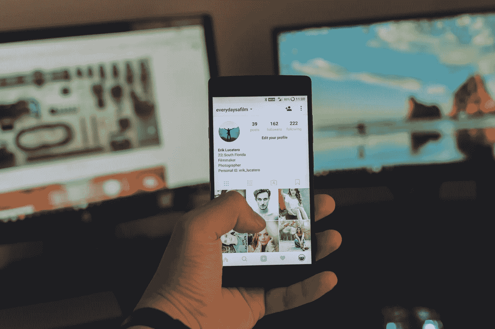

# 如何实际使用社交媒体作为内容创作者

> 原文：<https://medium.datadriveninvestor.com/how-to-actually-use-social-media-as-a-content-creator-36f231c8eaf0?source=collection_archive---------25----------------------->

## 它应该被使用的方式

Photo by [Erik Lucatero](https://unsplash.com/@erik_lucatero?utm_source=unsplash&utm_medium=referral&utm_content=creditCopyText) on [Unsplash](https://unsplash.com/s/photos/social-media?utm_source=unsplash&utm_medium=referral&utm_content=creditCopyText)

社交媒体有两个截然不同的阵营:一派完全接受它，另一派发誓放弃它，认为这是对时间的巨大浪费。

然而，如果你是一个内容创作者、博客作者或小企业主，你应该找到第三个阵营:舒适的中产阶级。

在这里，你会发现社交媒体在你的品牌建设、网络或交流中是一个非常有用的工具。

作为一个使用社交媒体十多年的人，如果你想建立一个人们会记住的个人品牌，我可以分享一些建议。

这里有 5 种使用社交媒体的重要方式，不会让人不知所措。

## 一次选择一个社交媒体平台

这是要遵循的最重要的提示。大多数博主，不管是新的还是其他的，都通过一次出现在所有地方来分散他们的注意力。这不仅会大大分散你的注意力，还会让你停止享受这个平台本身。

选择一个平台，在一个合理的时间框架内完成它。我的建议是至少连续 3 个月或 90 天。

> [**推荐阅读:免费 90 天社交媒体计划打造你的品牌**](https://shailajav.com/90-day-social-media-plan/)

## 研究你选择的平台

每个社交媒体平台都有不同的精神气质和独特的氛围。利用前两周的时间，试着了解什么有效，以及这个平台是否适合你。

时髦的一句话和简洁的公告对你有用吗？Twitter 是你最好的选择。

作为消费者和创造者，图像是否吸引了你？Instagram 是你需要的地方。

长篇字幕和更详细的视频对你的注意力有帮助吗？把你的注意力转向脸书。

请注意，这些都不是特定渠道独有的。这些概念中的每一个都可以根据您偏好的平台进行调整。

更重要的是要理解下一点。

 [## 抓住智能营销，获得巨大成果|数据驱动的投资者

### 网上的人都看过。每当人们在谷歌上搜索某样东西，他们最终都会与类似的广告互动…

www.datadriveninvestor.com](https://www.datadriveninvestor.com/2020/08/19/grab-on-to-intelligent-marketing-for-great-results/) 

## 吸引你的观众

社交媒体为正确使用它的人服务的原因隐藏在术语本身中:“社交”。

在社交媒体上茁壮成长的内容创作者主要有两点:

***济世***

这是否意味着他们不推广他们的内容？一点也不。

但是他们以一种自然符合平台精神的方式来做。比如在 Instagram 上，很多内容都是建立在参与原则上的。

你的内容本身就是为了启发、教育或激励。如果你试图使用 Instagram 纯粹是为了你的网站带来商机或流量，你会很快感到沮丧。

相反，致力于社区建设，看着你的受众随着你的业务一起成长。

> ***** [**推荐免费课程:让你的 Instagram 粉丝有机增长的方法**](https://shailajav.com/grow-your-instagram-page/)

## 安排您的内容

社交媒体的美妙之处在于，你的受众就在平台上。社交媒体的挑战是让你的内容适合平台，这样你的观众才能真正看到它。

这就是调度工具的用武之地。像 Buffer 和 Hootsuite 这样的免费工具非常适合跨平台发帖，也是受众活跃的最佳时机。

安排内容的另一个好处是你可以批量安排你的时间和带宽。

例如，我更喜欢在早上创作和安排内容，而晚上或傍晚有助于回复评论和吸引观众。这保持了一种理智的平衡，尤其是对社交媒体经理而言。

## 把它当工具用；不是为了分散注意力

大多数人远离社交媒体的最大原因是，它很容易分散注意力，耗费大量时间。

不同的人想出不同的技巧来保持注意力自由。

以我个人的经验来看，这些东西非常好用:

1.  仅在笔记本电脑上使用社交媒体
2.  在深度工作阶段，使用[扩展](https://shailajav.com/best-productivity-chrome-extensions-improve-focus/)屏蔽社交媒体网站
3.  在我踏上任何平台之前，设定一个工作的意图
4.  [定期清理我的手机](https://shailajav.com/declutter-your-phone/)，删除社交媒体应用
5.  [清理我的社交媒体](https://shailajav.com/organise-declutter-your-social-media/)频道

最终，只要你是掌控者，社交媒体会非常有用；而不是相反。

*Shailaja Vishwanath 是一位博客教练，他的工作重点是专注于生产力。* [*关注她的博客*](http://www.shailajav.com)

## 获得专家观点— [订阅 DDI 英特尔](https://datadriveninvestor.com/ddi-intel)