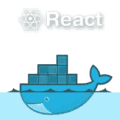

# 如何将自定义环境变量添加到创建-反应-应用程序中

> 原文：<https://medium.datadriveninvestor.com/how-to-add-custom-environment-variables-to-your-create-react-app-6c336e081075?source=collection_archive---------2----------------------->



*这篇文章假设你已经使用 ReactJS 和 Docker 对 web 开发和容器有了一个大致的了解。在这篇文章中，我将提供一些关于如何向 React 应用程序添加自定义环境变量的高级背景知识(注意:仅适用于基于 Unix 的操作系统)。我假设你用*[*create-React-app*](https://create-react-app.dev/)*设置了你的 React 应用，它使用了 Webpack、Babel、ESLint 等工具。*

如果您已经对 React 应用程序进行了 Dockerised，并且想要注入一些环境变量，那么可以通过在 Dockerfile 和构建脚本中添加几行代码来实现。


Photo by [Guillaume Bolduc](https://unsplash.com/@guibolduc?utm_source=unsplash&utm_medium=referral&utm_content=creditCopyText) on [Unsplash](https://unsplash.com/s/photos/container?utm_source=unsplash&utm_medium=referral&utm_content=creditCopyText)

# 为什么要注入变量？

## 这是个秘密！

也许你想注入某种配置，但不一定想让这些信息在你的应用程序中可见。避免“不安全地”将 URL、API 键等硬编码(从而共享)到代码中的一种方法是，让容器管理系统在运行时或构建时将它们作为环境变量注入到应用程序中。例如，rancher——containers/Kubernetes 集群管理器——能够创建命名的“秘密”用于容器。 [Secrets](https://kubernetes.io/docs/concepts/configuration/secret/#overview-of-secrets) 存储这些敏感数据(比如密码、令牌和密钥)，当根据他们在 Rancher 中选择的特定范围将秘密添加到项目或名称空间时，相关的项目所有者可以确保严格控制谁有权访问这些信息。

## 我已经有了哪些环境变量？

在您的终端中，您可以通过键入`export`(在您的项目的主目录中)，然后按 enter 键，看到您的应用程序已经存在的所有环境变量的列表。这将返回如下所示的项目列表:

`declare -x REACT_APP_<NAME_OF_VARIABLE>="value"`

在本例中，`REACT_APP_`是表示 React app 变量的文本，`<NAME_OF_VARIABLE>`表示已由用户定义的变量名的一部分。因此，`<NAME_OF_VARIABLE>`是用户定义的变量名称，`“value”`表示分配给它的任何值。

# 注入环境变量

## 临时变量

您可以通过在项目目录下的终端中键入以下命令，将环境变量临时添加到 shell 中:

`export REACT_APP_<YOUR_NEW_VARIABLE_NAME>="new_value"`

这对于测试非常有用。只有外壳打开时，变量才会保持“活性”。

## 注入变量

假设你在 Rancher 中定义了一些变量作为秘密。在您的 **Dockerfile** 中，您可以将每个环境变量添加到开发/构建下，如下所示:

```
ARG REACT_APP_<NAME_OF_VARIABLE>
ENV REACT_APP_<NAME_OF_VARIABLE>=$REACT_APP_<NAME_OF_VARIABLE>
```

我发现这个[讨论](https://stackoverflow.com/questions/41916386/arg-or-env-which-one-to-use-in-this-case)有助于理解 ARG 和 ENV 之间的区别。由于 Create React App 会生成一个静态的 HTML/CSS/JS 包，根据您自己的特定配置，您可能需要包含这两个包，以便变量在您的应用程序中可用。

根据您希望何时注入环境变量，可能会有各种脚本来引用环境变量。

***构建时间***

在您的构建脚本中，您可以向构建过程添加一个参数:

```
--build-arg="REACT_APP_NAME_OF_VARIABLE=$REACT_APP_NAME_OF_VARIABLE"
```

***运行时***

无论哪个脚本运行您的容器，您都可以将环境变量作为参数添加到 docker run 命令:

```
-e REACT_APP_NAME_OF_VARIABLE="$RANCHER_VARIABLE_NAME"
```

在 **App.js** (或者任何你想在你的 React 前端声明你的变量的地方)，你可以访问环境变量，例如:

```
const API_KEY = process.env.REACT_APP_API_KEY
```

***定制***

此外，您可以考虑定制 **config/env.js** 文件的需求，该文件通常隐藏在 Create-React-App 中。你可以通过“弹出”你的应用来做到这一点。

请注意，在 **config/env.js** (通常隐藏的脚本之一)中，您的变量会作为`getClientEnvironment`函数的一部分自动添加到`process.env`中，因此我不建议您弹出您的应用程序，因为您无法[]轻松地取消弹出它！然而，如果您想确保容器在构建时没有特定变量时抛出错误，或者如果您想添加某些其他定制，那么向该文件中添加您自己的代码可能就是您想要的。


Photo by [Sam Xu](https://unsplash.com/@therealsam?utm_source=unsplash&utm_medium=referral&utm_content=creditCopyText) on [Unsplash](https://unsplash.com/s/photos/stop-sign?utm_source=unsplash&utm_medium=referral&utm_content=creditCopyText)

要弹出 React 应用程序，使这些脚本变得可见，您可以输入`npm run eject`。警告:我鼓励继续阅读这些脚本，因为保留它们也有好处！

这将启动从 Create React App 的构建脚本中弹出的过程，并且意味着您可以在您的文本编辑器中访问这些文件。

```
// Example of customised error handling that has been added in config/env.jsconst REACT_APP_NAME_OF_VARIABLE =     process.env.REACT_APP_NAME_OF_VARIABLE;if (!REACT_APP_NAME_OF_VARIABLE) {throw new Error('The REACT_APP_NAME_OF_VARIABLE environment variable is required but was not specified.');}
```

如果你做到了这一步，感谢你的阅读！我希望我的文章能帮助你开始设置环境变量。