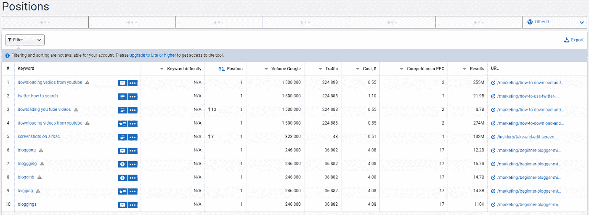
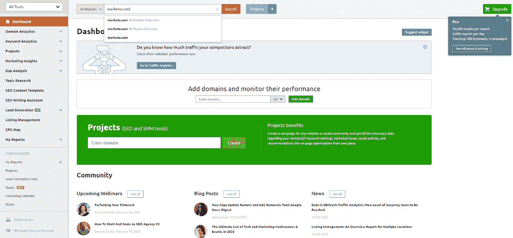
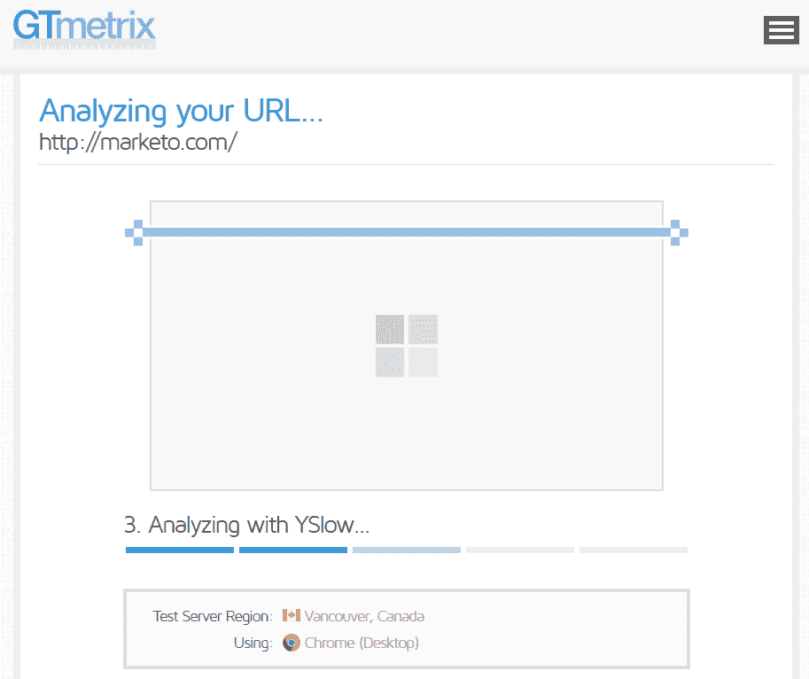

# 如何分析竞争对手 SEO 并排名靠前

> 原文：<https://medium.datadriveninvestor.com/how-to-analyze-competitors-seo-and-outrank-them-b5eafe3163d7?source=collection_archive---------15----------------------->

SEO 就像一场拔河。你不断地与其他企业竞争，以爬上 SERPs 和超越对方。

研究和分析自己的[搜索表现](https://morphio.ai/blog/blog/seo-anomalies)是必须的，但把它当成一项运动——理解对手同样重要，如果可能的话，监测可能影响你品牌的变化。

这就是为什么每个营销人员需要分析竞争对手的搜索引擎优化配置文件，以找到他们盔甲的缝隙。这创造了窃取关键词排名的机会，并发现向用户提供更好体验的方法。

 [## 在创业的旅途中，拥抱学习

### 好像建立一个数百万美元的公司还不够困难，企业家必须额外照顾他们的…

www.datadriveninvestor.com](https://www.datadriveninvestor.com/2018/10/16/on-the-entrepreneurial-trek-embrace-the-learning/) 

但是，说起来容易做起来难。要寻找和跟踪的数据永无止境。

幸运的是，我整理了这份关于如何在 SEO 中进行竞争分析的综合指南。看看这个。

# 1.确定谁的级别比你高

在你掰着手指头开始分析竞争对手之前，你需要先确定*和谁*在擂台上。我推荐使用一个叫做 [Serpstat](http://serpstat.com/) 的免费 SEO 工具。

首先在搜索栏中输入你网站的域名。

向下滚动页面到“有机搜索的竞争对手”部分。在这里，你会发现类似的关键字和主题的相关性排名领域。

导出这些域或将它们复制到另一个电子表格中。下一步您将需要它们。

# 2.他们是为了什么关键词排名的？

发现竞争对手的关键词排名就像脱掉他们的盔甲。您可以立即锁定相同或相似的搜索短语来[产生流量，并将](https://morphio.ai/blog/blog/generate-more-traffic-and-leads-with-these-8-content-marketing-trends)排在它们前面。

让我们从第一步开始继续使用 Serpstat。输入竞争对手的网址，他们排名最高的搜索词就会显示出来。

点击“显示全部”按钮，查看竞争对手排名的所有搜索词。

**或者，当竞争对手排名和元数据发生变化时，我们在 Morphio 的平台会提供详细的提醒。** [**在此了解更多**](https://morphio.ai/seo-anomalies) **。**

然而，仅仅锁定相同的搜索项是不够的。你也必须在内容上有所改进。

你可以在“位置”页面的最右边看到使用搜索词的 URL。

访问您要针对的每个关键字的页面，并审核内容的以下元素:

1.  **字数统计**:使用类似[字数统计](https://wordcounter.net/)这样的免费工具来确定一篇博文的字数。目标是比他们写的多 10%左右。
2.  **结构**:文章是怎么编排的？寻找标题标签、列表、粗体字和视觉元素。谷歌想要更多的首页内容，所以使用类似的结构。
3.  **关键词放置**:使用搜索功能(Ctrl + F 或 Command + F)查看关键词放置的频率和位置。对次要关键字也要做笔记。

制作一个针对相同关键词的内容，除了*更好*。把它想象成摩天大楼。他们可能有十层楼。你十五岁。

增加字数，增加新资源，让它更有用。比原始的内容和新鲜的视角更深入。这对 SEO 和读者都有好处。

# 3.他们从哪里赚取反向链接？

SEO 分为两部分:页面内和页面外。后者主要包括反向链接建设活动，其中产生的链接，以增加权威。

想出创造性的方法来建立反向链接也很困难。鉴于这是谷歌最重要的排名因素之一，你不能在这个部门懈怠。

这就是为什么对竞争对手的攻击可以节省大量时间的原因。

让我们为这一步切换它。使用 [SEMrush](http://semrush.com/) 通过在主页上键入 URL 来发现一个域从哪里接收反向链接。

向下滚动到反向链接概览，你会看到每个指向竞争对手的网站。点击这些推荐人，看看他们是什么类型的链接，如客座博文、评论、赞助商帖子等。

接触这些相同的出版物，并开始培养与网站管理员和编辑的关系。寻找客座博文或赞助帖子的机会。这些都是最常见和最有效的方法来建立联系。

此外，检查*他们有多少个*反向链接。这将会给你一个估计，你还需要多少链接才能达到一个相似的权限级别。

# 4.分解他们的内容和页面策略

搜索引擎优化的大部分是在页面上。它包括对网站页面和内容的优化和调整，以帮助网站排名更高。而且，其中最大的成分是*内容*。

你可以通过访问竞争对手的网站来研究他们的内容策略，看看他们发布了什么。

以 Marketo 为例:

如果他们是竞争对手，你可以注意到他们发表文章、案例研究、电子书和许多其他内容。

让我们深入了解一下。例如，浏览他们的博客，你可以想出许多不同的主题想法。

然后你会问这样的问题:

1.  他们发布的是什么类型的内容？
2.  他们多久发布一次？
3.  他们在哪里推广和分发内容？
4.  他们的目标是谁？
5.  他们提供什么样的销售线索磁铁？
6.  我怎样才能对以上所有的事情做出独特的改变呢？

接下来让我们窥探一下他们的元数据。假设你使用的是谷歌浏览器，右击网页并选择“检查”选项。

在这里，您可以筛选页面代码，找到元标题、元描述和其他信息，如打开的图表数据。(比如推特卡。)

由于谷歌如今关注的是细节，我也建议通过谷歌的结构化数据测试工具运行竞争对手的页面，以确定他们使用哪种模式标记。

模式标记为用户和搜索引擎提供了关于网站及其页面的更多信息。

您可以使用该工具提供的信息来优化您自己的模式标记，或者在它们不优化的情况下将其作为一种竞争优势。

编辑模式标记就像给汽车换油一样。很容易弄脏手，做错事。如果你在 WordPress，[使用 Schema](https://en-ca.wordpress.org/plugins/schema/) 这样的免费插件来自动生成代码。

# 5.分析他们的用户体验

谷歌热爱可用性。他们希望他们的用户在点击搜索结果时有很好的体验，这样他们就会不断回来寻找更多的搜索结果。

这就是为什么你清单上的最后一项是*用户体验*。SEO 的 UX？没错。这比大多数人意识到的更重要。

从几年前开始，谷歌在发布了他们的 RankBrain 算法之后，开始更加重视基于 UX 的指标。想想跳出率，平均停留时间和点击率。

通过类似 [GTmetrix](https://gtmetrix.com/) 的工具运行竞争对手。这记录了页面速度、缓存和其他与用户体验相关的重要数据。

这将显示 PageSpeed 和 YSlow 分数以及页面细节。

每一个提高网站性能的建议都会按优先级从高到低排列。

在上面的例子中，没有使用浏览器缓存或 CSS 精灵。这是一个向前迈进的好机会。此外，减少 301 重定向和缩放图像的数量将加快网站的速度，提高 UX。

# 关于如何分析竞争对手 SEO 的最后思考

学习如何在 SEO 中做竞争对手分析，是营销中的一个秘籍。这将提高你在 SERPs 中的表现，并不断让竞争对手保持警觉。而且，更多的流量意味着更多的顾客。

第一步是找到与你竞争的对手。使用工具或简单地键入相关的关键字来查看谁出现在第一页上。

记下这些域名，并通过 [SEO 分析工具](https://morphio.ai/blog/blog/7-best-seo-automation-tools-for-digital-agencies)运行它们，以发现它们的关键词排名。分析各个页面的内容质量、关键词密度和我之前概述的要点。

然后，窥探他们的反向链接配置文件。他们从哪里赚取链接？他们有几个环节？使用这些资源作为建立公司网站链接的一种方式。

在此之后，分解他们的内容营销策略。看看他们制作什么类型的内容，多频繁，在哪里推广。谷歌最喜欢发布新鲜内容的业务。

最后，他们的用户体验如何？审计项目，如页面速度、缓存和重定向。如果你正在经历这些问题，解决这些问题，你将立即在竞争中领先。

有一件事需要做很多努力。而且，你和你的团队每天都做得够多了。

这就是为什么你欠自己[今天免费试用吗啡](https://app.morphio.ai/register)。我们的营销安全软件会监控竞争对手的 SEO 和内容，以便在元数据和其他元素发生变化时实时提醒您。