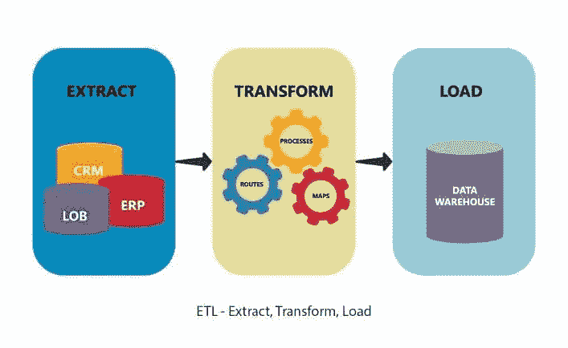
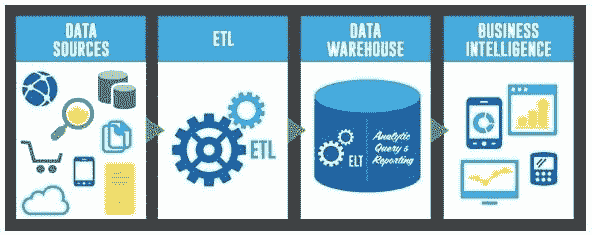
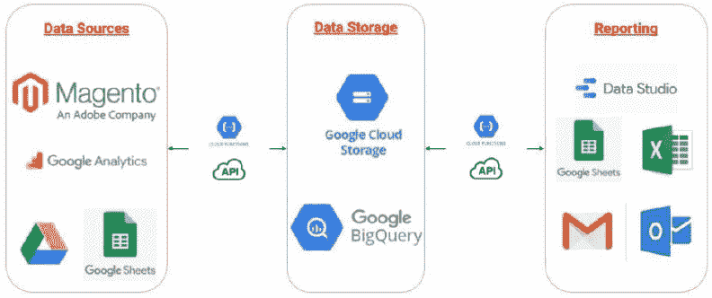
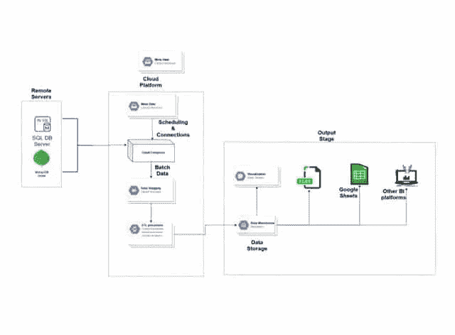

# 如何自动化 Magento & Google Analytics 数据的 ETL 过程

> 原文：<https://medium.datadriveninvestor.com/how-to-automate-the-etl-process-for-data-from-magento-google-analytics-72a6f8f0f6f5?source=collection_archive---------0----------------------->

作为一家数据驱动的企业，您是否计划从多个数据源提取和转换数据，然后将其加载到数据仓库中？是的，那么 ETL 就是你在考虑的。ETL 是提取、转换和加载的缩写，是每个数据仓库的重复活动。

为什么任何业务组织都应该首先采用 ETL？除了提供一种将数据从不同来源转移到数据仓库的简单方式之外，ETL 工具还可以执行复杂的数据转换，并且对于任何数据仓库项目的运行都是至关重要的。

 [## 不管准备好了没有，革命就在我们面前|数据驱动的投资者

### “对于技术如何影响我们的生活和重塑经济，我们必须形成全面的全球共识……

www.datadriveninvestor.com](https://www.datadriveninvestor.com/2019/02/12/ready-or-not-the-revolution-is-upon-us/) 

然而，与此同时， [ETL](https://www.webopedia.com/TERM/E/ETL.html) 是数据仓库中最复杂和耗时的过程之一。随着数据量和数据源种类的增加，传统的 ETL 工具不能提供高速的数据交付。除此之外，编写 ETL 脚本或者改变 ETL 相关的过程是复杂的，并且容易出错。

ETL 自动化被吹捧为解决这些 ETL 相关挑战的可行方案。在接下来的章节中，我们将讨论什么是 ETL 自动化，以及如何对来自 Magento 和 Google Analytics 工具的数据使用自动化 ETL。

# 什么是 ETL 自动化？

手动 ETL 工具要求您编写 ETL 脚本，这些脚本也需要针对不同的数据源定期修改。另一方面，ETL 自动化消除了手工编码，并提供了管理数据流的自动化过程。

通过使用自动化 ETL 工具，数据集成专业人员可以设计 ETL 工作流，并通过用户友好的图形界面对其进行监控。

除了提供数据流的可视化表示，流行的 ETL 自动化工具还集成了与数据源的连接器(包括 Magento integration 和 Google Analytics)。此外，它们还拥有包括数据分析和数据清理在内的高级功能。

在讨论如何使用 Magento 和 Google Analytics 的 ETL 来自动化数据传输之前，我们先来看看如何使用 Magento 工具集成数据。

# 用 Magento 集成数据

作为电子商务零售商的一个流行的开源平台， [Magento](https://magento.com/) 提供了各种电子商务特有的功能，如购物车的灵活性和电子商务商店的整体设计。

通过 Magento Web APIs，该平台内置了对各种第三方服务的支持，包括会计、ERP 和 CRM。除了 PHP 语言的工作知识之外，您还需要具备以下技能来从 Magento 执行数据集成:

*   Magento SOAP 或 REST APIs
*   Web API 认证

以下是使用 Magento 2.0 工具进行数据集成的方法:

1.  在 Magento 安装文件夹中设计一个框架模块，并为您的模块定义配置文件。
2.  接下来，创建包含多个 XML 文件的集成文件。您可以通过定义 API 资源和预配置集成文件来自定义您的模块。
3.  安装 Magento 模块。
4.  登录您的 Magento 帐户，检查您的集成。
5.  最后，在 Magento 中集成并激活您的应用程序。

接下来，我们将看一个 Countants 行业案例研究，它解释了如何使用 Magento 和 Google Analytics 的自动化 ETL。

# 如何从 Magento 和 Google Analytics 自动化 ETL 案例研究

基于云驱动的 BI 报告平台，客户 Smartchannel 正在寻找一种可以从 Magento 和 [Google Analytics](https://analytics.google.com/analytics/web/) 中提取数据的解决方案。利用这些数据，该公司正在寻找使用[谷歌数据工作室](https://datastudio.google.com/)创建的定制仪表板。

公司的要求如下:

*   执行 Magento 和 Google Analytics 的数据集成。
*   从这些列出的数据源中自动执行 ETL，并将输出加载到 Google 云存储和 BigQuery 中。

此外，该客户最近从 Magento1 迁移到 Magento2 平台，导致用户活动和性能下降。

通过使用 Google Data Studio，Countants 设计了一个 ETL Magento 数据自动化解决方案:

1.  对迁移过程进行深入分析。
2.  通过分析网站上访问量最大的页面来确定网站价值。
3.  使用谷歌分析数据，我们根据每个页面的价值对客户参与度进行了研究。包括多个指标来评估每个网站页面的价值。

接下来，我们将看到如何在 Google Data Studio 上可视化 Magento 分析和报告。使用自动化步骤，您可以使用 Magento 数据轻松地在 Google Data Studio 报表上执行数据可视化。

# 在 Google Data Studio 上执行 Magento 分析

作为一个数据可视化和报告工具，Data Studio 允许您生成各种信息丰富的报告，这些报告是根据个人业务需求定制的。使用内置的连接器，Data Studio 可以连接到 Magento 数据库，并将数据自动转换为定制的仪表板和报告，无需任何手动编码。

以下是如何在 Google Data Studio 中配置 Magento 数据的可视化:

1.  登录到您的 Data Studio 帐户并创建一个新的数据源。选择数据源类型为“MySQL”
2.  接下来，指定以下配置设置和属性:

*   主机名或 IP 地址
*   通道数
*   数据库名称
*   数据库凭据(用户名和密码)

3.指定设置后，点按“鉴定”

4.指定您希望在 Data Studio 上可视化的 Magento 数据库表。接下来，连接到数据库表。

5.接下来，您可以选择修改表列(如果需要)。使用特定数据源创建报表。

6.接下来，选择您想要在仪表板报告中使用的可视化样式。为您的可视化自定义尺寸和其他测量。

一旦您配置了此可视化设置，Data Studio 就会无缝连接到您的 Magento 数据。此外，当数据仓库中有新数据时，它会自动刷新 Magento 数据。

# 结论

随着 ETL 自动化的进步，数据分析师可以从包括 Magento 和 Google Analytics 在内的不同数据源中支持 ETL 过程。本文概述了从 Magento 和 Google Analytics 自动执行 ETL 的过程。

凭借其[云 ETL 自动化](https://www.countants.com/services/cloud-engineering/cloud-etl-automation/)服务，Countants 是在任何云计算平台上自动化您的 ETL 数据的最佳解决方案提供商。该公司在[云分析](https://www.countants.com/services/cloud-analytics/?utm_medium=social&utm_source=Medium&utm_campaign=traffic)和[云可视化](https://www.countants.com/services/cloud-visualization/)方面提供定制客户端解决方案的技术专长，使其成为许多全球公司的正确选择。想要为 Magento 和 Google Analytics 数据提供动力以获得更好的业务洞察力吗？不要犹豫[给我们打电话](https://www.countants.com/contact-us/)。