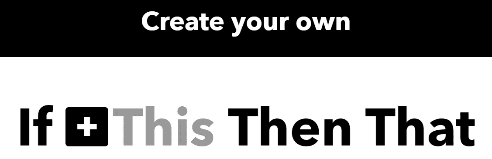
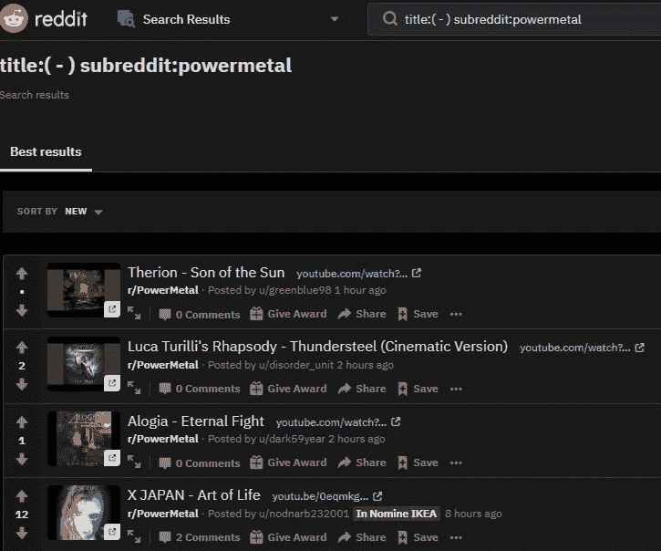
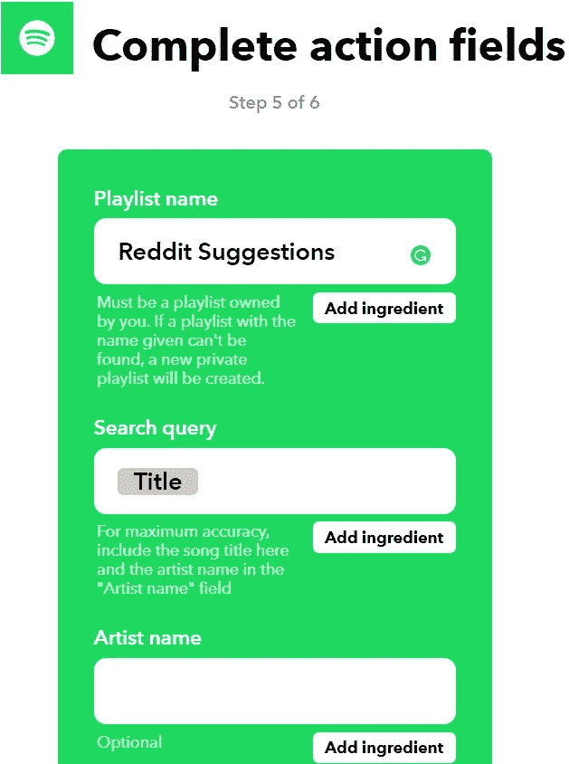

# 如何自动将喜爱的子编辑中的歌曲添加到 Spotify 播放列表中

> 原文：<https://medium.datadriveninvestor.com/how-to-automatically-add-songs-from-your-favorite-subreddits-to-a-spotify-playlist-35e163881c0b?source=collection_archive---------8----------------------->

从现在起大约 2 **0 分钟**后，Spotify 中就会有一个播放列表，可以自动接收你最喜欢的子歌曲。

你将不得不设置这个**一次**，并且永远享受它**。这非常简单，不需要任何编码知识。**

**好吧，但是我为什么要创建这样一个播放列表呢？**

**如果你和我一样，那么你爱**发现** **新歌**。除了 Spotify 等服务提供的很棒的推荐系统都是机器学习生成的，我发现**人工推荐**更多样，也更有趣。**

**互联网上最好的人类音乐推荐地之一是 Reddit。每种音乐口味都有许多子曲目。最受欢迎的名单可以在这里看到[。这些子编辑主要包含格式为:**‘艺术家-歌曲名称’**的帖子中的歌曲](https://www.reddit.com/r/Music/comments/1c9shq/largest_music_subreddits_by_subscribers/)**

**所以我在之前做的是:**

*   **浏览我最喜欢的音乐子剪辑**
*   **点击我感兴趣的每个帖子**
*   **听这首歌**
*   **重复**

**有几个缺点:**

*   **消耗了很多时间。浏览、查看帖子、打开帖子，一遍又一遍地做所有这些事情**
*   **现在就做，否则就别做。现在你必须为每篇文章重复上述过程。明天会有更多的歌曲发布，祝你好运，找到你听过的和错过的。是的，在你关注的每一个分支中。**

**这篇文章能给你带来什么？**

*   **为您节省大量时间。时间是宝贵的。不再需要手动搜索。**
*   **自动化。您定义的所有子编辑中的每首歌曲/帖子都将被添加到一个播放列表(或单独的播放列表)中。你继续你的生活，你的播放列表会自动增长。**
*   **你不会错过任何一首歌。**
*   **想听的时候就听。这些歌曲将在播放列表中等待你，你将永远拥有它们。**

# **好了，我们走吧！**

1.  **做账。IFTTT 的意思是‘如果这个，那么那个’。这是一个免费软件，让你能够连接其他两个应用程序(例如 Reddit 和 Spotify)并定义它们之间的自动操作。**

**2.打开 IFTTT，单击右上角的个人资料图像(在浏览器上)，然后单击 create。下一页就会出现。**

****

**单击第一个“+”。接下来，搜索 Reddit。接下来，选择触发器:“来自搜索的新帖子”。**

**3.在“搜索”中，键入“标题:(-) subreddit:powermetal”。它所做的是使用 Reddit 中的搜索栏来搜索指定子编辑标题中的'-'字符。如前所述，歌曲作为帖子的格式:**‘艺术家—歌曲名称’。**上一次搜索查询的结果如下所示。**

****

**如果完成此步骤，请单击“创建触发器”。**

**4.接下来，点击第二个“+”，搜索 Spotify。作为操作，单击“将曲目添加到播放列表”**

****

**5.在 IFTTT 上完成第 5 步之前，请转到您的 Spotify，用您想要的名称创建一个播放列表。**

**6.现在，在步骤 5 中，完成如下所示的字段。播放列表名称必须是您之前创建的名称。**

****

**单击“创建操作”。**

**我们所做的是，使用 Reddit 给我们的(包含'-'字符的帖子标题)，并在 Spotify 中搜索它。如果它是一个有效的标题，那么 Spotify 会找到它并将其添加到播放列表中。**

**7.在最后一步，只需点击“完成”**

****就是这样！**您现在有了一个播放列表，它会自动添加您指定的子编辑中的每首歌曲。**

**您可以对另一个子编辑重复此过程。如果您想将它的歌曲添加到与第一首歌曲相同的播放列表中，那么在 IFTTT 的步骤 5 中使用前一个播放列表的名称。如果您想要为新子编辑创建另一个播放列表，那么创建一个并使用它。**

**对于我的金属朋友，我创建了这样一个播放列表，包含了 [**r/PowerMetal**](https://www.reddit.com/r/PowerMetal/) **，**[**r/symphonicmetal**](https://www.reddit.com/r/symphonicmetal/)**，**[r/epic metal](https://www.reddit.com/r/epicmetal/)**中添加的所有内容。****

** [## Reddit 建议，Spotify 上 Deffro 的播放列表

### 我们和我们的合作伙伴使用 cookies 来个性化您的体验，根据您的兴趣向您显示广告，以及…

open.spotify.com](https://open.spotify.com/playlist/6w9wD0dF8GM4hczFZMMbpG?si=-mLfz_L9QnC7s6YWhp-Mow) 

感谢阅读！现在就去创建你的精彩播放列表吧！**