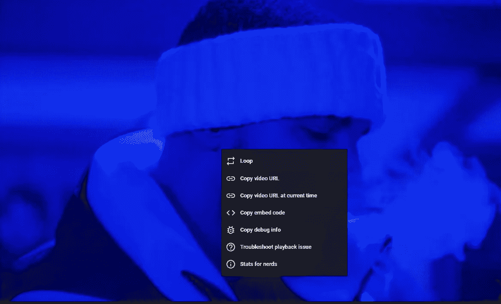
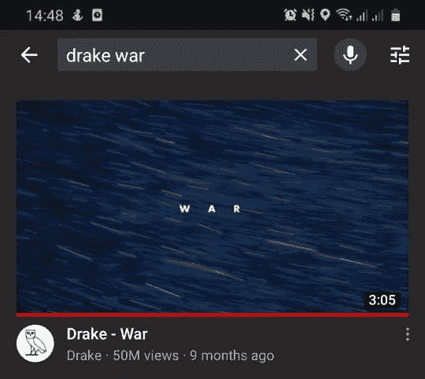
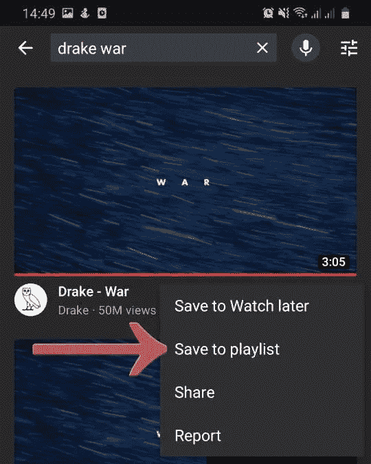
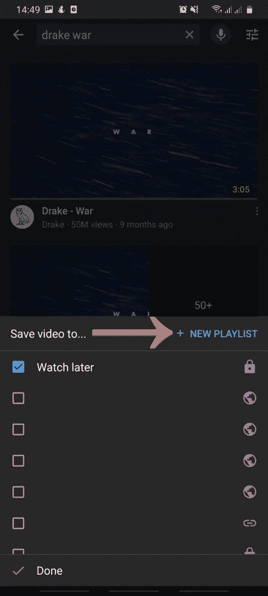
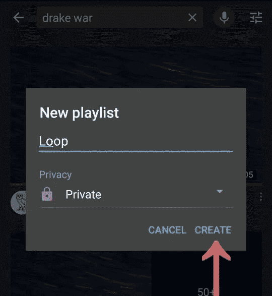
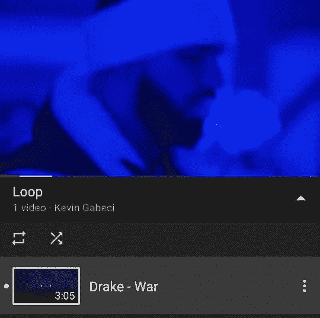
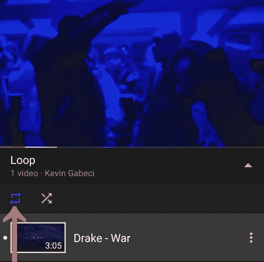

# 如何自动重复/循环播放 YouTube 视频

> 原文：<https://medium.datadriveninvestor.com/how-to-automatically-repeat-loop-youtube-videos-4fe7443c8663?source=collection_archive---------14----------------------->

我们都有过这样的经历，有时我们想不停地重复播放一首歌，但在 YouTube 上，这就有点难了。在这篇文章中，我将告诉你如何把这首歌从你的脑海中抹去，我的意思是你如何重复播放这首歌。

Photo by [NordWood Themes](https://unsplash.com/@nordwood?utm_source=medium&utm_medium=referral) on [Unsplash](https://unsplash.com?utm_source=medium&utm_medium=referral)

YouTube 允许你重复视频，但没有工具可以自动重复，这就是为什么我们必须使用不同的工具，如浏览器扩展、特定网站或第三方服务。

重复播放视频最简单的方法是右击视频并选择循环选项。

这样你就可以重复听你最喜欢的歌曲。

很遗憾这个选项不为人们所熟知，我觉得它应该有一个按钮。但也许在未来，YouTube 可能会改变这一功能的工作方式，所以我们必须等到那时。

# 如何在手机上重复播放 YouTube 视频

不幸的是，移动版 YouTube 甚至 YouTube 应用程序都没有 loop 选项。但是，您可以循环播放列表，诀窍是用您想要循环播放的歌曲创建一个播放列表。让我们看看如何创建播放列表。

 [## 抓住智能营销，获得巨大成果|数据驱动的投资者

### 网上的人都看过。每当人们在谷歌上搜索某样东西，他们最终都会与类似的广告互动…

www.datadriveninvestor.com](https://www.datadriveninvestor.com/2020/08/19/grab-on-to-intelligent-marketing-for-great-results/) 

打开移动 YouTube 应用程序，找到您想要重复播放的歌曲。

点击视频右侧的三个点，然后按下“保存到播放列表”按钮。

点击“新建播放列表”选项，如下图所示。

命名新的播放列表，然后按“创建”按钮。

现在转到你的播放列表，开始播放这首歌。

按下重复按钮，如下图所示。当你完成后，它会变成蓝色。

就是这样，你成功地让这首歌在 YouTube 移动应用程序上重复播放。

# 结束语

我在这里提到的两个选项对我来说是最实用的，我希望它们对你们也适用。还有其他选择，如使用浏览器扩展或网站，自动循环播放歌曲。

## 访问专家视图— [订阅 DDI 英特尔](https://datadriveninvestor.com/ddi-intel)