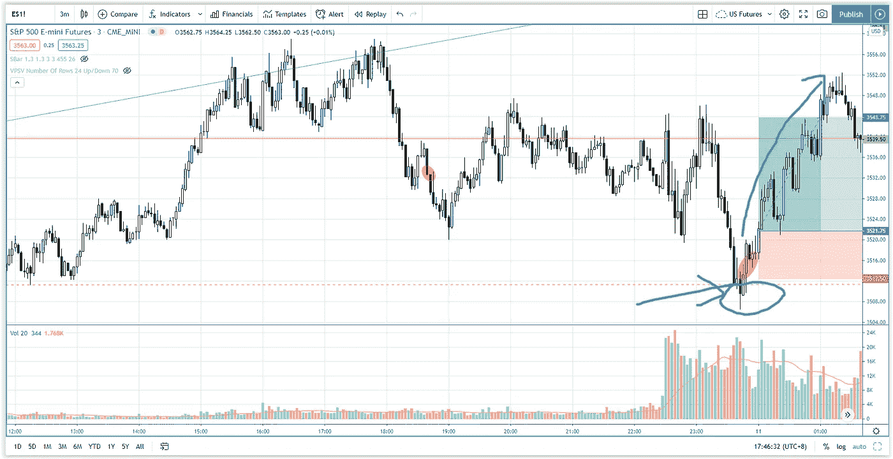

# 如何避免假突破甚至从中获利——标准普尔 500 日内交易

> 原文：<https://medium.datadriveninvestor.com/how-to-avoid-false-breakout-and-even-profit-from-it-s-p-500-day-trading-d795c9003c89?source=collection_archive---------25----------------------->

在交易评论部分，找出如何避免假突破，甚至从中获利。

观看视频，了解 2020 年 11 月 11 日交易时段标准普尔 500 指数期货的**每日市场分析。在这个视频中，你将看到最后一节的市场回顾和三分钟内的交易回顾(包括进场、出场和背后的原理)。展望未来，我将涵盖偏见，要注意的关键水平，我稍后的交易计划。**

## 时间戳

*   [1:55](https://www.youtube.com/watch?v=ZELd7j2ZH78&t=115s) 市场回顾
*   [4:15](https://www.youtube.com/watch?v=ZELd7j2ZH78&t=255s) 从假突破中获利的交易回顾
*   [7:00](https://www.youtube.com/watch?v=ZELd7j2ZH78&t=420s) 交易突破或假突破反转
*   [7:45](https://www.youtube.com/watch?v=ZELd7j2ZH78&t=465s) 避免假突围的方案
*   [13:08](https://www.youtube.com/watch?v=ZELd7j2ZH78&t=788s) 当前股票市场展望——来自纳斯达克的获利回吐和轮换

如果你还没有看我的[每日市场分析视频](https://www.youtube.com/watch?v=F1_is0HNVoE)，为了更好地了解市场回顾和交易回顾。

**偏向** —中性(日内交易)；看涨(长期)

**关键点位** —阻力:3587，3560；支持:3500、3480–3500

**潜在设置** —在关键级别寻找潜在反转。

# 资源

**每周市场展望&最佳交易建议【https://www.tradeprecise.com/】直达您的收件箱:[最佳交易建议](https://www.tradeprecise.com/)**

**职业免费**制图平台:创建账户→[www.TradingView.com](https://bit.ly/2U2Femd)

非美国居民？ ( **马来西亚、新加坡**、澳大利亚、新西兰、欧洲等):[点击此处，存款 2000 新加坡元](https://ji.hn/sgtiger)即可获得**免费股票(价值 100++美元)&老虎经纪**的欢迎礼物

美国居民？[点击此处，存款 1500 美元](https://ji.hn/ustradeup)，就有机会在 TradeUP 获得**份免费的 AMZN(价值 3000++** ) & **份欢迎礼物**

**从媒体获取无限文章** —加入以下:[https://priceactiontrading.medium.com/membership](https://priceactiontrading.medium.com/membership)

# 进一步阅读

 [## 低估的可操作高成长股第 2 部分— FVRR、优步、PYPL、JMIA

### 这些高成长股很可能在几天内被触发。找出我的交易计划与进入和止损…

medium.com](https://medium.com/datadriveninvestor/underhyped-actionable-high-growth-stocks-part-2-fvrr-uber-pypl-jmia-b24183668d20)  [## 2021 年这些小盘股会跑赢方舟 ETF 吗？

### ARK ETF 是 2020 年表现最好的 ETF，尤其是 ARKG ETF，截至 1 月 21 日，其 1 年回报率超过 215%

medium.com](https://medium.com/datadriveninvestor/will-these-small-cap-stocks-outperform-ark-etfs-in-2021-fe2d8b451bea)  [## ARK Invest 的 Cathie Wood 预测基因组股表现优于特斯拉？

### 方舟投资公司的首席执行官凯西·伍德预测，最大的上涨惊喜可能来自基因组股票，尤其是…

medium.com](https://medium.com/datadriveninvestor/ark-invests-cathie-wood-predicts-genomic-stocks-outperform-tesla-b67f3c4bbc68) 

Photo by Author — Ming Jong Tey

Photo by Author — Ming Jong Tey

披露:如果您点击本文中的链接进行购买或开立账户，并将所需金额存入推荐的经纪人账户，我们将免费为您赚取佣金。

免责声明:本演示中的信息仅用于教育目的，不应作为投资建议。