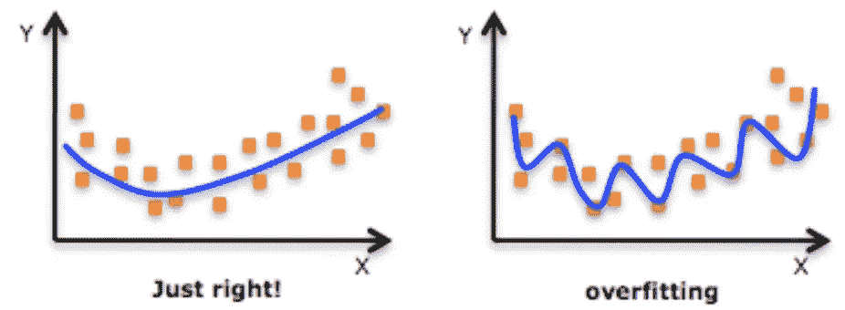
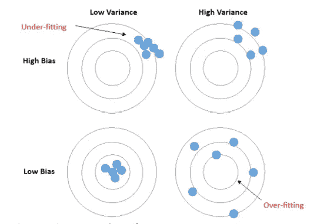

# 如何避免过度拟合

> 原文：<https://medium.datadriveninvestor.com/how-to-avoid-overfitting-fa2c4057443b?source=collection_archive---------6----------------------->

## 过度拟合是什么意思？

过度拟合是指模型对训练数据学习得太好。当模型学习训练数据中的细节和噪声达到对新数据的模型性能产生负面影响的程度时，就会发生过度拟合。换句话说，如果您的模型在训练数据上表现很好，但在看不见的测试数据上表现很差，这意味着您的模型过度拟合。

当模型具有低偏差和高方差时，监督机器学习算法中会发生过拟合。

## 为什么重要？

当模型仅对训练数据过度拟合时，这意味着模型没有学习数据的一般趋势，而是学习训练数据的噪声。这种模型在训练数据上表现很好，几乎没有误差。但是当这个模型被用来预测看不见的数据时，它的表现会很差。因此，避免过度拟合极其重要。

避免过度拟合的一些方法是:

## 列车测试分离

避免过度拟合的最重要的方法是为训练和测试准备单独的数据。我更喜欢使用 sklearn 的 train_test_split 函数将数据集分成两个随机组。train_test_split 是 Sklearn 模型选择中的一个函数，用于将数据数组分成两个子集:训练数据和测试数据。有了这个函数，就不需要手动划分数据集了。默认情况下，Sklearn train_test_split 会对这两个子集进行随机分区。

## 降低模型复杂性

数据中的要素过多也会导致模型过度拟合。减少数据集中的要素数量有助于模型。可以通过使用不同的特征选择技术来减少特征的数量。

 [## 将数据隐私转化为你的优势，重建消费者的信任:下一个投资前沿

### 疫情期间，抖音的使用量激增，全球约有 8 亿用户使用该平台…

www.datadriveninvestor.com](https://www.datadriveninvestor.com/2020/09/18/turn-data-privacy-to-your-advantage-and-rebuild-consumers-trust-the-next-investment-frontier/) 

## 正则化(学习算法)

正则化也有助于模型的过度拟合。机器学习中的正则化是正则化参数的过程，该参数约束、正则化系数估计或将系数估计收缩为零。换句话说，这种技术不鼓励学习更复杂或更灵活的模型，避免了过度拟合的风险。Lasso 和 Ridge 等模型使用正则化来避免训练数据的过度拟合。

## 交叉验证

在交叉验证中，数据被分成 k 个子集。现在，保持方法被重复 k 次，使得每次 k 个子集中的一个被用作测试集/验证集，并且其他 k-1 个子集被放在一起以形成训练集。误差估计在所有 k 次试验中平均，以获得我们模型的总有效性。可以看出，每个数据点恰好出现在验证集中一次，并出现在训练集中 *k-1* 次。这极大地减少了偏差，因为我们使用了大部分数据进行拟合，也极大地减少了方差，因为大部分数据也用于验证集中。交换训练集和测试集也增加了这种方法的有效性。

*感谢您的阅读。*

**来源:**

默西，施里拉塔。*成为局外人*2020 年 7 月 27 日

 [## 机器学习中的交叉验证

### 总是需要验证你的机器学习模型的稳定性。我的意思是，你就是不能让模型适合…

towardsdatascience.com](https://towardsdatascience.com/cross-validation-in-machine-learning-72924a69872f) 

## 访问专家视图— [订阅 DDI 英特尔](https://datadriveninvestor.com/ddi-intel)