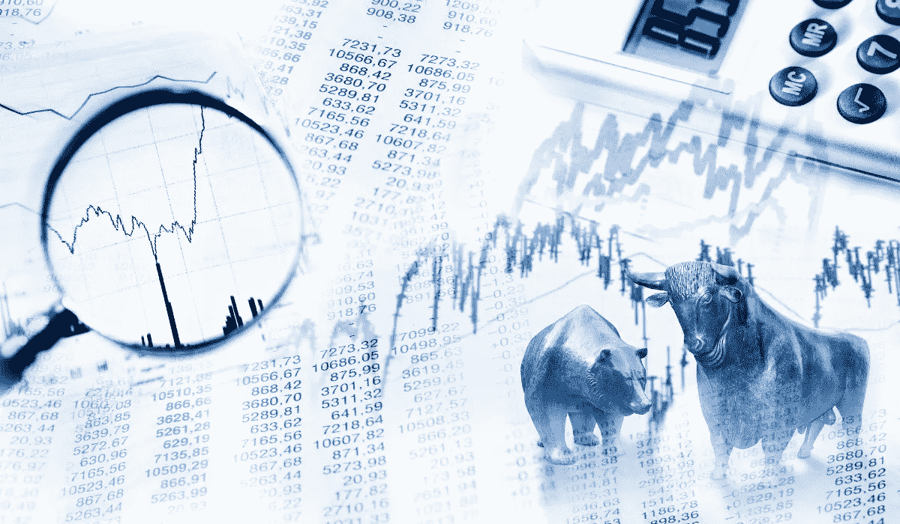

# 如何避免股市中代价最大的错误

> 原文：<https://medium.datadriveninvestor.com/how-to-avoid-the-most-costly-mistake-in-the-stock-market-3fec3f0ba09b?source=collection_archive---------6----------------------->

## “要是我保留那些股份就好了…”

股市失误可能代价高昂。你可能听说过卖空股票和期权交易出错的恐怖故事，虽然这些可能是毁灭性的，但每个投资者似乎都在他们的旅程中犯了一个代价高昂的错误。

错误？过早卖出某些股票。

代价高昂的错误不仅仅是承受巨大的损失。他们还会失去你本可以获得的重大胜利。

在以前的一篇文章中，我提到过早出售我的 Shopify 股票，如果我保留我的股票，我会错过超过 4 万美元的额外回报。

 [## 我 19 岁时买了第一只股票。以下是我从那以后学到的东西

### 成功、错误和巨大的遗憾

medium.com](https://medium.com/datadriveninvestor/i-bought-my-first-stock-at-19-heres-what-i-ve-learned-since-then-5490b6041286) 

我和其他经历过 Shopify 时刻的投资者聊过。他们买入一只惊人的股票，在某个时候卖出全部头寸，然后惊恐地看着这只股票获得 2 倍、3 倍、5X 甚至 10 倍的回报。

你投资的时间越长，这种情况就越有可能在某个时候发生在你身上。你不能因为过去的投资失误而自责。最好能从中吸取教训，这样你将来就能避免它们。

从过去的错误中吸取的教训让我在成长型股票翻倍之前就开始买入，并一直持有。

# 承认错误

避免这种代价高昂的错误的第一步是承认你过去犯过这种错误。如果你表现得像没有发生过一样，你就不能解决问题。

看到过去这个错误的证据会帮助你认识到你比你想象的更擅长投资。找到一只增值的股票，并尽早买入，这是一种技巧。然后你必须持有股票来实现收益，但在股票成为主流之前找到这些类型的股票需要技巧、人脉(这需要一些技巧来建立)和/或运气。

 [## 收盘，但没有雪茄-股票市场目标在停滞的 COVID 救济中创新高|数据驱动…

### 专家聊天程序:一个协作市场，在这里人们可以和能够解决他们问题的专家聊天。是……

www.datadriveninvestor.com](https://www.datadriveninvestor.com/2020/08/18/close-but-no-cigar-stock-market-targets-record-highs-amidst-stalled-covid-relief/) 

# 半信半疑地阅读你的股票

我过早地卖掉了我的 Shopify 股票，因为我担心它们的估值。网上突然出现文章，声称 Shopify 的价格应该下跌，它是一家伟大的公司，但却是一只糟糕的股票。

我把 Shopify 理解为一家公司，但那些文章把我吓跑了，我卖掉了我的头寸。当我以 1061.27 美元的成本重新建仓一些股票时，同样的文章不断出现。现在，该股正逼近每股 1300 美元。

每篇文章都只是一个观点。无论对一篇文章/视频进行了多少研究，数据点的数量以及其他因素，这只是一种观点。

只要公司和商业模式不变，你可以坚持你的观点。

如果一篇文章揭露了公司内部的欺诈计划，或者令人信服地表明商业模式正在恶化，那就不一样了。但是如果你看到几篇文章说“估值过高”，而你不同意，那么你就不应该卖出。

当你依靠文章获取信息时，你让其他人帮你做作业……而这在考试当天不会有好结果。

如果你对一家公司的商业模式和机会不够了解，就不要费心购买股票，因为这条船上的许多人在任何坏消息下都会卖掉他们的全部头寸。

# 不要计算股票价格

一般来说，把握市场时机是个糟糕的建议，尤其是对前景光明的公司而言。

更多的投资者更容易选择成长股而不是股息股，因为成长股的价格可能会在一周内大幅波动。不要因小失大。抓住股票，让时间去做它的事情。

当你看到一只赚钱的股票时，就抓住它。只有在商业模式恶化的情况下，才考虑卖出，而不是因为有人说股票估值过高。

想投资不同的成长型股票吗？卖掉你在一只成长型股票上的一些头寸，开始在另一只成长型股票上建仓。不要一口气卖掉你的全部头寸。

你可以通过赚更多的钱来弥补。选择正确的成长股可以让你的钱增值。你投资组合中的钱越多，你的净值增长就越快。

[***想学习如何投资股市赚钱？确保你订阅了我的 YouTube 频道***](http://bit.ly/2W4ag01)

**访问专家视图—** [**订阅 DDI 英特尔**](https://datadriveninvestor.com/ddi-intel)