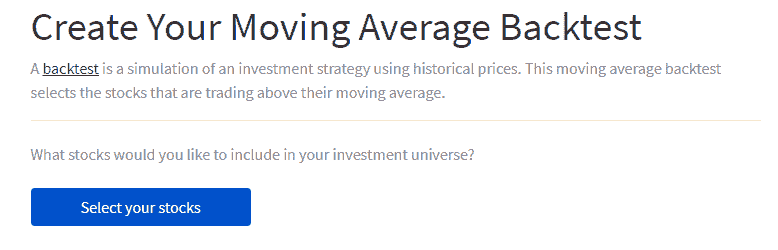
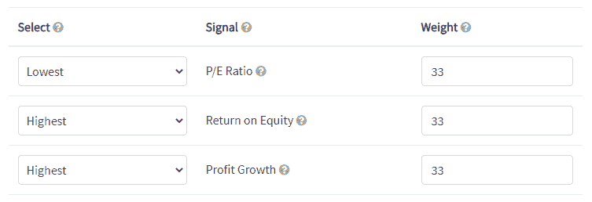
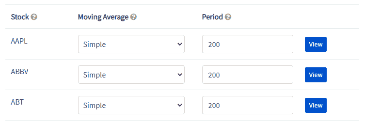
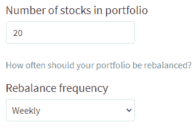
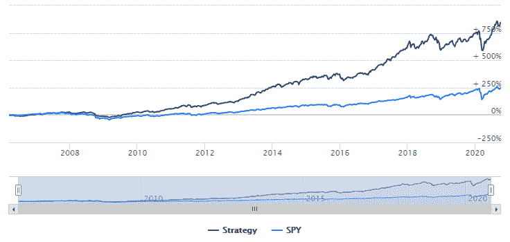
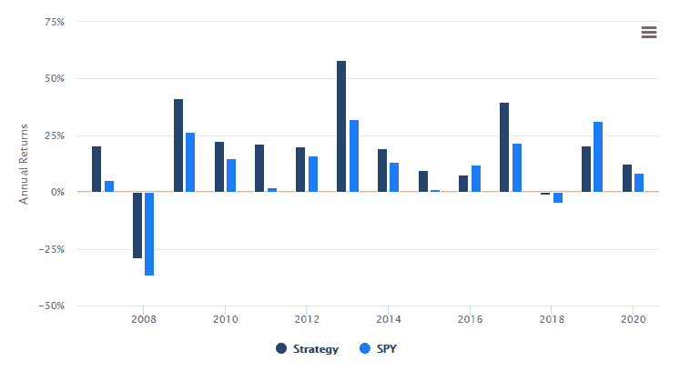
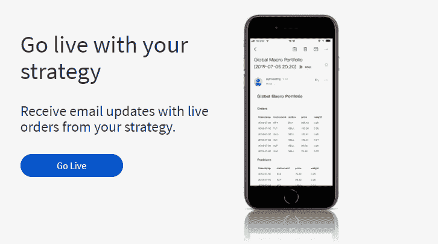

# 即使你不会编码，如何回溯测试一个交易策略

> 原文：<https://medium.datadriveninvestor.com/how-to-backtest-a-trading-strategy-even-if-you-cant-code-9aaf2614d483?source=collection_archive---------1----------------------->

你曾经尝试过一个被强烈推荐的投资策略，但是一旦你开始**赔钱**就决定退出吗？

我知道我有。

我的一个曾在对冲基金工作的朋友向我讲述了他疯狂的超级明星股票投资组合。出于某种原因，我觉得和他一起投资同样的股票会很酷。于是我照做了。

当我买入的时候，它碰巧是一个很好的切入点，因为市场几乎每天都在上涨。像 Sea 和特斯拉这样的股票，有几天投资组合单日飙升 4%！

然而，随着市场高度超买，一个巨大的红色日子很快就来了。之后不久我就慌了，套现了。总的来说，我在短短的三周内坚持投资组合。虽然这是一次令人兴奋的经历，但我再也不会投资于我没有信心的策略。

我如何找到一个我可以坚持的策略，即使是在市场波动的时候？

# 回溯测试你的投资组合

[回溯测试](https://pyinvesting.com/blog/12/heres-why-every-investor-should-backtest-their-investment-strategy/)是**模拟投资策略**的过程，使用历史价格来测试该策略在过去的表现。你需要对你的投资策略进行回溯测试，因为它可以让你确认你是否在市场上有优势，而不用拿你自己的钱冒险。

这有点像飞行员在被允许驾驶飞机之前必须使用飞行模拟器进行训练。在飞行模拟器中，将测试飞行员是否能够在不同的情况下安全驾驶飞机。如果一名飞行员在飞行模拟中撞毁了一架飞机，那么他就不可能被允许驾驶一架有数百名乘客生命危险的真飞机。

同样，如果一个投资策略在回溯测试中表现不佳，你为什么要拿你辛苦赚来的积蓄去冒险？

此外，回溯测试你的交易策略不会让你的钱面临风险。这是一种研究你的交易想法，并在你的钱到手之前测试它们是否有利可图的方法。

现在我们已经讨论了回测的重要性，下一个问题是我们如何回测交易策略？

# 决定你的交易规则

每一次回溯测试都依赖于一套符合逻辑的**交易规则**，这些规则在每天的模拟中会得到一致的应用。这套交易规则也就是通常所说的你的**交易计划**。

例如，我们将对均线交叉策略进行回溯测试。移动平均线用于估计股票的动量。高于移动平均线交易的股票具有向上的趋势价格(上升趋势股票)，而低于移动平均线交易的股票具有向下的趋势价格(下降趋势股票)。我们想要处于强劲上升趋势的股票，因为它们可能会继续上涨。

该策略的交易规则如下:

1.  过滤交易高于 200 天简单移动平均线(200SMA)的股票。
2.  根据以下信号对筛选出的股票进行排序。最低的市盈率(PE 比率)、最高的股本回报率(ROE)和最高的利润增长率

3.选择排名最高的前 20 只股票，组成一个权重相等的投资组合。

我们的投资领域将是标准普尔 500 的股票，我们将每周观察投资组合，检查投资组合中的每只股票是否都在 200 均线以上。如果一只股票跌破 200 日均线，它将被另一只高于 200 日均线且排名最高的股票取代。

 [## 为什么大多数人在日内交易中亏损(以及如何不成为他们中的一员)|数据驱动的投资者

### 日内交易很难，大多数人都赔钱。我确实有。事实上，我曾经在一个单一的损失更多的钱…

www.datadriveninvestor.com](https://www.datadriveninvestor.com/2020/09/23/why-most-people-lose-money-day-trading-and-how-to-not-be-one-of-them/) 

# 回溯测试软件

回溯测试交易策略是高度计算密集型的。幸运的是，我们可以依靠技术的力量来简化这一过程。

去 PyInvesting 的[移动平均线回测](https://pyinvesting.com/backtest/moving-average/)，我们将回测我们的移动平均线交叉策略。PyInvesting 是一个回溯测试软件，我为用户在云上创建他们自己的机器人顾问而开发的。

# 为你的投资领域选择股票

点击蓝色按钮选择你的股票，并在投资组合模板下选择标准普尔 500。这将从标准普尔 500 选择股票，形成我们的投资领域。

# 创造你的信号来排列你的股票

接下来，我们将选择用于股票评级的 smart beta 系数。根据我们的交易规则，我们将选择市盈率最低、净资产收益率最高和利润增长最快的股票。这些信号以 33%的权重被相等地加权，并被组合以形成总信号。

# 决定你的移动平均线参数

按照我们的交易计划，我们将使用 200 天简单移动平均线(200SMA)来确定股票是处于长期上升趋势还是下降趋势。默认情况下，移动平均线参数设置为 200SMA，因此我们不需要做进一步的更改。

# 股票数量和投资组合再平衡频率

将股票数量设置为 20 只，每周重新平衡一次，我们的交易算法将检查我们投资组合中的 20 只股票是否都高于其 200 天移动平均线。点击运行回溯测试按钮来模拟你的交易策略！

# 投资组合绩效分析

回溯测试结果显示，我们的策略年化回报率为 16.7%，而标准普尔 500 从 2016 年 3 月到 2020 年 10 月的年化回报率为 9.1%。我们策略的波动性也较低，为 17.2%，而标准普尔 500 的波动性为 19.9%。因此，我们的策略具有更高的夏普比率 0.78，而基准的夏普比率为 0.37。此外，在 2008 年全球金融危机期间，我们的策略最高下降了 39.9%，而标准普尔 500 下降了 55.2%。

年度回报图还显示，在过去 14 年中，我们的策略有 12 年跑赢了标准普尔 500。2016 年和 2019 年表现不佳。这意味着未来任何一年都有 85.7% (12/14)的机会超越基准。不算太寒酸。

这是我制作的一个训练视频，里面有我运行移动平均线回溯测试的现场演示。

# 从你的投资策略中获利

在分析了我们的回溯测试结果之后，我们对我们策略的表现感到满意。那么，我们如何将回溯测试转化为我们可以从中获利的真实可行的交易策略呢？只需点击“上线”按钮。一旦你的策略生效，PyInvesting 的 backtester 将每天运行你的策略，并向你发送电子邮件，更新你策略中的任何买入或卖出订单。然后你可以用你的个人账户进行交易，从你的策略中获利。参考消息互动经纪人 IBKR 是伟大的，因为交易成本非常低。

祝你投资愉快，并祝你好运。

*如果你想制定一个有效的投资策略，学习如何利用回溯测试的结果可能是你做过的最好的决定之一，因为回溯测试可以帮助你在你的钱被押上之前识别出一个不正确或正确的投资。*[*py investing*](https://pyinvesting.com/)*是一款用 Python 编写的回测软件，帮助投资者在云上创建自己的 robo advisors，无需编写一行代码。*

## 访问专家视图— [订阅 DDI 英特尔](https://datadriveninvestor.com/ddi-intel)