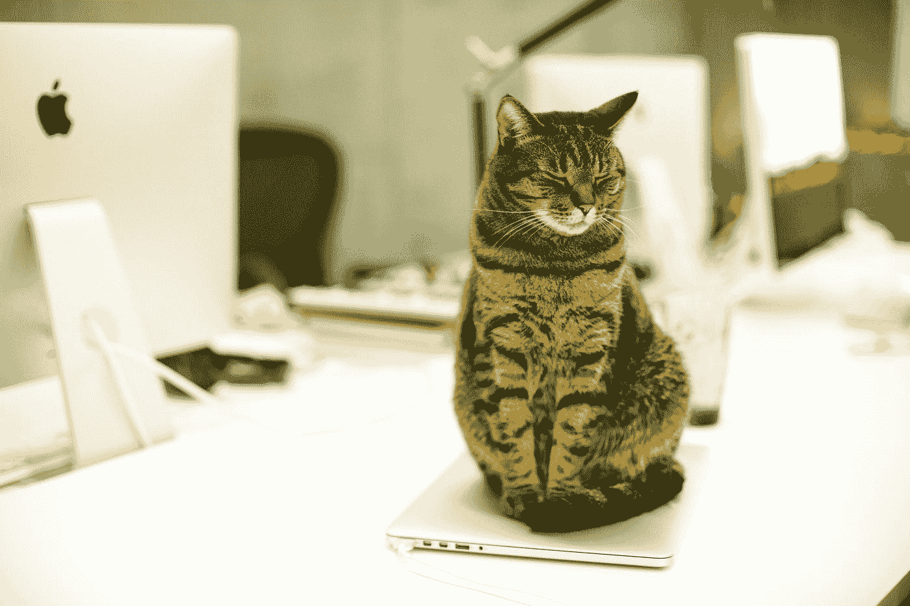

# 如何通过创建一个专用的工作空间成为一个更有生产力的作家？

> 原文：<https://medium.datadriveninvestor.com/how-to-be-a-more-productive-writer-by-creating-a-dedicatedworkspace-527d451069a3?source=collection_archive---------23----------------------->

## 拥有一个清晰的工作空间有助于你和你周围的人认真对待你的工作。

Photo by [Andrii Ganzevych](https://unsplash.com/@odya_kun?utm_source=medium&utm_medium=referral) on [Unsplash](https://unsplash.com?utm_source=medium&utm_medium=referral)

几年前，当我开始我的自由职业生涯时，我坐在餐厅的一把高背椅子上，在餐厅的大木桌上写作。

这不是一个理想的情况。

这些椅子不结实，总是坏。我太紧张了，无法放松，因为我永远不知道椅子什么时候会在我身下倒塌，即使我的猫是这场闹剧的唯一见证人；它仍然创造了一个紧张的写作条件。

我的餐厅是一个人流量很大的地方，在餐桌上工作感觉很像在橱窗里开店。

要从前门到厨房和后屋，你必须穿过餐厅，而且一整天都有很多人在走这条路。

我的猫在分散注意力的艺术方面很有天赋，经常会跳到桌子上调查，我的男朋友和室友会在我试图工作时靠在桌子上讨论足球，无论我如何试图忽略它，都无法逃脱似乎聚集在我桌子周围区域的各种声音。

 [## 跑步摆脱疯狂:锻炼如何提高你的生产力|数据驱动的投资者

### 没有比锻炼更好的方式来开始一天的工作了。我试着一周至少做四天，在…

www.datadriveninvestor.com](https://www.datadriveninvestor.com/2018/10/23/running-to-get-rid-of-the-crazy-how-working-out-increases-your-productivity/) 

作为一名作家，这不是我工作的最佳场所。我分心了，我的工作效率受到了影响。

我们的正式办公室已经被我的男朋友占用了，我们没有多余的房间，所以我买了电脑桌和迷你桌子，这样我就可以在飞行中形成工作空间。我甚至试着把我的笔记本电脑放在一个复古的电视托盘桌上，如果我一直在吃零食和看大型比赛，而不是写作，这个托盘桌可能会工作。

我需要一间办公室。

办公室这个词多年来一直在变化，尤其是随着许多人在家或远程工作。现在，它更像是专业人士开展业务的地方，而不是办公楼里的一个四面墙的房间。

任何对你有用的东西都可以是办公室——房间角落的一个小空间，你的餐桌，或者街角的咖啡店。

通过创建或指定一个专用于工作的空间，可以帮助你集中精力，完成更多的工作。它设定了明确的界限，要求你的工作得到尊重，并鼓励专业精神。

> 我的工作空间象征着生产力。一切都是为了一个目的而奉献和组织的，没有分心。这种一心一意的专注会产生结果。如果它不是专注的，它就不会工作，我也不会— [托德·特雷西德](https://financialmentor.com/)，财务顾问

一月份，男朋友把电脑搬到另一个房间，把办公室给了我。这是他给我的最棒的礼物之一，因为这证明了他的信念，只要有合适的工具和工作空间，我就能成为一名自由职业者。

## 拥有一间办公室带来了巨大的变化:我的生产率提高了两倍，我的注意力更集中了，而且我对自己作为一名职业作家的能力更有信心，因为我被当成了一名职业作家。

我的办公室在厨房和安迪办公室所在的佛罗里达房间(或奖金室)的旁边，虽然没有门把这两个房间和我的办公室分开；感觉还是一个真正的工作空间。

我已经开始戴降噪耳机来屏蔽任何外来的声音，我有一把二手办公椅，一张旧桌子，还有一个更大的显示器，它可以帮助我专注于我正在写的文字。

猫仍然会跳到我的桌子上，但没有以前那么多了，而且它们也更难把我的东西从桌子上弄下来。

最大的好处是电视可以在客厅里开着，客人可以过来，可以进行长时间的讨论，而且没有一件事会打断我的思绪。

不是每个人都可以使用传统的办公空间，但这并不意味着他们不能有一个专用于工作的区域。

## 关于如何创建专用工作空间的提示

它不一定要很贵，不一定要花很多时间来组装，也不一定要引起任何形式的干扰，它可以简单得就像封锁一个区域，称之为你的空间。有一些代表你的东西是很好的，比如一些有趣的办公用品或笔记本电脑上的贴纸。

## 把它放在人迹罕至的地方。

在一个普通的办公室里，当你的同事来到你的办公桌旁聊天时，那会是一件美好的事情。它可以给你一点能量或者帮助打破沉闷的一天，但是把你的桌子放在事情中间会让你很难集中注意力，并且会发出一个信息，那就是每件小事都可以打断你。

当你在 WFH 或者一个非传统的办公室时，你不希望有任何额外的干扰，尤其是那些你可以避免的干扰。

把你的工作空间想象成你的秘密实验室，在那里你可以把你的天才释放到世界上，而不会受到任何惩罚、干扰或评判。

## 建立清晰的界限

让人们知道，当你工作的时候，除非很重要，否则不要打扰你。

## 设定工作时间。

如果人们知道你在固定的时间工作，那么他们更有可能尊重这个时间。此外，一定要定期休息，吃午饭，四处走走。你不会想累垮的。

## 把它当成办公室。

如果你不得不去办公室，你可能会穿裤子，所以即使你在家工作，洗个澡，穿好衣服。

你不必穿得像是要给你最大的客户做报告。只要你很干净，看起来很整洁(不脏乱或脏污)，并且感觉像是在工作，你就可以非常随意。

当你有一个让你感到自信和充满活力的工作空间时，你会完成更多的工作，你的工作质量会更高，你也不会感到有压力。