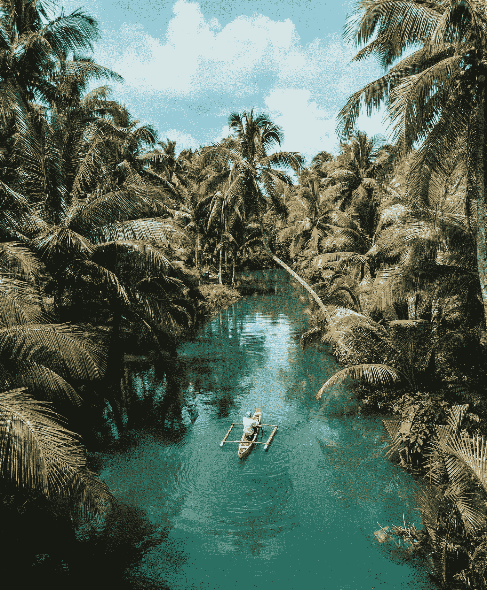
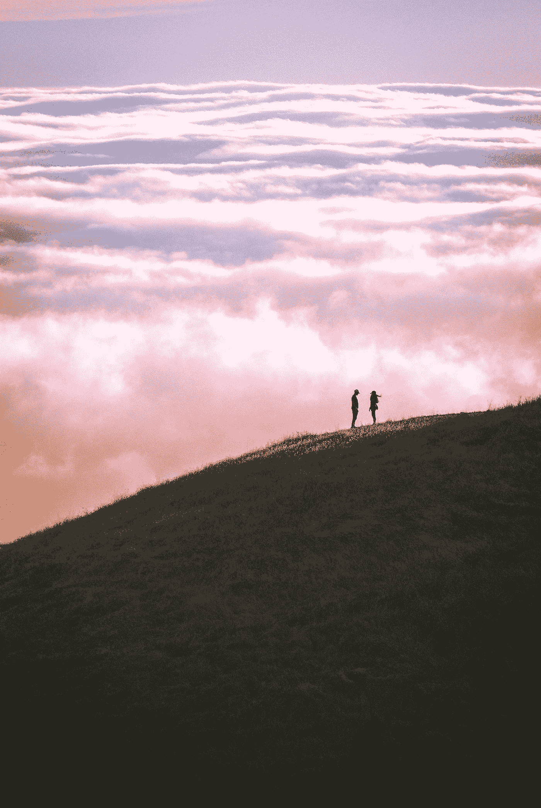
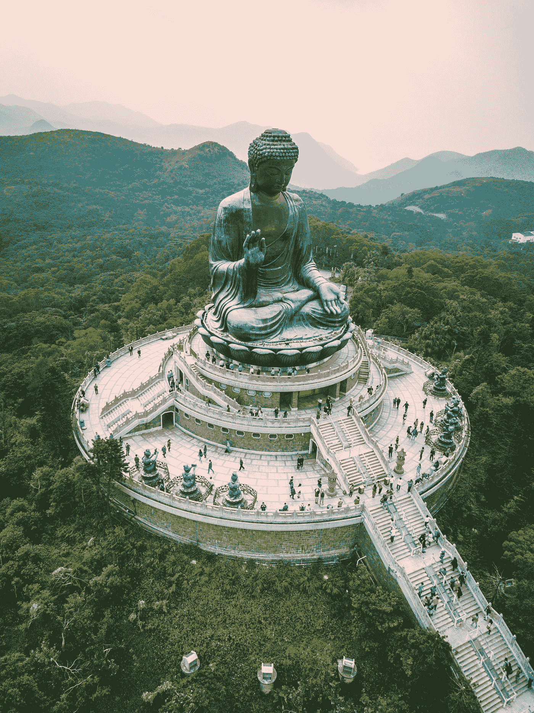
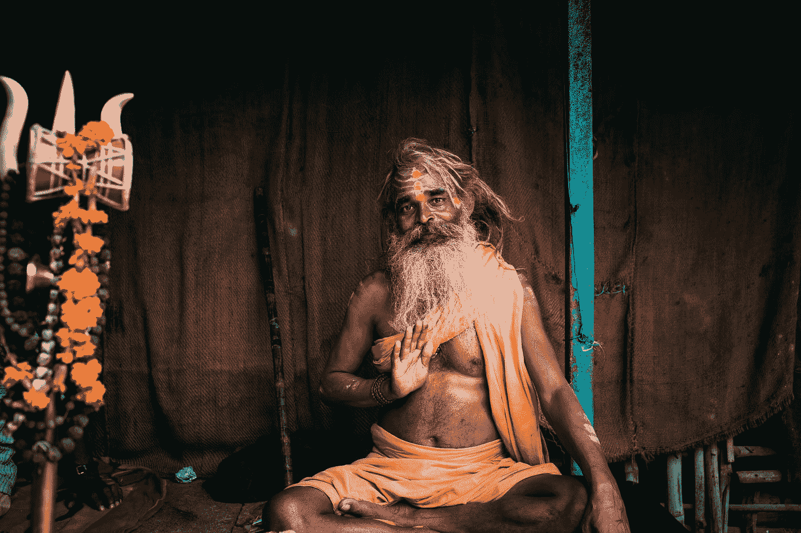
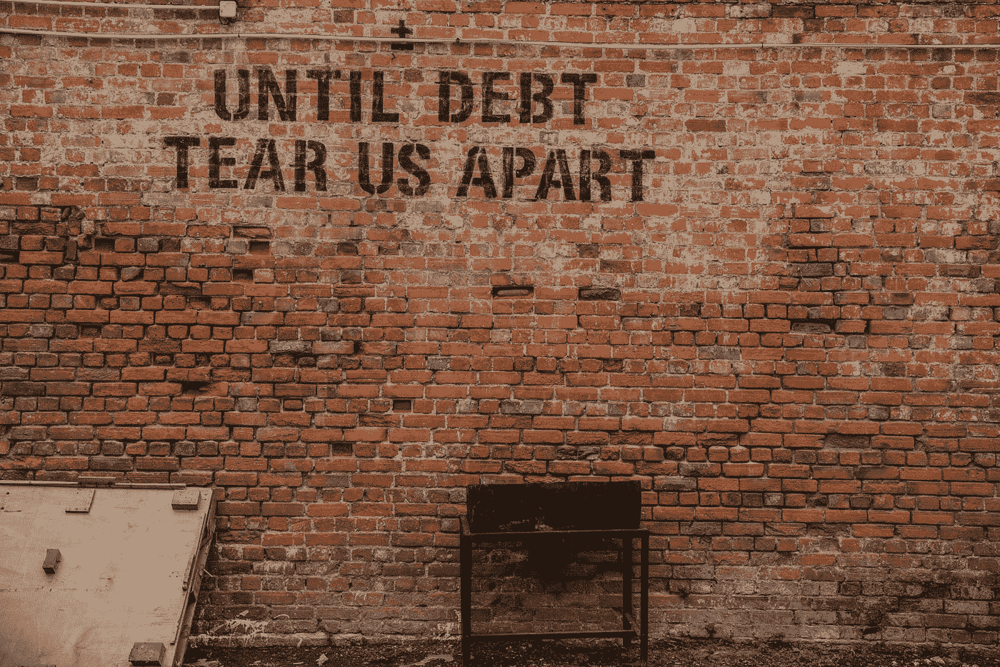
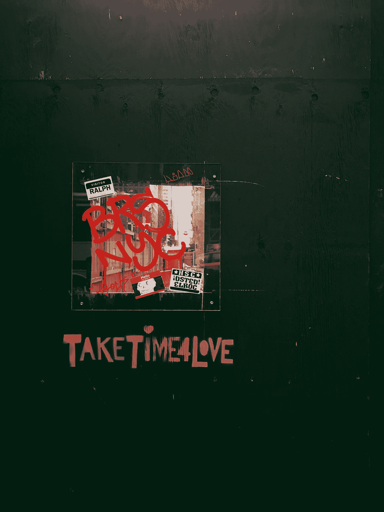

# 如何做到真实可信

> 原文：<https://medium.datadriveninvestor.com/how-to-be-authentic-15819eccbd22?source=collection_archive---------13----------------------->

## 做真实的自己

Photo by [Rolands Varsbergs](https://unsplash.com/@rolandsvarsbergs?utm_source=medium&utm_medium=referral) on [Unsplash](https://unsplash.com?utm_source=medium&utm_medium=referral)

事实是，我对科学、数学、会计、市场营销、投资甚至写作了解不多，但我对讨论过真实生活的渴望充满信心。我个人把真实定义为在哪里，为什么，如何，做什么，以及什么时候成为你最快乐，最健康，最好的自己。

你看，我的大多数朋友都想过真实的生活，但却感到困惑。欺诈。假的。他们想改变，但不知道如何改变。或者什么时候。

或者更糟，为什么。

发现真实自我的讽刺不是纸杯蛋糕和彩虹——而是他妈的艰苦工作。

# 真实的定义

还见于: [**词库**](https://www.freethesaurus.com/authentic) ， [**医学**](https://medical-dictionary.thefreedictionary.com/authentic) ， [**法律**](https://legal-dictionary.thefreedictionary.com/authentic) ， [**百科**](https://encyclopedia2.thefreedictionary.com/authentic) ， [**百科**](https://encyclopedia.thefreedictionary.com/authentic) 。

au 然后 TIC(ô-thĕn′tĭk)

**1。与事实相符的，因此值得信任、信赖或相信的:目击者的真实描述。**

**2。事实上如此的；不是欺诈或伪造的:*一把真正的中世纪剑。***

**3。** *法律*以产生法律效力的方式执行:*真实的契约。*

**4。**音乐*音乐*

**属于、关于或是中世纪调式的，其音域从最后一个音到其上八度音阶。**

**b.** 属于、关于或是主和弦紧接在主音和弦之前的抑扬顿挫的。

**5。**过时的*权威的*。

# 也许如果你问这些真实性问题:

Photo by [Casey Horner](https://unsplash.com/@mischievous_penguins?utm_source=medium&utm_medium=referral) on [Unsplash](https://unsplash.com?utm_source=medium&utm_medium=referral)

“我该不该辞职？”

“我该怎么办？”

“我要住在哪里？”

“为什么我一直做我正在做的事情，希望得到不同的结果？”

“什么让我更快乐？”

"是什么让我进入心流状态？"

首先，我认为在我们的真实性之旅中，问题是一个很好的起点。我们必须挑战我们的舒适区。我们留下来是因为报酬很高吗？因为它给你一辆舒适的车。房子。美国梦。或者也许你无法想象你目前正在做的事情之外的生活。

> 也许我们能做的第一件事就是质疑你真实的生活是什么样的！

你每天都在做什么？你在做什么样的工作(因为在我看来有意义的工作是真实性的很大一部分)？你有什么爱好？你有哪些健身套路？你周围都是什么样的朋友？在你的一周或一个月里，你能找到哪些幸福岛？

但最重要的是，一旦你开始与这些岛屿结盟，呆在这些岛屿上的感觉是真实的吗？

如果是的话，上帝保佑。

如果没有，那怎么办？

为什么要停留在与真实的自己不一致的东西里呢？

我认为我们大多数人留下来是因为我们害怕未知。

# 对了，我觉得恐惧是一种错觉。

Photo by [Timo Stern](https://unsplash.com/@timonrets?utm_source=medium&utm_medium=referral) on [Unsplash](https://unsplash.com?utm_source=medium&utm_medium=referral)

对死亡的恐惧。

害怕失败。

害怕改变。

都在我们的脑海里。

我们制造恐惧，我们的社会制造恐惧和匮乏的观念。我们永远不会满足。我们必须带走比我们需要的更多的东西，以防万一用光了。我害怕改变你目前的生活方式、工作或人际关系，但是要变得真实，我们必须接受恐惧是一种幻觉。

没有人会他妈的记得一年后你做了什么，除了你，所以你想做什么？

害怕？

你想成为什么？

我们必须练习成为一名战士来克服恐惧。我们必须呼吸，工作，冲破伴随变化而来的不舒服的感觉。就像健身一样。我知道我想要也需要健身，但是我害怕做最好的自己。我害怕以我不擅长的速度跑过我的舒适区。

真实性没有什么不同。

真实是在*日报上突破你的障碍和舒适区的实践。*

这就像跑步、冥想或写日记——真实自我的日常技巧和艺术总是在接下来的几个角落，上山、下山、过桥，如果你选择每天跑得更快更远，你可能会开始觉得自己变得真实。

 [## 如何管理优秀的团队和你自己|数据驱动的投资者

### Janice Presser 博士是团队科学及其基础理论的先驱实践者。老生常谈就是说她…

www.datadriveninvestor.com](https://www.datadriveninvestor.com/2020/05/26/how-to-manage-great-teams-and-yourself/) 

# 真伪的标志是什么？

Photo by [Jason Cooper](https://unsplash.com/@salty_sandals?utm_source=medium&utm_medium=referral) on [Unsplash](https://unsplash.com?utm_source=medium&utm_medium=referral)

我认为微笑、专注、心流和笑声是你真实生活的明显标志。你不会感到被评判。或者被宽恕。或者对自己的身份感到难过。

你将擅长做出与大众相悖的选择，并观察那些试图动摇你的想法。

我们不是那些想法。那个猴脑。

我们是观察者，是那个选择成为我们的思想或作为意识流观察它们的人。

> 我们选择哪些想法对我们的经历是真实的。

而真实永远是一种选择。

# 真实不在你总以为的地方。

Photo by [Dil](https://unsplash.com/@thevisualiza?utm_source=medium&utm_medium=referral) on [Unsplash](https://unsplash.com?utm_source=medium&utm_medium=referral)

你必须练习成为一名战士才能找到真实性。

当我住在纽约市时，我想过一种简单的生活。我会坐在电车上看人们的脸。那些悲伤的，安静的，专注的，遥远的，恍惚的脸凝视着东 44 街的世界。那些愤怒的小蚂蚁走向他们的办公室。为他们的工作干杯。他们是真实的吗？

他们在这个城市找到了平静和满足吗？

在去加勒比海之前，我只在那里呆了九个月。

我意识到，如果我能继续投资，每月获得 3000 美元的被动收入，我就不需要做我不喜欢的工作。

见鬼，我每月花 2000 美元住在曼哈顿中城东部一个没有门的房间里(说真的，它有一个该死的窗帘)。

但是在纽约的生活教会了我一些关于真实的东西——做出改变是可以的。

冒险失败也好，学习也好，想出办法也好。

我们他妈的只有一条命可活。

你几岁了？

我 41 岁了。

我在半路上，我拒绝等待。

我拒绝屈从于美国社会的强大力量和制约。

他们希望我们留在原地。

他们希望我们消费并负债。

他们希望我们买、买、买，而不是存、存、存(并投资、投资、投资)。

# 真实性的简单投资法则

Photo by [Alice Pasqual](https://unsplash.com/@stri_khedonia?utm_source=medium&utm_medium=referral) on [Unsplash](https://unsplash.com?utm_source=medium&utm_medium=referral)

我投资那些在我睡觉时能给我带来回报的东西。

就是这样。

如果我在睡觉的时候赚钱，我可以选择在白天做我想做的事情，如果我赚够了的话。

这是真实性的一个关键部分，因为如果我们被束缚在一份不真实或没有意义的工作中，它会把我们的灵魂吸出我们的肠子，并在起伏不定的、陈旧的遗憾中把它们拉出来。

诚然，到处都有真实性的泡沫。在城市，在农村，甚至你现在所在的地方。也许你还没有找到他们。那群人。那种艺术，那种工艺。那本书。

真实性可以是睡前阅读一小时。

可能是在创作音乐。大自然。群山。友谊。水。冒险。付出。感恩。帮助他人实现梦想和目标。做有意义的工作。

它必须“感觉”正确。

应该没那么难吧。

我不知道，对我来说，它总是习惯、惯例和自我意识的混合体。

痛苦的潮起潮落与我对真实生活的实践有关。

我认为这场斗争对于找到真相是必要的。

我认为苦难是找到开悟的必要条件。

我认为经历痛苦是感受平静的一部分。

找到真实并不容易——在我们做什么，我们和谁是朋友，以及我们找到自己的心流状态中。

# 我知道的不多，但有一点我可以肯定:

Photo by [Jon Tyson](https://unsplash.com/@jontyson?utm_source=medium&utm_medium=referral) on [Unsplash](https://unsplash.com?utm_source=medium&utm_medium=referral)

> 我了解人们。

我知道是什么激励了我们。

我知道是什么驱使我们。

我知道我们是否是真实可信的。

我看到我们是如何对待彼此的。

我看到我们如何争论政府或政治。

也许第一批美国人是对的。智慧是共有的。部落。我们在美国失去了我们的部落。我们可能会在我们的社会中变得孤立(尤其是在 COVID)——我们的孩子、我们的工人和我们的人民。

我们不排斥自私，而是欢迎自私。我们赞美奢侈，更糟糕的是，我们崇拜那些贪得无厌的领导人。

## 持续的自私对任何团队都没有好处，无论是在体育界还是在社会上。

给予和感激应该受到欢迎，然而我们在我们的国家做了什么？在我们的城市里？

我该怎么办？

我不总是在该给的时候给。

我很幸运地把自己从美国公司的无人驾驶中推了出来。我努力成为一个矮小的白人，在一项非白人占主导地位的职业运动中打球。我有关心我的父母。关心他们的教练。有人站在我这边反对我。不过，这场战斗是我的战斗。我努力成为一个人物，现在这场战斗结束了，我在寻找下一场战斗。我在寻找下一次肾上腺素激增和良好的感觉。

这就是我一直在寻找的——也许它会以我从未预料到的方式到来。

我对宇宙敞开大门——对数十亿年的进化、星尘和创造敞开大门。

只要相信我们接下来要做的事情就在我们应该在的地方。

这就是“是和…”的生活。

通过对我们应该做的事情说是，我们对我们不应该做的事情说不。

我很幸运存了钱，并把钱投资在被动收入工具上，在我睡觉的时候给我发工资。

这让我能够评估对我来说什么是重要的。

对你来说什么是重要的？

成为银行账户上零最多的男人或女人，还是可以自由选择？

## 访问专家视图— [订阅 DDI 英特尔](https://datadriveninvestor.com/ddi-intel)