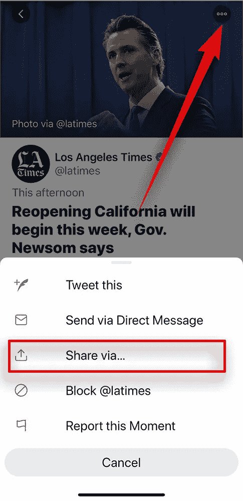
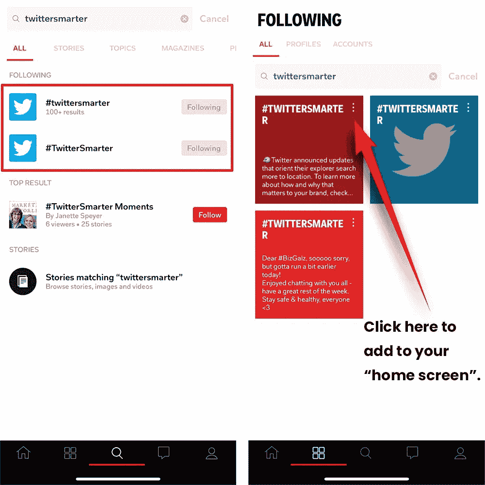
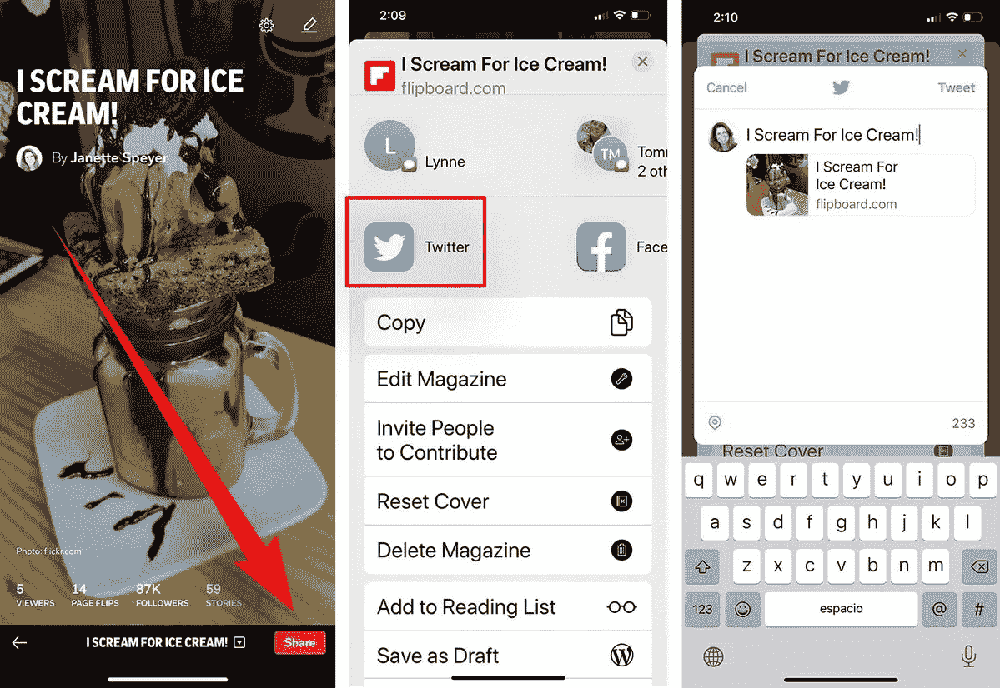

# 如何让你的粉丝觉得你很棒

> 原文：<https://medium.datadriveninvestor.com/how-to-be-flipin-awesome-for-your-fans-92581d8dfa0a?source=collection_archive---------7----------------------->

## Flipboard 杂志利用社交媒体进行营销

With Flipboard, anyone can publish a high-quality magazine.

无论是赚钱、教学还是娱乐——无论是商业还是个人娱乐——Flipboard 杂志已经成为一种极具吸引力的专业传播产品。

自 2010 年成立以来，Flipboard 已经将其触角伸向了成千上万的主题，让任何用户都拥有了收集者和发布者的权力。通过发行杂志，几乎任何人都可以成为网络思想领袖。

[珍妮特·斯派尔](https://twitter.com/JanetteSpeyer/)是一个毫不掩饰的 Flipboard 支持者。她是 [Hot Ice Media](https://twitter.com/HotIceMedia) 的合伙人，这是一家公共关系和数字营销公司，专门从事食品、健康食品、天然食品、健康和营养行业的 Flipboard 营销。斯派尔还为[社交媒体审查员](https://twitter.com/SMExaminer)撰稿。

 [## 修复你的社交媒体营销

### Twitter 快速而广泛地传播你的信息

blog.markgrowth.com](https://blog.markgrowth.com/fix-up-your-social-media-marketing-26cbfa3a5d45) 

她与数字营销专家 Madalyn Sklar 分享了使用 Flipboard 和 Twitter 的见解。

“Flipboard 是一个模仿传统出版物的在线杂志，”Speyer 说。“该应用程序从网络上收集内容，并按主题组织文章，有 34，000 个主题可供选择。Flipboard 是应用程序的“瑞士军刀”,因为它有如此多的用途。

“Flipboard 与 Twitter 的无缝集成让你可以组织你的推文以便于访问，”她说，并举例道:

*   组织研究
*   [社交倾听](https://blog.markgrowth.com/listen-for-good-vibrations-6cfa76efe031?source=friends_link&sk=ea7e95745397894229a8dfa463414534)
*   监控搜索
*   关注 Twitter 列表

“回到 2010 年，我刚刚得到我的第一台 iPad，”Sklar 说。“当我发现 Flipboard 时，我就爱上了它。我真的很喜欢这里的布局。”

使用 Twitter 和 Flipboard 使他们成为一对充满活力的搭档。

“Twitter 和 Flipboard 是强大的信息工具，”Speyer 说。“你可以合并来自主题或列表的推文，并将其添加到杂志中。然后分享给同事或你的社交媒体渠道。

“通过保存 Twitter 搜索，你可以监控标签或搜索词，而不必一直输入，”她说。"跟踪你的竞争对手、社交媒体、销售和活动."

# **全新的世界**

结果是思维扩展。

“通过使用 Flipboard，你正在创造一种全新的体验 Twitter 的方式，”Speyer 说。“这种格式有条理、美观、易读——使你的杂志成为一种必不可少的交流工具。”

她说强大的 Twitter-Flipboard 组合带来了其他好处:

*   学习和教学
*   项目创建和管理
*   内容管理和创作
*   营销和[公共关系](https://medium.com/datadriveninvestor/companies-success-depends-on-pr-whether-they-know-it-or-not-bc160bb5eb3a?source=friends_link&sk=89b8d331fb3523d3f8eddee69d42d2fe)促销
*   社交销售

 [## 知情人需要知道更多

### 继续教育对你事业的成功至关重要

medium.com](https://medium.com/datadriveninvestor/those-in-the-know-need-to-know-more-829d8ab77031) 

“你可以在每一个有 Twitter 和 Flipboard 的教育机构教书，”斯派尔说。“两者都是强大的学习工具。使用 Twitter 信息来管理 Flipboard 中的课程。然后把你的课程分成杂志图书馆，比如 T2 的 FLIPEDU 学校图书馆

她提供了更多的可能性:

*   建立一个商业参考图书馆，并在不同的杂志中添加 Twitter 研究。
*   将 Prezi 或 SlideShare 演示文稿添加到 Flipboard。分享到推特上。
*   将你所有的商业杂志加入[一个大杂志](https://flipboard.com/@flipmarketer/marketer-s-lounge-3ita718rz)。

摄影师、“网虫”兼 Flipboard 粉丝特里·波特正在领导一个 Flipboard 项目，帮助教师为学生提供教学材料。

此外，Speyer 还展示了 Flipboard 和 Twitter 如何“成为最佳销售团队”来帮助企业:

*   Flipboard 是一个漂亮的品牌工具。
*   在 Twitter 上推出了一款产品？建立一个 Flipboard 来展示产品体验。添加博客、推文、图片和视频。
*   监控 Twitter [影响某杂志的活动](https://www.datadriveninvestor.com/2018/11/13/to-gain-an-edge-influencers-move-markets/)。

“Twitter 是从你的客户那里获得提示、想法和信息的一个很好的方式，”Speyer 说。“你可以建立一个客户服务 Flipboard 杂志，并添加你所有的相关推文，以便与你的团队一起审查。你的员工会更容易看到顾客需要什么。

“关注你的竞争对手，”她说。“通过 Twitter 监控你的竞争对手。在 Flipboard 上关注品牌，捕捉他们的所有活动。将所有这些信息添加到杂志中，以便与您的销售团队分享。”

# **垂直话题**

Speyer 解释了如何在 Flipboard 上关注 Twitter 话题。

“使用 Twitter 搜索框找到你喜欢的主题或标签，并将其添加到杂志中，”她说。"你也可以在 Flipboard 杂志中保存一个 Twitter 主题."

斯派尔加了奖金。

“打开 Flipboard，使用智能手机底部的搜索图标输入你的主题或标签，”她说。“关注你的标签。Flipboard 将导入您的 Twitter 订阅源。然后，您可以在主屏幕上添加互动程序，以便于更新。”

据 Speyer 称，Twitter 列表也很容易与 Flipboard 整合:

*   在 Flipboard 上连接您的 Twitter 帐户。
*   点击你的 Twitter 图标，调出你的个人资料。
*   找到你的清单。选择你想关注的，这段视频演示的。

[另一个视频](https://www.youtube.com/watch?v=ROaJ310depI&feature=youtu.be)展示了如何在 Flipboard 上查看整个 Twitter 账户，并将推文添加到杂志中以供以后查看。

共享 Flipboard 杂志有几种方法:

*   在电子邮件中
*   在推特、脸书和 LinkedIn 上
*   在博客上
*   嵌入您的网站

斯派尔汇编了一份[Flipboard 工具清单](https://about.flipboard.com/tools/)，以帮助分享杂志或在网站上添加 Flipboard。

很自然地，她解释了如何在 Twitter 上分享杂志:

*   打开 Flipboard，找到想要分享的杂志。点击“分享”
*   找到 Twitter 图标，并选择它。
*   撰写您的推文并发布。

# **周末最爱**

“我们使用#FlipboardFriday 标签，每周五在 Twitter 上分享我们的杂志，”波特说，并引用了一个包含更多提示的文章[汇编。](https://medium.com/flipboard4business)

连接到 Flipboard 的 Twitter 帐户为用户提供了与观众互动的方式:

*   监控关注者。
*   转发收藏夹。
*   用 Twitter 列表建立一个图书馆。
*   从 Flipboard 内部转发。
*   策划高质量的杂志。

 [## 参与建立受众和利润

### 重要的是追随者的质量，而不是数量

blog.markgrowth.com](https://blog.markgrowth.com/engagement-builds-audience-and-profit-3849952ddbaf) 

结果是 Flipboard 用户和他们的 Twitter 追随者都受益。

“对你的顾客有用，”斯派尔说。“使用 Flipboard，通过提供有价值的东西来提升你的 Twitter 账户。比如你有网店吗？建立一个 Flipboard 购物目录，并在杂志上分享有用的技巧。然后分享到推特上。

“Flipboard 和 Twitter 是很好的社交销售组合，”她说。“使用 Twitter 策划的杂志吸引客户。我们的 [Hot Ice Media portfolio](https://flipboard.com/@janettespeyer/hot-ice-media-s7b90ordz) 为出版物和品牌策划了所有与杂志的公关工作。它是流动的，多变的。”

Flipboard 还拥有[脸书集团](https://www.facebook.com/groups/flipboard4business)、[媒体出版](https://medium.com/flipboard4business)和[推特营销](https://twitter.com/FlipMarketer/)和[教育账号](https://twitter.com/FlipEdu/)。还有一个 [Flipboard 用于演示教程](https://flipboard.com/@janettespeyer/flipboard-for-presentations-labsuol9z?from=share)。

通过 Flipboard 可以获得 speyer[。](https://flipboard.com/@JanetteSpeyer)

**关于作者**

吉姆·卡扎曼是拉戈金融服务公司的经理，曾在空军和联邦政府的公共事务部门工作。你可以在[推特](https://twitter.com/JKatzaman)、[脸书](https://www.facebook.com/jim.katzaman)和 [LinkedIn](https://www.linkedin.com/in/jim-katzaman-33641b21/) 上和他联系。