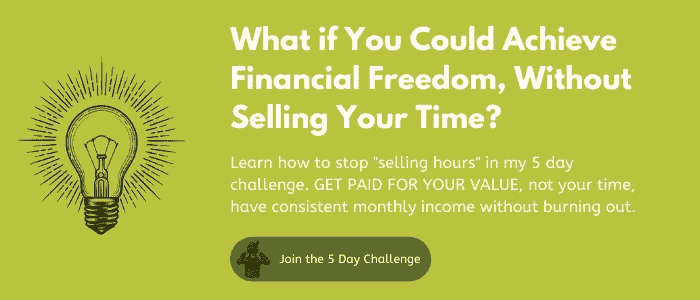

# 如何使用这种令人惊讶的(反直觉的)思维方式变得更有效率

> 原文：<https://medium.datadriveninvestor.com/how-to-be-more-productive-using-this-surprising-counter-intuitive-mindset-7a2e116842a2?source=collection_archive---------17----------------------->

延迟满足听起来可能是一个奇怪的提高你工作效率的“策略”，但是我向你保证，它是有效的。

有一句名言——出自无数不同的人之手，所以老实说，似乎没人知道这句话是谁说的——但当谈到商业中的延迟满足*和* [生产力](https://the3fs.com/time-management-business/)时，我认为这句话完美地概括了一切…

*“我们高估了我们一天能做的事，低估了我们一年能做的事。”*

想想吧。有多少天你对自己感到沮丧，因为*仅仅*做了几件你想做的事情……有多少天你觉得自己一事无成，尽管从一个地方跑到另一个地方，或者在电脑前坐了整整 8 个小时……

然而，当你回顾过去的一年，你可以看到你已经完成了很多事情。你已经签下的新客户，你正在接触的越来越多的[观众](https://the3fs.com/how-to-build-an-audience/)，你已经获得的额外经验，你已经建立的声誉，你已经开始提供的[新服务](https://the3fs.com/offering-something-different/)，你已经实现的增长率…

我们人类倾向于自然地想要和期待即时的满足，因此责备自己没有在一天内完成 100 件事情……然而事实上，我们正在实现的比我们意识到的要多得多——一天一次，一步一步，缓慢而稳定地。

 [## 开发人员提高工作效率的三位一体|数据驱动的投资者

### 在这个被大量工作负载轰炸的世界里，每个人都在寻找新的方法来提高工作效率…

www.datadriveninvestor.com](https://www.datadriveninvestor.com/2019/08/29/triad-for-developers-to-increase-productivity/) 

当我们从后见之明的角度看待事情时——而不是只关注我们“今天”设法做了什么——我们能够看得更清楚。

也就是说，当你想要提高你的工作效率的时候……当你想要学习如何变得不那么忙的时候……如何避免不堪重负的时候……如何提高你的时间管理技能……一个简单的改变心态的方法……

一种心态是*而不是*现在想做每件事，一种心态是*而不是*追求立竿见影的效果。

一种专注于你长期取得的成就的心态。

一种理解复合效应的心态——即[“少而常”](https://strategicmentors.co.uk/the-1-principle/)的力量。

记住延迟满足会带来*甚至更大的回报*的心态。

## **“复合效应”思维模式的好处……**

我们人类通常不擅长复合。我们有线性大脑…

即时满足的想法很吸引人，同时也满足了我们“更有效率”的概念。我们知道我们想要在业务中实现什么，为了实现它，我们有一个“要做的事情”的列表，因此我们本能地感到有一种“需要”来尽快完成这个列表，以便取得进展。

因此，采取大规模行动的想法似乎是明智的。

但是做所有的事情是不可能的……当然也不可能一次完成。所以在现实中，大规模的行动是不可持续的。

首先，一天只有这么多小时。另一方面，我们是人——不是机器——所以需要休息、休息、停下来反思的时间。

这就是为什么当谈到实现真正的生产力时，关注一个人随着时间的推移可以取得的成就(即理解延迟满足的好处)是如此重要。

如果我们告诉自己，我们必须尽快做好每一件事…现在，现在…我们正在制造紧迫感、忙碌感和压迫感——这本身就增加了压力，当我们不可避免地没有完成所有我们想做的事情时，或者当我们没有立即看到我们希望的结果时，就会导致失望。

这让我们感觉好像我们失败了，感觉好像我们在做错事…

但这是因为我们考虑的是短期问题。我们关注的是即时的满足，而不是长期的游戏。

如果你有一个待办事项清单，上面有 600 件重要的事情——600 个行动:不一定是大的，但却是重要的——这将引导你在业务中达到一个特定的目标，你会有什么感觉？

我敢说你会感到不知所措。即使它们只是很小的东西… 600 也是很多…

如果你的待办事项清单只有 3 件重要的事情呢？

嗯，那更可行。事实上，如果有时间，这很可能是可行的。

这就是现实。因为知道你需要做 600 件事是压倒性的。看似不可能，于是变得不可能。

但是如果每天只专注于做 3 件重要的事情，那么一年下来，你会完成 600 件重要的事情。

没有压力和压力。有条不紊的生产，有效率，稳步增长的结果。

更不用说完成 600 项重要任务所带来的进步可能是相当可观的。在仅仅一年的时间里取得了实质性的进展，这是相当不错的进展。

所以，都在心态上。

理解许多小而专注的行动的复合效果的心态。

知道你会随着时间的推移*实现这些目标，这是缓慢而稳定的工作和专注的结果——并且知道你不仅更有可能实际实现你为自己设定的目标，而且不会为了即时满足的希望而从一个紧急任务匆忙赶往下一个，你会发现你不再那么[忙碌](https://the3fs.com/mindset-for-more-time/) …压力更小…并且你会有更有效的结果。*

*只要有条不紊，你的工作效率就会高得多。*

*只要采用复合效应思维方式，你的工作效率就会高得多。*

**

## ***花时间提高效率***

*复合效果的最大挑战……延迟满足……就是*必须等待*的过程。*

*事实上，这是 70 年代著名的[棉花糖测试](https://en.wikipedia.org/wiki/Stanford_marshmallow_experiment)研究的主要发现之一——孩子们通常准备等待，以获得他们的“更大”奖励，但正是坐着看着它导致了各种各样的沮丧和焦虑…*

*就像专注于你想要但还没有得到的结果会令人沮丧一样。*

*不幸的是，复合需要时间，这就是它的本质。*

*但是，就像研究中的那些孩子一样，这只是一个关注你现在能做什么的简单例子，这样就可以分散你对只关注最终结果的注意力。*

*这只是一个简单的例子，记住每一个小的行动，努力或增加积累…它积累起来很大。这本身就意味着你会获得更大的回报……和更高的生产率……通过这些行动增长的绝对规模。*

*大多数人都听说过这样一个比喻:将一张纸折叠 50 次，它的厚度将等于到太阳的距离(或大约)。*

*这听起来很荒谬，因为人类总的来说很难理解指数级的事物。但是做一下算术题，一切都会好的。*

*我们之所以很难理解它，是因为最初的几个折叠差别很小。但是仅仅折叠 7 次，那张纸就和笔记本一样厚…如果你能折叠 10 次，它就和你的手一样厚了。12 次折叠显然是物理上可能做到的最大限度，但仅仅 17 次——每次折叠宽度都增加一倍——你就会看到比普通房子还要高的高度。20 分钟，你在一个塔区…再走 10 分钟，你就越过了大气层的极限…*

*突然间，我们有可能看到仅仅 50 个 T2 褶皱 T3 是如何让我们接近太阳的。*

*看起来*对不对*？不…因为我们的大脑仍然在努力处理它的指数性质…但是能够做数学和看到数字的准确性，足以提醒我们**小步骤可以导致非常大的事情**。*

*每天往罐子里放 1，到年底你就有 365 了。*

*每天在 LinkedIn 上添加 10 个新联系人，不出一个月你就会有 300 个。*

*每周写一篇简短的博客，6 个月内你就有 24 篇文章了。*

*是的，你必须等待你的满足感……这些行动的好处会在几周、几个月等结束时显现出来。但是这些行动是可管理的，没有压力的…最重要的是，它们是有效的。*

*玩长线游戏，关注延迟满足而不是即时满足，这意味着你突然有了一个创造**持续生产力**的策略，这导致了**切实的结果**。*

**

## *访问专家视图— [订阅 DDI 英特尔](https://datadriveninvestor.com/ddi-intel)*