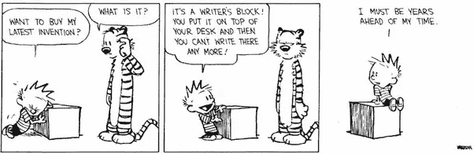

# 如何在 Twitter 上克服写作障碍

> 原文：<https://medium.datadriveninvestor.com/how-to-beat-writers-block-on-twitter-488a44207b52?source=collection_archive---------21----------------------->

Photo by [Dariusz Sankowski](https://unsplash.com/@dariuszsankowski?utm_source=medium&utm_medium=referral) on [Unsplash](https://unsplash.com?utm_source=medium&utm_medium=referral)

从很多方面来看，Twitter 似乎是建立受众的最简单的工具。这是一个具有极高投资回报率的平台。根据其定义，Twitter *不能*需要一点时间投入。帖子仅限于一两句话长！

但这也是问题所在。就这么几个词，如果你想继续写出有趣和有用的内容，你实际上必须很有创造力。记住，你的目标是以某种形式提供*值*。

 [## 影响者在聚光灯下表演|数据驱动的投资者

### 影响者营销是一个脱颖而出的游戏。结果是一个令人难忘的-和可信的-连接到一个产品或…

www.datadriveninvestor.com](https://www.datadriveninvestor.com/2020/01/15/influencers-perform-in-the-spotlight/) 

有些人对此如鱼得水。有些人会定期在 Twitter 上发帖，并且总是有一些机智、有趣和新鲜的东西要说。但是，当我们试图变得机智时，我们其他人会发现自己陷入了作家的困境。那么，如何解决这个问题呢？

**保持积压**

一个建议是积累一些 Twitter 帖子，当你的创意源泉枯竭时，你可以利用这些帖子。有些日子你会感到特别受鼓舞，并全力以赴，那些日子你可能会发现你可以用独特和有趣的推文填满整个 2 页。

所以，动手吧！然后定期贴这些就好了。你甚至可以使用类似 Buffer 的东西来安排这些 Tweets，使它们以固定的间隔发出。

**拥有个人品牌**

个人品牌是与你的名字联系在一起的品牌。这意味着你是品牌的一部分，因为人们把你和公司联系在一起。想想蒂姆·菲利斯、理查德·布兰森、托尼·罗宾斯或帕特·弗林。甚至像霍奇双胞胎那样的人。

这是强大的，因为它解放了你，让你开始发布你的日常生活和你的一天。通过这种方式，一切都变得有趣，一切都让你与你的追随者分享内容。如果你没有个人品牌，可以考虑分享你对企业日常运作的见解。

**分享小技巧**

受困于想法？那就分享一个有用的小技巧吧。如果你在正确的领域/行业，那么你应该有大量的建议给你的观众。所以就分享几行有用的东西吧。这是有保证的价值，因为这是他们可以采取行动的建议。因此，这是一个获得无穷无尽的有用和有趣的推文的好方法！