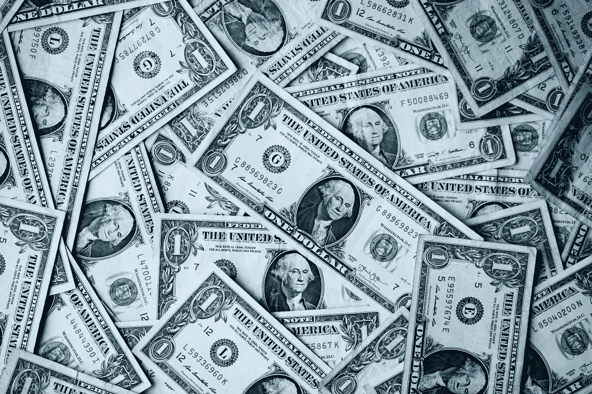

# 如何成为百万富翁，即使你是世界上最糟糕的市场时机

> 原文：<https://medium.datadriveninvestor.com/how-to-become-a-millionaire-even-if-you-are-the-worst-market-timer-in-the-world-401ca377aa36?source=collection_archive---------10----------------------->

## 以及我为什么不顾财务不确定性继续投资的 4 个原因。

Photo by [Sharon McCutcheon](https://unsplash.com/@sharonmccutcheon?utm_source=unsplash&utm_medium=referral&utm_content=creditCopyText) on [Unsplash](https://unsplash.com/s/photos/money?utm_source=unsplash&utm_medium=referral&utm_content=creditCopyText)

在我开始之前，这里有一个免责声明:

*我将要提出的任何观点/理由都纯粹是我在学习金融市场的过程中获得的见解，因此它们无意成为任何形式的正式金融建议。*

**现在，让我们继续。**

# 鲍勃的故事——最糟糕的市场时机

几个月前，我看到了这篇文章:

[https://awealthofcommonsense . com/2014/02/worlds-worlds-worst-market-timer/](https://awealthofcommonsense.com/2014/02/worlds-worst-market-timer/)

作者使用了一个虚构的角色 Bob 来说明即使你是一个不幸的投资者，从长远来看，你仍然可以获得不错的回报。注意，这里的关键词是**“长”**。

这就是鲍勃，一个尽职尽责的储蓄者，但却是你所知道的最糟糕的市场时机。每次他攒够了钱，鼓起勇气投资股票市场——在这种情况下，投资标准普尔 500 指数基金——市场就会崩盘。

 [## 数据驱动投资的兴起|数据驱动投资者

### 当 JCPenney 报告其 2015 年 2Q 的财务结果时，市场感到非常震惊。美国零售巨头…

www.datadriveninvestor.com](https://www.datadriveninvestor.com/2019/02/28/the-rise-of-data-driven-investing/) 

可取之处是他从不出售自己的股份。他什么也没做，只是继续认真存钱，并长期投资于股票市场。

虽然市场是周期性的，但它总体上是上涨的。因此，在 40 年的投资生涯结束时，他仍然拥有 100 多万美元。

当然，在读者开始质疑之前，作者已经在文章结尾和评论部分强调了一些假设、免责声明和概括。最起码，你不能只投资一只基金/股票，40 年什么都不做。即使是购买 ETF 和指数基金等更安全的期权，你也必须做一点研究。你还需要至少每年一次重新调整你的投资组合。

更重要的是，作者试图通过他的故事阐明以下几点:

*   长期投资的重要性如果你不想玩博彩市场的游戏，或者不想花额外的时间学习金融术语和分析复杂的图表。
*   复利的力量，如果你继续投资，再投资你的股息/回报
*   崩溃时控制情绪的重要性

我很幸运，在我投资的前两年获得了平均 8%的回报。展望未来，市场仍充满不确定性。我们非常清楚牛市的持续时间太长了——事实上，这是历史上持续时间最长的一次，我们还有像新冠肺炎这样的危机，它还没有显示出对全球经济的全面影响。

如果未来几年股市崩盘，我可能无法继续享受 8%的年回报率，但我会继续投资股市。除了鲍勃的故事，我还有另外四个理由:

# 1.不投资=因通货膨胀而亏钱

当一个国家的经济增长时，就会出现正的通货膨胀。在新加坡，通货膨胀率大约是每年 1%到 2%**平均**。几乎所有的当地银行都只为你的个人储蓄账户提供 0.05%的基本利率。如果你申请一个我称之为“升级版”的储蓄账户，你可以享受 1%到 3%的额外红利，在这个账户中，你首先必须:

*   当然，注册一张与相关银行关联的信用卡并消费
*   尽可能多地与银行进行交易，例如信用卡消费、贷款、保险，以获得更多红利

**本地人最低年收入 3 万新币，外国人最低年收入 4.5 万新币才有资格注册任何信用卡。*

这意味着，如果你没有那种“升级版”的储蓄账户，你在基本账户中的存款——基本年利率只有 0.05%——将会被每年的通货膨胀慢慢侵蚀。尝试零/低风险就到此为止…

当然，各国的基本利率和红利利率不同。一定要检查你的。

# 2.我已经有了一个养老计划

如果你在想为什么不做养老计划，投资保险计划等…我已经有了。

我的养老计划“承诺”至少 3%的回报率，前提是我把钱存进去几十年，直到 50 多岁或 60 多岁才取出一分钱。谁能保证我能活到那个时候？我不想成为一个悲观主义者，但是你永远不知道生活会带给你什么。

对我来说，一个就够了。

# 3.其他零风险或低风险的选择也有其缺点和局限性

在新加坡，我们有一个称为中央公积金的强制性退休储蓄计划。这几乎相当于美国的 401(k)计划。该基金严格用于退休和基本医疗保健目的，除非你想买房。

虽然有 4%的保证最低回报，但即使你已经到了规定的退休年龄，也不能全额提取。这是为了确保你不会全额提取，一次花光你所有的退休财富(这是我们的自由，但我不打算在这里深究这个话题)。你反而会每个月取出一小笔钱来陪你度过退休的日子。

再说一次，谁能保证我能活到那么老，享受我攒下的钱呢？

虽然你的国家可能有不同的系统，但我在这里想说的是，即使有安全的选择，也不意味着你要把所有的鸡蛋放在一个“安全”的篮子里。零风险/低风险选项也有其不利之处和局限性。

利用鲍勃的故事，你可能会说成功的股票投资也着眼于长期。但是，从上面提到的两个案例中，你可以看出，直到你老了，你对自己的储蓄可以做什么缺乏控制/灵活性。

**多样化不仅仅适用于股票市场。它适用于你的整个金融投资组合。**

# 4.如果你做足功课，交易费并不令人生畏

然而，你可能会说，股票交易是要收费的。如果你不做功课，高额的交易费会侵蚀你的部分回报。然而，时代变了，网上有越来越多的选择，使你能够以低得多的费用进行交易。研究收费最低的基金/平台。让谷歌成为你的朋友，你应该不会花太多时间去发现。

如果你一开始没有很多资本，费用可能看起来有点微不足道，但当你有更多资本投资时，当你的回报逐年增加时，你就会意识到这种影响。

## 预扣税呢？

好吧，这有点技术性。也许你的国家在某些领域做得不太好，你希望有一些海外投资作为你多元化计划的一部分。我认识到了解什么是预扣税是很重要的。

预扣税是对支付给外国人的利息或股息征收的税。如果你投资的是基于股息的外国股票，大多数情况下，会有预扣税。为了规避预扣税，你可能会考虑购买股票的注册版本。

用外行人的话来说，一只注册基金在某种程度上相当于你想购买的外国基金，只不过它的预扣税较低。例如，假设你想投资 S&P500 指数基金，但你不是美国公民，你可以投资先锋标准普尔 500 UCITS ETF 基金，这将降低你的预扣税。

你们中的一些人可能会认为事情没有那么简单，因为还有其他因素需要考虑，如外汇风险和费用率，即高外汇风险和高费用率可能会使注册基金不如实际基金本身有吸引力。

嗯，做作业还是很重要的。

# 总之…

我明白了，即使你在股票市场投资运气不佳，如果你:

1.  做一些研究，选择一篮子像样的股票，并在此过程中重新调整——标准普尔 500 交易所交易基金就是一个例子。
2.  保持长期投资
3.  将你的收益进行再投资，让它的复利力量发挥它的魔力

还要记住:

1.  查看你所在国家的平均通货膨胀率，看看它会如何影响你的储蓄。
2.  不仅要分散你的股票投资组合，还要分散你的整个金融投资组合。有时候，安全的选择也有不利的一面。
3.  做一些关于交易费用和税收的研究。你可以试着用谷歌搜索一些东西，比如“在美国，哪些平台的交易费用最低？”。

顺便说一句，我知道通货膨胀并不总是发生。会有负增长的时候。如果你不想花太多时间学习在不同的时间投资什么，你可以仔细阅读雷伊·达里奥的全天候投资组合**。他就如何创建一个平衡的投资组合提供了见解，这将帮助你度过不同的时期。虽然它不是每个人的最终解决方案，但阅读它作为一个好的参考也无妨。**

***感谢阅读:)***