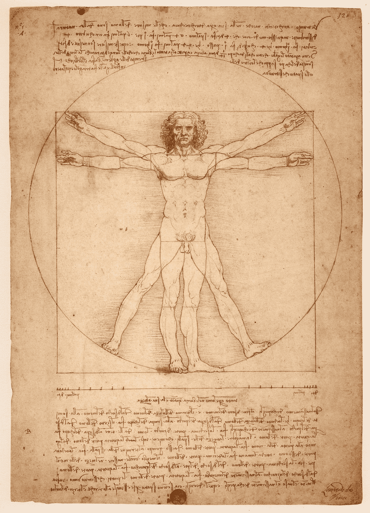

# 2020 年如何成为现代文艺复兴人

> 原文：<https://medium.datadriveninvestor.com/how-to-become-a-modern-renaissance-man-in-2020-b1bd694f1619?source=collection_archive---------0----------------------->

> 学习永远不会耗尽心智。
> 
> —莱昂纳多·达芬奇

我上次在意大利度假的时候，我们去了一个名叫芬奇的美丽小村庄。然而，不是风景，我喜爱的意大利食物，或橄榄树林是我们去那里的原因。达芬奇是著名的达芬奇的故乡。

列奥纳多·达·芬奇的成就不胜枚举。当我们走过博物馆时，我们惊讶地发现他不仅画了《最后的晚餐》和《蒙娜丽莎》,还研究了人体，设计了桥梁、飞行器，甚至机关枪。

达芬奇经常被描述为典型的文艺复兴时期的人和博学的人。根据[维基百科](https://en.wikipedia.org/wiki/Polymath)， *a* *博学者是一个知识跨越大量学科的人，以利用复杂的知识体系解决具体问题而闻名。*

文艺复兴时期的人是指生活在文艺复兴之前、期间或之后的伟大思想家。文艺复兴时期的人的目标是在生活中发挥他最大的潜力。为此，他们研究了各种各样的智力、艺术、社会、身体和精神主题。

 [## 教科书行业如何最终被颠覆，并将继续改变|数据驱动…

### 就此而言，教科书产业在美国乃至全世界都有着悠久的历史。事实上，他们已经…

www.datadriveninvestor.com](https://www.datadriveninvestor.com/2018/09/25/how-the-textbook-industry-has-finally-been-disrupted-and-will-continue-to-change/) 

但是今天你怎样才能成为一个多才多艺的人呢？

让我们来看看。

# 多才多艺的人喜欢学习

学习是成为一个文艺复兴人的核心。

但是学习不仅仅意味着像读书、看电视或听老师讲课这样的信息消费。

只有当你能在现实生活中应用知识，并能把它传授给你真正理解的人时，你才必须深入到表面之下，并完全掌握潜在的概念。

所以你可以遵循三个步骤:

1.  **高质量的投入:**如上所述，只消耗必要的投入，坚持最好的来源。
2.  **深入研究**:花时间思考一个概念，以及它与你已经知道的东西有什么关系。集中注意力，冥想，然后再集中注意力。这可以帮助你获得创造性的见解。
3.  实验:生产多于消费。如果你的第一步是错的，没有问题。重要的是你拿着它们。永远不要停止用新的方式做事。

你应该关注过程而不是结果。

每天至少花 30 分钟来练习你的手艺。

当你想成为作家时，写 300 字。

你想成为一名画家。画出那 30 分钟。

不要误解我。

我说的不是玩得开心。

那 30 分钟一定很难熬。

安德斯·埃里克森(Anders Ericsson)在他的著作 [*巅峰、*](https://amzn.to/307ScB6) 中谈到了刻意练习。刻意的练习必须有一个设定的目标，你必须在你目前能力的边缘训练，你需要得到快速的反馈。

如果你能像那样组织你的会议，你就在通往精通的路上。

Photo by [Robson Hatsukami Morgan](https://unsplash.com/@robsonhmorgan?utm_source=medium&utm_medium=referral) on [Unsplash](https://unsplash.com?utm_source=medium&utm_medium=referral)

# 一个多才多艺的人知道如何集中注意力和放松

在《T4》一书中，克里斯·贝利解释了大脑如何以两种模式运行。在聚焦模式和漫射模式下。两者都有自己的位置。

在专注模式下，我们可以把事情做好，并且富有成效。

这里有两个工具可以训练你的注意力:

*   冥想
    我专注于我的呼吸，感觉空气从我的鼻子进出。每当我的思绪游走，我就把它们带回呼吸。我开始每天这样做一分钟。我一感到舒服，就延长了疗程。目前，我每天做 10 分钟。
*   番茄工作法
    我设置了一个计时器，并严格专注于一项任务。我在旁边有一个笔记本，用来记下那些分散注意力但却很重要的想法。比如我忘记的生日或者杂货。我开始时集中注意力 10 分钟，然后休息 5 分钟。我进步到 30 分钟的专注和 5 分钟的休息。然后我冒险尝试了 60 分钟的集中注意力。效果很好，我决定停留在 60 分钟。

在扩散模式下，我们的大脑可以产生创造性的工作和深刻的见解。

你如何能进入漫射模式？

试着真正感到无聊。

出去走走，坐下来，什么也不做。能够忍受无聊并把它视为一个机会是一项没有人教我们的技能。

放松，让你的大脑工作。

# 文艺复兴时期的人对万金油

一个多才多艺的人或学者在许多方面都有天赋。

另一方面，什么都懂的人什么都不懂。

如果我们考虑到掌握任何东西都需要大约 10 000 小时的刻意练习，那么掌握许多领域似乎是不可能的。

不要因受教者而气馁。首先，这 10000 小时不是一成不变的。我们知道，如果我们达到心流状态，我们可以学得更快。

此外，知识建立在知识之上。就拿数学来说吧。莱昂纳多学习数学，然后将其应用于不同的领域。他将黄金比例融入绘画中，这影响了他对自然的看法。

不是追求完美，而是试图深入理解，这将使你结合几个领域，成为一个多才多艺的人。

文艺复兴时期的人应该关注哪些领域？

Photo by [Alexander Redl](https://unsplash.com/@alexanderredl?utm_source=medium&utm_medium=referral) on [Unsplash](https://unsplash.com?utm_source=medium&utm_medium=referral)

**开发你的身体**

我喜欢通过去健身房来塑造我的身体。当你脑海中有一幅自己理想身材的画面，随着时间的推移，你看到自己的身材越来越接近这个理想，这是一种不可思议的感觉。

不一定要在健身房。我也喜欢踢足球、越野滑雪和在大自然中散步。最好的运动是你想做的，并且能坚持下去的运动。

正如你在《维特鲁威人》这幅画中所看到的，列奥纳多对人体及其最佳发展非常着迷。

但不仅仅是你的外表。通过定期锻炼，你的能量水平会上升，甚至你的大脑也会受益。运动触发 BDNF 的释放；一种称为脑源性神经营养因子的蛋白质，与认知改善和抑郁焦虑的缓解有关。

为自己的身体发展设定目标。从小处着手，日积月累。

## 社会生活

城市经常让人生病，让人孤独。但它们也是一个熔炉，因此是创造力的源泉。作为一个多才多艺的人，你应该努力拥有充满活力的社交生活。这将让你与各种各样的人交流，并向他们学习。就像在城市里一样，这可以引发创造力的爆发。

提高你的对话技巧。最重要的规则是多听少说。人们喜欢谈论自己。如果你邀请他们这样做，他们会自动喜欢你。

## 成为艺术家

我们生来都有创造力。创造力是一种自我表达的行为。作为一个文艺复兴时期的人，如果你对科学感兴趣，没有必要回避艺术。学科之间没有分野。也许你最重要的科学见解会在你允许你的思想在绘画中漫游的时候出现。你不需要画下一幅蒙娜丽莎。从小事做起，选择你喜欢的事情，比如画画或演奏乐器。

## 旅行

这和拍最酷的 Instagram pic 没关系。一次旅行给你一个新的视角。一旦你看到其他人如何生活，他们做什么或不做什么，你就可以更好地质疑你的假设。追求质量胜于数量。与其奔波于一个又一个景点之间，不如花点时间和当地人交谈。建立新的联系和友谊，而不是照片。

# 文艺复兴时期的男人应该避免什么？

即使一个多才多艺的人很好奇，你也应该避免摊得太薄。不要一开始就一次处理太多的问题。相反，随着时间的推移慢慢加入它们。你不会在一个月内成为一个多才多艺的人。你必须做出长远的承诺。

# 外卖

2020 年成为文艺复兴人还是有可能的。尽管你能学到的技能种类更多，但基本原理是一样的。

学习新事物的强烈愿望和对生活永无止境的好奇心。

# **准备好变得无限吗？**

如果你想变得无限并大大加快你的学习速度，看看我的小抄:

[点击此处立即获取备忘单！](https://roadtolimitless.com/cheatsheet/)