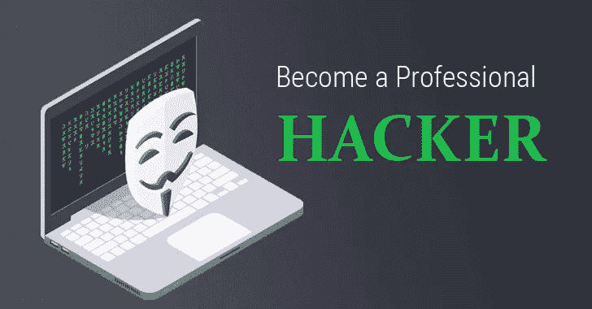
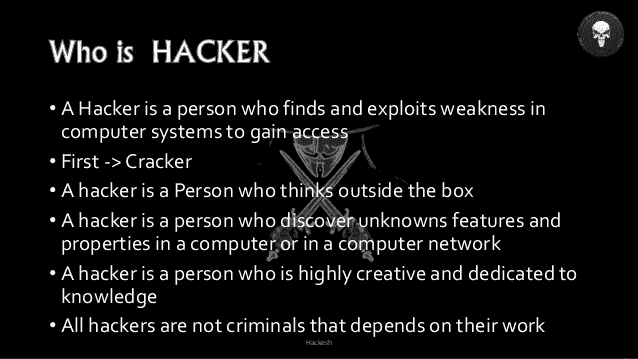
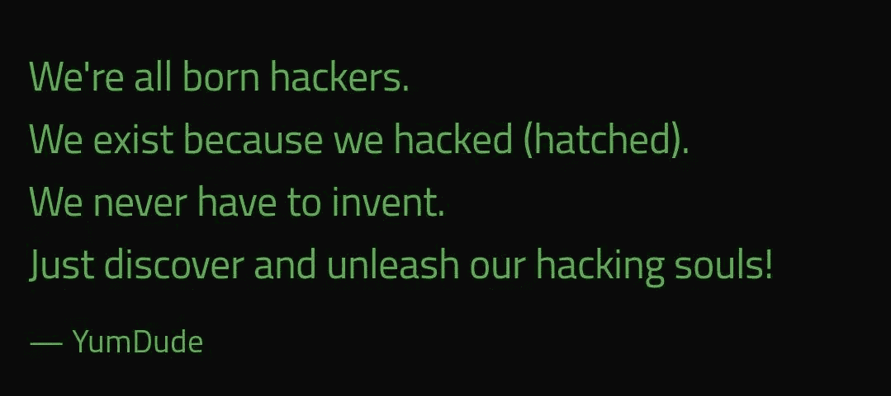
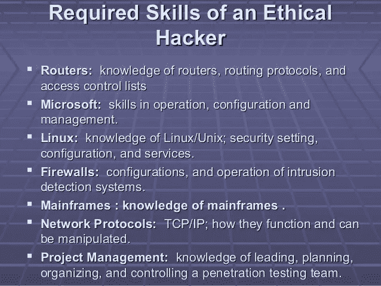

# 如何从零开始成为 2023 年的黑客？初学者指南

> 原文：<https://medium.datadriveninvestor.com/how-to-become-hacker-in-2020-from-zero-a-beginner-guide-f9dcce313e29?source=collection_archive---------1----------------------->

Photo by [Victoria Heath](https://unsplash.com/@vheath?utm_source=medium&utm_medium=referral) on [Unsplash](https://unsplash.com?utm_source=medium&utm_medium=referral)

How to become hacker in 2023 from Zero

**什么是黑客？**

黑客精神不仅限于软件的黑客文化。有人黑其他东西，比如电子和音乐——事实上，你可以在任何最高水平的科学和艺术中找到它。精通软件的黑客欣赏其他领域的同行，也称他们为黑客——一些人声称黑客本质上完全独立于他们工作的特定领域。但在这份文件中，我们关注的是软件黑客的技术和态度，以及创造了“黑客”一词的共享文化传统。

 [## 2019 年最值得学习的编码语言|数据驱动的投资者

### 在我读大学的那几年，我跳过了很多次夜游去学习 Java，希望有一天它能帮助我在…

www.datadriveninvestor.com](https://www.datadriveninvestor.com/2019/02/21/best-coding-languages-to-learn-in-2019/) 

一群人喊着自己是黑客，其实不是。他们(主要是青少年)是故意破坏计算机和电话系统的人。真正的黑客称这些人为“破解者”，不会鄙视他们。真正的黑客大多认为黑客懒惰不负责任，能力不大。专门破坏他人安全的行为不会让你成为黑客，就像用电线偷车不会让你成为汽车工程师一样。不幸的是，许多记者和作家经常把“黑客”误认为黑客；这种做法一直让真正的黑客很恼火。

根本区别在于**黑客做建设，黑客做破坏**。

如果你想成为一名黑客，请继续阅读。如果你想成为一名黑客，那就去看看 alt.2600 新闻组，在意识到自己没有想象中那么聪明后，去蹲五次或者十次监狱。关于黑客，我只想说这么多。

**一个黑客的态度**

黑客解决问题，建设东西，同时倡导免费无私的双向帮助。要被别人认可为黑客，你必须表现得好像你有这样的态度。而如果你想做到好像你有这个态度，你就要坚持下去。

但如果你认为培养黑客态度只是在黑客文化中获得认可的一种方式，那你就错了。成为这样一个拥有这些品质的人对你来说非常重要——帮助你学习，给你源源不断的动力。和所有创造性的艺术一样，成为大师最有效的方法是模仿大师的精神——不仅在智力上，而且在情感上。

或许，这首现代禅诗很好地说明了这一点:

要走这条路:

看着主人，

跟着师傅走，

与大师同行，

识破高手，

成为主人。

好吧，如果你想成为一名黑客，反复阅读以下内容，直到你相信为止。

**成为一名黑客需要哪些技能？**

**学习如何编程**

这当然是最基本的黑客技能。如果你还不懂任何编程语言，我建议你从 Python 开始。它有清晰的设计和完整的文档，适合初学者。这是一门很棒的入门语言，它不仅仅是一个玩具；它非常强大、灵活，适合大型项目。我有一篇 Python 评论详细介绍了这一点。Python 网站上有很好的教程。(译者:比较好的中文 Python 站点可能是[http://Python record . 51 . net)](http://pythonrecord.51.net.))

Java 也是很好的入门语言。它比 Python 难多了，但是生成的代码也快多了。它也是一种优秀的计算机语言，不仅仅是为了入门。

但是注意，如果你只会说一两种语言，你就达不到黑客所要求的技术水平，甚至达不到一个程序员的水平——你需要学会如何抽象地思考编程问题，独立于任何语言。要成为一个真正的黑客，你需要学会在几天内通读几本手册，结合你现在所知道的，快速掌握一门新的语言。这意味着你应该学习几种不同的语言。

如果你想做一些重要的编程，你将不得不学习 Unix 的核心语言 C。C ++和 C 很像；如果你理解了一个，学习另一个应该不难。但是这两个都不适合编程初学者。而且事实上，你越避免用 C 编程，你的效率就越高。

**2。获得一个开源 Unix，并学习使用和运行它**

是的，这个世界上除了 Unix 还有其他操作系统。但它们都是以二进制形式发布的——你无法读取它的源代码，也无法修改它。试图在运行 DOS、Windows 或 MacOS 的机器上学习黑客技术就像戴着脚镣跳舞。

另外，Unix 是互联网的操作系统。不懂 Unix 可以学会上网，但不懂 Unix 就成不了网络黑客。因此，今天的黑客文化很大程度上是以 Unix 为中心的。(事实并非总是如此。一些早期的黑客对此一直不满，但 Unix 与互联网的联系如此之强，连微软也无可奈何。)

所以，装一套 UNIX——我个人比较爱 Linux 但是也有其他种类(没错，可以在同一台电脑上同时安装 LINUX 和 DOS / Windows)。学习它，使用它，配置它。用它来上网。阅读它的源代码。修改它的源代码。你将获得比微软操作系统上更好的编程工具(包括 C、LISP、Python 和 Perl)。你会从中获得乐趣，学到更多你成为大师之前没有意识到的东西。

(注意:如果你是新手，我不建议你自己安装 Linux 或者 BSD。如果您正在安装 Linux，请向本地 Linux 用户组寻求帮助；或者联系开放项目网络。LISC 有一些 IRC 频道，你可以在那里获得帮助。)

**3。学习如何使用 WWW 和编写 HTML**

黑客文化构建的东西，大多在你看不到的地方发挥作用，帮助工厂、办公室、大学正常运转。对不是黑客的普通人的生活影响很难看到。网络是一个很大的例外。甚至政客们也认为这个超级耀眼的黑客玩具正在改变世界。仅仅因为这个原因(以及许多其他原因)，你需要学会掌握网络。

这不仅仅意味着如何使用浏览器(每个人都可以)，而是学习如何编写 HTML，一种 Web 标记语言。如果你不会编程，写 HTML 会教你一些思维习惯，对你学习有帮助。所以，先完成一个主页。(网上有很多不错的教程；这是一个。)

但是仅仅有一个主页并不能让你成为一个黑客。网络上充斥着各种各样的网页。大部分都是无意义、零信息的垃圾邮件——新潮的界面垃圾邮件。请注意，垃圾邮件的级别是相似的(有关更多信息，请访问 HTML Hell 页面)。

要想有价值，你的网页必须有内容——它必须有趣或者对其他黑客有帮助。这是下一个话题…

**4。不懂实用英语，就去学**

这是真的。大约在 1991 年，我了解到许多黑客在技术讨论中使用英语，即使他们的母语是相同的，英语对他们来说只是第二语言。据我所知的报道，目前英语的语种比其他语种多。更丰富的技术词汇，所以它是一个非常好的工作工具。出于类似的原因，英语技术书籍的翻译通常是不令人满意的(如果有的话)。

芬兰人 Linus Torvalds 用英语注释了他的代码(显然这对他来说不是巧合)。他流利的英语成为他管理全球 Linux 开发者社区的重要因素。这是一个值得学习的榜样。

**那么，作为一个小白，我该如何学习呢？**

**1。计算机是如何工作的**

要完成这部分基础学习，你有很多起点可以选择。你可以选择从经常使用电脑开始，也可以选择从明天开始学习编程语言。(这里注意:小白可能不懂哪些语言，容易混淆)，或者去一些论坛，或者买本书。有很多方法可以开始，就看你选择哪一种了。

我建议你从编程语言开始，一定要死。你不能放弃选择一门编程语言，你必须从头学到尾。这里不推荐语言，你可以慢慢学习选择一个你喜欢的。(我在理解的过程中不禁感到困惑，这很正常)

但这只是一部分，还有一部分硬件知识你可能需要了解。比如冯诺依曼结构是什么？作为一个小白，你可不能这么三心二意，先把前辈给你的东西学好，然后再拓展才是最安全的。

计算机众所周知是软件+硬件的机器，其中硬件是赛道，软件是跑车，跑车在赛道上运行形成多种数据样式。这是一个形象化的例子，和真实的硬件软件不一样，但是为了理解它，需要放弃前期的精密。

以上我的建议是从编程开始学起。从更大的角度来说，就是从软件入手，因为硬件已经设计好了，和你的电脑操作关系不大。懂硬件的人不一定会操作电脑。很棒，因为你的目的是黑客，是控制计算机的工作，而不是构造计算机，所以软件优先于硬件。

所以，去找个编程语言，死一个，绝对死一个。(我指的是想成为黑客大神的人。如果你的目标是做一个小的入侵，了解计算机的基本工作流程，没有(必要)，学完一门语言你会提高很多，然后当你头脑清晰的时候，你就会明白我今天在说什么。至于学什么语言，我之前说过不能推荐，必须自己摸索。

**2。计算机网络基础**

当你能用一种语言编程时，你就对计算机的工作原理有了深刻的理解。电脑上运行的任何软件和程序(如何运行，为什么能运行？这些潜在的问题都是在学习的过程中会很容易解决的，这时记住你的问题边界，不要太扩大问题边界)，一些安装包什么的，你都明白它在做什么。

那么就很容易学会所有软件程序中的一套“网络协议”。

网络协议的本质是一个程序，它的功能是允许计算机相互通信，以及安全地通信。