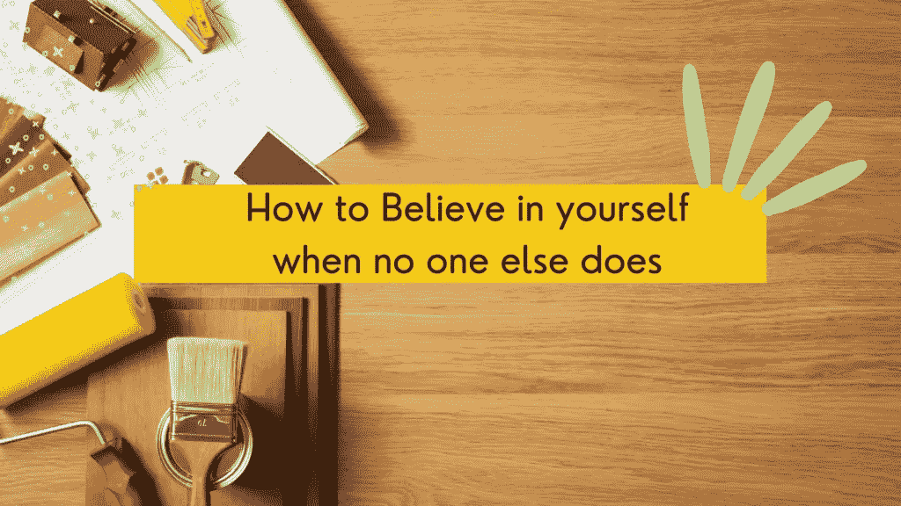
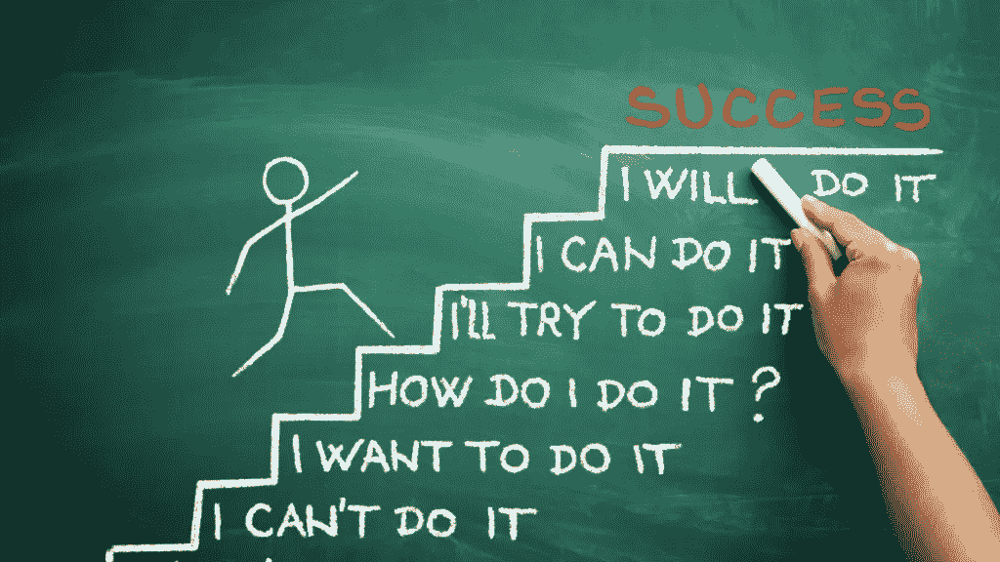

# 当别人都不相信自己时，如何相信自己

> 原文：<https://medium.datadriveninvestor.com/how-to-believe-in-yourself-when-no-one-else-does-a1bf2b2f01ec?source=collection_archive---------3----------------------->

canva.com user-edited photo

相信自己是走向伟大的第一步。如果你不这样做，你的人生将一事无成。相信自己是建立任何成功企业和实现梦想的最重要的基石之一，所以有能力消除你对自己的任何怀疑，并开始培养你内心缺乏的自信和信心，这是决定你成功的一个重要因素。

> 如果你不相信自己，还有谁会相信你呢？因为有些人会拒绝相信你，会告诉你你将一事无成，除非你证明他们是错的，并真的相信你能。不要指望别人总是把你举起来，你不能指望靠着别人的肩膀有所成就。你必须是唯一一个对你的梦想负责的人。

认为一切皆有可能，因为你相信你会实现你一直渴望的一切，因为如果你不相信它会发生，任何事情都不会创造奇迹，如果你不相信你可能实现它并使它发生，甚至你的目标和梦想也不可能实现。

> 请记住，仅仅是对自己的简单信念就能让你的日常生活发生巨大的变化。

话虽如此，如果你一直怀疑自己，那么你有多有才华或者你的想法与别人有多大不同都没有关系。这么说吧，即使你有真正相信你的朋友，仍然没有人能鼓励你去追求你不想追求的东西，特别是如果你缺乏实现梦想所必需的信心或自信，因为即使他们试图说你可以做到，他们鼓励你去做，如果你没有你应该首先拥有的信念，你甚至永远不会尝试和追求它。

> 通过尝试和学习如何相信自己，它将会打开无限的可能性，让你的生活变得更好。

我知道有些时候我们发现很难做到，因为我们一直怀疑自己，但你知道吗，这背后的主要原因是我们还没有发展和提高我们的自信心？还是因为我们总是质疑我们的能力，这让我们带走了我们自己仅存的信念？好吧，一旦我们练习面对我们的恐惧，摆脱我们心中的疑虑，我们就在训练自己增强自尊，发展自信。一旦我们做到了这一点，我们就离实现梦想更近了一步。

记住这一点，**以下是学习如何相信自己并取得巨大成就的最重要步骤**

canva.com user-free photo

**1。积极思考——消极的想法会阻碍我们的成功。尽可能避免过度思考消极的事情，开始关注积极的事情，因为消极的想法会限制你成功和变得更好的潜力。这只会让你更加沮丧和怀疑自己，那么还有什么比用更有力量的信念取代这种想法更好的改变方式呢，你会开始看到自信和自尊的提升**

**2。运用吸引力法则—** 通过吸引你身上的积极能量来获得生活中的成功。展现美好的事物，并相信你会得到它，因为你越是吸引和展现生活中更伟大的事物，它就越会吸引你去实现它。当他们说“同类相吸”时，这肯定意味着无论你吸引到什么能量，无论是积极的还是消极的，那都是你在生活中会吸引到的。

**3。从错误中学习——“跌倒 7 次，站起来 8 次”，你站起来多少次，你就只能跌倒多少次。所以每次你在生活中犯了一个错误，或者你经历了生活中的失败，不要让它阻止你再次相信自己，实现你想要的目标，相反，把你的错误作为成功的垫脚石，因为犯错误是学习过程中正常的一部分。不要因为失败过一次就不相信自己，这不是世界末日，你只需要认为每件事的发生都是有原因的，并把它作为学习曲线。**

**4。不要让恐惧阻止你——除非你停止恐惧，并朝着你的梦想采取行动，否则生活中不会发生任何事情。如果你总是怀疑自己，害怕采取行动去实现你的梦想，你只是在向自己证明你没有你应该拥有的信念。树立你的自尊，不要害怕。相信你的能力，一切都会好的。**

**5。不要把自己局限在你认为自己能做的事情上——走出你的舒适区。不要停滞不前，因为你认为你现在缺乏追求你想要的东西的能力。有些不如你的人做着他们热爱的事情，因为他们相信自己，所以你也应该这样。如果他们能做到，你凭什么认为你做不到？只要你愿意付出努力，并付诸行动去实现它，就可以有远大的梦想。毕竟，唯一限制你的是你的心态和对自己缺乏信心。**

~~~~~~~~~~~~~~~~~~~~~~~~~~~~~~~~~~~~~~~

**如果错过了我们之前的文章，可以点击下面这些链接阅读；**

 [## 培养创新思维的 7 个好习惯

### 创新是能够做别人从未想过要做的事情，以前从未做过的事情，或者…

medium.com](https://medium.com/the-innovation/7-good-habits-to-do-to-develop-an-innovative-mindset-413849330446)  [## 5 种方法将帮助你停止过于自我批评(如何处理…

### 你有没有发现自己一直在批评自己的所作所为，因为持续的…

medium.com](https://medium.com/the-innovation/5-ways-that-will-help-you-stop-yourself-from-being-too-self-critical-how-to-deal-with-ac6bce17d47)  [## 让生活变得更有条理的 10 个日常习惯

### 变得有条理对很多人都有好处，这是每个人都应该学习和实践的习惯。所以即使…

medium.com](https://medium.com/the-innovation/10-habits-to-do-every-day-to-become-more-organized-in-life-98b8508373ee)  [## 通过这 7 个步骤吸引生活中的富足和成功

### 只要你继续做最真实的自己，在生活中吸引富足和成功是你力所能及的

medium.com](https://medium.com/the-innovation/attract-abundance-and-success-in-life-through-these-7-steps-64565dca4cbe)