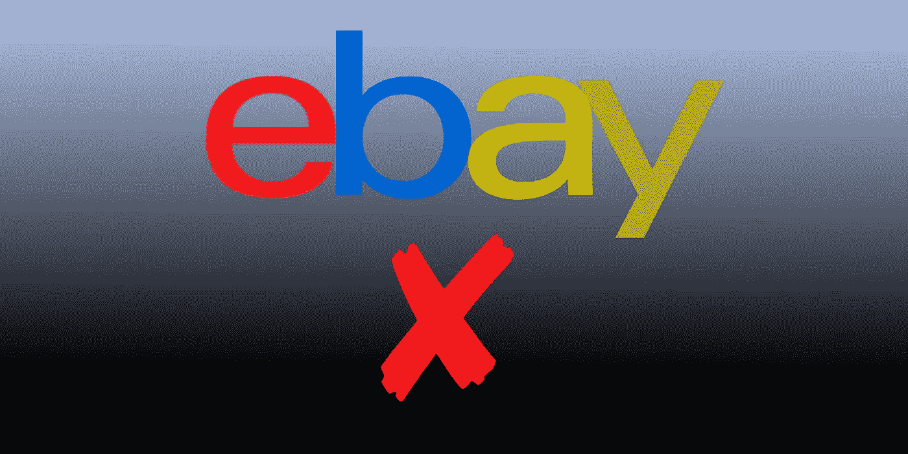
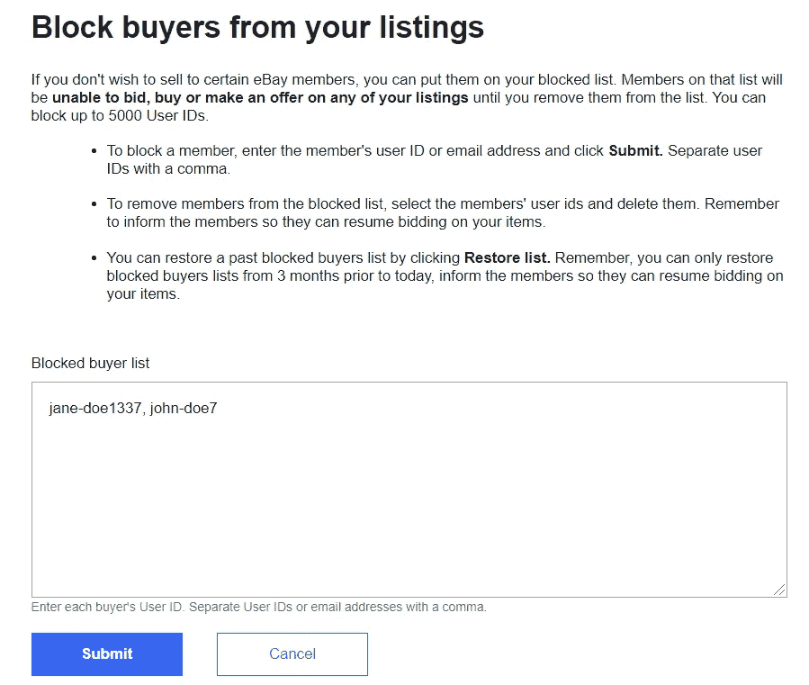
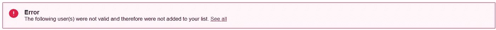
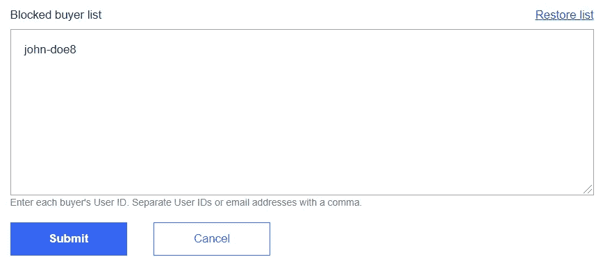

# 如何在易贝通过用户名或电子邮件地址阻止买家

> 原文：<https://medium.datadriveninvestor.com/how-to-block-buyers-by-username-on-ebay-729504184dc4?source=collection_archive---------22----------------------->

在易贝，你可能会遇到一些你不愿意与之打交道的买家，原因可能是你自己的负面经历，也可能是别人的负面经历。

在这种情况下，你可能需要阻止某些用户名，这样他们就不能投标或购买你的物品。

幸运的是，易贝有这样的功能，你可以插入用户名被阻止；他们说，“名单上的成员将无法对你的任何物品进行投标、购买或出价，直到你将他们从名单上删除。”

易贝允许多达 5000 个用户名添加到这个列表中——希望你不需要更多。

# 链接到易贝阻止买家

要阻止易贝、[上的买家，请点击此链接](https://www.ebay.com/bmgt/BuyerBlock?)。

Perhaps the Does are problematic.

用户 id 应该用逗号分隔。此外，您可以选择阻止某些电子邮件地址。

# 如何确保 id 是正确的

易贝将检查其用户数据库，以查看 id 是否有效。否则，它将显示以下错误消息:

# 如何恢复以前的列表

易贝说“你可以通过点击**恢复列表**来恢复过去被阻止的买家列表。请记住，你只能恢复 3 个月前被封锁的买家名单，并通知会员，让他们恢复对你物品的出价。」

# 如何解锁买家

就像从黑名单中删除买家的用户名和/或电子邮件一样简单。

 [## 取代你的风投？企业家的 5 条原则|数据驱动的投资者

### 在 Tau Ventures，我们建议所有企业家将融资过程中的勤奋过程视为双向的…

www.datadriveninvestor.com](https://www.datadriveninvestor.com/2020/11/29/replacing-your-vc-5-principles-for-entrepreneurs/) 

**访问专家视图—** [**订阅 DDI 英特尔**](https://datadriveninvestor.com/ddi-intel)

 [## 通过我的推荐链接加入媒体

### 作为一个媒体会员，你的会员费的一部分会给你阅读的作家，你可以完全接触到每一个故事…

tremaineeto.medium.com](https://tremaineeto.medium.com/membership)