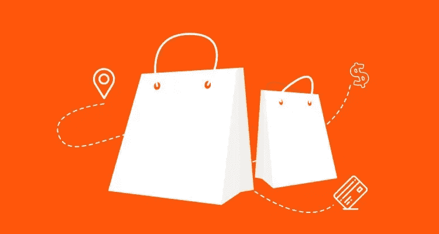
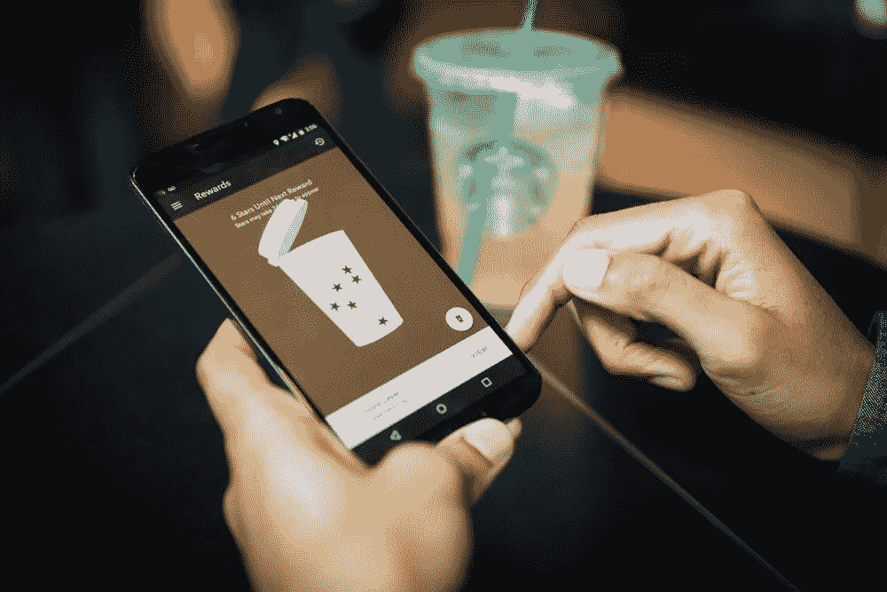
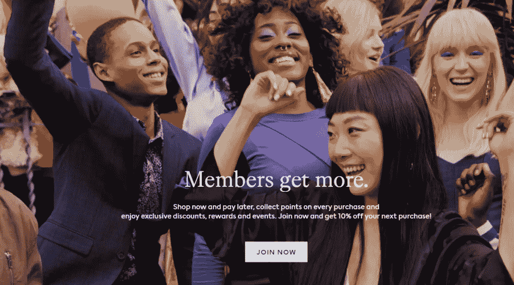
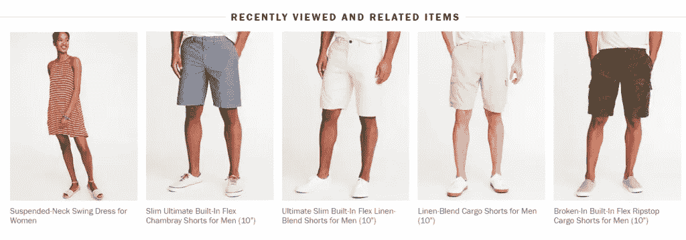
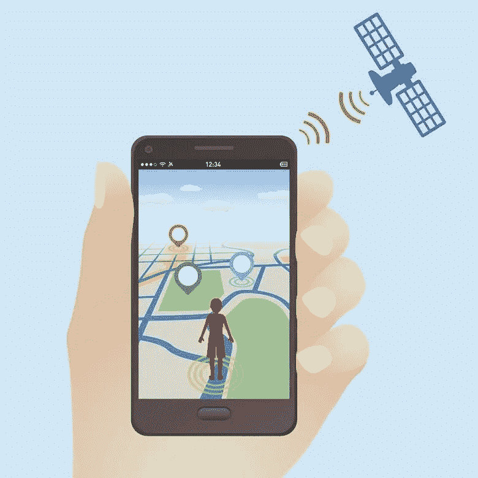
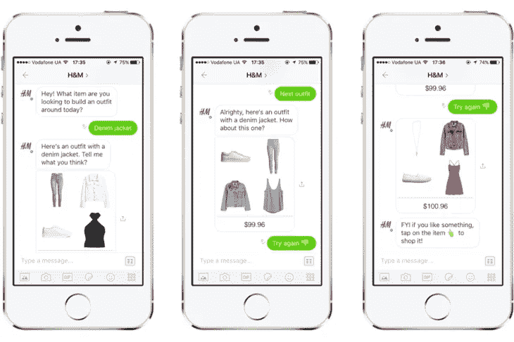
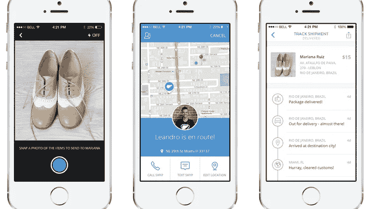
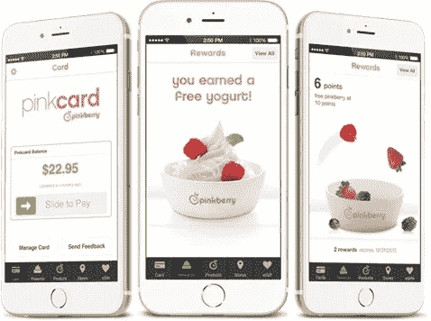
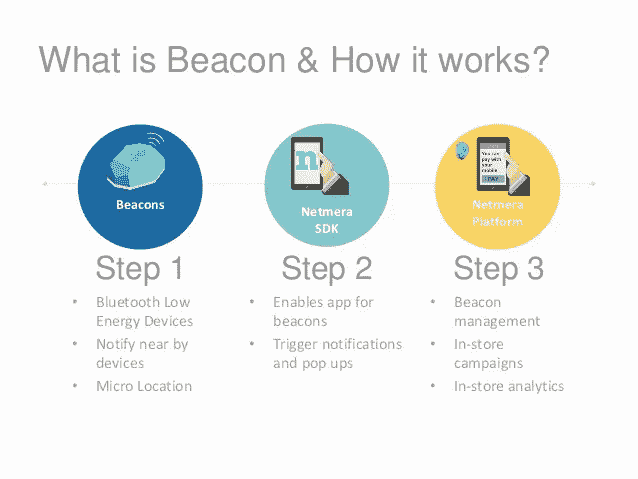

# 如何提升您的电子商务移动应用——zes ium

> 原文：<https://medium.datadriveninvestor.com/how-to-boost-your-ecommerce-mobile-app-zesium-86458c74bcbe?source=collection_archive---------19----------------------->

上一次[我写了关于](https://zesium.com/10-top-tips-for-developing-an-ecommerce-mobile-app/)每个电子商务应用**必须具备的顶级功能**，但是现在让我们来探索可以帮助你的电子商务应用获得相对于其他应用的竞争优势的功能。

你可能以前听说过这些功能，但如果在电子商务移动应用程序中实现，你可能不会意识到它们的潜力。

看看一些可以帮助你的手机应用获得更多人气的功能。

# 增强现实

增强现实 [(AR](https://en.wikipedia.org/wiki/Augmented_reality) )和虚拟现实( [VR](https://en.wikipedia.org/wiki/Virtual_reality) )已经稳步成为移动开发的一部分。如果你想让你的电子商务应用在你的零售业务中有所作为，你应该考虑这些技术。

AR 是指使用移动设备将虚拟对象叠加到现实世界的物品上。随着苹果和谷歌发布增强现实内容开发的个人框架，这些技术已经成为主流。

 [## 人工智能和虚拟现实的融合-你能期待什么|数据驱动的投资者

### 在技术领域，融合是合乎逻辑的一步。就在几十年前，你可能需要一个专门的…

www.datadriveninvestor.com](https://www.datadriveninvestor.com/2018/08/30/the-convergence-of-ai-rv-what-you-can-expect/) 

[使用 AR](http://zesium.com/powerful-augmented-reality-in-mobile/) 可以让你更好地展示你的产品，并唤起用户进一步参与你的应用。用户可以从不同的角度查看您的产品，这可以确保您的用户对他们选择的产品感到满意，并降低流失率。

Source: veeqo.com

如果你想超越标准，变得更具创新性，可以考虑在你的移动应用中加入虚拟现实。

例如，如果你提供一些服装项目，VR 将帮助消费者检查衣服是否合身或穿着如何。同样的事情也可以适用于许多类型的零售店，不管你卖的是衣服、太阳镜、帽子等等。

Source: ikea.com

AR 和 VR 让你有机会在现实生活背景下向客户展示你的产品。一些很好的例子是[宜家](https://www.youtube.com/watch?v=vDNzTasuYEw)和[丝芙兰](https://sephoravirtualartist.com/landing_5.0.php?country=US&lang=en&x=&skintone=&currentModel=)。

这些技术为用户提供了试用体验——它消除了用户的任何困惑，现实生活中的互动让用户有机会做出有意识的决定。

# 游戏化

[游戏化](https://en.wikipedia.org/wiki/Gamification)是一个添加类似游戏的元素，如点数、分数等的过程。教育或电子商务等非游戏环境。

通过[在你的电子商务应用中使用游戏化](http://zesium.com/gamification-in-mobile-apps/)，你创造了一个故事，用户可以赢得忠诚度积分，完成预先设定的里程碑，分享他们的成就等等。游戏化增加了回头客的机会，他们也会在未来使用你的应用进行购买。

Source: starbucks.com

如今，参与对任何企业的成功都是最重要的，更不用说电子商务了——这就是游戏化派上用场的地方。这有助于提高口碑，增加你的客户忠诚度和保留率。

H&M 将这样的想法发展到了 [H & M 俱乐部](https://www2.hm.com/en_gb/member/info.html)——故事是这样的:

*成为会员并在加入时获得 10%的折扣，无限免费送货，在所有或部分购买中赢取积分并获得专属折扣*。

H & M 更进一步，增加了一些个性化功能，如在用户生日当天享受 25%的折扣，提前获得精选系列等等。

在电子商务中获得流行很难，但如果有合适的工具、技术和一个优秀的开发团队，这并非不可能。

# 推荐系统

推荐系统是一种信息过滤系统，它分析用户行为以展示个性化的消息、内容或建议。

此功能有助于您吸引客户并提高交叉销售。这类似于体验亚马逊等顶级电子商务应用程序，其中该算法使用[机器学习](https://en.wikipedia.org/wiki/Machine_learning) (ML)来帮助应用程序学习用户的偏好并显示相关产品。

有不同类型的推荐系统:

*   **协同过滤**:类似于 Linkedin 或脸书，你可以根据相互联系或相似的人口统计和/或行为得到朋友建议。它很有效，但需要大量的客户数据(许多用户)
*   **基于内容的过滤**:基于客户的喜好，因为每个项目都带有某些属性或一个关键词。如果特征匹配用户的简档，则推荐项目。它的效率较低，因为不容易将属性附加到项目上，并且推荐可能会变得模糊。
*   **混合车型**:是前两种类型的结合。通过结合这两种方法，您可以享受两者的好处，而不必处理缺点。一个例子是[网飞](https://www.netflix.com/)用这种方法赢得了许多忠实用户。

如果你使用一个[推荐系统](https://towardsdatascience.com/how-to-build-a-recommendation-engine-quick-and-simple-aec8c71a823e)，你可以向消费者提供个性化的建议，并提高目录的可见性——这类似于实体店，那里的销售人员了解买家在寻找什么，并只展示首选产品。

Source: oldnavy.gap.com

在应用程序中寻找其他商品的客户将利用这些推荐来获得符合他们需求的产品，从而快速完成购买。

推荐系统可以给你带来一定程度的用户信任，从而使他们成为长期客户，这对每个企业都是必不可少的，不仅仅是电子商务。

# 地理围栏

[地理围栏](https://en.wikipedia.org/wiki/Geo-fence)是一项支持基于位置的营销的技术。

地理围栏可以是品牌应用程序的另一个有价值的元素，可以增强产品浏览和购物的体验。

您的手机应用程序可以使用 [GPS](https://en.wikipedia.org/wiki/Global_Positioning_System) 、 [RFID](https://en.wikipedia.org/wiki/Radio-frequency_identification) 、[蓝牙信标](https://en.wikipedia.org/wiki/Bluetooth_low_energy_beacon)等。让你的应用程序识别用户的位置。

使用地理围栏，您可以根据用户的位置向他们发送定制的营销消息。例如，您可以在用户进入市场的同时发送促销信息。这将确保你利用时机，引导用户的购买意图对你有利。

地理围栏可以自动检测用户在哪个商店，并根据他们的位置向他们提供通往特定产品的地图。这种技术可以帮助企业在以后重新定位客户。

如果顾客在其中一家商店尝试某件商品，地理定位功能可以帮助零售商使用这些数据，并发送相关的电子邮件或产品报价，从而将线下和线上的品牌沟通联系起来。

Source: econsultancy.com

请记住，虽然地理围栏自动要求访问位置数据的权限，但并非所有用户都知道他们做了什么。对你的企业来说，充分说明你使用数据的原因和方式是至关重要的，以便向用户解释，特别是在那些适用严格数据法规的国家，如 [GDPR](https://en.wikipedia.org/wiki/General_Data_Protection_Regulation) (通用数据保护法规)。

这项技术非常受欢迎，可能是你的电子商务移动应用程序的一个好主意。

# 移动云计算

移动云计算是云计算和移动计算的结合，提供更好的用户体验。

其中一个例子是，云引擎减少了服务器响应时间，从而提高了移动应用程序的速度。

您的业务预计会在未来增长，因此随着业务的增长进行扩展至关重要。移动云计算为您的业务需求提供了可扩展的结构-它允许您根据需求、流量或季节性高峰来扩展或缩减服务。

例如，虽然流量的突然增加会降低网站的速度，但云计算为你提供了更大的带宽、能力和存储。

Source: newgenapps.com

由于电子商务业务在很大程度上依赖于其客户的数据，因此明智的做法是使用基于云的结构，因为它们具有事故容忍度——它可以防止您的业务数据丢失，并保持数据安全、备份和易于访问。

通过使用移动云计算，你可以确保你的应用程序既有质量又有性能。

# 聊天机器人

[聊天机器人](https://en.wikipedia.org/wiki/Chatbot)是在适当的环境下能够理解人类输入并提供对用户有帮助的输出的程序。

聊天机器人使用 NLP ( [自然语言处理](https://en.wikipedia.org/wiki/Natural_language_processing))来理解用户查询背后的上下文，并相应地提供最合适的结果。

在机器人的帮助下，客户可以询问购买建议、支付流程、提出问题或找到想要的产品等。

Source: rubygarage.org

拥有聊天机器人的好处是巨大的——聊天机器人需要少量的开发和维护投资，允许用户获得即时帮助，而无需他们在帮助热线上排很长的队。

聊天机器人提供了更好的参与——它们擅长在任何时候就某个主题给出建议，而人们不可能一周 7 天 24 小时工作。结果是，无论客户何时需要，我们都能为他们提供服务。

个性化也很重要——尽管你网站上的 FAQ 可以提供一些答案，但聊天机器人可以立即回答你客户的查询，并在事后帮助他们提供个性化的建议。

# 多种运输方式

你应该为你的消费者提供更好的运输方式选择。

人们喜欢根据自己的个人需求送货上门。例如，如果一个客户只希望送货到他们的邮政信箱地址，那么你应该有这个选项。

允许用户从各种送货选项中进行选择，并让他们轻松地添加送货地址，这将在你的电子商务移动应用程序中创造积极的用户体验。

不同的可用运输方式是必须具备的，这将是实用的，用户可以显示每种方式的成本以及每个选项的预计交付时间。

Source: quora.com

如果你从开发 MVP 开始，你可以从一个简单的选项开始，让用户向你的商店订购一件商品，一旦应用程序受到欢迎，你可以升级这个功能并添加新的选项。

另一个很好的特性是可以方便地检查订购商品的运输状态。这将有助于增加透明度，提高顾客在完成购买后与你的商店互动的质量。

Source: [spaceotechnologies.com](https://www.spaceotechnologies.com/)

用户喜欢了解他们在线购物的详细信息，因此该功能将帮助他们确切了解他们订购的商品的情况。

# 忠诚度计划

客户在移动应用上花费的时间比在移动网站上多 3-4 个小时，一项研究表明，与通过移动设备访问您网站的购物者相比，移动应用用户在 30 天内返回您的移动应用的可能性是两倍。

决定下载你的移动应用程序的人最初会对你的品牌表现出更高的投资水平。除了目前许多商店提供的定期促销和 VIP 会员独享产品外，您还可以让用户选择通过您的移动应用程序收集积分和赢得折扣——通过特殊的忠诚度计划提升忠诚度[是明智之举。](https://www.devteam.space/blog/how-to-build-a-loyalty-program-app/)

Source: devteam.space

如果您的客户愿意，您可以轻松通知他们即将举办的活动、独家折扣和奖励。您还可以使用该应用程序向用户分发促销代码，激励他们下载和使用该应用程序。

提供特别的促销和折扣，让用户购买更简单，这将改善用户体验，增加销售额，因为你会提醒你的客户定期购买。

# 额外功能

除了上面提到的电子商务应用程序的附加功能，还有一些额外的可选功能，但可以添加这些功能来促进您的销售:

*   **推送通知** —发送个性化消息和优惠
*   **信标**——为每位客户提供更好的个性化推送通知，为他们提供独家交易
*   杂志——一个关于最新行业趋势的应用内博客
*   **商店定位器** —轻松找到附近的实体店。

Source: slideshare.net

# 一锤定音

电子商务移动应用程序开发过程充满了挑战，因为你试图将大量内容压缩到小屏幕上，这需要做出一定的妥协。

你应该致力于为你的用户创造一个从选择产品到最终购买的顺畅流程。该过程需要快速、直观和透明，并应鼓励客户完成购买。

你的品牌需要脱颖而出，因为让购物者立即认识到你的品牌是相关的，这一点很重要。

> 给你的电子商务应用添加一些额外的功能可以帮助你的品牌被认可，你的应用获得更多的欢迎。

*原载于 2020 年 2 月 25 日*[*【https://zesium.com】*](https://zesium.com/how-to-boost-your-ecommerce-mobile-app/)*。*

通过以下链接安排与[**Maja Dakic**](https://app.ddichat.com/experts/maja-dakic)**的 DDIChat 会话。**

** [## 马贾达基奇-迪迪恰特

### 技术行业(软件、移动应用、物联网、人工智能等)的资深作家。)以及在…

app.ddichat.com](https://app.ddichat.com/experts/maja-dakic)**