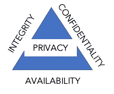
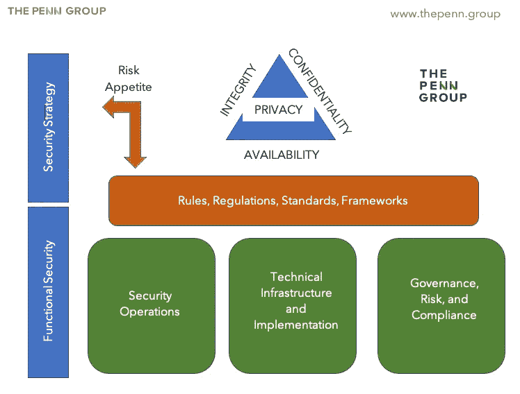
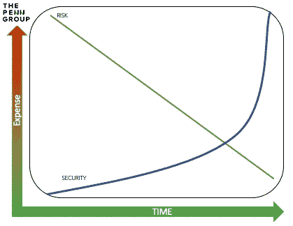

# 如何建立网络安全计划

> 原文：<https://medium.datadriveninvestor.com/how-to-build-a-cybersecurity-program-213b61810efe?source=collection_archive---------10----------------------->

了解如何建立从网络安全战略到战术技术安全的网络安全计划。

Build a cybersecurity program.

在当今的信息技术环境下，建立一个网络安全计划是一个有趣的挑战。作为[佩恩集团](http://www.thepenn.group)的[总裁&首席执行官](https://www.linkedin.com/in/austin-harman-7040199a/)，构建一个经济高效、健壮、敏捷的信息安全计划是我的公司咨询的核心课题之一。网络安全是安全团队的职能，是一项极其复杂的工作。在业务环境中，网络安全的职能大部分时间是一项监督活动。如果没有管理层的认可，网络安全项目将毫无进展。尽管如此复杂，安全计划的高尚是显而易见的。有了有效的网络安全计划，您就站在了保护客户甚至他们生命的第一线。在本文中，我将带您构建一个网络安全程序。

# 什么是网络安全计划？

The Security Triad

网络安全计划必须非常灵活，但必须有强大的治理来指导组织。建立网络安全计划需要时间、奉献精神、合适的团队和领导层的认同才能取得成功。一个成功的网络安全计划可以降低组织的风险，通过减少事故威胁来节省公司的资金，并提高组织的弹性。网络安全计划的作用是确保信息技术的保密性、完整性和可用性。这被称为安全三元组，多年来一直是网络安全功能描述的黄金标准。然而，最近几年，中情局的三位一体已经增加了额外的功能，如隐私和不可否认性。最终，这些额外的功能仍然以某种方式积累到中情局的三位一体中。

# 安全程序的功能职责

中央情报局三元组很好地描述了安全职能部门的职责，但是将中央情报局转化为安全计划并不是一个简单的比较。实际上，安全计划必须实现系统的可见性、技术基础设施的治理和控制的管理。

The foundation of a cybersecurity program

让我们从分解这个图形开始。首先，[CIA 三位一体结合规则、法规、标准和框架](https://medium.com/datadriveninvestor/why-does-cybersecurity-matter-83ecc9968535)定义了组织的安全策略。

# 网络安全战略

在战略层面，网络安全战略的第一个组成部分是组织的风险偏好。风险偏好就像是安全的使命宣言。基本上，这是一个帮助指导组织愿意接受的风险水平的陈述。例如:在银行的环境中，风险偏好声明会声明，由于客户数据丢失会给银行的客户带来巨大的财务风险，因此组织愿意接受的风险级别较低。相反，拥有少量信息技术资产和数据的非营利组织可能愿意接受更多的风险。

The inverse relationship to cost/risk.

风险承受能力和成本成反比。风险容忍度越低，安全计划的成本就越高。然而，这是一把双刃剑，因为网络罪犯并不关心您的风险陈述。他们会不顾一切地攻击你。如果你由于安全倾向而没有在网络安全上投入足够的资金，那么收回成本可能会超过最初的安全投资。

> 网络罪犯不在乎你的风险陈述。他们会不顾一切地攻击你。

# 领导力买入

底线很简单:如果你的领导没有参与到你的安全计划中，想象一下如果你有一个漏洞，他们会做什么。他们会递给你一个盒子，祝你一切顺利。

> 一个事件发生后的指责，总会落在领导身上。

获得高管团队的认同可能是一项艰巨的任务，尤其是如果你的组织历来抵制变革的话。根据我们在 Penn Group 的经验，让高管买入并不是为了消除恐惧，而是为了建立信任。通常，证券在出售时会有令人瞠目结舌的数百万美元的损失。这种方法的问题是，随着时间的推移，高管们会对统计数据产生兴趣，并将这些数据解读为散布恐慌。这并不是说你应该忽视事实。安全统计有助于讲述安全程序的故事。他们不应该成为故事的主角。

 [## 当网络安全出现问题时

### 如果网络罪犯进入您的网络，实际上会发生什么？

medium.com](https://medium.com/datadriveninvestor/when-cybersecurity-goes-wrong-cf65f3254221) 

# 法规、标准和合规性

法规、标准和遵从性要求因行业而异，但在法律上必须满足一些非常具体的安全要求。在努力争取管理层的认同时，收集一份您必须满足的安全要求列表。由于违规会导致不同程度的罚款和后果，这可能是吸引您的安全计划的有效方法。值得注意的是，将合规性作为一种策略是一种被误导的方法。对法规遵从性的追求几乎总是导致组织优先考虑所谓的“复选框安全性”。复选框安全是指完成安全活动只是为了说明/记录已经完成，而不是为了特定的安全需要。

# 持续报告

一旦您获得了领导的认可，持续讲述安全故事就变得至关重要。通常，报告有关入侵尝试、被阻止的 IP、事件报告和行业趋势的统计数据与最初的买入同样重要。否则，在组织内其他地方投资的压力可能会剥夺安全团队的关键资源。通常，季度报告在传达安全主题方面往往是有效的。在犯罪活动上升期间，可能需要更频繁的报告。

# 功能安全性

战略安全围绕着风险、合规性和审计的管理。网络罪犯不关心您的审计部门或您的安全预算。对于每一个网络安全项目，都有一部分活动是完全技术性的，而大部分活动是管理性的。任何信息安全计划的挑战都是需要大规模地执行技术安全。锁定单个工作站或 web 服务器免受攻击是相当简单的。这个过程可能需要 30 分钟到几个小时，最后你会得到一个坚固的盒子。当您的 IT 资产库存数以千计时，管理规模变得极其困难或不可能。[由于安全人才已经有限](https://medium.com/datadriveninvestor/why-is-it-so-hard-to-hire-great-security-talent-654e62e2fab6)，替代方案是转向自动化和简化。

在最简单的形式下，技术安全应实现以下目标:

1)系统的最大可见性，能够响应事件。

2)信息系统架构和资产得到强化和验证。

3)经过性能优化的灵活技术体系。

 [## 信息安全咨询服务-

### 信息安全咨询是一个广泛的主题，需要关键的亲密知识，以抵御网络…

thepenn 集团](https://thepenn.group/solutions/information-security-consulting-services/) 

# 安全治理

最大化您对系统的可见性、强化您的架构和资产以及技术灵活性是技术安全的基础。实现这些看似简单的目标的挑战是管理和验证这些目标。仅仅做信息安全是不够的。你必须证明你已经达到了足够的水平(合规性)，甚至是更高的水平(规则/框架)。治理、风险和法规遵从性，通常缩写为 GRC，是您的网络安全计划的功能管理。

# 构建治理、风险和法规遵从性计划

构建 GRC 计划从组织领导层的策略定义开始。策略使组织承诺做某事。过程解释了组织期望如何完成规则。程序在基本层面上解释了如何执行该过程。

 [## 如何起草信息安全政策-

### 任何信息安全团队都会发现自己处于的最糟糕的情况之一是发现大规模的安全…

thepenn 集团](https://thepenn.group/blog/cybersecurity/how-to-draft-an-information-security-policy/) 

# 安全框架

安全框架是构建信息安全治理计划的重要基础。在美国，大多数大型企业组织都使用 NIST 网络安全框架。

以下是一些对行业有用的附加框架:

- [NIST CSF](https://en.wikipedia.org/wiki/NIST_Cybersecurity_Framework)

-[NIST 800–53](https://nvd.nist.gov/800-53)

-[NIST 800–37](https://csrc.nist.gov/publications/detail/sp/800-37/rev-2/final)

——[GDPR](https://en.wikipedia.org/wiki/General_Data_Protection_Regulation)

——[CCPA](https://en.wikipedia.org/wiki/California_Consumer_Privacy_Act)

——[ISO 27000](https://www.27000.org/)

对于金融服务业

- [FFIEC 考试手册](https://www.ffiec.gov/cyberassessmenttool.htm)

——[GLBA](https://en.wikipedia.org/wiki/Gramm%E2%80%93Leach%E2%80%93Bliley_Act)

——[NYCS](https://www.dfs.ny.gov/industry_guidance/cybersecurity)

对于医疗保健行业

- [HIPAA](https://www.hhs.gov/hipaa/for-professionals/security/guidance/cybersecurity/index.html)

对于能源部门

- [能源部门网络安全框架实施](https://www.energy.gov/sites/prod/files/2015/01/f19/Energy%20Sector%20Cybersecurity%20Framework%20Implementation%20Guidance_FINAL_01-05-15.pdf)

 [## 针对治理、风险和法规遵从性的计划评估服务-

### 该网站使用 cookies 来改善您的体验。我们假设您对此没有意见，但是如果您…

thepenn 集团](https://thepenn.group/solutions/program-assessment-services-grc/) 

# 摘要

虽然框架很重要，并且有助于开发信息安全计划，但活动必须符合您的风险偏好和组织的网络安全策略。你必须得到领导的认可，并仔细起草政策和程序，让你的组织做正确的事情。

*奥斯哈曼是* [*宾夕法尼亚集团*](https://thepenn.group/about/) *的总裁& CEO。他目前拥有梦寐以求的 CISSP 认证，以及分别来自 ISC2 和 CompTIA 的 CCSP、CAP 和 Security+认证。他住在俄亥俄州的哥伦布市。*