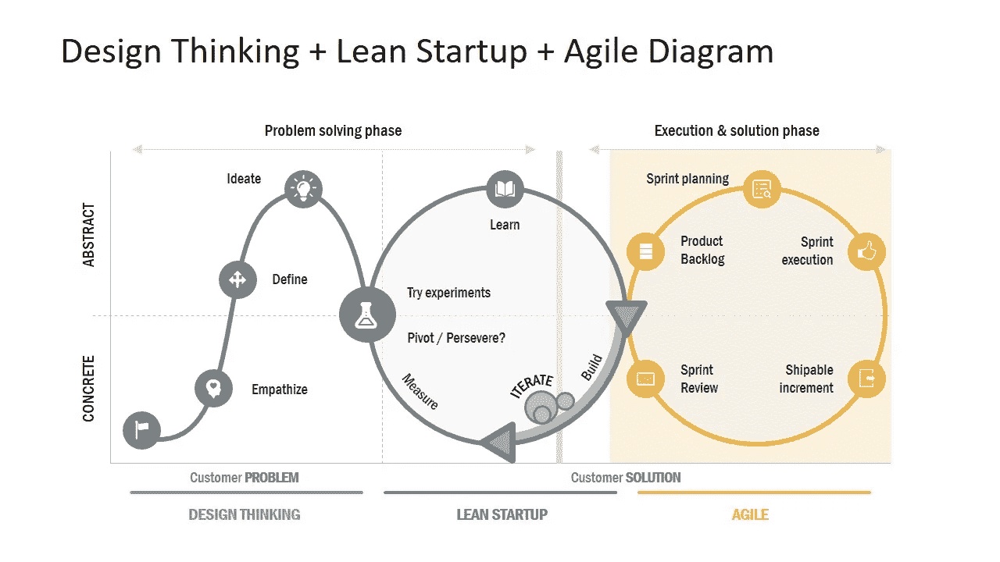
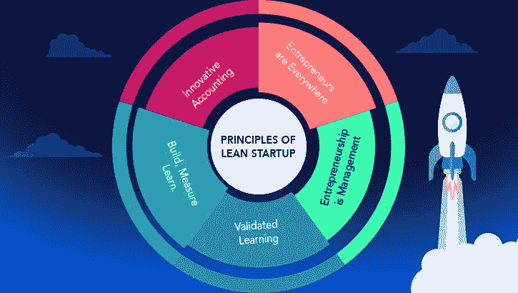
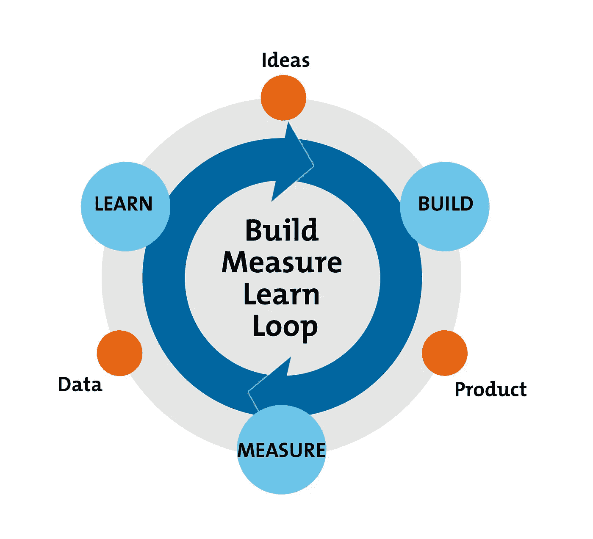
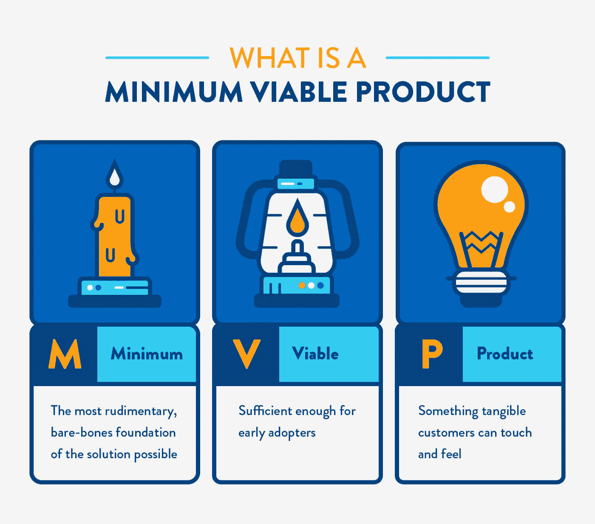
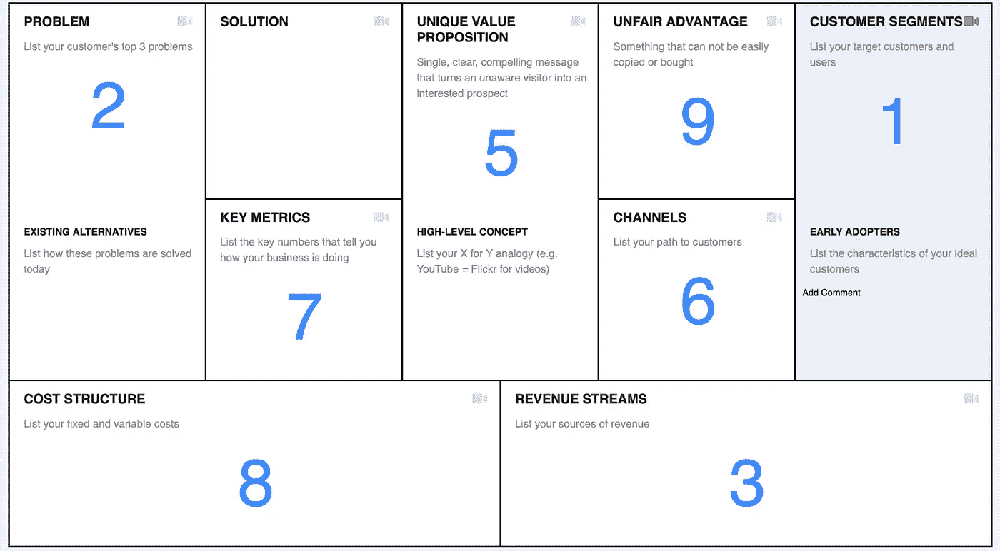

# 如何建立一个精益创业公司？

> 原文：<https://medium.datadriveninvestor.com/how-to-build-a-lean-startup-a0951e80b865?source=collection_archive---------15----------------------->

## 3 个简单的技巧…

Illustration (Image source : Internet)

# 实话实说:75%的初创企业都失败了！！

创办一家新企业——无论是科技初创企业、小企业，还是大公司内部的一个项目——总是一件碰运气的事情。根据几十年来的公式，首先，你写一份商业计划，向投资者推销，组建一个团队，测试/介绍一种产品，然后开始尽可能努力地销售。在这一系列事件的某个地方，你可能会遭受致命的挫折。简而言之，75%的初创企业都失败了。

# 为什么商业计划夭折了？

Business plan is so dead (Image source : Internet)

商业计划通常在启动后几周内就被扔出窗外。 ***许多初创公司花费大量时间基于这些假设开发产品，却从未向潜在客户验证过他们的想法。*** 最终，他们艰难地认识到，客户并不需要或想要产品 90%的功能。

# 什么是精益创业方法论？

精益创业方法是根据企业家在开发产品时必须调查、实验、测试和迭代的理念来建立新的企业。精益方法建议通过寻找合适的商业模式，然后测试想法来开始任何业务。

**设计思维+精益创业+敏捷团队**

Startup Process (Image source : Smartsheet)

**精益创业的 3 个原则—**

Principles of Lean Startups (Image source : Internet)

精益方法包括 **3 个基本原则**:

*   企业家接受未经检验的假设是他们第一天拥有的一切。
*   精益创业公司利用客户开发来测试他们的假设。它是关于商业模式所有元素的反馈。在客户开发过程中，初创公司会寻找可行的商业模式。客户开发的每个阶段都是迭代的。
*   精益创业公司实践敏捷开发，通过迭代和增量开发产品来消除时间和资源的浪费。该方法比使用传统方法导致更少的失败。

 [## 初创公司创始人的首要规则|数据驱动型投资者

### 当成立一家公司时，大多数创始人都非常专注于让业务起步，以至于他们可以很容易地…

www.datadriveninvestor.com](https://www.datadriveninvestor.com/2020/09/02/top-rules-for-startup-founders/) 

# 三个小窍门可以让你的企业立即融入精益理念

1.b**uild-measure-learn cycle——创造一个反馈循环**:对于以前没有获得潜在客户意见就开发产品的企业来说，这是一种改变游戏规则的技术。主要重点是不断收集和回应来自客户的数据和反馈。对反馈回路采取行动是这个循环的重要步骤之一。

Build-measure-learn cycle (Image source: Internet)

## 2.面条原则:理解最小可行产品

MVP Illustration (Image source : MVP wikipedia)

MVP 理念背后的一个关键前提是你生产一个实际的产品——可能是一个登陆页面，你可以提供给客户，并观察他们对产品或服务的实际行为。看到人们实际上做了什么比问他们会做什么要可靠得多。 发布一个正在进行的工作或者借用一个被过度使用的技术术语是可以的，就像把面条扔向墙壁，看看会粘上什么。想法是尽快以最小可行产品的形式获得你的产品的基本功能版本，然后 ***收集反馈并据此采取行动。***

## 3.数据驱动的决策制定

Data-driven decision making illustration (Image source : smartsheet)

数据显示你能够围绕你的产品或服务建立一个可持续发展的企业吗？ ***学习数据分析的语言将增强你的理解，并使你能够利用这些知识。*** 有三种不同的方式来展示你的发现:

*   **描述性信息**:只说事实。
*   **推理信息**:事实，加上对这些事实在特定项目环境中的含义的解释。
*   **预测信息**:基于事实的推理，以及基于你的推理的进一步行动的建议。

数据驱动决策的最后一步是 ***得出结论。*** 自问， ***“你从收集的统计数据中学到了什么新信息？”尽管有发现全新事物的压力，一个很好的开始是问自己一些你已经知道或者认为你知道答案的问题。***

# 构建精益启动画布

Lean Canvas 使用一个不到 20 分钟创建的单页业务模型解决了这个问题。*(来源:LeanStack)*

Lean Startup Canvas (Image source: LeanStack)

# 强项

*   关注问题-解决方案的契合度
*   很好地衡量成功
*   反映了精益创业的思维模式:构建-测量-学习
*   易于理解的元素和结构
*   根据客户/用户反馈采取快速行动

## 快的

与需要几周或几个月时间的商业计划相比，你可以在画布上写下/勾勒出多种可能的商业模式。构建多种商业模式并快速测试你的产品有助于构建-测量-学习循环。

## 轻便的

可共享的单页商业模式——这意味着它将被更多的人阅读，并根据反馈循环更频繁地更新。

## 简明的

精益画布迫使你只关注产品的主要方面。你有 60 秒的时间在电梯推销中吸引投资者的注意，还有 10 秒的时间在你的登陆页面上吸引客户或用户的注意。

## 有效的

无论你是向投资者推销，还是向你的团队或董事会提供最新信息，出色的内置演示工具都可以让你有效地记录和交流你的进展。使用这些工具以最具分析性的方式展示数字。

## 访问专家视图— [订阅 DDI 英特尔](https://datadriveninvestor.com/ddi-intel)