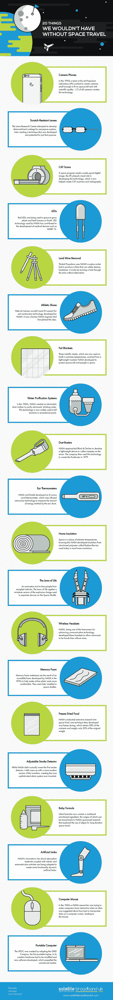

# 如何建立火星经济

> 原文：<https://medium.datadriveninvestor.com/how-to-build-a-martian-economy-74faf8db8951?source=collection_archive---------5----------------------->

## 撇开科学书呆子，一个经济学家需要说点什么…

Image Credit: Max Rymsha/HP Inc

对一些人来说，殖民火星也是一个令人兴奋的未来。这将是人类精神的例证，也是我们作为一个物种所取得成就的标志。

对其他人来说，殖民火星是一项毫无意义的努力。它似乎很少提供实质性的成本回报，尤其是在短期内。为什么不先解决地球上的问题呢？当地球上近 10 亿的居民甚至没有足够的食物时，我们能证明这样一个艰巨的项目是合理的吗？还是当癌症和其他疾病继续提前夺走我们所爱的人的生命？

虽然我同意我们应该认真关注地球的问题，但同样显而易见的是，为了人类的进步和生存，目光必须超越家园。斯蒂芬·霍金认为，我们需要在 100 年内殖民另一个星球，以避免气候变化、小行星撞击、资源枯竭和世界末日战争等潜在的灾难。

> “如果人类要再延续 100 万年，我们就必须大胆地去前人没有去过的地方，”—斯蒂芬·霍金，2008 年

在这个问题上，科学家和工程师的声音最大。但这并不意味着将像我这样的经济学家排除在对话之外。毕竟，我们需要尽自己的一份力量，确保火星殖民地即使不繁荣，也能在经济上自给自足。我们需要制定政策，在最小化成本的同时充分利用殖民火星的好处。它还提供了一个前所未有的机会，从一张白纸开始创造和研究经济增长。

## 从零开始发展经济

经济学家在火星面临独特的挑战，因为大多数增长挑战都有一些基础。因此，发展火星经济需要完全不同的方法。关于如何做这件事，有许多不同的观点，而且没有明确的答案。

对于外星殖民地来说，一个潜在的主要收入来源是房地产。殖民者的浪潮肯定会创造一个房地产市场，这将大大促进火星的经济。有了足够的产权，它可能成为殖民地的重要收入来源。这不需要在火星上建立一个法律体系；比如说，美国的财产登记处就足够了。据估计，一旦经过改造，火星上的土地价值可能会增长 100 倍以上(达到 36 万亿美元)。因此，一旦可执行的产权到位，私人所有者应该有动力自己改造土地，只要这样做的成本受到技术进步的限制。

> “他们(移民火星)的动机在许多方面与欧洲人和其他人来美国的历史动机相似，包括在劳动力短缺的经济中获得更高的工资，逃离传统和压迫，以及在一个未驯服和未定义的世界中自由发挥他们的创造动力。在如此大规模移民的情况下，出售房地产将为地球经济增加一个重要的收入来源。”罗伯特·祖布林

我更担心火星房地产经济的重要性。著名作家和航空航天工程师祖布林高估了人们的热情——依靠成群结队的普通人卖掉他们所有的地球财产来购买火星上的土地(在一张机票上)可能是天真的。根据他自己的估计，祖布林认为一个直径 100 米的可居住圆顶可以包含 100 万美元的房地产价值。虽然我声称在工程问题上没有专业知识，但这似乎极不可能涵盖这些圆顶建筑的价值；在这种情况发生之前，需要几十年的技术进步来降低建设成本。

提高火星房地产的成本来支付这些费用将是如此巨大，以至于阻止殖民者的移民。那么土地肯定会被那些富有到仅仅因为新奇而购买土地的人独占。接下来的问题是谁有权出售火星上的土地。会是 SpaceX 还是美国政府？在土地私有制下会出现许多这样的复杂情况，这使我认为殖民者需要某种形式的公共土地所有权——至少在短期内是如此。

对火星经济来说，更好的经济支柱可能是自然资源。只要运输成本得到控制，来自红色星球的贵金属，如金、铂和铕可以出口回地球，获得很高的利润。这也许可以通过使用可重复使用的火箭将货物送入火星轨道，然后使用廉价和可消耗的化学级(甚至可以在火星上制造)继续前往地球的旅程来实现。

An rudimentary prototype of what a Martian mining robot could look like. Image Credit: Meredith Chandler, NASA/ Philip Metzger

行星科学家加里·斯图尔特声称，我们可以通过在火星上富含金属的火山口建立自动化采矿设施来进一步削减成本。机器人可以自己勘测、提取和提炼金属。然后，在 3D 打印等技术的帮助下，这些金属可以制成金条、电子元件或珠宝。斯图尔特声称，该设施将与太阳能电池板农场，当地的冰和盐沉积自给自足。他还认为，随着时间的推移，该设施可以提供丰厚的回报，从而允许建立后续的采矿设施。因此，甚至在我们踏上火星之前，就有可能为火星出口经济打下基础。

当然，我们需要先走，然后才能跑。在我们考虑红色星球之前，明智的做法是利用月球运行以自然资源为中心的经济。通过月球上氦-3 的供应可以获得巨大的利润:这种同位素可以出口回地球，用于热核聚变反应堆。我们还应该承认，首先很难判断火星上是否有大量的贵金属。

更可证实的是小行星带的财富。如果我们以火星为基地，这些可以被提取出来。尽管小行星采矿带来了显著的财务和技术挑战，高盛认为这种可能性是可以实现的。利润应该可以轻松抵消任何成本，并改变火星和地球的经济。高盛甚至预测，小行星采矿将产生世界上第一个万亿富翁，尽管应该承认，这个人一开始可能会成为亿万富翁。

一些人对材料出口经济的成本可行性持怀疑态度，比如 SpaceX 的埃隆·马斯克(Elon Musk)和之前提到的罗伯特·祖布林(Robert Zubrin)(尽管祖布林看到了提取氘的一些潜力，氘在核裂变反应中被用作慢化剂)。相反，两人都认为最大的经济潜力在于知识产权许可和向地球出售研究成果。从科学家到历史学家在内的一系列学者可以看到，在火星上旅行和生活会产生大量的发明。地球的挑战性条件可能会刺激新技术的发展，就像 19 世纪美国劳动力短缺导致发明泛滥一样。

 [## 我是如何成为经济发展资金纠结网的独立研究员|数据…

### 我很少发现自己处于一种看似独立的自由形式的身体抑郁状态，这种状态使人…

www.datadriveninvestor.com](https://www.datadriveninvestor.com/2020/10/23/how-i-became-an-independent-researcher-of-the-tangled-net-of-economic-development-funding/) 

很难预见为火星项目开发的技术会如何影响日常生活，但毫无疑问，太空探索有很大的创新空间。许多起源于太空领域的发明已经进入了消费领域:照相手机、婴儿配方奶粉、记忆泡沫、隐形牙套、电脑鼠标、水过滤系统、假肢、发光二极管、冻干食品——我还可以继续说下去。这个想法是来自火星殖民的创新有巨大的潜力来改变经济。

Image Credit: Jet Propulsion Laboratory, Caltech

## 对地球人的好处

在火星上建立这种经济不仅会使火星人和他们的后代受益——那些留在地球上的人也会享受到经济收益。

如前所述，殖民火星的过程将成为创新的“高压锅”，地球可以从中受益。与“新世界”类似，火星将是一个自我选择的移民社会，在恶劣、劳动力短缺的环境中运营，技术工人将获得工资溢价。为火星上必要条件下创造的发明申请专利将产生支持地球发展所需的财富。这些创新将提高地球的生活水平，并打破原本会导致地球技术停滞的不稳定趋势。

此外，人们可以强调在火星上永久定居的地缘政治利益。美国和中国是最有可能的殖民者，这场新的太空竞赛的获胜者将决定 21 世纪剩余时间的主要经济和政治力量。

此外，尼尔·德格拉斯·泰森(Neil deGrasse Tyson)提出，火星可以“激励教育管道中的整整一代学生成为科学家、工程师、技术专家和数学家”，就像阿波罗任务所做的那样。这种 STEM 职业的吸纳可能会造就一个更具活力和高技能的经济。

## 犹豫的需要

虽然我已经讨论了殖民火星的经济学，我们必须承认，在我们开始这样做之前，还需要一段时间。也就是说，首先需要大幅度降低人员和货物的运输成本。目前，将一个人送上火星的费用是 100 亿美元。埃隆·马斯克(Elon Musk)正在领导一场无情的技术革命，将这一数字推低至每人 20 万美元以下。他需要在我们向那里派遣第一批殖民者之前接近我们。我们还需要更好的技术来建造殖民地，保护我们自己免受火星辐射。

此外，我们需要有绝对的信心，相信没有某种形式的火星生命会受到来自地球的微生物的威胁。红色星球上的本土微生物生命将是一个巨大的生物学发现，尤其是如果它们拥有完全独特的生物化学。

未来令人激动。科学家、经济学家以及介于两者之间的所有人都应该开始思考并期待它的到来。但是还没到。

*本文原载:*[*https://www . datadriveninvestor . com/2020/10/29/how-to-build-a-Martian-economy/*](https://www.datadriveninvestor.com/2020/10/29/how-to-build-a-martian-economy/)

**延伸阅读/来源:**

 [## 在红色星球上制造绿色:我们如何在火星上建立经济？

### 在未来的几十年里，太空机构和私人企业希望开始将人类送上火星。其中一些…

interestingengineering.com](https://interestingengineering.com/making-green-on-the-red-planet-how-might-we-build-an-economy-on-mars)  [## 火星上有发财的机会吗？

### 殖民火星会是一项有利可图或潜在有利可图的冒险吗？最初出现在 Quora: the knowledge…

www.forbes.com](https://www.forbes.com/sites/quora/2016/09/26/is-there-a-fortune-to-be-made-on-mars/#69bd37216e28)  [## 火星殖民的经济可行性

### 罗伯特·祖布林洛克希德·马丁航天公司邮政信箱 179 丹佛，科罗拉多州 80201，美国

www.aleph.se](https://www.aleph.se/Trans/Tech/Space/mars.html)  [## 为什么不需要玛氏和解的商业案例

### 一些人声称，与火星居民进行有利可图的星际贸易的“商业案例”,或者至少…

www.thespacereview.com](https://www.thespacereview.com/article/3908/1) 

## 访问专家视图— [订阅 DDI 英特尔](https://datadriveninvestor.com/ddi-intel)