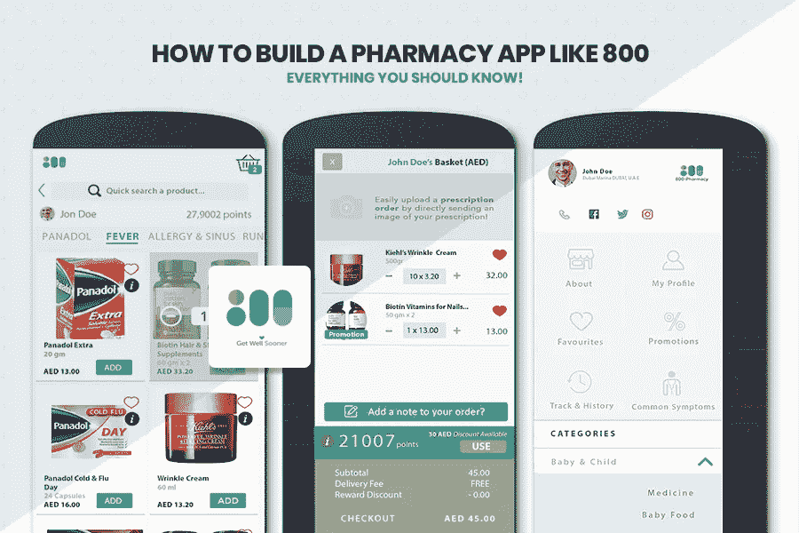

# 如何建立一个像 800 这样的药房应用程序—你应该知道的一切

> 原文：<https://medium.datadriveninvestor.com/how-to-build-a-pharmacy-app-like-800-everything-you-should-know-4cd91e27f547?source=collection_archive---------14----------------------->

随着按需应用程序充斥智能手机，毫不奇怪，今天的购物者更有可能在网上购买一切，而不是在商店的收银台排起长队。我们所说的一切也指药房应用程序。

随着移动和技术成为我们日常生活不可或缺的一部分，它的日益普及在医疗保健领域发挥着至关重要的作用。根据 Statista 的数据，2019 年全球移动医疗市场估计达到 370 亿美元，预计将在 2020 年增长并实现 720 亿美元的市场资本。

上图显示了 2016 年至 2025 年全球移动医疗市场的预计规模，标志着健康未来移动医疗应用的开始。此外，预计到 2021 年，完整的移动健康市场将达到近 1000 亿美元；这将是 2016 年约 210 亿英镑的五倍增长。

随着数字化主导每个细分市场，制药企业拥有在线社交网络非常重要。但是，这就够了吗？

当然不是！

你必须考虑转向移动平台。尼尔森调查公司(Nielsen survey)最近对移动媒体时间进行的一项研究表明，客户 89%的时间是通过应用程序交互在移动设备上度过的。移动浏览器和网络搜索已成过去，仅占 11%。它对您的业务有什么潜力？

简单明了。您的客户想要简单，简单，最好的。他们想要一个点击式应用程序将他们与品牌联系起来，并订购他们的药品。所以，现在是时候考虑与最好的 [**应用程序开发公司**](https://www.xicom.ae/services/mobile-app-development/) 一起构建自己的网上药店应用程序，以与大盒子商店竞争。

# 在这里，我列出了一些移动应用程序药店可以享受的不可或缺的好处

## 为您的顾客提供无与伦比的客户体验

想想你智能手机里那些你同时使用和享受的应用程序。分享我的观点，它就像 Waze 和 800，这使得在拜访我的家人时导航道路交通的艰巨任务变得顺畅，而像 800 这样的应用程序有助于从我的舒适区订购药品，而没有排长队的麻烦。

不可否认，这些应用程序帮助我做了两件事情中的一件，证明了我的口袋负担得起，也节省了时间。

这也是商业应用的主要目标。创建一个客户喜欢使用的应用程序，并为他们提供快速寻求帮助的功能。此外，你的应用程序应该通过在线设置处方补充订单来节省他们的时间。你的应用程序也应该通过提供支持你的营销策略的折扣券和代金券来帮助他们赚同样的钱。

你帽子上的另一根羽毛是可选的支付选择。作为一个经常选择货到付款购物的人，他会喜欢选择数字支付这种便捷的交付方式。通过应用程序，您可以存储每次购买的卡信息和凭证，使客户体验比想象中更易于管理。

## 利用药房应用进行正确的营销

不管业务性质和规模如何，任何在线药房应用的核心都是获得巨额收入。此外，为了获得巨额收入，你的应用程序的营销策略应该无懈可击。这是一款在你和你的忠实客户之间架起桥梁的应用。

与电子邮件、商业广告甚至社交媒体帖子不为人知的传统方式不同，推送通知是该应用程序中不容错过的新功能。皮尤研究发现，90%的手机用户声称他们“经常”随身携带智能手机。因此，这是一个难以置信的俘虏观众，很容易达到你的在线药房应用程序。

因此，请确保与迪拜 最优秀的 [**移动应用开发者合作，创建您的应用，轻松融入您的营销计划，并推送与当前促销和特价优惠券相一致的内容。**](https://www.xicom.ae/services/mobile-app-development/)

例如，如果你是一家零售药店，需要在过期日期到来之前转移库存过多的药物和消毒剂，那么向你的应用程序用户推送一条通知，并向他们提供一个难以说不的交易。此外，如果你是一家混合药房，想要鼓励使用你的商店将他们的孩子的药制成更可口的味道，那么使用应用程序提供的数据来瞄准你的应用程序受众以及他们的年轻受众，并坐下来看看收入如何滚滚而来。

## 维护品牌忠诚度，创造终身客户

为您的企业开发一个应用程序是维护您的药店企业品牌忠诚度的迫切需要的推动力。因为它有助于客户获得最佳交易，甚至养成按处方配药的习惯，这意味着您将获得更多业务。

一个应用程序拥有这样的能力。客户越容易通过你的应用获得他们的处方，他们就越有可能继续回来。然而，对于你的顾客来说，移动应用是一个完美的工具，可以伪装成移动应用放在他们的口袋里。这有助于一站式购物体验，减轻他们的压力。此外，您可以集成关于续杯的推送提醒，回答常见问题，并继续提供您的应用程序所熟知的顶级服务。

## 在人群中脱颖而出

连锁零售药店的应用程序特别关注客户面前的低成本交易。那么，为什么要留下来。如果你还没有在药房业务中使用移动应用程序，现在是时候表明你的主张并开始与众不同了。

所以，与一家值得信赖的 [**移动应用开发公司**](https://www.xicom.ae/services/mobile-app-development/) 合作，打造一款能反映你网站的应用，它的功能和设计让人爱不释手。否则，使用应用程序作为重塑品牌和重新评估对客户重要的东西的机会。

请记住，成功应用的关键是以客户为中心，用户友好，直观，资源增值。

## 最大化品牌认知度，赢得客户

众所周知，一个应用程序可以帮助你的品牌保持在人们的脑海中。有了智能手机，每个下载你的应用程序的消费者都可以轻松而奇特地访问你的内容。您将能够推送通知，让您的药房成为最受关注的对象。

一个设计良好的移动应用程序可以提高可访问性，让你的品牌既体贴又可信。这种积极的品牌认知度提升了你的品牌认知度，而品牌认知度被认为是当地药店的一个重要营销渠道。

因此，鼓励你的客户与他们的家人和朋友分享应用程序，并立即开始建立你的品牌。

## 展示您的一系列产品和服务

目录和小册子可能是你目前展示你的药店所能提供的选择。但是，一个应用程序可以揭示下一个层次的商业机会。

就像一个网站一样，你可以选择不同的产品或服务，并定期更新。动态内容对于保持客户的交互性至关重要。

为此，您的应用程序必须由迪拜的熟练的 [**应用程序开发人员创建**](https://www.xicom.ae/services/mobile-app-development/) ，它可以作为您药房中可用的产品和服务的库，并使您的客户可以通过简单的购买选择轻松访问它们。

## 深入了解您的客户并识别趋势

在移动应用为你的业务带来的众多好处中，最好的是“大数据”。因此，一个应用程序将帮助你了解你的客户是谁，他们购物的时间和原因，以及他们经常看但可能不准备订购的商品。

在这里，拥有建立一个更聪明、更有效的商业战略的洞察力来拯救你。很简单，因为了解顾客的购物行为变得容易多了，它最终会帮助你识别趋势。

但是，大多数应用程序用户登录是为了续杯吗？

吸引他们进一步参与的因素是什么？

总之，答案依赖于跟踪趋势和识别模式，帮助您更好地了解您的社区。

从今以后，调查客户对你的应用程序和网站的看法，不断改进你的互动平台，让你的业务从拥挤的选择中脱颖而出。

到目前为止，您已经了解了在线药房应用程序为您的业务带来的好处。现在，是时候开始记下你的应用程序的关键功能，让它在全球移动医疗领域取得巨大成功。

# 像 800 这样的药店 App 必备功能

现在，你可能更想知道像 800 这样的在线药房应用程序。此外，如果您正在迪拜寻找一个可靠且经验丰富的应用程序开发团队来创建像 800 这样的应用程序，了解药房应用程序 800 的功能是最重要的。

让我们深入了解一下所列出的功能，这些功能可确保快速、简单和用户友好的订单处理为您的客户节省大量宝贵的时间和金钱。

## 送货上门

无论在哪里，送货上门对于您的在线药房应用程序来说都是必不可少的。因此，请与您的开发合作伙伴讨论此功能，以便将其集成到您的应用程序中，实现轻松结账。此外，只需轻触一个按钮，即可让您的应用成为在线药物交付的首选。

## 全天候获取药物

通过您的在线药房应用程序，您可以为患者提供 24 *7* 365 种获取药物和救命药物的途径。这还不是全部。随着应用程序提供全天候访问，它还可以节省客户的血汗钱。

因此，为此，您需要确保您的股票是最新的，并且订单中没有任何错误。

## 与最好的医生进行无障碍咨询

在任何医疗紧急情况下，即时咨询可以在几秒钟内挽救一条生命。因此，请确保您的应用程序在医疗保健领域脱颖而出 [**迪拜**](https://www.xicom.ae/services/mobile-app-development/) 移动应用程序开发具有与最佳医生即时咨询的广泛功能。

无论何时何地，只要打一个电话或进行一次跨地区的聊天，您的问题就会马上得到解答。

## 没有更多的队列做测试

通过应用程序，您可以轻松预约实验室测试。例如，您可以通过您的应用程序预订病理学/放射学测试。这个特性可以像磁铁一样吸引你的应用程序，吸引庞大的客户。

即使从商业角度来看，不同的实验室也可以在你的应用程序上注册，并提供带有一些代金券的全身套装，包括肝脏和肾脏功能测试、糖尿病测试、心电图等，并在你的应用程序或智能手机上在线获得报告。

## 免费健康提示

通过你的在线药房应用程序，你可以在你的应用程序中包含一些健康提示功能，让你的用户获得良好的健康和生活方式，这也是免费的。此外，探索大量值得信赖的健康信息。

## 药物补充提醒

如果你在度假时用完了常规药物怎么办？

似乎是一场噩梦！不在那个地方将是任何人的愿望。此外，在这种情况下，“用药提醒”的功能可以为您的在线药房应用程序带来好处。因此，请确保您的应用程序包含此功能，以便在竞争中胜出。

为了实现这一点，与迪拜 众多 [**移动应用程序开发公司中最优秀、最有经验的公司合作，通过一个简单的弹出通知，为用户提供一个难忘的体验，为你的药物推车加油。**](https://www.xicom.ae/services/mobile-app-development/)

## 只需点击一下，您的续杯订单就完成了！

## 像 800 这样的药店 App 的成本评估

对于开发人员来说，在提供即时、实时体验的竞赛中，构建在线药房应用程序不是一件即时或简单的任务。这是一个很长的过程，需要几周的时间，完全取决于客户的要求、规格和功能列表，最重要的是成本估算，而成本估算因地区而异。

在某些情况下，开发一个在线药房应用程序的成本高达 2 万至 3 万美元。相反，你可以以 25-49 美元/小时的超值投资从一家经验丰富且可靠的应用程序开发公司雇佣迪拜最优秀的**移动应用程序开发人员**。此外，由专业人士开发的应用程序非常经济，也很容易符合你的商业道德。

800 等不同类型的在线药物移动应用程序为用户提供了快速可靠地分发药物和药物的功能，在挑战过程中，用户还可以通过应用程序自行报告问题，由迪拜熟练的应用程序开发人员解决问题。

然而，随着技术的进步，这些药物输送应用程序将成为消费者的真正乐趣。毕竟，主要目标是开发一个用户友好且负担得起的在线药房应用程序。

最后……我们 Xicom 了解到，随着创新者开始利用数字媒体，与迪拜 、印度和美国最好的移动 [**应用程序开发公司结盟，移动医疗领域已经取得了重大进展。**](https://www.xicom.ae/services/mobile-app-development/)

因此，如果你是一个新进入药房领域的人，或者是一个有兴趣拥有自己的药物输送应用程序的经验丰富的药物经销商，请从你的免费项目评估开始，以帮助个人更好地管理他们的健康。最后，与正确的开发公司一起做出正确的决定，将有一个光明的未来，帮助人们走上更健康的道路。

抓住机会，通过与专家讨论启动您的在线药房应用程序业务,+ 18980 . 688888886616

*原载于 2020 年 8 月 7 日*[*https://www . xicom . AE*](https://www.xicom.ae/blog/how-to-build-a-pharmacy-app-like-800-everything-you-should-know/)*。*