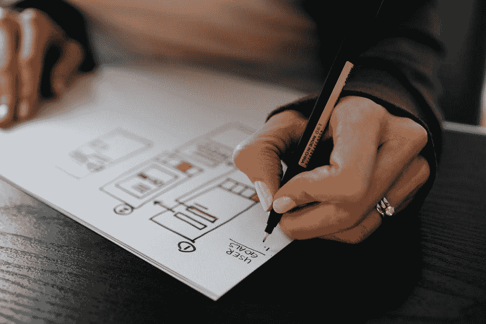
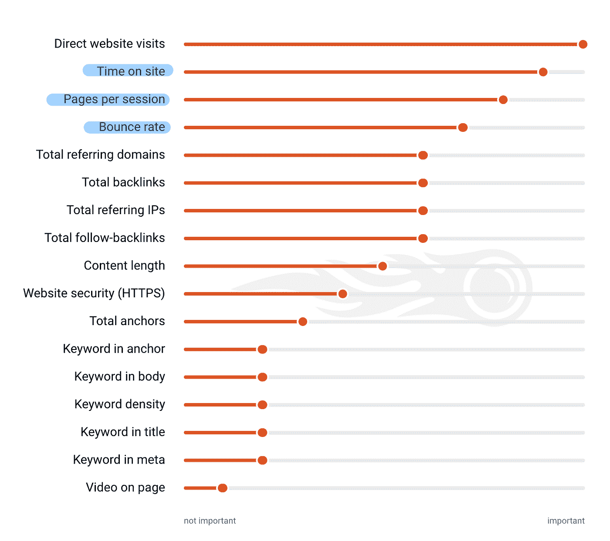
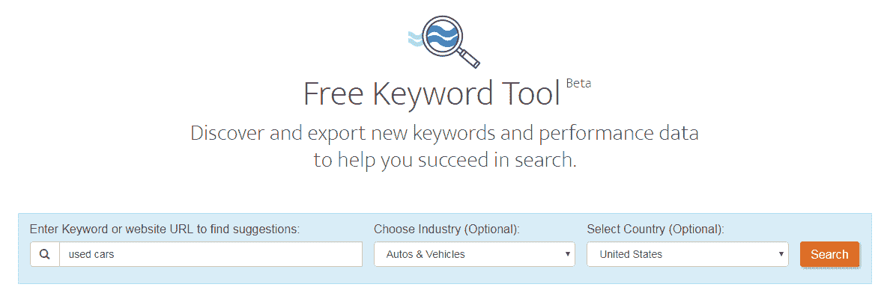
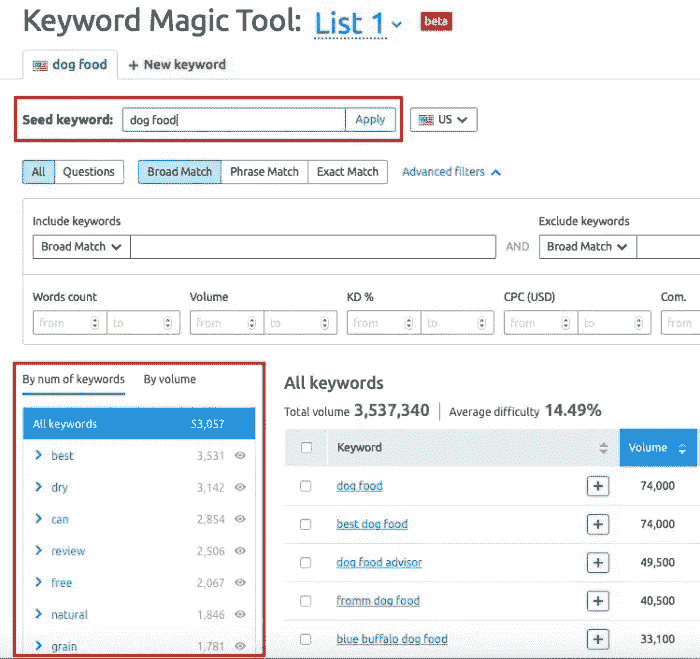
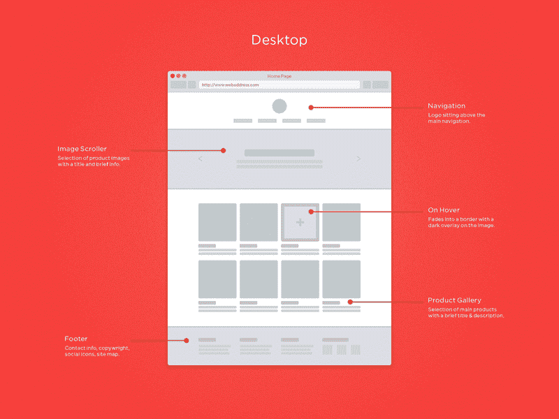
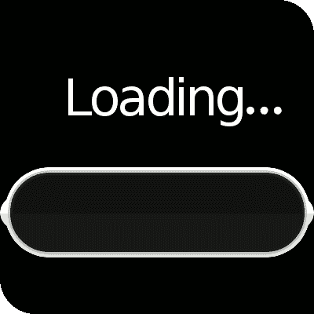
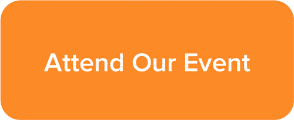
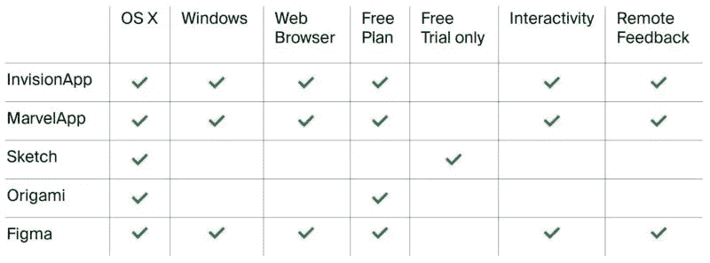

# 如何建立一个强大的 UX/UI 网站或产品

> 原文：<https://medium.datadriveninvestor.com/how-to-build-a-powerful-ux-ui-website-or-product-614e72cc1fce?source=collection_archive---------11----------------------->

## UX 设计如何影响搜索引擎优化…

Photo: Unsplash (Image source and credits : [Kelly Sikkema](https://unsplash.com/@kellysikkema))

有人假设关键词+元描述+标题标签=好的网站排名。

***但是不，假设错了！***

T4 每天有 35 亿次谷歌搜索。谷歌挖掘数据，每次搜索都会产生大量的数据，说到搜索，谷歌有 3 个关键目标

1.  基于查询提供精确的搜索结果
2.  为用户提供最佳体验
3.  列出排名好的优质网站

# 什么是 UX？

用户体验(UX)对于一个产品或网站在市场上的成败至关重要。 [Peter Morville 的用户体验蜂巢](http://semanticstudios.com/user_experience_design/)详细说明了一个好的 UX 应该具备以下要素:

Peter Morville’s User Experience Honeycomb ( Image source and credits: Sematic studios)

*   有用的:你的产品或网站有用吗？你的产品或网站应该是原创的，合法的，满足需求的。越有用，手感和体验越好。
*   **可用**:是否易用，效率最高，误差最小？如果用起来太复杂或者太混乱，用户会在几秒钟内退出。你的网站应该直观易用。它还包括使用户能够有效和高效地实现他们的目标。
*   **合意**:使用是否满意？它体现了你的品牌的价值观和身份吗？网站的整体外观、图像、品牌、颜色和其他设计元素应该唤起情感、欣赏和体现品牌的价值。
*   **Findable** :用户能很容易找到你的站点吗？搜索与你网站的搜索引擎优化相一致吗？我们必须努力设计可导航的网站和可定位的对象，这样用户就可以很容易地找到你。内容需要可在现场和异地导航和定位
*   **可访问性**:特性、功能和结果对残疾人来说是可访问的吗？用户可以从不同的平台/浏览器进行搜索吗？您的产品或网站需要方便残障人士使用。
*   **可信**:设计是否激发信任和可信度？用户会相信你的产品提供的结果吗？用户必须信任和相信你告诉他们或给他们的结果。
*   **有价值:**UX 与企业战略一致吗？你的产品或网站的价值是什么？蜂巢的所有品质是如何相互作用的？你的产品或网站应该向最终用户传递价值。不仅仅是用户体验，用户满意度应该是最重要的。

# UX 设计如何影响网站的 SEO？

等式是—

***用户体验设计+搜索引擎优化=网站排名靠前***

1.**图片标签和标题** —合适的图片标签和标题至关重要。当图像加载不正确时，图像标签会提供详细信息，而标题有助于构建页面内容并提高页面可读性。

2.**字数** — 650+字/页很重要，以确保它是深入的，并用重要的关键词回答用户的问题。

3.**适应不同的设备**——无论是 iPad、台式机还是手机，你的网站都应该能够有效地适应并给人们提供良好的用户体验。阅读此处— [手机占据了 52.2%的市场份额](https://www.statista.com/statistics/241462/global-mobile-phone-website-traffic-share/)。

Percentage of all global web pages served to mobile phones from 2009 to 2018 (Image source and credits: StatCounter)

4.**页面加载和速度**—2016 年，[谷歌发现](https://www.thinkwithgoogle.com/marketing-resources/data-measurement/mobile-page-speed-new-industry-benchmarks/)如果页面加载时间超过三秒，53%的移动用户会放弃。因此，3 秒钟决定了与你网站命运相关的一切，也就是说，如果读者不喜欢这个网站，谷歌会通过对慢网站的排名来反映这一点。

5.**搜索结果** —搜索引擎主页面上用户查询的相关搜索结果。

 [## 创业公司的顾问？与他们合作的 4 种最佳方式|数据驱动型投资者

### 顾名思义，顾问能给你的建议对一个人来说是成功还是失败的关键

www.datadriveninvestor.com](https://www.datadriveninvestor.com/2020/09/27/advisors-in-your-startup-4-ways-to-best-work-with-them/) 

# 所以 UX 的设计师应该专注于—

1.  提高页面速度，让用户从敏捷加载中受益
2.  为页面添加更多的关键字，以获得更好的 SEO。

[SEMrush](https://www.semrush.com/ranking-factors/) 做了一项研究，分析了 600，000+个关键词，以确定各种排名因素的重要性。结果是—

Importance of various ranking factors (Image source and credits: SEMrush)

3.包括导航设计、可用性测试、视觉效果、颜色和内容

4.谷歌在决定网站排名时考虑的关键指标列表——快乐的用户让谷歌快乐

5.跳出率和糟糕的排名

# 最佳实践—搜索引擎优化和 UX 设计

# 1.关键词

用户在搜索什么？有多少人在寻找它？

关键词优化有三个阶段— 1。研究正确的关键字 2。分析给定的一组关键词 3。选择最佳关键词

所有这些阶段导致—

**流量—** 给你的网站带来更多的流量

**关键词流行度—** 通过分析关键词流行度来衡量流量潜力

**内容—** 通过在网站内容中加入优化的关键词来撰写有效的内容，客观地满足用户的需求

# 你可以使用的工具和网站找到正确的关键词集—

[免费关键词工具](https://www.wordstream.com/keywords/):发现数千个有利可图的长尾关键词

Free Keyword Tool (Image source and credits: Free Keyword Tool website )

[关键词研究指南](https://www.wordstream.com/keyword-research-guide)——关键词研究实用指南

[谷歌的关键词工具](https://ads.google.com/intl/en_sg/home/tools/keyword-planner/)识别他们的搜索量，并提出对你的业务有意义的变化。此工具可让您深入了解搜索特定单词的频率，以及这些搜索如何随着时间的推移而发生变化，从而帮助您缩小所需关键词的范围。

[SEMRush 关键字工具](https://www.semrush.com/features/keyword-magic-tool/) —该工具以下列形式显示结果—

*   关键词难度—
*   竞争密度
*   SERP 功能
*   每次点击成本数据
*   搜索量

SEMRush Keyword tool illustration (Image source and credits: SEMRush)

SEMrush 算法建议与您的初始搜索语义相关的关键字，并根据搜索主题将它们分类，以确保您找到正确的关键字集。

# 2.网站导航

Site navigation across multiple devices (Image source and credit: GemFind)

浏览网站页面有多容易？是否直观流畅？

UX 的设计师应该希望它的网站用户能够轻松地浏览网站。为此，请记住以下内容

**网站的目的和范围** —很好地定义网站的范围。一个非常集中的网站，提供简化的导航元素，帮助搜索引擎正确地抓取和索引。

**网站架构和浅层网站结构** —它有助于搜索引擎阅读和理解整个网站，便于顺畅导航。UX 专家建议将所有内容放在离主页 4 次点击的范围内。对于在网站上排名靠前的谷歌页面来说，层级更重要，也更有权威。

**组织你的网站**——考虑使用链接和按钮来确保任何人都可以很顺畅地从首页导航到首页。所以内部链接，反向链接和删除页面上的死链。

# 3.加载速率

Loading page Gif (Image source and credits : Giphy)

页面加载的速度有多快？你能在 3 秒内加载你的网站吗？有哪些元素可以帮助你优化页面的加载速度？

快速的加载时间让用户感到高兴，并改善他们的用户体验，而缓慢的加载时间会增加跳出率，对搜索排名和用户体验产生负面影响，以至于用户可以在最初的 5 秒内放弃你的网站。

**优化图片和视频** —大图片和视频影响页面的登陆速度，阻碍导航和页面滚动。因此，使用像 [**TinyPNG**](https://tinypng.com/) 这样的工具来调整你的图像大小，而手刹是一种允许用户在不降低质量的情况下优化视频大小的软件。

**页面布局—** 一个好的页面布局应该是重中之重，因为它会影响页面的加载速度。删除任何不必要的图片、视频等，它们只会降低页面速度。页面的性能取决于页面的布局和组件。

# 4.行动呼吁(CTA)

Call to Action gif (credits : Giphy)

行动号召—为了让观众参与进来，并从网站页面访问获得转化，我们使用 CTA。它是一个命令或动作短语，通常以按钮或超链接的形式出现。这有助于—

1.  降低跳出率
2.  增加花在网站上的时间
3.  反馈——创建客户反馈循环
4.  建立电子邮件列表—注册一份时事通讯
5.  转化——将网站访问者转化为客户
6.  下载免费赠品或电子书

一个好的 CTA 可以创造奇迹。**如何设计出色的行动号召(CTA)** —

**通过可操作的文本进行转化:**陈述 CTA 的目的，如订阅时事通讯、立即购买、点击了解更多信息、下载文本等。文本应该简短，并清楚地传达行动信息。

**用户参与度和注意力:**使用明亮的按钮颜色，与页面或电子邮件的颜色形成对比。

**良好的可视性:**要放在首页，字体足够大，使其在网页上非常醒目。

# 最佳 UX/用户界面工具

Prototyping tools for UX and UI Designers (Image source and credits: Internet)

# [1。隐形 App](https://www.invisionapp.com/)

这是我用过的最好的一款。它允许你创建丰富的交互式原型，有大量的模板，可以与 Slack，吉拉等集成。

# [2。图玛](https://www.figma.com/)

我喜欢这个工具。它是一个协作设计工具，有一个很棒的用户界面，可以让你和你的团队在你的设计项目中有效地合作。除了主要功能之外，它还带有 tee Arc 工具和矢量网络。

# 3.[草图](https://www.sketch.com/)

另一个最流行的协作设计工具，我在搬到 Figma 之前一直在用。

# [4。Adobe XD](https://www.adobe.com/products/xd.html?promoid=PYPVQ3HN&mv=other)

Adobe XD 是一个功能强大、易于使用的协作平台，可帮助您和您的团队为网站、移动应用程序、语音界面、游戏等创建设计，该平台具有共同编辑功能，可让您的团队在项目上进行协作。

# 5. [Webflow](https://webflow.com/)

这是我个人最喜欢的，因为它是为不喜欢 web 开发的人制作的。这是一个现代设计师的平台，他们希望不用代码就能构建响应性网站，并且只需一次订阅就能托管这些网站。它很容易使用，并用于建立伟大的响应网站。

## 获得专家观点— [订阅 DDI 英特尔](https://datadriveninvestor.com/ddi-intel)