# 如何用 Apache Nifi 构建简单的数据流

> 原文：<https://medium.datadriveninvestor.com/how-to-build-a-simple-data-flow-with-apache-nifi-1ef3b25fe2c4?source=collection_archive---------0----------------------->

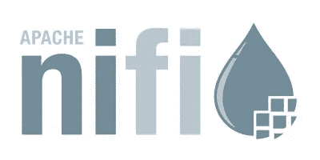

在这篇文章中，我将解释 Apache Nifi 的简要信息，它是最有效的数据流工具之一，并构建一个简单的设计作为快速教程。

# **数据流和 Apache Nifi**

将任何内容从 A 移动到 B 被定义为数据流。有时数据流可以很容易地执行，但有时可能是复杂和困难的情况。在我看来，数据流过程取决于 3 个组成部分。

*   数据
*   基础设施
*   人

**数据:**定义为将被移动内容的数据。这些内容可以是日志文件、xml、csv、图像、视频或任何类型。并且每个内容可以具有不同的标准、格式、协议、模式等。因此，从不同来源收集数据并传输到目的地可能会很复杂。

**基础设施:**可以定义为包含数据来源或目标的平台。在这个组件中，你需要处理安全、网络等问题。

**People:** 包含将设计数据流的组件。

**Apache Nifi** 为我们提供了一个强大而灵活的数据接收和数据流管理工具。Nifi 在你的浏览器上工作(基于网络),有一个简单的拖放用户界面。它提供了实时收集和转换数据的平台。您可以在 Windows 或 Linux/Mac OS 计算机上使用 Apache Nifi。

# 下载并启动 Nifi

首先你需要使用这个官方 [**链接**](http://nifi.apache.org/download.html) 下载 Nifi。你会在下载页面看到两个选项。 **gz** 文件适用于 Linux/Mac OS 用户， **zip** 文件适用于 Windows 用户。

如果你使用的是 Mac OS，并且有**家酿**(软件包管理系统)，可以在终端使用***brew install nifi***命令下载安装 apache nifi。

下载并安装 nifi 后，您需要检查服务状态，可能需要启动服务。对于 Mac OS 用户，您可以通过在终端键入 ***nifi status*** 命令来检查服务状态

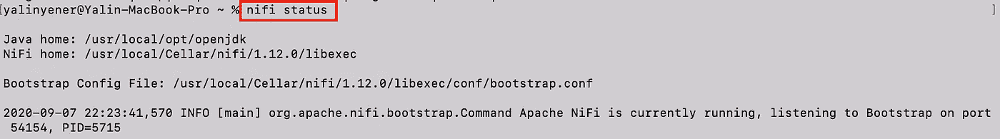

根据您的 nifi 服务状态，您可以使用这些命令来启动、停止、重新启动 etc 服务

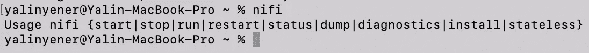

启动 nifi 服务后，您需要打开浏览器并键入[**http://localhost:8080/nifi/**](http://localhost:8080/nifi/)以访问基于 nifi web 的界面。

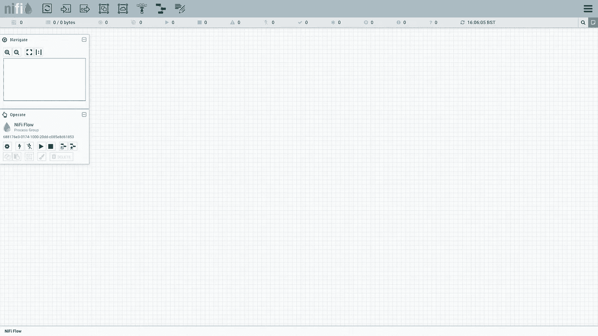

# **Apache Nifi 关键概念**

**处理器:**处理器是创建数据流的基本模块。每个处理器都有不同的功能。Apache Nifi 默认安装了 280 多个处理器，您也可以编写自己的处理器。

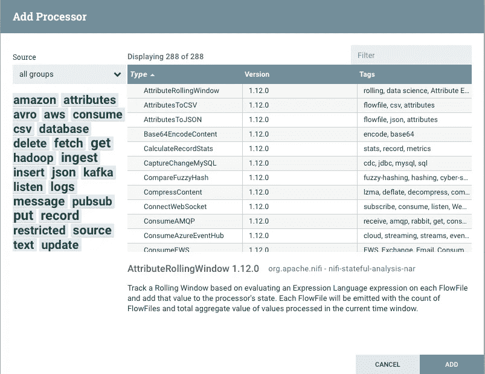

**流程组:**用户可以根据项目或组织对其处理者进行分组。

**模板:**您可以使用模板保存您的 Nifi 流。这些流可以被其他用户使用。您可以创建、下载、上传和添加 xml 文件形式的模板。这些模板包括您的所有处理器和处理器组

**连接:**处理器之间的链接。每个连接可能有一些关系规则

 [## 一瞬间学会数据科学！？数据驱动的投资者

### 在我之前的职业生涯中，我是一名训练有素的古典钢琴家。还记得那些声称你可以…

www.datadriveninvestor.com](https://www.datadriveninvestor.com/2020/07/23/learn-data-science-in-a-flash/) 

# **示例教程**

**场景:**在本教程中，我将设计一个简单的数据流，获取 json 数据，分割它们，找到特殊的关键字，并将结果放入我的本地文件夹。

我将使用下面的链接来调用 http。[https://geoserver . Nottingham city . gov . uk/open data/geo JSON/NCC _ Recycling _ centres . JSON](https://geoserver.nottinghamcity.gov.uk/opendata/geojson/ncc_Recycling_Centres.json)

**InvokeHTTP**

可以与可配置的 HTTP 端点交互的 HTTP 客户端处理器

1.  拖动处理器并放下白色区域
2.  选择 **InvokeHTTP** 并点击**添加**
3.  右击您的 **InvokeHTTP** 处理器和**配置**。
4.  在配置处理器类型链接上方的**远程 Url** 区域。

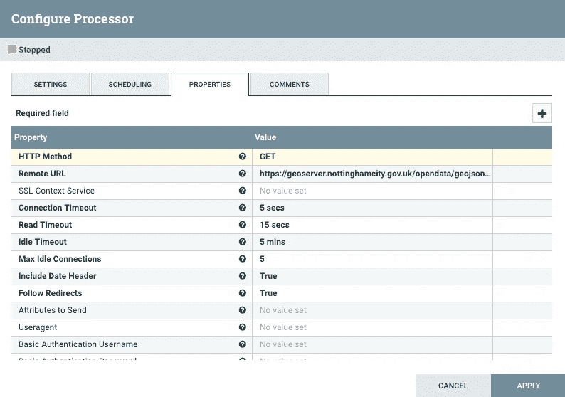

**拆分文本**

处理器在行边界上将一个文本文件分割成多个更小的文本文件，这受到最大行数或片段总大小的限制。

您可以在下面看到 SplitText 处理器配置。我想把我的样本 JSON 文件 1 分成一行。

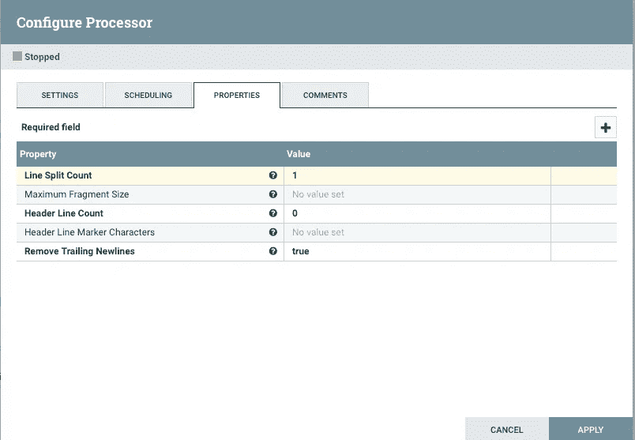

**RouteOnContent**

处理器使用属性表达式语言根据流文件的属性路由流文件。我使用正则表达式创建了两个新属性。我想找到“停车场”和“学校”的内容

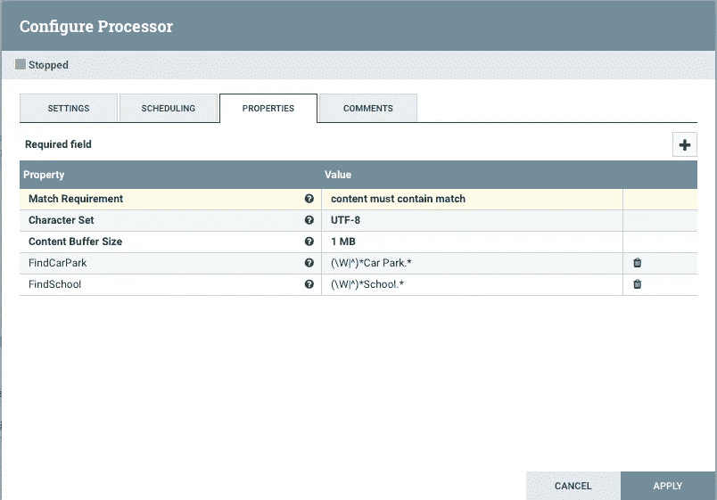

**合并内容**

处理器根据用户定义的策略将一组流文件合并在一起，并将它们打包成单个流文件。我创建了两个 MergeContent，一个将“停车场”内容合并到一个文件中，另一个将“学校”内容合并到一个文件中。

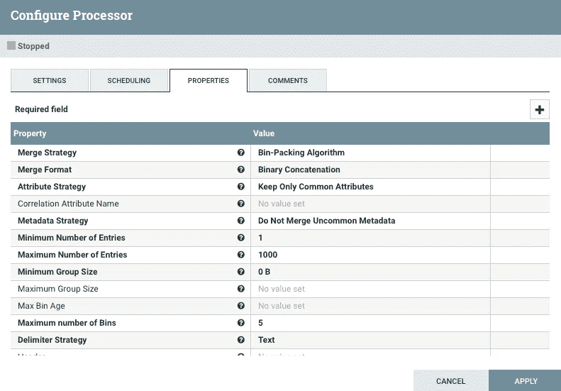

**上传文件**

处理器将流文件的内容写入本地文件系统。你应该改变你的输出目录。对于我的数据流，我将结果放入如下所示的两个新文件中；

***/tmp/recycle _ data/学校***

**T5/tmp/recycle _ data/car _ park**

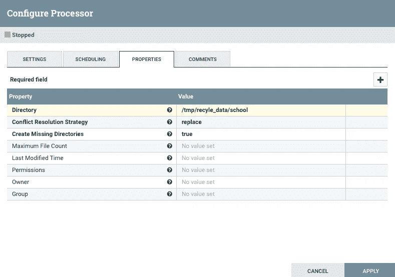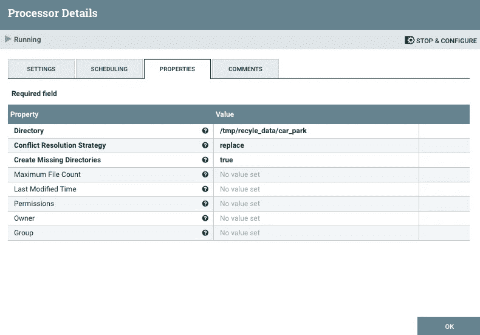

设计完所有处理器后，您需要用一些规则将它们连接起来。

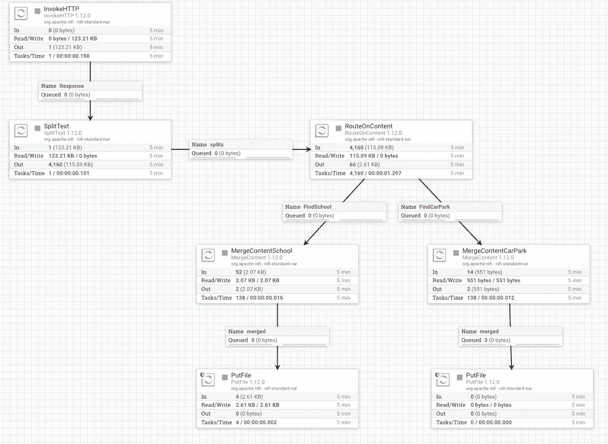

你可以在我的 [Github Repo 上找到上面的数据流设计模板。](https://github.com/yalinyener/ApacheNifiTemplates/)

最后，让我们开始数据流，看看发生了什么。您可以同时或依次启动所有程序。启动数据流后，可以用输入、读/写、输出和任务/时间来跟踪处理器

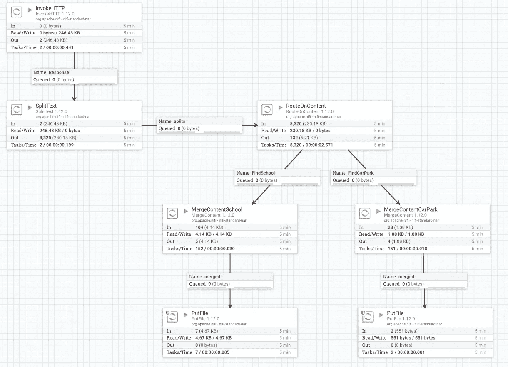

让我们控制目标输出来检查文件。你可以在终端或 Nifi 界面查看你的文件。

**端子**

您可以使用 cat 或 head 或 tail 命令来查看数据流的文件内容

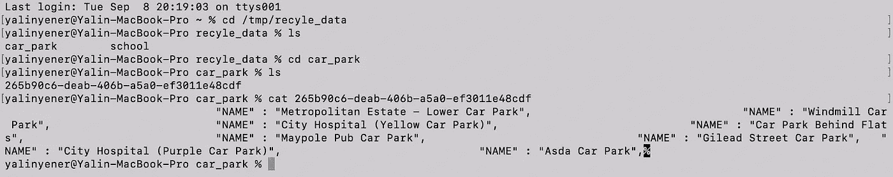

**Nifi 接口**

选择 PutFile 处理器，右键选择**查看数据来源**

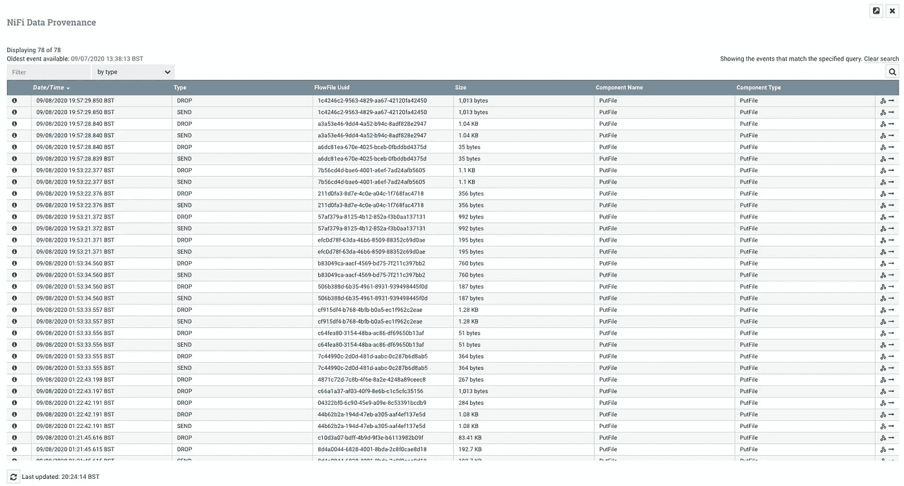

选择行并点击查看详情，方法是按“I”图标并打开“内容”选项卡。

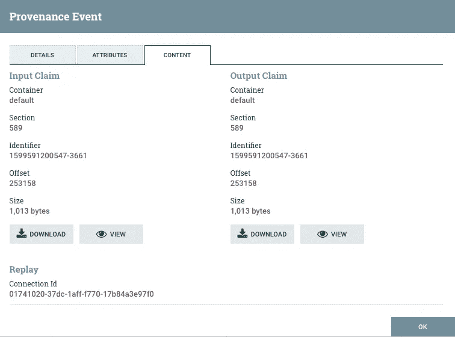

您可以下载最终的 Json 文件或者查看内容。

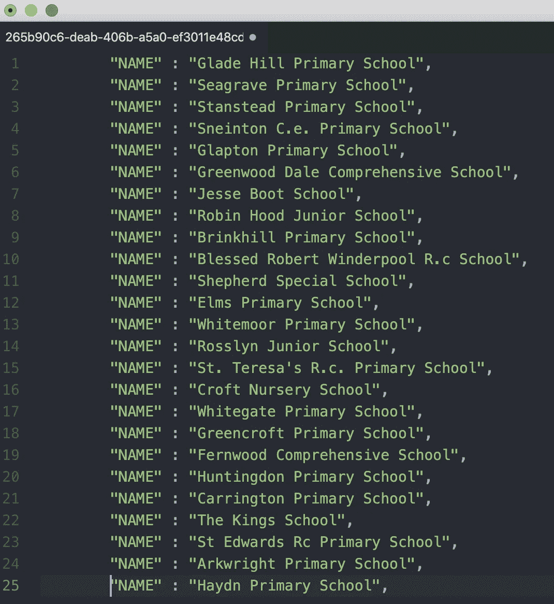

简单地说；

*   一、设计数据流流程
*   我调用了包含 JSON 内容的 HTTP(回收中心)
*   我把这个 JSON 一行一行的拆分
*   我创建了两个属性来查找关键字(停车场、学校)
*   Nifi 创建了每个关键字并将其合并
*   并根据我的关键字规则创建了两个单独的文件。

感谢你阅读我的帖子，希望你喜欢。如果您有任何问题或想要分享您的意见，请随时联系我。

**访问专家视图—** [**订阅 DDI 英特尔**](https://datadriveninvestor.com/ddi-intel)